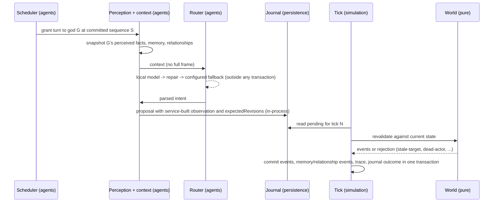

# feat: M2 autonomous Greek cast

## Overview

M2 turns the M1 rules-driven world into a social simulation.
The seven Greek gods decide through one model router over OpenAI-compatible endpoints (M2 runs them on local models, and OpenCode Go or any other endpoint works by configuration), see only what they perceived, were told, or sensed through a power, and remember what happened to them.
Their memories and relationships change what they do next.
A quiet-world director adds events without undoing consequences.
The 20 ordinary inhabitants stay on deterministic routines.

The work lands in three phases: local model routing and the model trace, then a two-god causal slice with an owner-rated experience gate, then the full cast with a measured scheduler and a gated unattended outage run.
A minimal settings view for endpoints and per-role assignment runs alongside the slice.

## Problem Frame

M1 proved an authoritative, persistent world with a durable proposal path and a local causal trace.
`packages/agents` is still a placeholder, perception is only "who is at my location", and actors have no memory, beliefs, or relationships.
The M0/M1 review ([m0-m1-review-2026-09-28.md](../research/m0-m1-review-2026-09-28.md)) names the largest product risk: whether limited local inference produces distinct, responsive gods whose experiences change their relationships and actions.
More infrastructure alone does not answer that, so the plan builds one causal slice end to end before scaling out.

The review's three correctness fixes landed first as separate PRs: event-linked legends and immutable observation ids (#51), and whole-frame forwarding (#50).

## Requirements Trace

- R1. W01: seven sourced gods with drives, abilities, profiles, and variant notes. Placeholder sprites only; portraits and final sprites stay M4, so W01 stays partial.
- R2. W04: a god acts only on knowledge from perception, a report, or a power; remembered outcomes change later behavior.
- R3. W06 remainder: background scheduling keeps inhabitants' action capabilities; drives produce different decisions.
- R4. W09: transformation, grudges, alliances, and persistent consequences with provenance; unrelated identity and memory survive.
- R5. W10: a quiet-world director proposes valid events, history attributes them, and nothing restores a catastrophe.
- R6. P06 partial: per-role endpoint and model assignment through config and a minimal settings view, local server first. The first-run download flow is deferred.
- R7. P07: one router over OpenAI-compatible endpoints; any role can use any configured endpoint, including OpenCode Go by configuration with its key in Keychain, with an operator-ordered fallback list and non-local endpoints dropped in offline mode. M2's evidence runs use local models.
- R8. O04 remainder: follow an event from observation through model request, validated action, outcome, relationship change, and presentation; secrets absent.
- R9. O08 (M2 portion): the unattended one-hour trial with a provider outage and recovery on the M1 Pro, plus the M2 workload baseline for the memory-policy gate (ADR-0005).
- Acceptance trials exercised: A02 divine consequence, A04 knowledge, A05 interruption (god proposals), A08 catch-up with pending god proposals, A13 provider failure, A15 replay without inference (god and director proposals), A16 secrets absent from the trace, and the one-hour unattended trial ([acceptance.md](../product/acceptance.md)).

## Scope Boundaries

- No player dialogue, mortal creation, combat, or afterlife (M3).
- No generated behaviors, image generation, or art pipeline; gods get placeholder sprites (M4).
- No first-run model download wizard; P06 stays partial.
- No generic actor or plugin framework, no migrations (greenfield rule), no multiplayer authorization.
- Catch-up stays model-free and deterministic; gods are divinely quiet across a catch-up gap (owner decision, 2026-09-29).
- When every provider is down, gods idle and a non-halting `model-degraded` status is visible; there is no authored divine fallback heuristic (owner decision, 2026-09-29).
- The director does not compensate for an outage; its quietness rule ignores provider status (owner decision, 2026-09-29).
- No trace export or retention policy work (M6); trace records stay local.

### Deferred to Separate Tasks

- Heavy-work memory policy candidates: measured against the M2 workload baseline before M4 enables concurrent image generation (ADR-0005 gate). M2 only captures the baseline.
- Crash-safe catch-up summary delivery (W03 limit from #46): the latest summary survives a kill after publication and before the client fetches it. Separate PR; must land before Unit 13's packaged evidence.
- A god activity panel in the client (recent actions, turn state, idle reason): X04, M5. M2 surfaces `model-degraded` through the existing status display only.
- Packaged Windows and Linux renderer runs: later milestone, on the desktop app.

## Context & Research

### Relevant Code and Patterns

- Tick path: `apps/simulation/src/server.ts` (`runOneLiveTick`, `/proposals`), `apps/simulation/src/tick.ts` (`mergeTickQueue`, `admitWithinCap`, `screenObservations`, `commitWorldTick`, `traceWorldTick`), `apps/simulation/src/catchup.ts`.
- Journal: `packages/persistence/src/journal.ts` — journal before acknowledge, consume inside the tick transaction, outcome on the row.
- Pure world: `packages/world/src/{state,actions,validate,routines,fire}.ts`; proposal contract `packages/contracts/src/proposal.ts` (sources `routine | fixture | operator`; rejects `modelRequestId` as authority).
- Fire cause today: automatic events carry `tick-N` (`packages/world/src/actions.ts` ~421–443); spread drops the source building (`fire.ts` ~91–108); `packages/telemetry/src/query.ts` documents the gap.
- Archives: `packages/persistence/src/archive.ts` carries world, events, projections, journal, catch-up progress; no trace.
- Trace: `packages/telemetry/src/trace.ts` — observation, proposal outcome, outcome events, receipts.
- Sidecar secrets today: launch token on stdin only (`apps/desktop/src-tauri/src/sidecar.rs`); no Keychain crate.
- Content: `content/greek/world/inhabitants.json` has Zeus, a woodcutter, and a farmer; `apps/simulation/src/greek-world-pack.ts` embeds the pack.
- Probes: `tools/probes/provider-matrix/src/{providers,repair,offline}.ts` (patterns to promote), `auth.ts` and `fallback.ts` (not reusable), `tools/probes/inference-baseline` (evidence and prompt shape).
- Scenario harness: `tools/scenarios/m1-living-world` (compiled sidecar, step modules, positive controls, README generator).

### Institutional Learnings

- Durable intake: [proposal-accepted-then-lost-before-durable](../solutions/integration-issues/proposal-accepted-then-lost-before-durable-2026-09-28.md) — model proposals are external proposals; journal first, consume in the commit.
- Tick admission is policy: [tick-admission-starved-external-proposals](../solutions/logic-errors/tick-admission-starved-external-proposals-2026-09-28.md).
- Writes that share a tick's fate go through `onCommitted`: [side-effects-inside-the-commit-transaction](../solutions/best-practices/side-effects-inside-the-commit-transaction-2026-09-28.md).
- Rules take intent from proposals and everything else from the world; models join in M2: [authoritative-rule-validation](../solutions/best-practices/authoritative-rule-validation-2026-09-27.md).
- Composition-root integration test with real implementations; replay from log, nothing from memory: [world-persistence-composition-broken-after-reopen](../solutions/integration-issues/world-persistence-composition-broken-after-reopen-2026-09-27.md).
- Every negative claim gets a positive control: [end-to-end-scenario-with-positive-controls](../solutions/best-practices/end-to-end-scenario-with-positive-controls-2026-09-28.md).
- The M0 offline proof used a packet capture with a positive control; a capture on the production path belongs with release acceptance (A01), not M2: [tcpdump-sudo-pid-resolution-offline-proof](../solutions/test-failures/tcpdump-sudo-pid-resolution-offline-proof-2026-09-27.md).
- Ollama RSS lives in the runner child: [ollama-runner-pid-rss-sampling](../solutions/performance-issues/ollama-runner-pid-rss-sampling-2026-09-27.md).
- Level state in a polled frame: [catch-up-summary-lost-between-polls](../solutions/integration-issues/catch-up-summary-lost-between-polls-2026-09-28.md).
- One lifecycle lock, no lock across an await: [lifecycle-state-one-lock-transitions](../solutions/best-practices/lifecycle-state-one-lock-transitions-2026-09-28.md).
- Greenfield discipline: [greenfield-anti-over-engineering](../solutions/best-practices/greenfield-anti-over-engineering-2026-09-27.md).

### External References

- AI SDK 7 with `@ai-sdk/openai-compatible` against Ollama `/v1`: `response_format` JSON schema maps to Ollama's `format`; `/v1` cannot set `num_ctx` per request, so a derived 4K model is created from a Modelfile. Use the v7 `timeout` option with `abortSignal`. A bare string model id routes through Vercel's hosted gateway by default, so model ids are always provider instances. `generateObject` is not deprecated in v7.
- Workspace pins: `ai@7.0.116`, `@ai-sdk/openai-compatible@3.0.57` (probe manifests); ADR-0005's `ai@7.0.93` text is stale.

## Prior-Art Survey

```json
{
  "schema_version": 2,
  "verdict": "extend",
  "scope": "apps/simulation, packages/{contracts,world,persistence,telemetry,content,agents}, content/greek, tools/probes/{provider-matrix,inference-baseline}, tools/scenarios, apps/desktop/src-tauri",
  "freshness": {
    "vcs_reference": "062614f (main) plus the fix/evidence-integrity diff (PR #51); rechecked at 814dc6a, where #50 changed only apps/desktop/src-tauri/src/{proxy,state}.rs and docs, none of the candidates"
  },
  "budget": {
    "max_search_passes": 3,
    "max_candidate_inspections": 10,
    "exhausted": false
  },
  "candidates": [
    {
      "path_or_symbol": "apps/simulation/src/tick.ts + packages/persistence/src/journal.ts",
      "description": "queued proposals, admission caps, external proposal journal, trace writes and journal consumption inside the tick transaction",
      "disposition": "extend"
    },
    {
      "path_or_symbol": "packages/world/src/routines.ts",
      "description": "deterministic drive-weighted routine proposals with factsRead for drive-bearing inhabitants",
      "disposition": "extend"
    },
    {
      "path_or_symbol": "packages/telemetry/src/trace.ts + packages/telemetry/src/query.ts",
      "description": "local observation, proposal, event, and receipt trace with follow-event and follow-proposal inspection",
      "disposition": "extend"
    },
    {
      "path_or_symbol": "packages/persistence/src/archive.ts",
      "description": "archive export and import of world state, event log, journal, and catch-up progress",
      "disposition": "extend"
    },
    {
      "path_or_symbol": "tools/probes/provider-matrix/src/providers.ts + repair.ts + offline.ts",
      "description": "measured provider adapter shape, shared JSON repair pass, offline hosted-client construction guard",
      "disposition": "extend"
    },
    {
      "path_or_symbol": "tools/probes/provider-matrix/src/auth.ts + fallback.ts",
      "description": "probe-only OpenCode auth.json loading and hosted-first fallback order with flat 25 ms retry",
      "disposition": "insufficient",
      "insufficiency_reason": "production routing follows operator configuration, not the probe's hosted-first order or flat retry, and keys come from Keychain, not OpenCode's auth.json."
    },
    {
      "path_or_symbol": "tools/probes/inference-baseline",
      "description": "local Ollama prompt and schema benchmark with TTFT, completion, and RSS metrics",
      "disposition": "reuse"
    },
    {
      "path_or_symbol": "packages/world/src/state.ts + packages/contracts/src/event.ts",
      "description": "actor, building, and legend state and the committed event vocabulary",
      "disposition": "extend"
    },
    {
      "path_or_symbol": "content/greek/world",
      "description": "authored Greek seed: realms, locations, buildings, rules, woodcutter, farmer, Zeus",
      "disposition": "insufficient",
      "insufficiency_reason": "M2 needs seven gods, twenty inhabitants, and sourced profile, ability, and lore data; the pack has three inhabitants and no profile or lore manifest."
    },
    {
      "path_or_symbol": "tools/scenarios/m1-living-world",
      "description": "compiled-sidecar scenario runner with step modules, API helpers, positive controls, and README evidence",
      "disposition": "extend"
    }
  ]
}
```

## Key Technical Decisions

- **Inference never runs inside a world transaction.** A god's turn snapshots committed state, awaits the model outside any transaction, and journals the resulting proposal through the same intake as `/proposals`. The tick admits and consumes it inside `commitWorldTick`. Replay and catch-up read the journal and never call a model.
- **The trusted service builds the observation; the model supplies only intent.** The agent layer builds the observation from the god's perception snapshot, sets the actor, `factsRead`, `stateRevision`, and `expectedRevisions`. Model output is parsed into an action whose targets must appear in the snapshot. This is the W04 boundary and closes the review's "model invents its own evidence" risk.
- **Delayed proposals are revalidated by `expectedRevisions`.** Gods name the revisions of the actor, location, and targets they reasoned about. A world that moved between snapshot and admission yields `stale-target`, recorded and consumed.
- **The journal is the only durable record of a god's turn.** The scheduler never grants a god a turn while that god has a pending journal entry. A turn killed before journaling is simply reasoned again, since nothing of it was committed; a turn killed after journaling runs once from the journal. No in-memory turn identity has to survive a restart.
- **Model and director proposals enter in-process only.** There is no HTTP route for them. The service sets `source`, actor, `factsRead`, and `expectedRevisions`; `/proposals` stays operator and fixture intake and cannot carry the `model` or `director` source.
- **Agent dispatch waits for catch-up.** No turn starts before startup catch-up completes or while any catch-up run is active; catch-up blocks new dispatch like pause, through an explicit lifecycle seam rather than inference from frames.
- **Memory, beliefs, and relationships are world state, changed only by events.** They are archived, rebuilt from the log, and survive restart and restore. The trace stays inspection-only and is not a knowledge source. Memory entries carry the event or proposal id that produced them, so evidence for a persisted relationship change travels in the archive without archiving the trace.
- **Per-character beliefs are separate from world legends.** A report writes an attributed belief (source, event link if any, the reported content) into the recipient's memory; it may be distorted or false and is never resolved to the truth automatically. Legends remain world narrative, event-linked or not (PR #51).
- **Social state is derived in its own tick phase.** After the tick's primary events (proposals and environment) have ids, a pure derivation step emits memory and relationship events that cite them, in the same commit. Derived events never trigger further derivation.
- **Memory is bounded by a pure eviction rule** over committed state (recency and salience), with capacity as a D23 tunable, so rebuild equals live. Unit 13 checks archive size, rebuild time, and live-versus-rebuild equality at full-cast scale.
- **Fire carries its initiating cause.** Ignition records the initiating event; spread records the source building's ignition; burn and destruction carry that chain. Cause is stored when the fire starts, never inferred later.
- **Keys live in Keychain.** The shell reads a configured endpoint's key and passes it to the sidecar at spawn with the launch token; changing it restarts the sidecar. Keys stay out of config, prompts, saves, trace, and logs.
- **Model-request payloads are bounded and pruned.** Trace rows keep bounded prompt and output text for evaluation and episode review, pruned after seven days (defaults.md); digests and metadata stay with the world history.
- **Offline drops non-local endpoints, judged by URL.** An endpoint is local when its URL host is a loopback address, `localhost`, a private LAN address (10/8, 172.16/12, 192.168/16, IPv6 unique-local or link-local), or a `*.local` name; any other host is non-local. There is no editable flag. Offline mode removes non-local endpoints from assignment and fallback before any adapter is built, and adapters do not follow redirects. Model ids are always provider instances, never bare strings.
- **Local routing uses `@ai-sdk/openai-compatible` against Ollama `/v1`** with a derived `llama3.2:3b` 4K model (`parallel=1` stays a server setting; since 2026-10-02 the local baseline is qwen3 8B at 4K, see the gate result below), and the promoted repair pass. The production chain is operator-configured per role. Every endpoint uses the same OpenAI-compatible adapter and repair pass; no tier or order is built in.
- **A model outage never stops ticks.** `model-degraded` is a new status distinct from `store-error` and `disk-full`; routines and the director keep running. It shows through the existing status display with wording that separates it from a halting world failure and from intentional offline mode.
- **Two gates decide whether M2 works.** After the slice, the owner rates real-inference Zeus and Hera episodes and chooses continue, tune, or replan before the other five gods are built. At exit, the unattended run must meet starting thresholds (Unit 13), revisited after the slice measurements. A failed run is kept as tuning evidence but does not pass.
- **Scheduling is gods-first** within the ~39 turns/min capacity (ADR-0005): one inference at a time, bounded pending work per god, fairness across gods, a per-turn and total-fallback timeout under the 30 s starvation target, and pause freezes new dispatch.
- **The director is an attributed producer on the same path.** It has its own proposal source, decides from committed state and persisted PRNG only, measures quietness by consequences rather than event volume, and has no action that reverses state.
- **The causal scenario runs twice.** A scripted provider, injected at the provider boundary of the production routing path, gives deterministic causal assertions and positive controls. A real local-inference run gives acceptance evidence with property checks. Scripted runs are not evidence of model behavior.

## Open Questions

### Resolved During Planning

- Gods during a total outage: idle with visible `model-degraded` (owner, 2026-09-29).
- Divine activity during catch-up: none; catch-up stays deterministic (owner, 2026-09-29).
- Director during an outage: independent (owner, 2026-09-29).
- Providers are peer OpenAI-compatible endpoints; Go works in M2 by configuration (owner, 2026-09-29; ADR-0005).
- W01 art: placeholder sprites; W01 stays partial (owner, 2026-09-28).
- P06: config plus a minimal settings view; first-run download later (owner, 2026-09-28).
- Second god for the slice: Hera. Her sourced conflict with Zeus gives a natural grudge, a report path, and a later transformation case (Io).
- Pause semantics: pause freezes new dispatch; in-flight calls complete and journal, then run after resume and revalidate.
- The minimal settings view runs alongside the slice (owner, 2026-09-29).
- Early experience gate after the slice, owner-rated (owner, 2026-09-29).
- Exit thresholds: starting numbers now, revisited after the slice (owner, 2026-09-29).
- Keys are set through a write-only command and read by the shell at spawn (owner, 2026-09-29).
- Trace keeps bounded model payloads with seven-day pruning (owner, 2026-09-29).
- Deterministic proposal ids for model turns: dropped; the journal plus one-pending-turn-per-god makes restart safe without a durable turn identity.

### Deferred to Implementation

- Exact perception rules (sight radius by location graph, what a divine sense reveals and costs): tuned against the slice scenario.
- Memory capacity and salience weights: D23 tunables set from the unattended run.
- Rumor distortion and hop limit: start with one hop and a simple distortion rule, tune later.
- Prompt and context shape per role: iterate against the evaluation rubric; the 4K context bound is fixed.
- Timeout values: set from measured p95 once the production path runs.

## High-Level Technical Design

> *This illustrates the intended approach and is directional guidance for review, not implementation specification. The implementing agent should treat it as context, not code to reproduce.*



## Implementation Units

### Phase A — Production model routing (Unit 3 runs alongside Phase B)

- [x] **Unit 1: Local routing, repair, and configured fallback**

**Goal:** a production router in `packages/agents` that turns a context into a parsed intent through configured providers.

**Requirements:** R6, R7

**Dependencies:** none

**Files:**
- Modify: `packages/agents/package.json`, `packages/agents/src/index.ts`, `bun.lock`
- Create: `packages/agents/src/router.ts`, `packages/agents/src/providers.ts`, `packages/agents/src/repair.ts`, `packages/agents/src/config.ts`
- Create: `tools/probes/inference-baseline/Modelfile.llama3.2-3b-4k` (or an equivalent documented setup step)
- Test: `packages/agents/src/router.test.ts`, `packages/agents/src/repair.test.ts`

**Approach:**
- Promote the repair pass and adapter shape from `tools/probes/provider-matrix`; production must not import probe code.
- Role config assigns an endpoint and model per role plus an operator-ordered fallback list; locality is derived from each endpoint's URL, and offline mode drops non-local ones before construction.
- Bounded retries with production backoff; per-turn and total-chain timeouts via v7 `timeout` plus `abortSignal`.
- The router returns a discriminated result: intent, or exhausted with per-step reasons.
- Adding `ai` and `@ai-sdk/openai-compatible` to a production package changes the lockfile; ask the owner before the dependency lands.

**Execution note:** test-first.

**Patterns to follow:** probe `providers.ts`, `repair.ts`, `offline.ts`; parse-don't-validate contracts.

**Test scenarios:**
- Happy path: a scripted local provider returns valid JSON; the router returns the parsed intent and step metadata.
- Edge: malformed JSON repaired into a valid intent; unrepairable output falls to the next step.
- Error: first step times out, second succeeds; all steps fail returns exhausted with each reason.
- Offline: a fallback list containing a non-local endpoint (scripted; no real hosted call) in offline mode never constructs that endpoint's adapter (constructor spy) and never reads a key.
- Locality: loopback, `localhost`, private LAN, and `*.local` URLs are local; a public hostname or public IP is not, whatever the config says; a redirect from a local endpoint is refused.
- Positive control for the offline claim: the same list online constructs the non-local endpoint's adapter once.
- Integration: against a live local Ollama (skipped when absent, reported), one call returns a schema-valid intent.

**Verification:** router tests pass; one recorded real local call through the production path.

- [x] **Unit 2: Model-request trace and `model-degraded`**

**Goal:** model requests become part of the causal trace, and an outage keeps the world ticking.

**Requirements:** R7, R8

**Dependencies:** Unit 1

**Files:**
- Modify: `packages/telemetry/src/trace.ts`, `packages/telemetry/src/query.ts`, `packages/contracts/src/proposal.ts` (proposal sources `model`, `director`), `packages/contracts/src/snapshot.ts` (degraded reason), `apps/simulation/src/server.ts`, `apps/simulation/src/index.ts`, `packages/persistence/src/store.ts` (schema version)
- Test: `packages/telemetry/src/trace.test.ts`, `packages/telemetry/src/query.test.ts`, `apps/simulation/src/server.test.ts`

**Approach:**
- A model-request record (role, provider step, model, attempts, timings, prompt and output digests, bounded payloads, outcome) links to the proposal it produced; follow-proposal and follow-event include it.
- Payload text is pruned after seven days; digests and metadata stay.
- The designer sets `model-degraded` wording and prominence in the existing status display.
- `model-degraded` is set when the chain is exhausted and cleared on the next success; it never clears the tick timer.
- Schema bump without migration.

**Execution note:** test-first.

**Test scenarios:**
- Happy path: a committed model proposal's chain shows observation → model request → proposal → validation → events.
- Error: a failed-then-successful chain records every attempt with its reason.
- Outage: with every provider failing, routine ticks keep committing and the frame shows `model-degraded`; recovery clears it.

**Verification:** `bun run check`; the scenario from Unit 8 later exercises the chain end to end.

- [x] **Unit 3: Minimal settings view and endpoint keys** (refined in `docs/plans/2026-10-01-003-feat-provider-settings-plan.md`; shipped in #84 and #85)

**Goal:** an endpoint list (base URL, model), per-role assignment and fallback order, persisted outside world saves; a write-only command stores an endpoint key in Keychain; the shell reads it at sidecar spawn and passes it with the launch token.

**Requirements:** R6, R7

**Dependencies:** Unit 1. Runs alongside Phase B; does not gate Units 4–9; required before Unit 13.

**Files:**
- Modify: `apps/desktop/src-tauri/src/commands.rs`, `apps/desktop/src-tauri/src/sidecar.rs`, `apps/desktop/src-tauri/Cargo.toml`, `apps/desktop/src-tauri/Cargo.lock`
- Create: a small Keychain helper under `apps/desktop/src-tauri/src/`
- Modify: sidecar config read in `apps/simulation/src/`
- Create: settings UI under `apps/client/src/ui/` (designer)
- Test: alongside each change

**Approach:**
- Endpoint config (base URL, model), per-role assignment, and fallback order persist outside world saves and contain no keys.
- A write-only command stores an endpoint's key in the Keychain; the shell reads it at sidecar spawn and passes it with the launch token. Changing a key restarts the sidecar.
- Adding a Keychain crate changes `Cargo.lock`; ask the owner before it lands.
- Designer owns layout, interaction, and wording. States to cover: endpoint reachable or unreachable, a role with no model or an unavailable model, key saved or missing, and where changes apply (a key change restarts the sidecar).
- Accessibility: semantic form controls, keyboard focus order with visible focus, announced save and error states, no colour-only state, usable at 1280×720 with larger text.

**Execution note:** designer owns the settings view's layout, interaction, and wording; fixer or implementer owns Rust and sidecar changes.

**Test scenarios:**
- Happy path: assign a role to an endpoint and the router uses it on the next turn.
- A configured key reaches the sidecar, and a changed key takes effect after the sidecar restarts.
- Offline mode drops a non-local endpoint.
- An unreachable endpoint shows its state and gods idle with `model-degraded`.
- Config survives restart and is not in exports; the key is not in config or exports.
- Sentinel key: a planted key sent through the shell, the sidecar, and a scripted provider never appears in prompts, trace rows, the journal, or sidecar logs (AGENTS.md credential rule).

**Verification:** tests; `bun run check`; cargo fmt and clippy; window-cropped screenshots; one manual run with a role pointed at Go, recorded as a note (not an evidence gate).

### Phase B — Zeus and Hera causal slice

- [x] **Unit 4: God profile contract and two sourced profiles**

**Goal:** a content contract for gods and authored profiles for Zeus and Hera.

**Requirements:** R1

**Dependencies:** none (parallel with Phase A)

**Files:**
- Modify: `packages/content/src/*` (profile parsing), `apps/simulation/src/greek-world-pack.ts`, `content/greek/world/inhabitants.json`
- Create: `content/greek/gods/{zeus,hera}.json`, `content/greek/lore/` source manifests, placeholder sprite references
- Test: `packages/content/src/*.test.ts`

**Approach:** each profile has drives, abilities (mapped to world actions and costs), sourced lore with citations, variant notes, and a placeholder sprite id. Lore is prompt material; abilities are enforced by world rules.

**Test scenarios:**
- Happy path: the Greek pack parses with both profiles.
- Error: a profile citing an unknown ability or missing source is rejected.

**Verification:** content tests; lore sources cited per the lore-sources rule in [open-decisions.md](../product/open-decisions.md).

- [x] **Unit 5: Perception snapshot and trusted observation builder**

**Goal:** per-actor perception and a service-built observation for model proposals.

**Requirements:** R2

**Dependencies:** Unit 4; PR #51 merged

**Files:**
- Create: `packages/world/src/perception.ts`, `packages/agents/src/context.ts`, `packages/agents/src/observation.ts`
- Modify: `apps/simulation/src/tick.ts` or a sibling module (in-process intake for model proposals; no HTTP route)
- Test: `packages/world/src/perception.test.ts`, `packages/agents/src/context.test.ts`

**Approach:**
- Perception is a pure function of committed state: co-located events and actors, the god's own memory, and powers that grant sensing at a cost.
- The context builder uses only the snapshot and the god's memory, relationships, and drives, never the full frame.
- The observation builder sets `factsRead` as a subset of the snapshot and `expectedRevisions` for every entity the intent touches; the parsed intent is rejected if it targets something outside the snapshot.

**Execution note:** test-first.

**Test scenarios:**
- Happy path: Zeus at the tavern perceives the tavern and co-located actors.
- Negative: an event at another location is absent from Zeus's snapshot and context. Positive control: moving Zeus there makes it present.
- Power: a sensing power reveals a remote event and records its cost; without the power it stays hidden.
- Error: a model intent naming an actor outside the snapshot is refused before journaling.
- Intake: `/proposals` refuses a body claiming the `model` or `director` source.
- Stale: a target moves after the snapshot; the journaled proposal is rejected `stale-target`. Positive control: no change, it commits.

**Verification:** tests; a context dump for the slice shows no unperceived facts.

- [x] **Unit 6: Memory, beliefs, relationships, reports, and fire provenance**

**Goal:** world-state memory and relationships changed by events, a report action, and fire events that carry their cause.

**Requirements:** R2, R4, R8

**Dependencies:** Unit 5

**Files:**
- Modify: `packages/world/src/{state,actions,validate,fire,codec}.ts`, `packages/contracts/src/{event,proposal}.ts`, `packages/telemetry/src/query.ts`, `packages/persistence/src/store.ts` (schema)
- Create: `packages/world/src/memory.ts`
- Test: `packages/world/src/memory.test.ts`, `packages/world/src/fire.test.ts`, `apps/simulation/src/world-store.test.ts`, `packages/persistence/src/archive.test.ts`

**Approach:**
- A derivation phase runs after the tick's primary events have ids: witnessing a committed event adds a memory, citing that event, to each perceiving actor in the same commit. Derived events never trigger further derivation.
- A `report` action between co-located actors writes an attributed belief into the listener's memory; content may be distorted or false.
- Relationship entries (affinity, grudge, alliance) change through events that name their cause.
- Bounded memory with deterministic eviction.
- Ignition, spread, burn, and destruction carry the initiating cause; follow-event walks destruction back to the strike.

**Execution note:** test-first.

**Test scenarios:**
- Happy path: Zeus strikes the tavern; co-located witnesses remember it with the event id; the absent god does not.
- Report: a witness tells Hera an inaccurate account; Hera's belief is attributed to the witness and differs from the event; an uninformed third character has nothing.
- Relationship: Hera's belief shifts her relationship toward Zeus with the belief as cause.
- Fire: destruction traces to the strike through ignition and spread.
- Persistence: memories and relationships survive store reopen, projection rebuild, and archive export/import; the restored branch explains relationship changes without trace rows.
- Eviction: over capacity, the same entries are evicted live and on rebuild.
- Derivation: a memory event does not produce memories of itself.

**Verification:** tests; `bun run check`.

- [x] **Unit 7: God turn runner**

**Goal:** a god's decision cycle wired into the live service without touching the tick transaction.

**Requirements:** R2, R3

**Dependencies:** Units 1, 2, 5, 6

**Files:**
- Create: `packages/agents/src/turn.ts`, `apps/simulation/src/agents.ts`
- Modify: `apps/simulation/src/index.ts`
- Test: `packages/agents/src/turn.test.ts`, `apps/simulation/src/agents.test.ts`

**Approach:** grant a turn, snapshot, build context, route, parse, build the observation, journal. One turn in flight at a time for the slice. A god with a pending journal entry gets no new turn. Pause and any catch-up run stop new turns; dispatch starts only after startup catch-up completes, through an explicit lifecycle seam.

**Execution note:** test-first.

**Test scenarios:**
- Integration: routine ticks keep committing at cadence while a scripted provider holds a turn open for several seconds (positive control: a blocking provider inside the tick fails the check).
- Crash: kill after journaling; the proposal runs once and the god gets no second turn while it is pending. Kill during inference; after restart the god reasons afresh and exactly one proposal commits.
- Catch-up: no turn is dispatched during startup or sleep-wake catch-up (control: forcing a dispatch during catch-up fails the check).
- Pause: no turn starts while paused; a turn in flight journals and runs after resume.
- Outage: all providers down; gods idle, routines continue, status shows `model-degraded`.

**Verification:** tests; a short live run with local Ollama shows god proposals committing.

- [x] **Unit 8: M2 slice scenario** (closed 2026-10-02 on the gate 3 continue; the threshold revisit moves to Unit 13)

**Goal:** the causal story end to end against the compiled sidecar: a god acts, a witness remembers, another hears an imperfect report, a relationship changes, and the next choice changes.

**Requirements:** R2, R4, R8

**Dependencies:** Unit 7

**Files:**
- Create: `tools/scenarios/m2-greek-cast/` (steps, fixtures, README)
- Modify: `tools/scenarios/package.json`
- Test: scenario unit tests alongside the harness

**Approach:** extend the M1 harness. The scripted-provider run asserts exact causal facts and runs the positive controls. The real-inference run asserts properties (valid actions, perception compliance, a relationship change with provenance, a changed next action) and records latency and outcomes.

**Test scenarios (steps and controls):**
- Zeus strike → witness memory → report to Hera → Hera's relationship to Zeus changes → Hera's next proposal reflects it.
- Knowledge isolation: an uninformed character's context has no trace of the strike (control: inject the event into its context, the check fails).
- No inference in catch-up or replay (control: a provider call during catch-up fails the run).
- Restart and restore keep memory and relationships (control: dropping memory from the archive fails the run).
- Stale god proposal rejected (control: an unchanged world commits it).
- Destruction traces to the strike.

**Verification:** scripted run and controls pass; real-inference run recorded in the README with its limits; traceability W04, W09, O04 updated.

**Experience gate (after Unit 8, before Unit 9):** a set of real-inference Zeus and Hera episodes on the M1 Pro. Automated checks: each god's committed actions trace to its own drives or abilities, repetition stays under the starting cap, and each god causes at least one relationship or belief change. The owner rates the episodes with the acceptance rubric and chooses continue, tune, or replan. The starting exit thresholds in Unit 13 are revisited here with the measured numbers.

Gate parameters and checks (owner, 2026-09-30):

- Three episodes of five minutes each. Each is a fresh world from the initial authored Greek state, with Zeus and Hera on llama3.2:3b at 4K through the real-run configuration, and no fixture staging and no seeds. The tooling is `scenario:m2 --episodes=3 --episode-seconds=300`, which writes one transcript per episode and a summary.
- The rubric is novelty, causality, recognizable identity, pacing, and inspectability (acceptance.md), each scored 0, 1, or 2 by the owner: 0 is replan pressure, 1 needs tuning, 2 is good enough to continue. The owner scores and decides; the tool never scores.
- Automated checks, per god per episode, on top of the real-run properties: (a) profile trace: every committed model proposal has a model request for its actor, and its kind is one of the actor's profile abilities (ability-backed: strike, legend) or a context action (context-backed: move, realm-transition, report), reported as a split, and anything else fails; (b) repetition: ordered by the first event each proposal caused, the longest run of the same (kind, primary target) is at most 3, so a fourth identical choice in a row fails; (c) minimum activity: at least 5 committed model actions; (d) influence: at least one told belief or relationship change traced through the causal chain to that god's committed proposals.

Gate result (owner, 2026-09-30): replan. The owner rated all three llama3.2 3B episodes replan. The automated checks failed only on repetition, in 5 of 6 god-episodes, each a report run between Zeus and Hera of 4 to 10; profile trace, minimum activity, influence, and the four real-run properties held. The transcripts are in `tools/scenarios/m2-greek-cast/episodes/2026-09-30T15-22-36/`. Before the replan the owner wants Gemma 4 compared on the same gate (`--model=gemma4-e4b-4k --reasoning-effort=none`).

Replan (2026-10-01): the gate's replan is carried by `docs/plans/2026-10-01-001-feat-god-goals-plan.md` (origin `docs/brainstorms/2026-10-01-god-goals-requirements.md`): gods keep one private goal across turns and see their own recent actions, legends become public tellings that give every hearer a told memory, and the gate is rerun on llama3.2 3B and on Gemma 4 E4B with reasoning off, with per-god goal checks and a goal-privacy property added. Unit 9 starts only after that rerun earns an owner rating with no 0 in any episode and the decision continue.

Replan 2 (2026-10-01): gate 2 failed on both models, and the next replan is `docs/plans/2026-10-01-002-feat-god-petitions-plan.md` (origin `docs/brainstorms/2026-10-01-god-petitions-requirements.md`): mortals pray at the altar about what happened to them, gods answer by striking or blessing, signs move affinity, a quiet-world director gives the world something to answer, and goals stick until a god has cause to change them. Gate 3 ran on llama3.2 3B and on Gemma 4 E4B with reasoning off and failed; see the 2026-10-02 diagnosis below. Unit 9 still waits on an owner rating with no 0 in any episode and the decision continue.

Gate 3 diagnosis (2026-10-02): no model had answered a petition because a bless pinned the whole revision of the petitioner and of the god's location and was refused as `stale-target` before its own conditions were checked (73 of 81 proposals in one hosted episode); a bless now pins no revision, a report no longer pins its listener, and the harness records every proposal's outcome (`docs/solutions/logic-errors/whole-entity-revision-pins-refused-petition-answers-2026-10-02.md`).
On the fix, 3 × 300 s: qwen3 8B passes every automated check in 6 of 6 god-episodes and answers 9 of 10 heard petitions in each, llama3.1 8B passes 2 of 6, and gpt-6-luna through a self-hosted proxy passes 5 of 6; the owner's ratings are not in, so Unit 9 still waits (transcripts in `tools/scenarios/m2-greek-cast/episodes/2026-10-02T03-46-02/`, `2026-10-02T04-04-50/`, and `2026-10-02T04-19-56/`).

Gate 3 result (owner, 2026-10-02): continue. The rerun at b0d978d (#90–#94) on qwen3 8B at 4K with reasoning off (`tools/scenarios/m2-greek-cast/episodes/2026-10-02T14-29-04/`) passes every automated check in 5 of 6 god-episodes (Hera, episode 3: a repetition run of 4) and answers 9 of the 10 or 11 petitions each god hears, with 29 goals set and 28 ended and all-native output, and the owner rated all three episodes continue. Unit 9 is unblocked. qwen3 8B at 4K (`qwen3-8b-4k`, `tools/probes/inference-baseline/Modelfile.qwen3-8b-4k`) is the M2 local baseline model; llama3.1 8B (`2026-10-02T14-44-12/`) passes 2 of 6 and is comparison only. Three failures in that run are disclosed, and the owner reaffirmed continue with them known: repetition (Hera, episode 3, a run of 4); petition privacy in episode 1, a false positive of the check (Zeus stood at the altar from tick 102 to 116 and witnessed the farmer's prayer to Hera, which the petitions plan allows, and the check scans his whole prompt, not only his prayers section, which stays filtered; it is being narrowed separately); and changed next action in episodes 1 and 3, a coverage limit of the check plus run behaviour, not a regression (it looks only at each god's first belief or feeling and needs actions on both sides of it, and Hera's report reached Zeus before his first action; the qwen3 run before #91 to #94, `2026-10-02T04-19-56`, failed it in 2 of 3 episodes too).

Unit 9 direction (owner, 2026-10-02): the episodes still repeat because the world gives a character too little to do. Unit 9 is planned as world-building: each new god's abilities are backed by new world rules, and the twenty inhabitants get needs, routines, and trades that give the gods something to answer and act on.

Phase A gate (2026-10-03): the practices plan's Unit 6 gate ran three times on qwen3 8B at 4K with fixes between runs (cbd8c76, 81f2be1, 46ca1ea): the last had 28 threads (27 ended, 26 of them fulfilled), nothing refused or breached, and 5 of 103 requests exhausted; the owner did not rate it and chose to proceed to Phase B (`tools/scenarios/m2-greek-cast/episodes/2026-10-02T21-45-43/`, `2026-10-02T22-50-35/`, `2026-10-03T00-38-55/`; `docs/plans/2026-10-02-001-feat-god-practices-plan.md` Unit 6).

Superseded 2026-10-02: Units 9, 10, and 11 are absorbed by `docs/plans/2026-10-02-001-feat-god-practices-plan.md` (origin `docs/brainstorms/2026-10-02-god-practices-requirements.md`): its Unit 7 carries the five gods and twenty inhabitants (this plan's Unit 9), its Unit 9 the gods-first scheduler (Unit 10), and its Units 1, 4, 5, and 8 the endings, transformation, and alliances by settlement (Unit 11). The unit texts below are kept for their context and are not to be worked from; Unit 13 runs after that plan.

Done 2026-10-04: Units 9, 10, and 11 are done through that plan. Unit 9 (the five gods and twenty inhabitants) is its Unit 7; Unit 10 (the scheduler) is its Unit 9, landed in #117 (gods that owe, or are waited on, go first, with no god passed over more than a round) and #119 (travel journeys), with the per-request timing table and the journeys line standing in for the metrics (the queue, generation, and commit split is not needed for M2, and Unit 13 can add it if the unattended run needs it); Unit 11 (transformation, grudges, and alliances) is its Units 1, 4, 5, and 8. Its Unit 10 closes the evidence: the scripted run now has all seven gods acting and every practice appearing, a sealed alliance among them, asserted by `scenario:m2` (S18 to S20) with positive controls that fail. W09 and W01 stay planned until M2's exit; Unit 13 is next.

### Phase C — Full cast, director, scheduler, unattended evidence

- [x] **Unit 9: Remaining five gods and twenty inhabitants** (done 2026-10-04 through the practices plan, its Unit 7)

**Goal:** Athena, Hermes, Hephaestus, Poseidon, and Hades profiles; twenty routine inhabitants.

**Requirements:** R1, R3

**Dependencies:** Unit 4 and the experience gate, which the god-goals replan (`docs/plans/2026-10-01-001-feat-god-goals-plan.md`) reruns: Unit 9 waits for that gate to earn a continue

**Files:** `content/greek/gods/*.json`, `content/greek/lore/`, `content/greek/world/inhabitants.json`, `content/greek/world/locations.json` as needed.

**Approach:** same contract as Unit 4; abilities map to existing or new world actions only where a rule backs them.

**Test scenarios:** the full pack parses; every ability resolves to a rule; every profile cites sources.

**Verification:** content tests; W01 partial with portraits and sprites named for M4.

- [x] **Unit 10: Gods-first scheduler** (done 2026-10-04 through the practices plan, its Unit 9)

**Goal:** fair, bounded scheduling for seven gods within measured capacity.

**Requirements:** R3, R9

**Dependencies:** Units 7, 9

**Files:** `packages/agents/src/scheduler.ts`, `apps/simulation/src/agents.ts`, tests alongside.

**Approach:** one inference at a time; each god has at most one pending turn; priority for gods involved in a recent consequence, without permanent starvation of others; turn timeout and total-chain budget under the 30 s target; metrics for queue wait, generation time, time to commit, and time to presentation, recorded separately.

**Test scenarios:**
- Fairness: over a scripted run every god gets a turn within the starvation target.
- Priority: an involved god goes first; an uninvolved god still gets a turn within the bound.
- Bounded: pending work never exceeds one turn per god.
- Stale results: a slow result for a god whose target changed is rejected at admission.

**Verification:** tests; metrics visible in the unattended run and judged against Unit 13's thresholds under real load.

- [x] **Unit 11: Transformation, grudges, and alliances** (done 2026-10-04 through the practices plan, its Units 1, 4, 5, 8, and 10)

**Goal:** W09 effects with provenance.

**Requirements:** R4

**Dependencies:** Units 6, 10

**Files:** `packages/world/src/{actions,validate,state,memory}.ts`, `packages/contracts/src/{event,proposal}.ts`, tests alongside.

**Approach:** transformation changes form and capabilities, bumps revision, records provenance, and keeps unrelated identity and memory. Grudges and alliances are relationship states with causes, and they change later choices through context.

**Test scenarios:**
- Transformation: a pending proposal from the transformed actor goes stale; memory and unrelated relationships survive; provenance names the cause.
- Alliance: two gods allied by an event favour each other in later context; a grudge does the opposite.

**Verification:** tests; W09 traceability.

- [x] **Unit 12: Quiet-world director**

**Covered by the petitions plan:** the director is built in the world tick, with the persisted PRNG, in `docs/plans/2026-10-01-002-feat-god-petitions-plan.md` Unit 5 (`packages/world/src/director.ts`), not as an agent-side proposer. What is left of this unit is its measurement in Unit 13: the director's trigger rate across a provider outage.

**Goal:** a W10 director that adds attributed events without undoing consequences.

**Requirements:** R5

**Dependencies:** Units 6, 10

**Files:** `packages/agents/src/director.ts`, `apps/simulation/src/agents.ts`, contracts, tests alongside.

**Approach:** reads committed state and persisted PRNG only, measures quietness by consequential events and relationship changes over a window, respects a cooldown, ignores provider status, and proposes in-process with the `director` source.

**Test scenarios:**
- A consequence-quiet world triggers a valid, attributed event; a greeting-only world still counts as quiet; a busy world does not trigger.
- Catastrophe: after a destruction, the director's event leaves it destroyed.
- Outage: the director's trigger rate is the same with and without providers.
- Replay: director events replay from the journal without re-deciding.

**Verification:** tests; W10 traceability.

**Status (2026-10-07): closed.** The director is the world's own tick step on its own interval clock (`directorIntervalTicks`, mortal-wrongs plan Unit 5), so this unit's "measures quietness over a window", its cooldown, and "proposes in-process with the `director` source" are superseded: nothing a god or mortal does resets it, and its events carry `cause: "director"` themselves. What the unit's scenarios became, and the tests that prove them (all in-process, on world ticks, no wall clock):
- *A quiet world triggers a valid, attributed event; a greeting-only or busy world cannot delay or add to it:* `packages/world/src/director.test.ts`, "the director fires once its interval has passed since it last fired…", "the director's own clock runs from its own last fire…", and the AE6 tests (nine kinds of activity at tick 9, and gods blessing every tick, do not delay tick 10).
- *Catastrophe, a destruction stays:* `director.test.ts`, "catastrophe: a destroyed building stays destroyed through the director's following fires…" (five seeds, twelve fires each), with its control, "catastrophe, control…". The existing "never undoes damage" test stays.
- *Outage, the trigger is the same with and without providers:* `apps/simulation/src/agents.test.ts`, "the director across an outage": with every provider failing, and with providers answering legends, the director's fires, clock, persisted PRNG and (failing case) journal equal a world with no gods; the director's own step ignores the service's model-degraded status. Gods acting does not change the PRNG stream; the director reads only committed state and the persisted generator.
- *Replay, director events replay from the journal without re-deciding:* `director.test.ts`, "replay does not re-decide…", and `apps/simulation/src/world-store.test.ts`, "director events replay from the journal without re-deciding…" (reopen, rebuild and the live-row read add nothing and draw nothing; a resumed world fires when an uninterrupted one does).
- *Attribution:* `director.test.ts` (the first test, and "the director's pressure never opens a thread or a contest and never answers for a god") and the store test, which reads the attribution back from the journal.
Real gap found: none. Each property already held; the new tests pin them, and each was checked by a mutation that fails it. The unit's remaining measurement, the director's attributions across an unattended run, stays with Unit 13.

- [ ] **Unit 13: Unattended run, M2 exit gate, and workload baseline**

**Goal:** acceptance evidence on the M1 Pro, a pass/fail M2 exit decision, and the memory-policy baseline.

**Requirements:** R9, all

**Dependencies:** Units 1–12; the crash-safe catch-up summary PR (Deferred to Separate Tasks)

**Files:** `tools/scenarios/m2-greek-cast/` (unattended mode), `tools/probes/` baseline capture, `docs/product/traceability.md`, `docs/product/mvp-roadmap.md`

**Approach:**
- A one-hour unattended run with seven gods and twenty inhabitants, a provider outage and recovery, restart, and a scripted catch-up.
- Records participation, idle reasons, relationship changes, legends, repeated patterns, queue health, the latency split, memory (Ollama runner child), and director attributions.
- Captures the M2 workload baseline that ADR-0005's gate requires.
- Owner scores selected episodes with the acceptance rubric; director-caused and god-caused episodes are scored separately.

**Starting exit thresholds** (revisited here with the measured numbers from the experience gates, moved from Unit 8 on 2026-10-02; a run that misses any is kept as evidence and does not pass):
- Per god: p95 queue wait of 30 s or less (ADR-0005 starvation target).
- Per god: a minimum count of committed actions tied to its own drives or abilities, and a repetition cap.
- Per god: at least one relationship or belief change it caused.
- Zero unauthorized knowledge leaks.
- Routine ticks never stop during the outage; reasoning resumes after recovery.
- Memory: archive size, rebuild time, and live-versus-rebuild equality within budgets set with the D23 memory values.
- The owner approves the rated episodes.

**Test scenarios:** Test expectation: none -- this unit produces evidence and a gate decision, not behavior.

**Verification:** the run's report and gate result are committed; the roadmap records an M2 outcome only after the gate passes.

## System-Wide Impact

- **Interaction graph:** the agent runner is a new producer on the journal; the tick, catch-up, and replay paths are unchanged except for new event kinds and memory updates inside the commit.
- **Error propagation:** provider failures stay inside the router and surface as `model-degraded`; store failures keep their existing halting path.
- **State lifecycle risks:** schema bumps with no migration; the owner's local store is refused after each bump and must be moved aside.
- **API surface parity:** `/proposals` stays operator and fixture intake; model and director proposals use the same journal in-process, with sources set by the service.
- **Integration coverage:** the composition-root test with a reopened store and the M2 scenario against the compiled sidecar.
- **Unchanged invariants:** the pure world, one-transaction ticks, durable journal before acknowledge, the read-only renderer, and deterministic catch-up.

## Risks & Dependencies

| Risk | Mitigation |
| --- | --- |
| A 3B local model produces valid but pointless or repetitive actions | Own-action memory and repetition penalty in context; the experience gate after the slice decides continue, tune, or replan before the full cast |
| Five more gods feel interchangeable | Per-god drive-tied action and relationship thresholds at the exit gate |
| Seven gods at one inference at a time starve | Gods-first scheduler with measured bounds; tune context and cadence rather than cutting the roster (defaults.md) |
| Knowledge leaks through context construction | Context built only from the snapshot; isolation controls in the scenario |
| Keychain may re-prompt after dev rebuilds | Accepted for now; revisit if it slows the loop |
| Lockfile and `Cargo.lock` changes | Ask the owner before each dependency addition |
| Schema bumps refuse the owner's local store | State it in each PR |

## Documentation / Operational Notes

- ADR-0009 for the agent architecture (perception, memory as world state, turn runner) once Phase B lands.
- ADR-0005 update: production routing, version pins, and the measured M2 baseline.
- `docs/solutions/` entries after each phase via `ce:compound`.
- Traceability updated in every PR that touches W01, W03, W04, W06, W09, W10, P06, P07, O04, or O08.

## Sources & References

- [m0-m1-review-2026-09-28.md](../research/m0-m1-review-2026-09-28.md)
- [ADR-0005](../decisions/0005-model-providers.md), [ADR-0008](../decisions/0008-world-state-and-client-transport.md)
- [requirements.md](../product/requirements.md), [acceptance.md](../product/acceptance.md), [defaults.md](../product/defaults.md), [mvp-roadmap.md](../product/mvp-roadmap.md)
- PRs #49, #50, #51
