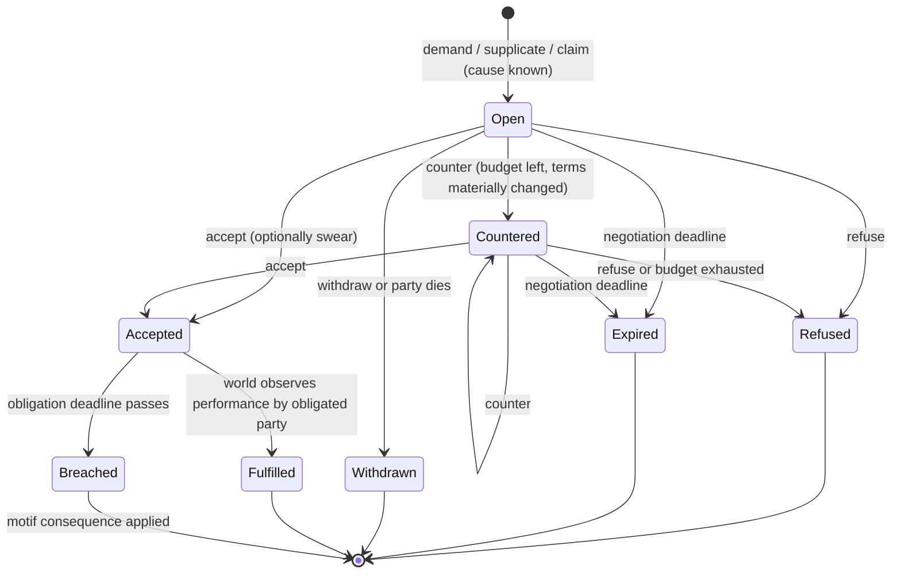
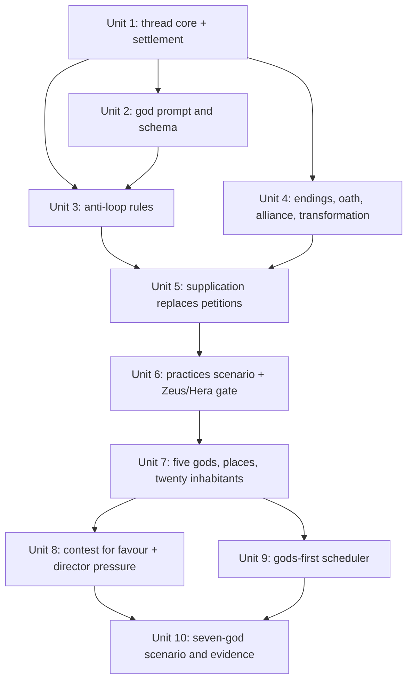

# feat: gods bargain, commit, and live with it

## Overview

Gods act through three Greek social practices: supplication, demand and settlement, and contest for favour. Each practice is a thread the world holds. A thread records what was asked, offered, and answered. It ends in an outcome the world judges and records, and it stays closed until something new happens. Supplication takes over today's petitions. The five remaining gods, twenty inhabitants, director pressure on open threads, and a gods-first scheduler follow. This plan absorbs M2 plan Units 9, 10, and 11 (see origin: docs/brainstorms/2026-10-02-god-practices-requirements.md).

## Problem Frame

The gate 3 rerun on qwen3 8B was rated continue, but Zeus and Hera kept returning to the same argument. Goals are private declarations the world never judges, and no offer, refusal, or promise between gods is recorded, so nothing concludes (`packages/world/src/goals.ts`). The world also has two mortals and four buildings, so gods have little to contend over. Prior LLM-agent systems with planning and reflection still loop. The levers with evidence are records the world holds: practices with roles and endings, schemes with outcomes, and commitments judged against the event log.

## Requirements Trace

Origin R1–R25 carry over unchanged. Grouped:

- R1–R13. Practice threads: causes, digest, moves, checkable terms, endings, recorded changes, closure and successors, no-progress, counteroffer budget, obligations lead the prompt, goals stay motives.
- R14–R16. Supplication, demand and settlement with Styx oath, contest for favour.
- R17–R19. Sourced motif endings, transformation with identity kept, alliances only by settlement.
- R20–R23. Five sourced gods with stakes, twenty routine inhabitants, director pressure on threads, seven gods on one model.
- R24–R25. Transcripts and the next Zeus and Hera gate on qwen3 8B.

Product requirements touched: W04, W05, W06, W07, W09, M05, O08 (`docs/product/requirements.md`). W01 and W10 are Phase B (Units 7–8) and are listed on those units.

## Scope Boundaries

- Player participation in practices: M3.
- A formal patron role that routes a place's worship and supplications: M04.
- Death, judgment of the dead, and playable afterlife: M3 (M06).
- The full Hesiodic Styx penalty and divine banishment: M3 (M08).
- Oaths sworn by mortals. Mortals bind themselves only by accepting supplication terms.
- Hospitality as its own practice.
- A model game master. The rules engine stays authoritative.

### Deferred to Separate Tasks

- Unit 13 of the M2 plan (one-hour unattended run, M2 exit gate, workload baseline): runs after this plan, with all seven gods.
- Generated visual effects for outcomes: M4.

## Context & Research

### Relevant Code and Patterns

- Proposals and events: `packages/contracts/src/proposal.ts` (`parseProposal`), `packages/contracts/src/event.ts` (`parseEvent`, `WORLD_EVENT_KINDS`, `eventSubjects`, `eventCause`).
- Validation and tick: `packages/world/src/validate.ts` (`validateProposal`), `packages/world/src/actions.ts` (`runTick`, `applyEvent`). The derive phase order today is answers, then lapses, then memories, then relationships.
- State and replay: `packages/world/src/state.ts` (`WorldState`), `packages/world/src/codec.ts`, `packages/persistence/src/archive.ts` (`importArchive` requires projection equality after rebuild).
- Lifecycle to generalize: `packages/world/src/petitions.ts` (open, answer window, `judgeAnswers`, `lapsingPetitions`, sign memory, worship).
- Motives, not commitments: `packages/world/src/goals.ts` (`planGoalEvents`, lock and refusal events).
- Feelings: `packages/world/src/memory.ts` (`planRelationships`, alliance threshold).
- Pressure: `packages/world/src/director.ts` (`planDirectorStep`).
- Mortals: `packages/world/src/routines.ts` (`decideRoutineProposal`, one proposal per tick).
- God turn: `packages/agents/src/context.ts` (`buildGodContext`, `godIntentSchema`, `describePetitions`), `packages/agents/src/observation.ts` (`buildModelProposal`), `packages/agents/src/turn.ts`.
- Dispatch: `apps/simulation/src/agents.ts` (`createGodTurnRunner`, one turn in flight, round-robin by deity id).
- Content: `content/greek/gods/*.json` with `packages/content/src/god-profile.ts`; `content/greek/world/{inhabitants,buildings,locations,rules}.json`; strict tunable parsers in `packages/contracts/src/content.ts` (`parsePetitionBalance`).
- Harness: `tools/scenarios/m2-greek-cast/src/real-analysis.ts`, `transcript.ts`, `steps/` with positive controls (`steps/s12-petition-privacy.ts`).
- Size today: `context.ts` 1427 lines, `validate.ts` 795, `actions.ts` 735, `petitions.ts` 716. Prompt p50 about 5.8K characters, max about 6.8K, on the 4K-token context.

### Institutional Learnings

- Pin only what the validator rechecks at commit; whole-entity pins refused every bless (`docs/solutions/logic-errors/whole-entity-revision-pins-refused-petition-answers-2026-10-02.md`).
- Let the target decide the action kind and name exact action and target pairs in guidance; per-kind `anyOf` schemas tripled schema size (`docs/solutions/logic-errors/move-realm-transition-destination-pairing-2026-10-02.md`).
- Judge presence at event time; claims are the only belief source and cited events are provenance only (`docs/solutions/logic-errors/knowledge-leaks-through-perception-timing-and-citations-2026-09-29.md`).
- Every negative check needs a positive control that forces failure (`docs/solutions/best-practices/end-to-end-scenario-with-positive-controls-2026-09-28.md`).
- Dispatch reads are I/O and stay inside the turn's error boundary (`docs/solutions/runtime-errors/unawaited-god-turn-store-fault-2026-09-29.md`).
- Admission order is policy; say who loses when the per-tick cap is short (`docs/solutions/logic-errors/tick-admission-starved-external-proposals-2026-09-28.md`).
- Consequences commit inside the tick transaction and survive export and import (`docs/solutions/integration-issues/proposal-accepted-then-lost-before-durable-2026-09-28.md`).
- Gods-first with inhabitants on routines is the settled scheduling policy (ADR-0005).

### External References

- Versu social practices (Evans and Short), Façade beats, storylets, Crusader Kings III schemes, Concordia's game master boundary, Generative Agents and Project Sid loop failures. Greek sources: Iliad 1, 14, 24; Odyssey 7, 9; Hesiod, Theogony; Homeric Hymns; Apollodorus; Pausanias 2.15.4; Ovid, Metamorphoses 6 (late). Full list in the origin document.

## Prior-Art Survey

```json
{
  "schema_version": 2,
  "verdict": "extend",
  "scope": "packages/contracts, packages/world, packages/agents, apps/simulation, packages/persistence",
  "freshness": {
    "vcs_reference": "7a81b23"
  },
  "budget": {
    "max_search_passes": 3,
    "max_candidate_inspections": 10,
    "exhausted": false
  },
  "candidates": [
    {
      "path_or_symbol": "packages/world/src/petitions.ts:Petition/judgeAnswers/lapsingPetitions",
      "description": "Owns petition causes, open/answered/lapsed status, answer windows, world-judged blessing/strike answers, lapse events, sign memories, and worship after answer.",
      "disposition": "extend"
    },
    {
      "path_or_symbol": "packages/world/src/goals.ts:planGoalEvents",
      "description": "Owns private active goals, goal set/end/refusal events, and lock timing; the world records and never judges them.",
      "disposition": "insufficient",
      "insufficiency_reason": "Goals are single-actor private motives, not shared commitments, negotiations, obligations, or world-judged terminal outcomes."
    },
    {
      "path_or_symbol": "packages/world/src/memory.ts:planRelationships",
      "description": "Owns memories and relationship deltas from witnessed, told, and sign consequences, including affinity, grudge, and the allied threshold.",
      "disposition": "insufficient",
      "insufficiency_reason": "It records after-effects of events but has no open lifecycle, deadlines, legal moves, terms, or participant negotiation state."
    },
    {
      "path_or_symbol": "packages/contracts/src/proposal.ts:Proposal and packages/world/src/validate.ts:validateProposal",
      "description": "Owns structured action kinds and rule validation for moves, reports, legends, prayers, blessings, goals, economy, repair, worship, and strikes.",
      "disposition": "extend"
    },
    {
      "path_or_symbol": "packages/world/src/routines.ts:decideRoutineProposal",
      "description": "Owns mortal one-proposal routine choice for consume, trade, produce, repair, pray, walk, and gather.",
      "disposition": "insufficient",
      "insufficiency_reason": "Routines select immediate proposals; they do not persist negotiation threads or judge obligations."
    },
    {
      "path_or_symbol": "packages/persistence/src/journal.ts:ExternalProposalEntry",
      "description": "Owns durable pending and consumed external proposal rows, proposal/observation pairing, target tick, outcome, and rejection reason.",
      "disposition": "insufficient",
      "insufficiency_reason": "It is transport durability for proposed actions, not domain state for negotiations, terms, deadlines, or consequences."
    }
  ]
}
```

## Key Technical Decisions

- **Threads are world state rebuilt from events.** A thread map sits in `WorldState` beside petitions and goals, not on actors. Events are the replay authority, and the codec and archive import change in lockstep.
- **One flat `practice` proposal kind with a move field.** Moves (demand, offer, counter, accept, swear, refuse, withdraw) share one schema branch so the 4K budget holds. The target, a thread id or a new cause, decides what is legal, as with move destinations.
- **A move pins only its thread's revision.** Thread ids join `getEntityRevision` in `packages/world/src/state.ts`, which today resolves only actors, locations, and buildings. The validator rechecks liveness, presence, terms, and budget at commit, so no other pin is needed.
- **Terms are typed predicates over committed events.** The first set is: tell a legend to an audience at a place, be at a place, stay away from a place, give a resource, bless a mortal, and make an offering. The world judges each from events after acceptance and by the obligated party only. A term its party cannot reach or afford by the deadline is refused at offer time.
- **Judging runs at the end of the environment step.** `runTick` derives memories only from primary events, so thread endings, breaches, motif consequences, and standing changes must be primary. The order is observed performances, then deadline and budget expiries, then breaches with their motif consequences. Memories and relationships follow, so a breach is remembered in the same tick.
- **Deadlines run on world ticks and are judged the same in catch-up.** No inference runs during catch-up, so no moves happen, but expiries and breaches do. Replay is identical (owner decision, 2026-10-02).
- **No-progress is a recorded rejection.** `no-progress` joins `REJECTION_REASON_CODES` in `packages/contracts/src/ids.ts`. A no-progress move is rejected with that reason and its cause, and the god's next digest says why. Rejections already carry outcome and reason through the journal and trace.
- **Off-thread talk matches on structure, never on words.** A report or legend between a thread's participants makes no progress when its structured claim names the same agent and target as the thread's subject, or when it cites the thread's cause event.
- **"Materially changed" compares the term tuple.** Kind, subject, party, amount, and deadline are compared, and the words never are.
- **Successors need a cause learned since the closed thread opened** (R9 as amended by the owner, 2026-10-02; a changed offer alone does not reopen a thread). Earlier wording: **Successors need a cause the closed thread did not consume.** A closed thread stores the cause event ids it consumed. A successor must cite a memory of a newer event about the same subject and link the closed thread.
- **Supplication generalizes petitions in place.** No petition data has shipped, so there is no migration. A supplication without terms behaves exactly as a petition does today, and the existing petition tests are the characterization suite.
- **Transformation is a recorded change of form and capabilities.** A transformation event names its cause. Memory, relationships, and identity stay with the actor.
- **Contests change standing, not patronage.** Standing is a per god and place value. Mortals weigh the services they experienced, and their worship and supplication choices follow that weight.
- **A contest opens on a perceived rival act.** A god opens a contest when it perceives a rival's bless, strike, or legend at a place with mortals. The profile rivalry decides which rivals it contests; it never opens a contest by itself.
- **Alliances come only from sealed settlements.** The affinity threshold stops creating alliances, and the superseded rule gets a dated note.
- **The digest never drops a thread that needs this god.** Accepted obligations and threads awaiting this god always appear, in a compressed row if needed. Only other open threads are cut to fit the budget.
- **The scheduler gives inference to decisions, not travel.** A god declares a destination with a validated `travel` proposal, which stores a journey in world state. The world turns each hop into a validated move. The journey ends on arrival, on an invalid or stale hop, or on the god's next decision. Gods with an obligation or a thread awaiting their answer go first, and no god waits past a fairness bound.
- **Tunables live in a strictly parsed `practiceBalance`** in `content/greek/world/rules.json`, like `petitionBalance`.

## Open Questions

### Resolved During Planning

- Deadlines during catch-up: judged as if live (owner).
- Party dies mid-thread: the thread ends withdrawn, with no consequence unless a breach was already due.
- Performance before acceptance, or by a third party: never fulfils.
- Contest with no mortals present: cannot open, and a contest whose place empties ends expired with no standing change.
- Gate strength: the gate keeps the requirements doc's bar; an accepted obligation is not required (owner, 2026-10-02).
- Mortal in two supplications: allowed for distinct losses, with the one-open-per-subject rule kept.
- Director and threads: the director creates attributed trouble near quiet contests and open threads. It never opens a thread or chooses a response; a participant who perceives the trouble may act on it.

### Deferred to Implementation

- Exact tunable values: deadlines, counteroffer budget, contest window, oath penalty size, standing deltas.
- The digest's exact wording and its size with several open threads, measured against the 4K budget.
- The transformation forms each motif offers, chosen while authoring the motif catalogue.
- Which new places and livelihoods each new god needs, settled by the lore research in Unit 7.

## High-Level Technical Design

> *This illustrates the intended approach and is directional guidance for review, not implementation specification. The implementing agent should treat it as context, not code to reproduce.*



A supplication with no terms goes from Open straight to Fulfilled (help performed) or Expired (lapse), which is today's petition. A contest has no negotiation: Open until its window closes, then Closed with standing changes.

Tick order: proposals → environment (income, fire, needs, director, then judge threads: performances, expiries, breaches and motifs, standing) → memories → relationships.

## Implementation Units



### Phase A — Zeus and Hera settle and answer

- [x] **Unit 1: Thread core and settlement lifecycle**

**Goal:** a world-held thread for demand and settlement, with moves, checkable terms, deadlines, and world-judged endings.

**Requirements:** R1, R2, R5, R6, R7, R8, R11, R15; W05, M05.

**Dependencies:** none (PRs #95 and #96 are merged).

**Files:**
- Create: `packages/world/src/practices.ts`, `packages/world/src/practices.test.ts`
- Modify: `packages/contracts/src/proposal.ts`, `packages/contracts/src/event.ts`, `packages/contracts/src/content.ts`, `packages/world/src/state.ts`, `packages/world/src/validate.ts`, `packages/world/src/actions.ts`, `packages/world/src/codec.ts`, `content/greek/world/rules.json`
- Test: `packages/contracts/src/proposal.test.ts`, `packages/contracts/src/event.test.ts`, `packages/world/src/codec.test.ts`, `packages/persistence/src/archive.test.ts`
- Docs: dated supersession notes in `docs/brainstorms/2026-10-01-god-goals-requirements.md`, `docs/brainstorms/2026-10-01-god-petitions-requirements.md`, and `docs/plans/2026-09-29-001-feat-m2-autonomous-greek-cast-plan.md` (Units 9–11 absorbed here); `docs/product/traceability.md` (M05, W05).

**Approach:**
- Thread state holds kind, participants and roles, cause event ids, terms, status, deadlines, counteroffer budget left, revision, and a successor link.
- Settlement moves: demand, counter, accept, swear on accept, refuse, withdraw.
- Opening requires a cause the opener knows: a memory of a perceived or told event, or a need or loss.
- Judge at the end of the environment step: performance observed, then negotiation and obligation deadlines, then budget exhaustion. Party death ends the thread withdrawn.
- Thread ids resolve through `getEntityRevision`.
- Strict `practiceBalance` tunables.

**Execution note:** test-first for the lifecycle and replay equality.

**Patterns to follow:** `petitions.ts` lifecycle and derive ordering; `parsePetitionBalance` strictness; codec and archive lockstep from the goals work.

**Test scenarios:**
- Happy path: Hera demands a legend at the altar with a deadline, Zeus accepts, then tells that legend to the mortals at the altar before the deadline → fulfilled, with the change recorded.
- Happy path: Zeus refuses → refused; the thread is closed and its consumed cause ids are stored.
- Edge case: Zeus accepts and the deadline passes with no performance → breached.
- Edge case: a legend told before acceptance, or by Hera, does not fulfil.
- Edge case: Zeus dies while the thread is open → withdrawn, no consequence.
- Edge case: the counteroffer budget runs out → refused; the negotiation deadline passes → expired.
- Error path: a term naming an unreachable place, or a resource Zeus cannot have by the deadline, is refused at offer.
- Error path: a demand with no known cause is refused.
- Error path: a move against a stale thread revision is refused `stale-target`; a move pinned to the current revision commits; an unrelated actor's move does not stale it.
- Edge case: after acceptance, the term's place becomes unreachable for Zeus; the obligation stays open, his digest marks it unperformable, and it breaches at the deadline unless renegotiated.
- Integration: export then import rebuilds an identical thread map; replay from the log equals live state.
- Integration: a deadline crossed during catch-up breaches exactly as live.

**Verification:** lifecycle tests pass; archive round-trip equal; `bun run check` passes.

- [x] **Unit 2: God prompt, schema, and proposal builder for practices**

**Goal:** gods see their threads and make practice moves within 4K.

**Requirements:** R3, R4, R5, R12; W04.

**Dependencies:** Unit 1.

**Files:**
- Modify: `packages/agents/src/context.ts`, `packages/agents/src/observation.ts`, `packages/agents/src/turn.ts`
- Test: `packages/agents/src/practices-context.test.ts` (new), `packages/agents/src/observation.test.ts`, `packages/agents/src/context.test.ts`

**Approach:**
- The digest comes first in the prompt. Accepted obligations lead it, then threads awaiting this god, then other open threads. Each shows the cause as this god knows it, the last answered move, the legal responses, the deadline, and any no-progress reason.
- Obligations and threads awaiting this god always appear, compressed if needed. Only other open threads are cut to fit.
- Add one flat `practice` intent with a move enum, a thread id or cause id, and a term picked from the checkable set. Legal targets are listed in guidance with exact pairs.
- The builder pins only the thread revision.
- Privacy: a god never sees another party's unobserved evidence or private goal.

**Execution note:** test-first; measure the prompt-size change on the same representative contexts as #91 and #94.

**Patterns to follow:** citation guidance in #91 (per-action eligible ids listed in guidance, flat schema); petitions section heading exported for the harness (`PRAYERS_HEADING`).

**Test scenarios:**
- Happy path: with an accepted obligation, the digest's first line is that obligation with its deadline.
- Happy path: a valid accept from the model parses and builds a proposal pinned only to the thread revision.
- Edge case: with three open threads, the digest stays within the measured budget and orders them by urgency.
- Edge case: with more threads than fit, every obligation and awaiting thread still appears, and only other threads are cut.
- Error path: an accept for a thread this god is not party to is refused at parse.
- Error path: a term outside the checkable set is refused at parse.
- Integration: the other god's private goal and unobserved evidence never appear in this god's digest.

**Verification:** tests pass; prompt-size change recorded; `bun run check` passes.

- [x] **Unit 3: Anti-loop rules**

**Goal:** the old loop cannot return inside a practice.

**Requirements:** R2, R9, R10, R11, R13; W04, M05.

**Dependencies:** Units 1 and 2.

**Files:**
- Modify: `packages/contracts/src/ids.ts` (`no-progress` reason), `packages/world/src/practices.ts`, `packages/world/src/validate.ts`, `packages/agents/src/context.ts`, `tools/scenarios/m2-greek-cast/src/transcript.ts`
- Test: `packages/world/src/practices.test.ts`, `packages/agents/src/practices-context.test.ts`

**Approach:**
- No-progress rejections cover three cases: a repeated answered move with an identical term tuple and no new evidence, a counteroffer with an unchanged tuple, and, while a thread is open, a report or legend between its participants whose structured claim names the thread's subject agent and target or that cites the thread's cause event.
- `no-progress` is a rejection reason that travels through the journal, trace, and transcript like the others.
- A successor needs a newer cause about the same subject that the closed thread did not consume, and it links the closed thread.
- Standing aims never count as a cause.
- A goal set or ended never changes a thread.
- The next digest names the no-progress reason.

**Execution note:** test-first.

**Patterns to follow:** goal refusal events and their prompt feedback (`goals.ts`).

**Test scenarios:**
- Happy path: after a refusal, Hera's identical demand is rejected `no-progress`, and her next digest says it was already answered.
- Happy path: Zeus counters, then counters again with the same tuple reworded → `no-progress`; a third counter exhausts the budget → refused.
- Happy path: a report from Zeus to Hera about the thread's subject while it is open → `no-progress`, and nothing is recorded in the thread.
- Edge case: a report between them whose claim names a different agent or target is unaffected, even if its words mention the same affair.
- Edge case: a report with the thread's subject in its claim but worded differently is still `no-progress`.
- Edge case: after a fulfilled demand, a new demand on the same subject with no newer cause is refused; after a new sighting it opens as a linked successor.
- Error path: ending a goal as achieved does not close or fulfil any thread.

**Verification:** tests pass; `bun run check` passes.

- [x] **Unit 4: Endings, oath penalty, alliances, and transformation**

**Goal:** endings change the world and the gods, using sourced motifs.

**Requirements:** R8, R15, R17, R18, R19; W07, W09.

**Dependencies:** Unit 1.

**Files:**
- Create: `content/greek/lore/motifs.json` (or the lore manifest's equivalent), `packages/content/src/motifs.ts`, `packages/content/src/motifs.test.ts`
- Modify: `packages/world/src/practices.ts`, `packages/world/src/state.ts`, `packages/world/src/memory.ts`, `packages/world/src/codec.ts`, `packages/contracts/src/event.ts`
- Test: `packages/world/src/practices.test.ts`, `packages/world/src/memory.test.ts`, `packages/world/src/codec.test.ts`
- Docs: dated supersession note on the alliance threshold in `docs/product/defaults.md`; `docs/product/traceability.md` (W07, W09)

**Approach:**
- The motif catalogue gives each motif's sources, variants, and labels (late Roman, game invention), plus the bounded change it applies.
- Each ending records at least one persistent change from its motif or outcome: affinity or grudge where the outcome calls for it, the bounded oath penalty on a sworn breach (divinity loss and a period without access to Olympus), or a transformation of form and capabilities with its cause.
- Ending events are primary events of the tick, so memories and relationships see them in the same tick.
- Alliances form only through a settlement whose term seals one. The affinity threshold no longer creates alliances.

**Execution note:** test-first.

**Patterns to follow:** god profile source and lore conventions (`packages/content/src/god-profile.ts`, `content/greek/lore/README.md`).

**Test scenarios:**
- Happy path: a sworn breach applies the bounded oath penalty and records the motif, the breach, and the cause.
- Happy path: a refusal lowers the demander's affinity toward the refuser; a fulfilment raises it.
- Happy path: a transformation changes form and capabilities, and the actor keeps its memories and relationships.
- Edge case: affinity of 6 creates no alliance; a sealed settlement does.
- Edge case: a transformed actor's pending proposal goes stale, and its unrelated relationships survive.
- Error path: a motif without sources fails content parse.
- Integration: a breach in tick N is in the breaker's and wronged party's memories in the same tick.

**Verification:** tests pass; content parses; archive round-trip equal.

- [x] **Unit 5: Supplication replaces petitions**

**Goal:** mortals supplicate, gods answer or offer terms, and mortals keep or break them.

**Requirements:** R14, R18, R21; W05, W07, W09.

**Dependencies:** Units 3 and 4.

**Files:**
- Modify: `packages/world/src/petitions.ts` (renamed or folded into `practices.ts`), `packages/world/src/routines.ts`, `packages/world/src/validate.ts`, `packages/agents/src/context.ts`
- Test: `packages/world/src/petitions.test.ts` (kept as characterization), `packages/world/src/practices.test.ts`, `packages/world/src/routines.test.ts`

**Approach:**
- A petition becomes a supplication thread with no terms, keeping its causes, divine hearing, answer judging, signs, worship, and lapse.
- A god may offer terms: a boon for an offering by a deadline.
- The routine accepts or declines by drive and resources, and performs the offering as an ordinary routine proposal.
- A breach applies a motif, such as transformation.
- When an accepted term's deadline is near, performing it comes before the mortal's other routine choices, and before gathering when the per-tick cap is short.

**Execution note:** characterization first. All existing petition tests must stay green before terms are added.

**Patterns to follow:** current `petitions.ts` and the petitions privacy check (#95).

**Test scenarios:**
- Happy path: a supplication with no terms behaves exactly as today's petition (existing suite).
- Happy path: the farmer supplicates Hera after his stock spoils; Hera offers food for an offering of wood, he accepts and offers, and the thread ends fulfilled.
- Happy path: the woodcutter accepts Zeus's terms, receives the boon, makes no offering by the deadline → breached; Zeus's transformation applies, and memory is kept.
- Edge case: a mortal that cannot afford the offering declines.
- Edge case: with the deadline near, the offering is chosen over trading.
- Edge case: one open supplication per subject still holds.
- Integration: the petition privacy check still passes on supplications.

**Verification:** existing and new tests pass; `bun run check` passes.

- [ ] **Unit 6: Practices scenario and the Zeus and Hera gate**

**Goal:** prove settlement and supplication end to end and run the next rated gate.

**Requirements:** R12, R24, R25; O08.

**Dependencies:** Units 1–5.

**Files:**
- Create: `tools/scenarios/m2-greek-cast/src/steps/s13-settlement.ts`, `tools/scenarios/m2-greek-cast/src/steps/s14-supplication.ts`, and further steps as needed
- Modify: `tools/scenarios/m2-greek-cast/src/real-analysis.ts`, `tools/scenarios/m2-greek-cast/src/transcript.ts`, `tools/scenarios/m2-greek-cast/README.md`
- Test: `tools/scenarios/m2-greek-cast/src/real-analysis.test.ts`
- Docs: `docs/product/traceability.md` (O08), gate episodes under `tools/scenarios/m2-greek-cast/episodes/`

**Approach:**
- Scripted steps cover refuse, accept and fulfil, sworn breach, no-progress repeat, counteroffer exhaustion, an off-thread report, a successor on a new sighting, and a supplication with terms kept and one breached.
- Transcripts show each thread's cause, moves, ending, and changes, plus open threads with their age and wait reason, and every no-progress rejection.
- For every turn an obligated god takes while its obligation is open, the transcript records whether it performed, renegotiated, waited for a named event, or knowingly risked breach.
  - Amended 2026-10-03 (owner, R12): an acceptance binds, so the classes are performed, waited for a named event, and knowingly risked breach; renegotiation belongs to a thread that is still open. `practice-analysis.ts`, its tests, the transcript, and the README no longer have a renegotiated class; an attempt to bargain over an accepted thread is classified as risking breach. The line above is kept for its context.
- Real-run properties: each god causes a thread ending with a persistent consequence in each episode, the run includes a supplication and a settlement with at least one refused or breached, no reopening without a new cause, no no-progress move advancing a thread, and a recorded consequence changing a later choice.
- Run 3 × 5-minute episodes on qwen3 8B at 4K with reasoning off, for the owner to rate.

**Execution note:** each new property gets a positive control that fails as required.

**Patterns to follow:** `steps/s12-petition-privacy.ts` and its positive control.

**Test scenarios:**
- Integration: the scripted settlement and supplication scenarios pass against the compiled sidecar.
- Integration: each positive control (a reopened thread, a no-progress move that advances, a thread with no ending, an obligated turn with no recorded choice) makes the run fail.
- Happy path: the transcript lists open threads with age and wait reason, and each obligated turn's choice.

**Verification:** `scenario:m2` passes and its controls fail as required; the gate transcripts are committed and rated by the owner.

Status (2026-10-03): the scenario and harness are done (34159f4). The gate ran three times with fixes between runs (cbd8c76, 81f2be1, 46ca1ea): 0 practice moves in 115 requests on 34159f4; 12 threads and 43 of 91 requests exhausted on cbd8c76; 28 threads, 27 ended (25 supplications fulfilled, 1 expired, 1 open at the end, 1 Zeus–Hera settlement fulfilled), nothing refused or breached, and 5 of 103 requests exhausted on 46ca1ea. The "supplication and settlement with at least one refused or breached" property failed in every episode, and Zeus failed influence in all three. The owner did not rate the gate, so Unit 6's verification stays open; Phase B proceeds by owner decision (2026-10-03), where rivals and stakes are expected to produce settlements and refusals. Evidence: `tools/scenarios/m2-greek-cast/episodes/2026-10-02T21-45-43/`, `2026-10-02T22-50-35/`, `2026-10-03T00-38-55/`.

### Phase B — Cast, contest, and scheduler

- [ ] **Unit 7: Five gods, their places, and twenty inhabitants**

**Goal:** the world gives every god something at stake.

**Requirements:** R20, R21; W01, W02, W06.

**Dependencies:** Unit 6 and the owner's continue rating on its gate.

**Files:**
- Create: `content/greek/gods/{athena,hermes,hephaestus,poseidon,hades}.json`, their lore sources under `content/greek/lore/`
- Modify: `content/greek/world/{inhabitants,buildings,locations,rules}.json`, `packages/world/src/routines.ts` as livelihoods need
- Test: `packages/content/src/god-profile.test.ts`, `packages/content/src/load.test.ts`, `apps/simulation/src/greek-world-pack.test.ts`

**Approach:**
- A lore research lane sources each god's profile, standing aims, rivalries, and variants before authoring.
- Add only the places and livelihoods those aims need, such as a harbor with fishers and a forge with a smith, and keep existing locations.
- Twenty inhabitants get drives and routines over existing actions, plus any minimal new recipe or resource a livelihood needs.

**Patterns to follow:** Zeus and Hera profiles; Unit 4 of the M2 plan's profile contract.

**Test scenarios:**
- Happy path: the full pack parses; every profile cites sources and labels inventions.
- Happy path: each new livelihood's routine produces and trades over a scripted day.
- Edge case: every ability resolves to a world rule.
- Error path: a profile whose rivalry names an unknown god fails parse.

**Verification:** content tests pass; `scenario:m1` and `scenario:m2` still pass.

- [x] **Unit 8: Contest for favour and director pressure**

**Goal:** rival gods compete for a place's people, and the world's pressure lands on open threads.

**Requirements:** R16, R21, R22; W06, W07, W10.

**Dependencies:** Units 5 and 7.

**Files:**
- Modify: `packages/world/src/practices.ts`, `packages/world/src/director.ts`, `packages/world/src/routines.ts`, `packages/world/src/state.ts`, `packages/world/src/codec.ts`
- Test: `packages/world/src/practices.test.ts`, `packages/world/src/director.test.ts`

**Approach:**
- A god opens a contest when it perceives a rival's bless, strike, or legend at a place with at least one mortal. The profile rivalry decides which rivals it contests. Each god's services there over the window count per mortal from what that mortal experienced.
- At window close, each god's standing there changes for good, and mortals' worship and supplication weights follow, replacing affinity-only routing in supplication. If the place empties, the contest ends expired with no standing change.
- The director prefers places with open threads or quiet contests for its attributed trouble. It never opens a thread or picks a response.

**Execution note:** test-first.

**Test scenarios:**
- Happy path: Athena's blessings reach five mortals and Poseidon's two → Athena's standing rises and Poseidon's falls, and those mortals worship and supplicate Athena more often.
- Edge case: the place empties mid-window → expired, no standing change.
- Error path: a contest with no perceived rival act is refused, even between profile rivals.
- Edge case: the loser cannot open a new contest there without a new cause.
- Happy path: a quiet contest draws a storm attributed to the director; neither god's move is chosen for it.
- Integration: director behavior is identical with and without a provider.

**Verification:** tests pass; archive round-trip equal.

- [x] **Unit 9: Gods-first scheduler**

**Goal:** seven gods share one model fairly, with inference spent on decisions.

**Requirements:** R23; W06, O08 (M2 plan Unit 10).

**Dependencies:** Unit 7.

**Files:**
- Create: `packages/agents/src/scheduler.ts`, `packages/agents/src/scheduler.test.ts`
- Modify: `apps/simulation/src/agents.ts`, `packages/contracts/src/proposal.ts` and `event.ts` (`travel` and journey events), `packages/world/src/state.ts`, `packages/world/src/codec.ts`, `packages/world/src/validate.ts`, `packages/world/src/actions.ts`, `packages/agents/src/context.ts`, `packages/agents/src/observation.ts`
- Test: `apps/simulation/src/agents.test.ts`, `packages/world/src/journey.test.ts` (new)

**Approach:**
- Still one inference at a time, and still at most one pending turn per god.
- Order: gods with an accepted obligation near its deadline, then gods with a thread awaiting their answer, then the rest round-robin. No god waits past a fairness bound.
- A god declares a destination with a validated `travel` proposal, which stores a journey in world state. Each tick the world turns the next hop into a validated move or realm-transition proposal. The journey ends on arrival, on an invalid or stale hop, or on the god's next decision, and a failed hop changes no state.
- Queue wait, generation time, and time to commit are recorded separately.
- All dispatch reads stay inside the turn's error boundary.

**Execution note:** test-first, including an injected store fault.

**Patterns to follow:** `createGodTurnRunner`; the unawaited god-turn store fault fix.

**Test scenarios:**
- Happy path: over a scripted run, every god gets a turn within the fairness bound.
- Happy path: a god with an obligation due soon goes before an idle god.
- Edge case: a god travelling to a declared destination takes no turns until it arrives or a thread needs it.
- Error path: a hop into a restricted realm is refused, the journey ends, and the god's position is unchanged.
- Integration: a journey replays identically from the log and survives export and import.
- Error path: a store fault in a scheduling read is logged and the tick timer survives.
- Integration: metrics appear in the scenario summary.

**Verification:** tests pass; seven-god scripted scenario keeps routines at cadence.

Status (2026-10-04): Unit 9 is split into two PRs, by owner decision. PR 1 is the scheduler: `packages/agents/src/scheduler.ts` (the pure picker), `schedulingSignals` beside `practiceBy` in `packages/agents/src/practices.ts` (the signal reader, sharing the prompt digest's standing rule), and `apps/simulation/src/agents.ts` calling them. PR 2 is travel journeys (the `travel` proposal, journey state and events, the codec and archive, and the context and observation changes). The checkbox stays unticked until both land. The owner's scheduler rules differ from the Approach text above in two places, which this note records and does not erase: the first tier is any accepted obligation, a boon owed included, whatever its deadline (not one "near its deadline"), earliest deadline first; and the fairness bound is a hard skip cap of 7 (one full round of seven), kept for every god at once. Prayers and contests raise nothing. The cursor and skip counts are in the service's memory and start over on a restart. Queue wait, generation time, and time to commit are not recorded by PR 1: the gate transcript's per-request timing table (#109) already lists when each god was asked, when its proposal was applied, and its latency.

Status (2026-10-04): PR 2 implements travel per the owner's choices of this date, which differ from the Approach text above and replace it where they differ: `travel(to)` is a god's one movement action and replaces `move` and `realm-transition` for gods (mortal routines keep both); the god's prompt lists the places it can travel to instead of its exits. A validated `travel` stores one journey and takes the first hop on the tick it is applied; every tick the world advances each journey by one hop, worked out from where the god stands and run through the existing move and realm-transition validators, with no model call and no divinity cost. A journey ends once, with a private event giving the reason: arrived, refused (a refused or no-route hop moves nothing, and the event carries the world's reason), or replaced (the god commits its next proposal). A god on a journey is not eligible for a turn until it ends, unless a thread awaits its answer (owing alone does not call it back). The journey is one `WorldState` field, in the codec and the archive's projection check. The contract changed accordingly: `travel` in `proposal.ts`, `journey-started` and `journey-ended` in `event.ts`, and `defaults.md` records the rules. The tests of this unit are covered by `journey.test.ts`, the dispatch tests in `agents.test.ts`, and the archive test in `proposal-journal.test.ts`, except the "metrics appear in the scenario summary" test, which PR 1's note above leaves to the per-request timing table; the checkbox stays unticked until the owner confirms that reading.

Status (2026-10-04): done. Both PRs have landed (the scheduler in #117, travel journeys in #119), and the owner has confirmed the reading of the "metrics appear in the scenario summary" test: the existing per-request timing table (when each god was asked, when its proposal was applied, its latency) and the journeys line meet it. The queue, generation, and commit split the Approach lists is not needed for M2; M2 Unit 13 can add it if the unattended run needs it.

- [x] **Unit 10: Seven-god scenario and evidence**

**Goal:** the full cast plays every practice in one scripted run, ready for Unit 13 of the M2 plan.

**Requirements:** R24; W01, W09, O08.

**Dependencies:** Units 8 and 9.

**Files:**
- Modify: `tools/scenarios/m2-greek-cast/src/steps/`, `tools/scenarios/m2-greek-cast/README.md`, `docs/product/traceability.md`, `docs/plans/2026-09-29-001-feat-m2-autonomous-greek-cast-plan.md`

**Approach:**
- A scripted run with all seven gods covers a settlement, a supplication with terms, a contest, a breach with transformation, and a sealed alliance.
- The transcript reports each god's thread endings and distinct practices.

**Test scenarios:**
- Integration: the seven-god scripted run passes, and each positive control fails as required.

**Verification:** `scenario:m2` passes; traceability rows updated; the M2 plan records Units 9–11 as done through this plan.

Status (2026-10-04): done. The owner approved this scope. The story is now 20 steps. Hermes, Hephaestus, and Hades each play a short arc beside the existing ones: S18 is a sealed alliance (Hermes demands that Hephaestus ally with him over a kindness Hephaestus told him; Hephaestus accepts; the world ends the thread sealed and allies both gods, each by one `relationship-changed` event citing its memory of the sealing, which rests on the sealed ending; no other relationship in the world is allied), and S19 is Hades walking to the dock, telling Hermes something, and refusing Hermes's demand in turn (named as the refuser, remembered by both, Hermes cooling toward him). The practice-properties step becomes S20 and names the cast: three new properties over the run's events, `alliances sealed by agreement`, `every god practiced` (each of the seven made at least one practice move), and `every practice appeared` (a settlement, a supplication with terms, a contest, a breach with transformation, a sealed alliance, and travel). `castPractices` in `practice-analysis.ts` reads each god's practices and thread endings from the log, and the transcript lists them. A god's practice move is a thread it opened or moved on, a contest it opened, or a journey it set out on; a contest's rival is credited only when the act the contest rests on was its own (Poseidon's legend), and a sealed alliance is the act of both gods in it. Three positive controls were added and fail: `alliance-unsealed` (S18), `god-silent` and `practice-absent` (S20). The existing practice controls still fail on the S20 properties. A real-model episode was not run; the new properties are asked only of a run that names its cast, so the gate's two-god episodes are unchanged.

## System-Wide Impact

- **Interaction graph:** proposal intake, tick environment step, perception, memory, relationships, routines, director, god context, dispatch, archive, transcript.
- **State lifecycle risks:** thread state must replay exactly. Every thread change is an event, and the codec and archive change in the same unit as the state.
- **API surface parity:** the client view reads committed state only. New event kinds must not break the observer.
- **Integration coverage:** catch-up breaches, restart with a journaled move, export and import of open threads.
- **Unchanged invariants:** the world service stays authoritative; generated output acts only through validated proposals; no inference during catch-up or replay; perception-limited knowledge; offline operation.

## Risks & Dependencies

| Risk | Mitigation |
|------|------------|
| The digest pushes prompts past the 4K context | Measure the change per unit against #91 and #94 baselines; obligations and threads awaiting the god always show, and only other threads are cut |
| qwen3 8B still loops by choosing legal but empty moves | No-progress rejections, the counteroffer budget, and the Unit 5 gate before the cast grows |
| Petitions regress while being generalized | The existing petition suite stays green as characterization before terms are added |
| Replay or archive inequality from new state | Codec and archive tests in every unit that adds state |
| Lore authoring for five gods stalls the plan | A dedicated research lane in Unit 7, with profiles limited to what the practices need |
| Scope size (ten units) | Phase A ends in a rated gate; Phase B starts only after a continue rating |

## Documentation / Operational Notes

- Dated supersession notes for "conversations end through goals", standalone petitions, and the alliance threshold.
- Traceability rows updated in each unit that touches a requirement.
- A `docs/solutions/` entry after Unit 5 on how practices closed the loop, or did not.

## Sources & References

- **Origin document:** docs/brainstorms/2026-10-02-god-practices-requirements.md
- Related plans: docs/plans/2026-09-29-001-feat-m2-autonomous-greek-cast-plan.md (Units 9–11 absorbed), docs/plans/2026-10-01-002-feat-god-petitions-plan.md
- Related PRs: #90, #91, #92, #94, #95, #96
- Gate evidence: tools/scenarios/m2-greek-cast/episodes/2026-10-02T14-29-04/
