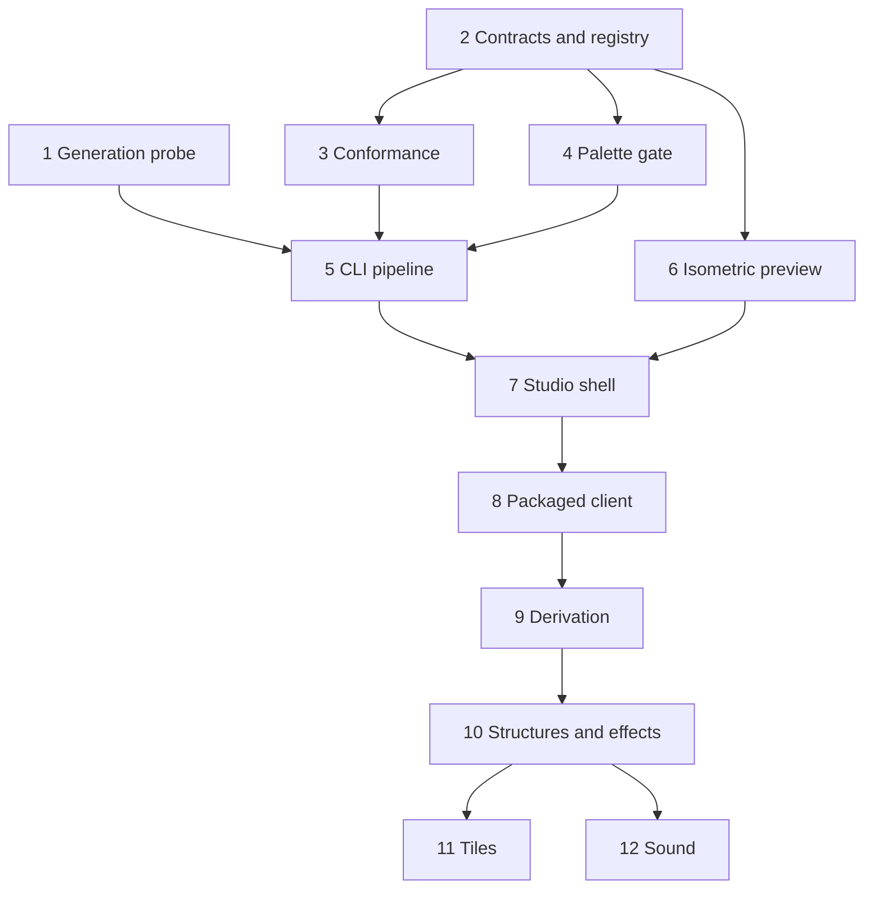
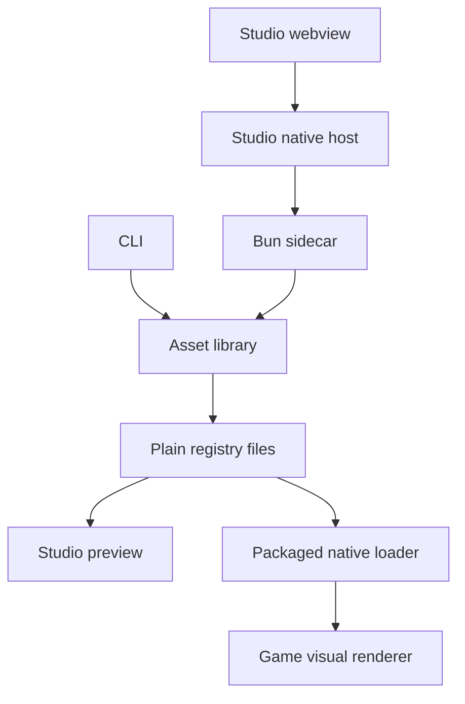

# feat: Asset studio foundation

## Overview

Build the full local authoring pipeline for Panthea sprites, portraits, structures, effects, tiles, and sound. One asset library serves a headless CLI and a separate Tauri studio; the packaged game resolves published assets without changing simulation behavior.

Ship three independent tiers: Zeus on screen, the visual reference scene, then world tiles and sound. Each of the twelve units lands separately; shared-additive contracts land before their consumers. Model quality and canon remain owner decisions, not automated verdicts.

---

## Problem Frame

The client draws markers, while the asset and content-tool packages are placeholders. M0 established local generation and deterministic silhouettes but its PixelArtRedmond LoRA is excluded from canon. The new pipeline must make an owner-approved Zeus set usable in the packaged client, with complete licences and provenance, without blocking the core simulation lane.

---

## Requirements Trace

R identifiers below refer to the origin document, not new product requirement IDs.

| Origin | Obligation | Units | Acceptance |
| --- | --- | --- | --- |
| R1 | Kind-specific metadata and versioned states | 2, 11, 12 | Manifest fixtures |
| R2 | Complete provenance, licences, edits and cancellations | 1, 2, 5, 9, 12 | AE5, AE6 |
| R3 | Content-addressed registry and missing-state fallback | 2, 8 | AE1 |
| R4 | Plain files and standalone validator | 2, 5 | F4 |
| R5 | Per-kind providers and shared jobs; unavailable staging | 2, 5, 12 | AE5 |
| R6 | Measured, output-redistributable local image chain | 1 | Licence ledger and contact sheets |
| R7 | Data-built generation specs | 2, 5 | F1 |
| R8 | Responsive queue, restart cancellation, serial heavy work | 1, 5, 7, 12 | AE6 |
| R9 | Deterministic conformance and scale uncertainty | 3, 5 | AE2 |
| R10 | Tagged Aseprite round trip and absent-editor fallback | 5, 7 | F2 |
| R11 | Report-only edit import and pixel diff | 3, 5, 7 | AE3 |
| R12 | Owner confirmation before altering hand edits | 2, 5, 7 | AE3 |
| R13 | Bounded deterministic derivation | 9 | AE4 |
| R14 | Reference generation and repair for new poses | 9 | F3 |
| R15 | Byte-identical derivation from manifests | 9 | AE4 |
| R16 | Representative integer-zoom preview | 6, 7 | AE1 |
| R17 | Studio live reload | 6, 7 | F4 |
| R18 | Shared app/CLI pipeline and restricted webview | 5, 7 | AE9 |
| R19 | Dual-grid tiles, Wang export, depth-sorted map | 11 | F5 |
| R20 | Complete tiered Zeus reference asset set | 1, 4, 5, 8, 9, 10, 11, 12 | Tier checkpoints |
| R21 | Three effect tiers and reduced-effects mode | 10 | AE7 |
| R22 | Committed synth parameters and derived audio | 12 | AE8 |
| R23 | Organic SFX model deferred until demonstrated need | Deferred | No model acquired here |
| R24 | Isolated lane, additive shared packages, coordinated client work | All | Per-unit scope review |

Update product traceability U06, U07, U08, X02, X03, and X05 where touched. Propose U09 for owner-facing local asset authoring, approval, provenance, and publication; it is not an accepted obligation until the owner approves its addition to `docs/product/requirements.md` and `docs/product/traceability.md`.

---

## Scope Boundaries

No changes to world rules, model-agent behavior, persistence, simulation lifecycle, client connection/store/settings, or core M1/M2 scenarios. Subject mappings live in `content/greek/assets/`; modifying god JSON needs core-lane agreement. No migrations or compatibility shims for unshipped formats.

### Deferred to Separate Tasks

- Walk and facing-driven states await core position/facing contracts. T1 supplies idle-south, seated-on-cloud, one strike act, and six portrait expressions; T2 supplies remaining idle directions, tree, building states, and lightning tiers.
- In-game runtime generation remains M4 and subject to ADR-0005; studio serialization does not resolve its coexistence gate.
- Hosted implementations/keys, models requiring more than 16 GB, SFX models, 47-tile blob sets, embedded pixel editing, player-facing map editing, voices, video, music and future-pack style transfer are excluded.
- No model training, marketplace, purchases, hosted deployment, or copying commercial art.

---

## Context & Research

Use `packages/contracts/src/content.ts` for strict parsers, `packages/content/src/god-profile.ts` for stable `sprite` identity, and `tools/probes/art-local/src/placeholder.ts` for deterministic PNG encoding. `packages/assets/src/index.ts` and `tools/content/src/index.ts` currently report not ready.

Follow `apps/client/src/renderer/markers.ts` for SpriteGroup ownership and `apps/client/src/renderer/lifecycle.test.ts` for renderer failures and receipt suppression. The current radial scene is not an isometric renderer. Follow `apps/simulation/scripts/build-sidecar.sh` and `apps/desktop/src-tauri/src/sidecar.rs` for the separate studio host, not for simulation coupling.

Research in `docs/research/asset-generation-2026-10-03.md` establishes candidate APIs and licence constraints, not M1 Pro measurements. Preserve M0 release `master-921-168f7b8`, Metal evidence and measurements. Begin with the current arm64 release and build from source only if host verification shows Metal absent. Keep binaries and weights gitignored; pin identifiers, licences and download-verified hashes.

Lessons from existing probes: subprocesses provide real memory/crash containment; browser-only previews miss Tauri CSP failures; screenshots must contain only the app window. Read relevant `docs/solutions/` entries before each implementation area.

---

## Prior-Art Survey

```json
{
  "schema_version": 2,
  "verdict": "extend",
  "scope": "apps/client/src/renderer, packages/{assets,contracts,content}, tools/content, tools/probes/art-local, tools/probes/{coexistence,provider-matrix,inference-baseline}",
  "freshness": {
    "vcs_reference": "9deea6574f8340a0d027e658d804f7782f573022"
  },
  "budget": {"max_search_passes": 4, "max_candidate_inspections": 12, "exhausted": false},
  "candidates": [
    {"path_or_symbol": "packages/assets/src/index.ts", "description": "Root exports hash, placeholder rendering, PNG header reading, pure resolution, and deterministic RGBA conformance functions with local metrics, pixel diffs, and report-only mode; no RGBA/PNG decoder; filesystem registry is a separate subpath.", "disposition": "extend"},
    {"path_or_symbol": "packages/assets/src/placeholder.ts:renderPlaceholder", "description": "Deterministic silhouette PNG and content-addressed logical URI; shares CRC from png.ts and preserves six placeholder and one encoder golden vectors.", "disposition": "reuse"},
    {"path_or_symbol": "tools/probes/art-local/src/run.ts", "description": "Probe-only generator runner records provenance, timings, errors, cancellations and result artifacts.", "disposition": "insufficient", "insufficiency_reason": "Probe reporting is not the asset job, editing or publication pipeline."},
    {"path_or_symbol": "packages/content/src/god-profile.ts:GodProfile.sprite", "description": "Core god profile retains stable sprite identity; god-visual-profile.ts separately parses visual metadata.", "disposition": "reuse"},
    {"path_or_symbol": "packages/contracts/src/content.ts:parseContentPack; packages/contracts/src/assets.ts; packages/contracts/src/asset-lifecycle.ts", "description": "Strict content parsing and reference checks coexist with implemented asset manifests, vocabulary, provenance, lifecycle, job and provider contracts; ConformanceReport carries checks, status and messages, with no structured metrics.", "disposition": "reuse"},
    {"path_or_symbol": "tools/content/src/index.ts:main, validateAssets", "description": "Asset validator CLI and exports are implemented in tools/content/src/assets.ts; it checks registry integrity including PNG chunks and CRCs, bounded scanline inflation and filter bytes, not pixel decoding or conformance.", "disposition": "reuse"},
    {"path_or_symbol": "apps/client/src/renderer/scene.ts:createWorldRenderer", "description": "Draws locations, buildings, actor markers and recent effects; actor placement comes from the current world view.", "disposition": "extend"},
    {"path_or_symbol": "apps/client/src/renderer/markers.ts:createMarkerLayer", "description": "Owns SpriteGroup and Sprite2D attachment, removal and disposal.", "disposition": "extend"},
    {"path_or_symbol": "apps/client/src/renderer/presentation.ts:placeEvents", "description": "Places recent events at a subject location in the viewed realm without choosing assets or world outcomes.", "disposition": "insufficient", "insufficiency_reason": "Event presentation has no asset identity, registry resolution or lifecycle behavior."},
    {"path_or_symbol": "tools/probes/coexistence/README.md", "description": "Heavy-work coexistence remains inconclusive; the 3072 MiB case exceeded its LLM p95 penalty threshold.", "disposition": "insufficient", "insufficiency_reason": "Coexistence measurements do not implement studio asset registry or publication behavior."},
    {"path_or_symbol": "tools/probes/provider-matrix/README.md", "description": "Model-provider fallback and offline network evidence, not asset state fallback.", "disposition": "insufficient", "insufficiency_reason": "Provider routing does not define asset lifecycle or registry resolution."},
    {"path_or_symbol": "tools/probes/inference-baseline/README.md", "description": "Local inference latency, capacity, concurrency and outage evidence with the renderer running.", "disposition": "insufficient", "insufficiency_reason": "Model capacity measurements do not establish asset publication or per-state resolution."}
  ]
}
```

---

## Key Technical Decisions

| Decision | Approach and reason |
| --- | --- |
| Shared execution | `@panthea/assets` owns steps; CLI and app translate requests and present results only. |
| Registry identity | `panthea-asset://` is a logical identifier, not a webview protocol. Stable sprite IDs resolve content-hashed revisions; no Tauri `asset:` collision. |
| Publication | Write immutable hashed blobs/manifests first, then atomically replace a single registry index containing mappings. Readers see the old or new complete index, never a half-published set. Re-publish changes its selected revision without overwriting prior bytes. |
| Lifecycle | Candidate → picked draft → approved → canon; rejection retains provenance. Editing externally is a draft substate; cancellation belongs to jobs, never assets. Asset provenance links its request/job ledger, including relevant cancellations, without treating cancelled output as an asset. |
| Human edits | Import/report-only conformance preserves edited pixels. Interactive replacement needs explicit confirmation; headless replacement fails with a diff, never implicitly confirms. Owner exceptions carry reasons in provenance. |
| Packaged loading | Bundle a read-only canon registry and actor-to-sprite mapping under desktop resources. Validate each mapping against `GodProfile.sprite`; Zeus retains `placeholder-zeus` as its stable sprite ID. Native commands resolve only IDs within that root and return bytes/metadata. Studio watches its authoring registry; client reloads registry on next load, not a filesystem watcher. |
| Model scheduling | One studio-owned heavy model resident at a time, unload before switching; no claims about controlling an independently running core service. Coordinate measurements with the core lane rather than masking external memory use. |
| Conformance | Pure deterministic TypeScript grid detection, k-centroid reduction and fixed-palette mapping. Optional external detector is explicit, never a silent fallback. |
| Rendering | Studio-owned isometric layer first; client adoption/extraction waits for coordinated Unit 8. No new simulation positions invented to animate walk. |
| Sound | zzfx-style parameter synthesis first; seeded mutation, fixed sample rate and pinned encoder. Package or vendoring choice remains an approval gate. |

Packing consumes selected draft frame sets and produces the final atlas and manifest first. Approval applies once to that exact packed record, and publish performs the explicit approved-to-canon transition after palette, provenance and licence gates. Deliberate owner edits can import and record exact pixels even when report-only conformance fails; automatic replacement proposals need explicit owner approval. CLI lifecycle actions include pick, approve, reject, exception, edit finish/discard, export/import edited, and queue remove/abort, in addition to the six pipeline verbs. These actions expose existing flows, not extra product scope.

---

## Open Questions

### Resolved During Planning

- Full three-tier scope is confirmed. Owner approved acquisition of Civitai model 1770073 / version 2454660 / file 2344890 for local benchmarking only; canonical use and publication remain unapproved.
- D26 already landed in #110; do not record it again. U09 remains a proposal.
- T1 is an independent asset milestone, not a new precondition for M2 exit.
- Aseprite absent: `open` reports unavailable; explicit PNG+JSON export/import preserves the remaining pipeline.

### Deferred to Implementation

- Chain choice, quantization, generation bound and cancellation latency require Unit 1 measurements; 90–120 seconds is a planning target, not a pass claim. Studio headroom is measured in Unit 7 once the real studio exists.
- Aseprite 1.3.18.6 is installed at `/Applications/Aseprite.app`, not on `PATH`; tag/slice fidelity still requires a real round trip with it. Isometric TileMap2D behavior requires Unit 6 verification; emit SpriteGroup geometry if it does not place/sort correctly.
- Final native command/CSP details require packaged tests and owner approval. Renderer extraction needs core-lane agreement.
- Palette hues, aura and portrait framing follow existing guide defaults until an owner-approved change; master palette approval blocks canon, not drafting.

---

## Output Structure

```text
apps/studio/                 Tauri UI and native sidecar host
tools/studio/                Headless command surface
tools/probes/art-local-2/    Measured generation comparison
tools/scenarios/studio-zeus-scene/ Packaged acceptance fixture
packages/assets/src/        Registry, jobs, conformance, editor, derivation
content/greek/assets/       Manifests, registry, subject mappings, canon bytes
content/greek/palette/      Master palette and realm families
docs/evidence/asset-studio/ Window-only visual evidence
```

---

## Implementation Units

Each unit is a separate focused PR. Units 2–4 may progress while Unit 1 measures; concurrent writers require isolated worktrees and explicit non-overlapping ownership. New behavior is test-first. Every requirement-bearing PR updates relevant traceability rows; architecture decisions add an ADR and its index entry, checking the next available number before allocation.



### Tier 1: Zeus on screen

### Unit 1. Local generation comparison
- [x] Complete measured probe and chain recommendation.
- **Requirements:** R2, R6, R8, R20; U06, U07, X02.
- **Dependencies:** Existing M0 evidence; probe-only Civitai approval. No other nonstandard licence acquisition is authorized.
- **Files:** Create `tools/probes/art-local-2/README.md`, `package.json`, `src/run.ts`, `src/run.test.ts`, licence/hash records and contact sheets; update `docs/decisions/0007-local-image-generation.md` and traceability.
- **Approach:** Compare FLUX.2-klein-base-4B plus svntax, Z-Image-Turbo plus the approved probe LoRA, SDXL plus pixel-art-xl, and no-LoRA fallback. Verify every component including encoders and VAE licence. Pin current sd-server release; verify Metal on host. Exercise 512×640 and 768×768 inputs for 64×80 and 96×96 outputs, separately recording the svntax training-layout mismatch. Record hardware, warmup, sample count, p50/p95, peak RSS, quantization, fixed-seed with/without LoRA output differences, restart abort-to-idle and contact sheets.
- **Patterns:** M0 probe provenance and subprocess measurement; preserve M0 evidence rather than replacing it.
- **Test scenarios:** Missing binary/weights yields staging guidance; failed or timed-out arm records failure without invented timings; paired-seed records retain settings and hashes; aborted job has no completed result. Real-host runs establish LoRA application, timing and memory, not mocks.
- **Verification:** Recommend only a measured chain with a stated timing bound on M1 Pro 16 GB; generator comparison is measured here, and studio headroom moves to Unit 7 verification. Differences demonstrate application, not visual quality; owner rates contact sheets. If no chain passes, report measured conflict and alternative without shrinking scope.
- **Outcome:** Z-Image-Turbo without a LoRA at 512×640 is the draft generator (p50/p95 76.70/76.74 s, n=3); SDXL with pixel-art-xl is the measured comparison; the Civitai Z-Image LoRA was unavailable (HTTP 401). This is a draft generator, not canon or an MVP claim, and studio headroom is measured in Unit 7.

### Unit 2. Contracts, registry and placeholder
- [x] Land shared-additive asset foundation.
- **Requirements:** R1–R5, R7, R12, R18, R24; U06–U08, X02.
- **Dependencies:** None on chosen model; core coordination for additive packages.
- **Files:** Contracts: `packages/contracts/src/assets.ts`, `asset-lifecycle.ts`, their tests, and `index.ts` exports. Assets: `packages/assets/src/{placeholder,hash,png,resolve,registry,fixtures}.ts` with tests, the M0 placeholder moved from `tools/probes/art-local` with golden-byte tests and its probe imports updated, and `index.ts`/`package.json` exports (root, `./registry`, `./fixtures`). Content: a separate `packages/content/src/god-visual-profile.ts` and test, exported from `index.ts`; `god-profile.ts` is unchanged. Validator: `tools/content/src/assets.ts`, tests and the `index.ts` CLI. Data: `content/greek/assets/` vocabulary, empty registry index and Zeus visual profile. Also traceability and ADR 0009 with its index entry. Approved internal workspace dependencies and their `bun.lock` entries are in; new external dependencies or other lock changes still need owner approval.
- **Approach:** Strict versioned kind-discriminated manifests, provenance, lifecycle transitions, reports and provider/job envelopes. Separate cancelled job records from asset records. Add visual profile metadata without editing core-owned god files. Resolve stable sprite ID and requested state, falling back per unresolved state. Publish immutable revisions through atomic index replacement; keep files readable without studio.
- **Patterns:** Existing strict content parsers and placeholder PNG encoder.
- **Test scenarios:** Reject malformed kind metadata, unknown states/version and broken references; reject illegal lifecycle transitions; preserve rejected provenance outside registry; missing ID/state returns placeholder; republish selects new revision while old bytes remain; interrupted publication leaves old index usable. Moved placeholder PNG and hashes match M0 byte-for-byte, changing only logical URI expectations.
- **Verification:** Standalone validator catches invalid mappings/hashes; valid partial canon resolves deterministically. No source dependency or lockfile change without approval.

### Unit 3. Deterministic conformance
- [x] Implement automatic and report-only cleanup.
- **Requirements:** R9, R11, R12; AE2, AE3; U06, X02.
- **Dependencies:** Unit 2; provisional palette fixtures suffice.
- **Files:** Create `packages/assets/src/conformance.ts`, `conformance.test.ts`, `fixtures/conformance/`; update asset exports and traceability.
- **Approach:** Confidence-bearing grid recovery, deterministic k-centroid reduction, fixed-palette mapping without dithering, binary alpha, canvas/pivot checks, silhouette and mirror reports. Low confidence requests scale; no guess. Background removal uses caller-supplied alpha or key-colour settings. Key tolerance, grid thresholds, alpha cutoff and palette are explicit inputs. Pure functions work on decoded RGBA and return a typed result: invalid input, needs-scale with grid evidence, or the image, proposal, contract report, local metrics and pixel diff. Hand imports are report-only. Optional external detector remains disabled unless explicitly installed/approved.
- **Patterns:** M0 deterministic encoder and art-guide checks; stable iteration and tie-breaking.
- **Test scenarios:** AE2 71-colour 8× input produces correct 64×80 grid and bounded colours; identical input produces identical bytes/reports; ambiguous grid requires supplied scale; invalid pivot, stray pixels and asymmetric mirror produce specific reports; report-only hand edit returns diff with unchanged input bytes; portrait interior antialias and declared effect accents obey kind rules.
- **Verification:** Fixture results expose detected scale, merged colours and moved pixels; automated silhouette checks do not certify recognizable identity.

### Unit 4. Master palette approval
- [x] Owner approved the 48-colour `greek-master` palette on 2026-10-05; digest `faa637b2ce7bd3493f20a7a1b191554640b9a801a6e8fc42f8a985bb07073209` recorded. This approves the palette only.
- **Requirements:** R9, R12, R20; X02.
- **Dependencies:** Unit 2 metadata; does not require model selection.
- **Files:** Create `content/greek/palette/master.gpl`, `master.hex`, `palette.json` (family and ramp definitions) and swatch evidence under `docs/evidence/asset-studio/palette/`; add `packages/assets/src/palette.ts`, `palette.test.ts`, `tools/content/src/palette.ts`, `palette.test.ts`; update `packages/assets/src/{registry.ts,fixtures.ts,index.ts}`, `tools/content/src/assets.ts` and traceability.
- **Approach:** Propose at most 64 original or attributed CC0 colours and town/Olympus/Underworld families. Preserve guide limits of 16 sprite and 32 portrait colours; those budgets stay in conformance, not the master parser. Draft palette may support tests; no canon before approval. `parsePalette` is a pure strict parser over `palette.json`, `master.gpl` and `master.hex`: the two lists name the same unique colours in the same order, every 4–5 shade ramp shade is a master colour, a colour appears once per family (it may serve several), and the families are exactly the vocabulary's. An approval is the digest of the palette id, master list and ramps, so editing any of them voids it; GPL names are cosmetic. `publishAsset` takes the parsed palette and refuses, before any write, a draft palette, a stale digest, or a manifest or realm variant that names another palette; `validateAssets` reads the palette and flags canon entries it does not back. The owner-approved palette is `greek-master`: 48 original colours in 12 four-shade ramps. This approval covers only the palette, not an asset, licence, or generator output. Interactive and headless replacement of off-palette pixels is Unit 5; until then a hand edit is report-only and an owner exception does not approve a palette.
- **Patterns:** `docs/product/art-guide.md` palette rules.
- **Test scenarios:** GPL/hex encode identical entries; duplicate/out-of-master family colours fail validation; unapproved palette blocks publish; palette replacement on a hand edit produces report/confirmation, never silent mutation.
- **Verification:** The owner approved the current `greek-master` palette digest on 2026-10-05. This approval is not canon asset approval. Any guide-default change is a separate owner question.

### Unit 5. Shared pipeline and CLI
- [x] Exercise request, edit and publish flows headlessly. PR #174 published the six-expression Zeus portrait. The idle-south sprite is deferred (owner, 2026-10-08); the child plan's Unit 7 note records the evidence, and Zeus keeps `placeholder-zeus`.
- **Requirements:** R2, R4–R12, R18, R20; F1, F2, F4; AE3, AE5, AE6.
- **Dependencies:** Units 2, 3; Unit 1's selected draft generator (Z-Image-Turbo without a LoRA), Unit 4 approval for canon.
- **Child plan:** `docs/plans/2026-10-05-001-feat-studio-pipeline-cli-plan.md` is the authoritative Unit 5 implementation plan.
- **Files:** See the child plan. In summary: create `tools/studio/` and a node-only `@panthea/assets/studio` subpath for the session host, durable authoring store, request builder, runtime adapter, bounded PNG decode, candidate conformance, Aseprite/export-import seam, packing, approval and publish gates; update contract/provenance tests, package exports, `content/greek/assets/`, traceability and ADRs only where implementation requires them.
- **Approach:** CLI and the future app sidecar call the same shared host functions over a single long-lived newline-JSON stdio session; no studio control-plane daemon, socket, HTTP service or token. The owned `sd-server` runtime may still use its existing local loopback HTTP API behind the adapter. The owning session holds an OS-backed SQLite exclusive lock for one authoring root; read-only list/status can inspect another active session, while mutations refuse busy. Resolve content-backed specs; default batch four is per slot, appends rerolls and preserves picked drafts when a request sheet is replaced. Serialize heavy providers and restart the owned subprocess to abort; missing providers report staging and no hosted fallback is wired. Generated keyframes become a local working set, not a valid sprite record. Picked portrait keyframes are auto-conformed native cells unless deliberately edited; multi-frame sprite animations need a complete imported frame set. Aseprite or PNG+JSON import is the hand-edit seam for animation frames. Packing consumes selected draft frame sets and creates the final atlas and manifest; approval applies once to that exact record; publish calls `publishAsset` unchanged after palette, provenance and licence gates. Unit 5 includes the greenfield generated-provenance contract change, selected-profile licence checks, and real selected-runtime cancellation/readiness evidence. Derive reports unsupported operations until Unit 9 rather than fabricating frames.
- **Patterns:** Probe subprocess adapters; strict contracts; shared library functions for every action.
- **Test scenarios:** Unknown subject blocks with choices; same seed/spec yields same adapter inputs; reroll appends new seeds; pick/approve/reject/exception exercise legal states. Three-job remove/abort preserves cancellation and starts third after restart, with cancelled late output discarded. Missing editor fails open but export/import works; save/finish/discard preserves or restores edit-session pixels and provenance; deliberate hand-pixel imports store exact bytes and refresh reports. Headless conform on a hand-edited draft where the proposal would replace pixels exits nonzero with a structured diff and leaves hand pixels untouched. Packing rejects incomplete frame sets without manufacturing frames, preserves all source job references/licences/hand edits, and is reproducible; publish rejects unapproved palette, failed source-job cross-check, missing prior canon revision, incompatible licences or stale reports before any write and preserves partial-state fallback.
- **Verification:** Real local F1/F2/F4 on Zeus idle-south and six-expression portrait set, including installed Aseprite fidelity, real selected-runtime readiness/cancellation/late-output evidence, deterministic pack bytes, complete provenance and explicit owner approval for any canon publication. T1 also needs seated and strike sets before its checkpoint. Owner approvals are explicit; CLI invocation never invents them.

### Unit 6. Isometric preview layer
- [ ] Establish representative pixel-exact preview.
- **Requirements:** R16, R17; U08, X02.
- **Dependencies:** Unit 2; fixture assets may precede canon.
- **Files:** Create `apps/studio/src/renderer/scene.ts`, `scene.test.ts`, `tiles.ts`, `tiles.test.ts`, preview fixtures and window evidence; update traceability.
- **Approach:** Verify installed three-flatland TileMap2D placement/sorting first. Use studio-owned SpriteGroup placement if insufficient. Low-resolution target, 2×/3×/4× nearest upscale, snapped camera, 64×32 tiles with 64×31 diamonds, guide elevation and x+y−z/layer ordering. Show drafts/approved assets and placeholders for context.
- **Patterns:** Client SpriteGroup lifetime and device-loss behavior; guide defaults, not radial scene extraction.
- **Test scenarios:** Equal-depth layer ties are stable; tall structure occludes actors by footprint; zoom retains hard pixel edges; missing state draws placeholder; changed atlas reloads without accumulating groups/textures; renderer restart rebuilds safely.
- **Verification:** Actual renderer inspection plus window-only screenshots at integer zoom; placement support is reported from execution, not inferred from a type declaration.

### Unit 7. Separate Tauri studio
- [ ] Host pipeline and full owner workflow.
- **Requirements:** R8, R10–R12, R16–R18; AE6, AE9; U08, X02.
- **Dependencies:** Units 5, 6; approval before capabilities, build pipeline or dependency changes.
- **Files:** Create `apps/studio/package.json`, `src/App.tsx`, `src/App.test.tsx`, native crate/config/capabilities, `src-tauri/src/sidecar.rs`, `commands.rs`, native tests and sidecar build script; update evidence, traceability and ADR/index.
- **Approach:** Bun pipeline sidecar supervised by native host. Explicit command bridge, no webview shell/filesystem permissions. Request form displays resolved input before queueing; queue shows progress/error/retry and remove/abort. Contact sheet exposes checks, scale, changes, pick/approve/reroll and frame playback. Editing-externally state supports finish/discard; unavailable editor offers export/import. Live reload includes draft and approved preview.
- **Patterns:** Desktop named-command capability and sidecar supervision, without simulation-specific commands or credentials.
- **Test scenarios:** Sidecar failure surfaces retry without losing job disposition; UI remains usable during generation/abort; editing and confirmation states survive save/import; failures do not grant approval. AE9 same request/seed via CLI and app produces identical bytes/reports using the shared library. Packaged CSP permits actual renderer imports.
- **Verification:** Packaged studio, real generator/editor path, responsive queue and window screenshots. Studio headroom: with the real studio running, execute one heavy Z-Image 512×640 job beside it and measure generator and studio RSS, system memory pressure, swap, disk and studio responsiveness; no mock or idle proxy. Capture unavailable/staging, abort/restart/cancelled, failed conformance, edit diff, absent-editor export/import, blocked publish and placeholder fallback; shared-library and command-bridge tests prove parity for all six verbs, lifecycle and queue actions. No browser-only completion claim; touched Rust crate passes formatting and warning-free checks.

The primary studio workspace groups request and queue, candidate sheet with reports/provenance, and selected-asset preview. Actions follow lifecycle: candidates can be picked/rejected; failed conformance needs an owner exception before approval; drafts can edit/approve/reject; external editing offers finish/discard; approved sets can pack/publish subject to palette/licence gates. Queue states distinguish empty, unavailable/staging, queued, running, aborting/restarting, cancelled, removed, failed and completed. Late results after cancellation are discarded, not presented as completed. Tests prove controls remain usable throughout those transitions.

### Unit 8. Packaged game resolution
- [ ] Draw canon Zeus in packaged client.
- **Requirements:** R3, R4, R20, R24; AE1; U07, U08, X02.
- **Dependencies:** Units 4–7, owner canon approval; core agreement and desktop capability/build approval.
- **Files:** Modify `apps/client/src/renderer/scene.ts`, `markers.ts`, visual-resolution tests; `apps/desktop/src-tauri/src/commands.rs`, permission/capability/config surfaces and native tests; create `tools/scenarios/studio-zeus-scene/README.md`, `src/run.ts`, `src/run.test.ts`; canon manifests/mappings under `content/greek/assets/`; traceability and ADR/index. If extraction is agreed, add `packages/renderer/` exports/tests and both consumers in this unit.
- **Approach:** Native read-only bundled registry loader supplies validated actor-to-profile-sprite mappings alongside manifests. Renderer joins existing actor IDs to those mappings, then resolves the sprite ID; it does not key the asset registry by actor ID or modify world frames/store. Default idle-south and existing committed event presentation drive normal rendering. A named packaged visual-inspection fixture explicitly selects seated, strike and portrait expressions without inventing simulation state. Retain placeholder for absent states and renderer receipt/device-loss semantics. Adopt shared isometric layer only through coordinated extraction; no store/observer/settings changes. Game refresh is next-load; studio alone watches changes.
- **Patterns:** Existing native command restrictions and renderer lifecycle tests.
- **Test scenarios:** Canon idle-south loads by existing sprite identity; missing seated uses placeholder (AE1); complete T1 seated/strike/portrait renders where driven or inspected. Unknown ID, corrupt manifest/hash and unavailable resource fail visibly/fall back appropriately; path escape never reads outside bundled root. Device loss restores asset layer; only drawable committed events produce receipts.
- **Verification:** New packaged scenario proves `placeholder-zeus` resolves to canon idle-south, seated-on-cloud, strike and all six portrait expressions, with source manifest/hash and window evidence for each. Success criterion 1 requires the idle/seated/portrait client-visible subset; R20 additionally requires strike. Run one complete owner sitting from request through candidate review, edit/approve and publish to packaged-client inspection; record elapsed time and licence-auditable provenance. If it cannot meet the owner's one-sitting outcome, report the measured conflict rather than certify T1. Mocks or atlas file existence alone do not pass.

### Tier 2: Visual reference scene

### Unit 9. Derivation and repair
- [ ] Expand approved sets honestly and reproducibly.
- **Requirements:** R2, R13–R15, R20; AE4; U06, U07, X02.
- **Dependencies:** Tier 1 complete; chosen provider must expose reference/inpaint capability or report unavailable.
- **Files:** Create `packages/assets/src/derive.ts`, `derive.test.ts`, `reference.ts`, `reference.test.ts`; extend CLI/app frame playback tests and committed derivation fixtures; update traceability.
- **Approach:** Approved inputs produce mirror/bob/palette/overlay outputs with versioned recipe and pinned encoder. Asymmetry prevents blind mirroring. Non-derivable north/back/pose frames return through generated-candidate review or manual editing, never deterministic claims. Reference conditioning and inpaint repair record inputs/settings. Deterministic batches are reviewed as sets.
- **Patterns:** Deterministic conformance and lifecycle gates.
- **Test scenarios:** AE4 east-to-west repeats byte-identically; declared bolt-hand asymmetry blocks mirror; recipe-only regeneration reproduces all frames; new walk/act request is not fulfilled by bob; generated repairs remain candidates; playback/scrubbing obey per-frame timing.
- **Verification:** Remaining Zeus idle directions are approved with provenance; no new core facing driver is introduced.

### Unit 10. Structures and effects
- [ ] Complete visual reference scene.
- **Requirements:** R20, R21; AE7; X02, X03.
- **Dependencies:** Unit 9.
- **Files:** Add tree/building/lightning manifests and bytes under `content/greek/assets/`; create `packages/assets/src/overlays.test.ts`, `effects.test.ts`; extend studio preview fixtures/tests and scenario evidence; update traceability.
- **Approach:** One tree and intact building; damage/fire overlay the same silhouette. Lightning has three tiers; tier one is under 300 ms without full-screen flash/shake. Reduced-effects selects tier one, not a different world outcome. Validate up to four declared emissive exceptions and blending rules.
- **Patterns:** Guide effect/structure rules and existing committed-event presentation.
- **Test scenarios:** Overlays preserve footprint/silhouette; all tiers exist with legal timing/colours; reduced-effects strike uses tier one while fixture building remains burning; missing effect falls back without creating events; idle directions and portrait expressions remain consistent.
- **Verification:** Owner reviews complete visual scene at 1×/integer zoom and reduced effects. T2 completes without tiles or sound.

### Tier 3: World tiles and sound

### Unit 11. Dual-grid tiles and map preview
- [ ] Produce seamless map-ready terrain.
- **Requirements:** R19, R20; F5; X02.
- **Dependencies:** Tier 2; existing preview layer.
- **Files:** Extend `packages/contracts/src/assets.ts` with the tile manifest kind and vocabulary, and `tools/content/src/assets.ts` validation (Unit 2 rejects `tile`); create `packages/assets/src/tiles.ts`, `tiles.test.ts`, `tiled.ts`, `tiled.test.ts`; extend CLI/app map surfaces and tests; add `content/greek/assets/tiles/`, map fixture and evidence; traceability.
- **Approach:** Generate or choose a seamless base texture through the existing candidate/provenance/approval flow, then stamp sixteen dual-grid masks; isometric diamonds and declared layer/occlusion. Export Tiled JSON tilesets/Wang metadata with correct eight-value wang IDs and map orientation. No 47-tile expansion.
- **Patterns:** Deterministic recipes, guide grid/elevation/depth order; Tiled format reference in research.
- **Test scenarios:** Generated and chosen texture paths retain provenance and require approval; non-seamless source reports edge failures. All sixteen masks are generated; neighbouring edge pixels match; identical texture/recipe regenerates bytes; invalid Wang references reject; exported tileset reloads into map preview; elevated/tall props sort correctly at layer ties.
- **Verification:** External Tiled import and actual studio map render establish exchange/seam/depth behavior, not JSON shape alone.

### Unit 12. Procedural sound authoring
- [ ] Publish reproducible thunder-strike sound.
- **Requirements:** R2, R5, R8, R20, R22; AE8; X05.
- **Dependencies:** Tier 2; package/vendoring and encoder approval where needed. May run alongside Unit 11 in an isolated lane.
- **Files:** Extend `packages/contracts/src/assets.ts` with the sound manifest kind and vocabulary, and `tools/content/src/assets.ts` validation (Unit 2 rejects `sound`); create `packages/assets/src/sound.ts`, `sound.test.ts`, `audio-encode.ts`, `audio-encode.test.ts`; extend CLI/app parameter panel and tests; add `content/greek/assets/sound/`, scene audio fixture and evidence; traceability and sound ADR/index.
- **Approach:** Presets, seeded mutation, editable parameters and re-render. Parameters/seed/sample rate/algorithm/encoder versions are source; normalize true peak to −1 dBTP and render Opus with fixed encoding metadata. Optional configured local LLM proposes validated parameters only and follows heavy-model unload ordering. No SFX model until an unmet synth sound is identified and separately approved. Playback uses one input-unlocked AudioContext.
- **Patterns:** Manifest provenance and deterministic derivation; research zzfx/jsfxr and audio processing notes.
- **Test scenarios:** Sound render/proposal jobs use the shared queue/provenance envelope; unavailable optional providers surface staging, and asynchronous jobs exercise removal/cancellation with no late result. AE8 delete derived render then regenerate identical bytes; invalid parameters reject; fixed seed mutation repeats; clipping input normalizes within true-peak target; absent local LLM leaves presets fully offline; unloaded model precedes optional LLM load; first-input playback works in packaged webview, including decoder/pre-skip behavior.
- **Verification:** Owner hears thunder-strike in packaged fixture; offline regeneration matches committed hash. Pin actual encoder build/settings before claiming Opus byte determinism. X05 game integration is coordinated if it requires core-owned event surfaces. The T3 checkpoint requires both Unit 11 world tiles and Unit 12 thunder-strike sound.

---

## System-Wide Impact



Model/editor failures become job errors or unavailable staging, never canon. Cancellation discards late output. A failed publication leaves the prior complete index selected. External edits update drafts and show reports without silently rewriting pixels. CLI/app parity is checked at the shared-library boundary and with packaged execution.

The simulation remains authoritative. Renderers consume recorded outcomes and asset metadata only; they do not choose actions, invent actor positions, or certify commitments. No credentials enter asset manifests, content, prompts, evidence or logs. Hosted endpoints are not wired; offline authoring after setup requires no network.

---

## Risks & Dependencies

| Risk | Gate or evidence |
| --- | --- |
| Model does not fit or LoRA workload mismatches | Measure each arm; keep failed arms visible and ask on concrete feasibility conflict. |
| Custom LoRA permissions | Benchmark-only approval does not authorize canon/publication. |
| Hand edits destroyed by cleanup | Report-only import, diff and explicit interactive confirmation; headless refusal. |
| Palette not accepted | Draft freely; block canon until owner approval. |
| Aseprite absent or lossy | Explicit export/import; real installed-editor tag/slice test before round-trip claim. |
| Isometric support only declared | Verify placement/depth; studio-owned SpriteGroup fallback within scope. |
| Packaged CSP/resources differ from browser | Packaged app/client tests and window-only evidence. |
| Core/shared-package drift | Separate additive PRs, recheck main and ADR numbering before each coordinated unit. |
| Encoder/platform nondeterminism | Pin versions/settings and test bytes; disclose unsupported parity instead of weakening guarantees. |

---

## Documentation / Operational Notes

Every requirement-bearing unit records actual evidence in traceability; no unrun acceptance is marked satisfied. New architecture ADRs carry Status, Context, Decision, Consequences, Evidence and requirement IDs and update `docs/decisions/README.md`. Capture reusable solved problems under `docs/solutions/` after each merged unit.

Verification includes frozen dependency installation and the workspace type/lint/test gate; touched Tauri crates require formatting and warning-free clippy. No dependencies, lockfile, capabilities, CI/build/release changes, deletions, public writes or merges bypass owner approval. Palette/canon decisions use the owner gate after evidence/doc updates. Pushing and PR creation need owner approval; the owner merges manually, with no automerge.

---

## Sources & References

- Origin: [asset studio requirements](../brainstorms/2026-10-03-asset-studio-requirements.md), R1–R24, F1–F6, AE1–AE9 and all four success criteria.
- [Generation research](../research/asset-generation-2026-10-03.md), including upstream model/editor/Tiled/audio references and licence ledger.
- [Art guide](../product/art-guide.md), [content direction](../product/content-direction.md), [owner decisions](../product/decisions.md) D14, D15, D19, D25, D26.
- [Local image ADR](../decisions/0007-local-image-generation.md), [provider ADR](../decisions/0005-model-providers.md), `tools/probes/art-local/README.md`.
- House plan: `docs/plans/2026-10-02-001-feat-god-practices-plan.md`.
- Foundation docs merged in [#110](https://github.com/marcusrbrown/panthea/pull/110), baseline `5b87b6eec8a0c3bc1c91f2532183610d4b65dccb`.
