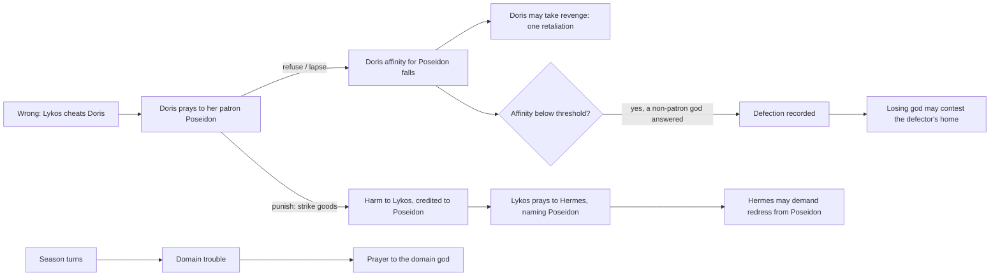

# feat: Mortals who wrong each other, and gods who take sides

## Overview

The world gains the pressure the 2026-10-05 seven-god gate lacked.
- **Patrons:** each inhabitant gets a stored patron god.
- **Wrongs:** inhabitants wrong each other by temperament and need.
- **Prayers:** a victim prays to its patron. A punished wrongdoer prays to its own patron and names the god that punished it, which gives two gods a cause to quarrel.
- **Neglect:** neglected mortals defect, and a defection opens a contest.
- **Troubles:** seasons change the odds of each god's domain troubles.
- **Director:** it keeps its own clock.
- **Food:** hunger becomes occasional.
- **Gate:** it trades its goal check for an initiative check.

The last unit runs the next rated gate.

## Problem Frame

See origin: `docs/brainstorms/2026-10-05-mortal-wrongs-requirements.md` (Problem Frame). In short:
- Unscripted, every prayer asked for food.
- The director never fired.
- No god acted toward another god.
- No mortal belonged to any god.

Research for this plan confirmed the mechanics behind each failure:
- **Patron:** no patron exists in state. `routePetition` re-picks the god with the highest affinity plus standing on every tick (`packages/world/src/petitions.ts`). Authored devotion only seeds a starting relationship (`packages/world/src/state.ts`, `createInitialWorldState`).
- **Punishment:** a god can punish a mortal only by striking a building it owns. A wrongdoer without a building can't be asked to be punished (`petitions.ts`, `requestFor`).
- **Refusal:** a prayer has no refusal answer, only bless, strike, terms, or lapse.
- **Contests:** a contest needs a standing rivalry and a perceived service act (`packages/world/src/contests.ts`, `validateContest`).
- **Director:** blessings and answered prayers reset its quiet measure (`packages/world/src/director.ts`, `isConsequential`).
- **Food:** only the agora shop starts with food, buildings can't trade, and routines sell only surplus to co-located actors (`packages/world/src/routines.ts`, `content/greek/world/buildings.json`).
- **Seasons and troubles:** no season, calendar, or trouble schema exists. God profiles carry only lore `domains` labels (`packages/content/src/god-profile.ts`).

## Requirements Trace

All twenty origin requirements are in scope.
- R1. Stored patron from authored devotion, visible in state and prompts. Every inhabitant gets an authored devotion (owner, 2026-10-05), so no livelihood fallback exists.
- R2. Each god has a domain, a closed list of troubles with sources. Troubles are prayed to the domain god.
- R3. A patron learns of harm through its worshipper's prayer. Harm caused by a god is a cause for a demand against that god.
- R4. Routine wrongs: theft, cheating in trade, unpaid debt, broken agreement, feud.
- R5. Authored temperament sets the odds of wrongs, and need raises them.
- R6. Wrongs are deterministic.
- R7. A victim supplicates its own patron and names the wrongdoer. The answers are punish, compensate, terms, refuse, or lapse.
- R8. A punished wrongdoer knows which god punished it and names that god to its own patron.
- R9. A refused or unanswered prayer lowers affinity for the addressed god, and an answer raises it.
- R10. Below the threshold, a mortal defects to the last non-patron god that answered it. Otherwise it keeps its patron.
- R11. Standing per place. A defection is a contest cause that needs no rivalry.
- R12. Revenge is damped: one retaliation per wrong, and none for a revenge.
- R13. Seasons on world time change the odds of troubles. At least one turn happens in an hour.
- R14. Each god has at least one unscripted domain trouble. Hades's needs no death.
- R15. The director's clock is never reset by answers or blessings.
- R16. Prompts show the season.
- R17. Hunger is occasional.
- R18. Transcripts show wrongs, routing, defections, revenge, and season turns.
- R19. No goal check in the gate. Every god opens at least one demand or contest toward another god.
- R20. ADR-0005's target becomes a p95 queue wait of 90 s or less.

Success criteria carried from the origin:
- SC1. At most 250 "cannot get food" lines per episode, and food prayers below half of all prayers.
- SC2. Every god's domain trouble occurs at least once per episode, and every god gets a prayer.
- SC3. At least one cross-patron wrong reaches the victim's patron and leads to a visible consequence.
- SC4. At least one unscripted demand, contest, or settlement between gods.
- SC5. Initiative from every god (R19).
- SC6. A neglected mortal defects within one episode.
- SC7. Owner rating.

## Scope Boundaries

- No new practice. Supplication, demand and settlement, and contest carry everything. A defection is a new contest cause, and harm to a worshipper is a demand cause the existing validator already admits.
- Inhabitants stay routine-driven, with no model.
- The goal feature stays. Only its gate checks go.
- No defection cooldown (owner, 2026-10-05). A mortal may switch back if its new god neglects it too.
- No mortality. Hades's trouble needs no death.
- No scheduler priority change up front. The cause-to-action latency is measured first (see Open Questions).

### Deferred to Separate Tasks

- M2 Unit 13 (the one-hour unattended run, M2 exit) and its plan come after this plan's rated gate (origin Scope Boundaries).

## Context & Research

### Relevant Code and Patterns

- **Tick pipeline:** `packages/world/src/actions.ts` `runTick` scans, drafts events, and reduces them. It threads the PRNG through fire and then the director. Each new producer extends this.
- **Routines:** `packages/world/src/routines.ts` `decideRoutineProposal` covers drives, needs, trade, production, prayer, and mortal obligations.
- **Petitions:** `packages/world/src/petitions.ts` covers `knownCause` and `prayableCauses` (newest first, one open petition per subject), `routePetition`, `requestFor`, answer and lapse judging, and `answeredBy`.
- **Relationships:** `packages/world/src/memory.ts` `signMemory` and `planRelationships` move affinity and grudge from signs and harm, and harm consequences name the agent when known.
- **Practices:** `packages/world/src/practices.ts` `openDemand` and supplication terms validation. `packages/world/src/contests.ts` `validateContest` and standing on closure.
- **Director:** `packages/world/src/director.ts` `planDirectorStep` (theft, spoilage, fire) and `isConsequential`.
- **Content rules:** strict content rules and tunables in `packages/contracts/src/content.ts`. Content lives in `content/greek/world/{inhabitants,buildings,rules}.json` and `content/greek/gods/*.json`.
- **Agents:** `packages/agents/src/scheduler.ts` (tiers, `SKIP_CAP`), and `packages/agents/src/practices.ts` (digest ordering and budgets: digest 1,600, prayers 2,400, contests 600 chars).
- **Gate:**
  - `tools/scenarios/m2-greek-cast/src/episode-analysis.ts`: goal checks, and influence via `answeredBy`.
  - `real-analysis.ts` and `practice-analysis.ts`: properties.
  - `practice-controls.ts`: in-process sabotage controls (#132).
  - `request-timing.ts`: request timing from trace and journal.
- **Scripted steps:** `tools/scenarios/m2-greek-cast/src/steps/s12`–`s17`.
- **Tunables:** `docs/product/defaults.md` (D23).

### Institutional Learnings

- **Commit hook:** new records (wrongs, prayers, defections, season turns) commit inside the tick through the `onCommitted` hook, never in a second call (`docs/solutions/best-practices/side-effects-inside-the-commit-transaction-2026-09-28.md`).
- **PRNG:** it's threaded explicitly. A producer consumes it and returns the next state (`docs/solutions/best-practices/authoritative-rule-validation-2026-09-27.md`).
- **Terms:** a term's promise and its keeping share one validator predicate (`docs/solutions/logic-errors/world-judged-obligation-evidence-windows-2026-10-03.md`).
- **Pins:** pin only the facts an action depends on, never whole entities (`docs/solutions/logic-errors/whole-entity-revision-pins-refused-petition-answers-2026-10-02.md`).
- **Prompt budget:** Ollama silently drops the start of a prompt over about 4,090 tokens. Budget each section, keep binding rows, and guard the whole prompt by `prompt_eval_count` (`docs/solutions/best-practices/ollama-4k-prompts-truncate-silently-2026-10-03.md`).
- **Moves:** new moves need copyable, validated exemplars listed as peers (`docs/solutions/best-practices/prompt-commanding-old-action-hides-new-option-2026-10-03.md`).
- **Trade:** sellers come from production role, so test for loops between the same two actors (`docs/solutions/logic-errors/routine-trade-follows-production-role-2026-10-03.md`).
- **Tunables:** accepted tunables need boundary values tested through commit, reopen, and export (`docs/solutions/logic-errors/accepted-memory-tunable-made-world-unreloadable-2026-09-29.md`).
- **Positive controls:** every "never" property gets one that fails (`docs/solutions/best-practices/end-to-end-scenario-with-positive-controls-2026-09-28.md`).
- **Ceremony:** each safeguard traces to a requirement ID (`docs/solutions/best-practices/greenfield-anti-over-engineering-2026-09-27.md`).
- **Not covered:** no learning exists for the director clock, seasons, food balance, or scheduler fairness.

## Prior-Art Survey

```json
{
  "schema_version": 2,
  "verdict": "extend",
  "scope": "packages/world",
  "freshness": {
    "vcs_reference": "c8969ad8f167c2d6cab8105827350cb48a002c04"
  },
  "budget": {
    "max_search_passes": 3,
    "max_candidate_inspections": 10,
    "exhausted": false
  },
  "candidates": [
    {
      "path_or_symbol": "packages/world/src/actions.ts::runTick",
      "description": "world tick event pipeline: proposal validation, environment events, director, notices, practice and contest judging, petition answers and lapses, derived memories and relationship changes",
      "disposition": "extend"
    },
    {
      "path_or_symbol": "packages/world/src/routines.ts::decideRoutineProposal",
      "description": "routine-driven mortal action selection from drives, needs, trades, production, repair, prayer, and mortal practice obligations",
      "disposition": "extend"
    },
    {
      "path_or_symbol": "packages/world/src/petitions.ts",
      "description": "prayable causes, god routing by affinity plus standing, petition state, answer and lapse judging, and answer linkage through answeredBy",
      "disposition": "extend"
    },
    {
      "path_or_symbol": "packages/world/src/memory.ts::signMemory/planRelationships",
      "description": "answer or silence signs become memories; harm, kindness and refusal move affinity and grudge with provenance",
      "disposition": "extend"
    },
    {
      "path_or_symbol": "packages/world/src/director.ts::planDirectorStep",
      "description": "deterministic PRNG-driven world trouble: theft, stock spoilage, director-caused fire after quiet ticks",
      "disposition": "extend"
    },
    {
      "path_or_symbol": "packages/world/src/contests.ts::validateContest",
      "description": "contests for a place's people over rival service acts, with standing changes at closure",
      "disposition": "extend"
    },
    {
      "path_or_symbol": "packages/world/src/state.ts::relationships/devotion/standing",
      "description": "devotion seeds affinity; relationships and standing persist, but no explicit patron or defection state exists",
      "disposition": "extend"
    },
    {
      "path_or_symbol": "packages/world/src/state.ts::PrngState",
      "description": "persisted deterministic PRNG state used by world rules",
      "disposition": "reuse"
    },
    {
      "path_or_symbol": "packages/contracts/src/content.ts::WorldRules",
      "description": "strict content rule schema for balances and resources; no seasons, calendar, domain trouble, temperament, or patron fallback fields yet",
      "disposition": "extend"
    }
  ]
}
```

## Key Technical Decisions

- **The patron is stored state, changed only by a recorded defection event.** It comes from authored devotion. The few inhabitants without one get an authored devotion, so no fallback table or rule exists (owner, 2026-10-05).
- **Routing:** wrongs, grudges, harms, and needs go to the patron. Hunger goes there because no god in the cast has food in its domain (owner, 2026-10-05). Only domain troubles go to the domain god.
- **Troubles route by a domain table.** A cause with no mortal wrongdoer (fire, spoilage, director theft, season troubles) maps to a trouble kind, and each trouble kind to exactly one god in content.
- **A punishment can strike a mortal's goods.** A strike may target a mortal (owner, 2026-10-05). The world takes the mortal's most valuable carried good, up to a D23 cap, so the model chooses nothing. A mortal carrying nothing is still struck: the harm is credited to the god with nothing taken (owner, 2026-10-05). The building-only requirement on a punish request goes away.
- **The punished mortal always knows the punisher.** The harm consequence names the god, so its prayer to its patron carries an attributable cause.
- **A prayer addressed to a god is a cause that god knows.** The demand validator's known-cause check is extended to admit it. That's the patron's knowledge of the harm, so no new perception rule is needed.
- **A prayer about harm done by a god takes priority** over an open need prayer, so the punisher's name reaches the patron in time.
- **Refusal is a prayer answer.** It derives a sign like a lapse does, and costs the same affinity (R9). It makes the victim eligible for revenge the same way: the owner confirmed refusal counts as unanswered for R12 (plan scope, 2026-10-05).
- **One wrong event shape.** A wrong has a wrongdoer, a victim, a kind, and a loss. Theft, cheating, and feud use existing substrate. Unpaid debt and broken agreement come from one minimal credit trade between mortals: goods now, payment by a deadline. A buyer who never pays is an unpaid debt. A seller who takes payment and never delivers is a broken agreement.
- **Defections are judged at prayer endings.** After an answer, refusal, or lapse changes affinity, the world checks the threshold and records any defection in the same tick.
- **A defection contest bypasses rivalry and the service-act cause.** The place is the defector's home. If a contest is already open at that place, the defection is recorded but opens nothing.
- **Seasons are derived from the tick.** `season = floor(tick / seasonTicks) mod seasons`, and the world emits a `season-turned` event on the boundary tick. Catch-up replays it exactly.
- **The director counts ticks since its own last fire.** Answers and blessings no longer reset it.
- **Each god's trouble has a guaranteed floor** (owner, 2026-10-05). Every god's domain trouble fires at least once per D23 window shorter than an episode, at a slot the persisted PRNG picks. The season's odds add more troubles on top.
- **PRNG order is fixed and documented.** Mortal wrongs, then revenge, then domain troubles, then fire, then the director, each over actors in id order. A replay property test pins it.
- **The food fix is content plus selling rules.** It decides who can sell food and where, and doesn't touch prices alone. A scripted day must show production meeting consumption, with no trade loops.
- **Tunables live in D23.** Temperament odds, defection threshold, season length, trouble odds, director interval, credit deadline, and food values all go in `docs/product/defaults.md`. Each is tested at its boundary values through commit, reopen, and export.

## Open Questions

### Resolved During Planning

- **Patron model:** stored state, not hysteresis on routing (flow analysis gap 1, origin R1 and R10).
- **Punishing a mortal with no building:** a strike on its goods (owner).
- **Hunger routing:** to the patron (owner).
- **Defection cooldown:** none (owner).
- **Defection during an open contest:** recorded, and opens nothing.
- **Goods taken by a strike:** the most valuable carried good, capped. An empty-handed mortal is still struck (owner).
- **Inhabitants without a devotion:** each gets an authored one (owner).
- **Each god's trouble per episode:** a guaranteed floor, plus seasonal odds (owner).
- **Initiative:** counts demands, which carry their terms, and contests opened toward another god. Terms offered to a mortal aren't toward a god.
- **Goal-check trace:** O08's god-goals gate amendments (`docs/product/traceability.md`). The goal checks are removed there with a dated clause.

### Deferred to Implementation

- **Cause-to-action latency** (origin Outstanding Questions). Unit 8 measures the ticks from a wrong to the punished mortal's patron opening a demand, in scripted and real runs. Add a scheduler priority for a god with a fresh harm or defection cause only if the real gate shows the latency outruns an episode.
- **Prompt cost of the new sections.** Measure by `prompt_eval_count` on the busiest god. Set each section's budget from the measurement.
- **Each god's domain troubles,** with sources from a lore research lane in Unit 5. Hades's needs no death, for example a buried store spoiling or a lost hoard.
- **Default values for every new tunable.** The defaults must meet SC1, SC2, and SC6 on a scripted 300-tick run. They must also give at least three wrongs between different gods' people in that run, and at least one season change within the one-hour run's tick count (R13).

## High-Level Technical Design

> *This illustrates the intended approach and is directional guidance for review, not implementation specification. The implementing agent should treat it as context, not code to reproduce.*



Tick order for the new PRNG consumers: mortal wrongs, then revenge, then domain troubles, then fire, then the director.

## Implementation Units

### Phase A — World

- [ ] **Unit 1: Patron state and prayer routing**

**Goal:** Every inhabitant has a stored patron. Prayers go to the patron, or to the domain god for troubles.

**Requirements:** R1, R2 (routing), R7 (routing).

**Dependencies:** None.

**Files:**
- Modify: `packages/world/src/state.ts`, `packages/world/src/petitions.ts`, `packages/world/src/codec.ts`, `packages/contracts/src/content.ts`, `content/greek/world/inhabitants.json`, `content/greek/world/rules.json` (trouble-kind table)
- Test: `packages/world/src/petitions.test.ts`, `packages/world/src/state.test.ts`, `packages/world/src/codec.test.ts`, `packages/contracts/src/content.test.ts`

**Approach:**
- The patron comes from authored devotion. Inhabitants without one get an authored devotion, and content parse requires one for every inhabitant.
- `routePetition` sends wrongs, grudges, harms, and needs, hunger included, to the patron. Domain-trouble causes (fire, spoilage, director theft, and Unit 5's season troubles) go through the trouble-kind table to the domain god.
- The patron is part of the replayed state, the world codec, and the export.

**Patterns to follow:** existing devotion seeding in `createInitialWorldState`, and the `routePetition` tie-break rules.

**Test scenarios:**
- Happy path: an inhabitant with a devotion to Hera has Hera as patron.
- Happy path: a need prayer goes to the patron even when another god has higher affinity plus standing.
- Happy path: a fire prayer goes to the trouble table's god, not the patron.
- Error path: an inhabitant without a devotion fails content parse.
- Integration: the patron survives commit, reopen, and export, then import.

**Verification:** routing tests pass, and the scripted story still holds where its prayers relied on affinity routing (adjust those steps in Unit 8).

- [ ] **Unit 2: Punishing a mortal, refusal, and harm as a cause between gods**

**Goal:** A god can punish any wrongdoer and refuse any prayer. A punished worshipper's prayer gives its patron a cause against the punisher.

**Requirements:** R3, R7, R8, R9 (refusal).

**Dependencies:** Unit 1.

**Files:**
- Modify: `packages/world/src/petitions.ts`, `packages/world/src/actions.ts`, `packages/world/src/memory.ts`, `packages/world/src/practices.ts`, `packages/contracts/src/` (event and proposal schemas)
- Test: `packages/world/src/petitions.test.ts`, `packages/world/src/memory.test.ts`, `packages/world/src/practices.test.ts`

**Approach:**
- A strike may target a mortal. The world takes the mortal's most valuable carried good, up to a D23 cap. A mortal carrying nothing is still struck: a harm credited to the god with nothing taken.
- A `punish` request no longer needs a building.
- The harm consequence always names the striking god for the target.
- The harmed mortal's prayable cause is the harm, with its agent. It goes to its own patron (Unit 1). A harm done by a god takes priority over an open need prayer.
- The demand validator's known-cause check admits a prayer addressed to the demanding god. A demand citing that harm then validates. Assert that a god can't demand against itself.
- A prayer answer `refuse` derives a sign like a lapse does, with the same affinity cost.

**Execution note:** test-first for the punish → harm → patron-prayer → demand chain.

**Patterns to follow:** building strike and harm consequences in `memory.ts`, and lapse judging in `petitions.ts`.

**Test scenarios:**
- Happy path: Poseidon strikes Lykos's goods. Lykos loses the resource, remembers Poseidon as the agent, and prays to Hermes, naming Poseidon. Hermes's demand against Poseidon citing that prayer's cause validates.
- Happy path: a strike on a mortal takes its most valuable carried good, up to the cap.
- Edge case: a strike on a mortal with an empty inventory still lands, as a harm credited to the god with nothing taken. The mortal's prayer still names the god.
- Edge case: a punished mortal with an open need prayer prays about the harm next, ahead of the need.
- Edge case: when Lykos and Doris share a patron, the patron's punishment leaves no cross-god cause, and a self-demand is refused.
- Happy path: a refused prayer lowers affinity for the addressed god by the lapse amount, and records a sign memory.
- Integration: privacy holds. Only the harmed mortal and its patron learn the punisher; other gods don't (`s12` property).

**Verification:** the chain test passes end to end in the world package, and petition-privacy tests still pass.

- [ ] **Unit 3: Defection, standing, and the defection contest**

**Goal:** A neglected mortal defects to a god that answered it. The god that lost it may contest the defector's home.

**Requirements:** R9, R10, R11.

**Dependencies:** Units 1 and 2.

**Files:**
- Create: `packages/world/src/patrons.ts`
- Modify: `packages/world/src/actions.ts`, `packages/world/src/contests.ts`, `packages/world/src/state.ts`, `packages/contracts/src/`
- Test: `packages/world/src/patrons.test.ts`, `packages/world/src/contests.test.ts`

**Approach:**
- After any prayer ending in a tick, check the patron affinity against the threshold. Defect to the last non-patron god that answered, or keep the patron if none has.
- Record a `patron-changed` event with its cause: the lapsed or refused prayers and the answer.
- Standing per place counts held worshippers and answered prayers, and falls on defection and on unanswered prayers.
- The contest cause union gains a defection. Its validation skips rivalry, perception, and act age. The place is the defector's home. One open contest per place is still enforced.

**Patterns to follow:** contest cause validation and standing on closure in `contests.ts`.

**Test scenarios:**
- Happy path (AE2): three lapsed prayers to Poseidon, then Athena answers. Below the threshold, the fisher becomes Athena's, and the event cites the lapses.
- Edge case (AE3): below the threshold with no non-patron answer, the mortal keeps its patron. A later answer from Athena triggers the defection.
- Edge case: the last answerer is the current patron. The mortal defects to the last non-patron answerer instead.
- Happy path (AE4): Poseidon opens a contest with Athena for the harbor, citing the defection, with no rivalry.
- Edge case: a defection at a place with an open contest is recorded and opens nothing.
- Integration: a defection and its standing change replay identically from the journal.

**Verification:** patron and contest tests pass, and replay equality holds.

- [ ] **Unit 4: Temperament, wrongs, credit trade, and damped revenge**

**Goal:** Inhabitants wrong each other by temperament and need, deterministically, and revenge is bounded.

**Requirements:** R4, R5, R6, R12.

**Dependencies:** Units 1 and 2: victims route to their patron, and revenge needs the refuse answer.

**Files:**
- Create: `packages/world/src/wrongs.ts`
- Modify: `packages/world/src/routines.ts`, `packages/world/src/actions.ts`, `packages/world/src/petitions.ts`, `packages/world/src/codec.ts`, `packages/contracts/src/event.ts`, `packages/contracts/src/content.ts`, `content/greek/world/inhabitants.json`, `docs/product/defaults.md`
- Test: `packages/world/src/wrongs.test.ts`, `packages/world/src/routines.test.ts`, `packages/contracts/src/event.test.ts`

**Approach:**
- A `wrong` event has a wrongdoer, a victim, a kind, and a loss. The victim learns of it as a known cause and prays to its patron, naming the wrongdoer.
- **Kinds:**
  - theft: taking goods from a co-located victim;
  - cheating: a short-weighted trade;
  - feud: spoiling a victim's goods;
  - unpaid debt and broken agreement: the credit trade's two failure sides.
- **Credit trade:** a routine sale on credit with a deadline. Missing the deadline is judged in the tick.
- **Temperament:** authored on each inhabitant. Per-kind odds come from D23, and need multiplies them.
- **Revenge:** after a refused or lapsed prayer about a wrong, the victim may commit one feud against the wrongdoer. A revenge links its cause, and a revenge never triggers revenge.
- **PRNG:** draws follow the documented order, over actors in id order.

**Execution note:** test-first for determinism and damping.

**Patterns to follow:** the director's PRNG draws, routine trade decisions, and `routine-trade-follows-production-role` for credit sellers.

**Test scenarios:**
- Happy path: a greedy, hungry trader co-located with a fisher commits a theft at the seeded draw. The fisher's next prayer is to its patron and names the trader.
- Happy path: an unpaid credit sale becomes an unpaid-debt wrong at its deadline tick. Undelivered goods become a broken agreement.
- Edge case: an honest temperament with zero odds never wrongs, even when needy.
- Edge case (AE5): after B's revenge on A, A may pray but never retaliates.
- Happy path: a refused prayer about a wrong makes the victim eligible for revenge, the same as a lapse.
- Edge case: revenge against a wrongdoer that isn't reachable does nothing, and records nothing.
- Integration: the same seed and state produce identical wrongs across a replay.

**Verification:** wrong and revenge tests pass, and the replay property holds.

- [ ] **Unit 5: Seasons, domain troubles, and the director's own clock**

**Goal:** The world produces each god's troubles on a season's odds, and the director fires on its own clock.

**Requirements:** R2 (content), R13, R14, R15.

**Dependencies:** Units 1–4. It needs the trouble-kind table, and its replay test covers all the new state.

**Files:**
- Create: `packages/world/src/seasons.ts`
- Modify: `packages/world/src/director.ts`, `packages/world/src/actions.ts`, `packages/world/src/codec.ts`, `packages/contracts/src/event.ts`, `packages/contracts/src/content.ts`, `packages/content/src/god-profile.ts`, `content/greek/gods/*.json`, `content/greek/world/rules.json`, `docs/product/defaults.md`
- Test: `packages/world/src/seasons.test.ts`, `packages/world/src/director.test.ts`, `packages/content/src/god-profile.test.ts`, `packages/contracts/src/event.test.ts`, the persistence archive tests

**Approach:**
- **Lore research lane:** each god's domain troubles, with cited sources and labelled inventions, in the god profile. At least one trouble per god, and Hades's needs no death.
- **Seasons:** the season is derived from the tick. A `season-turned` event fires on boundary ticks. Season odds per trouble kind live in content.
- **Trouble producer:** every god's trouble fires at least once per D23 floor window, shorter than an episode, at a slot the persisted PRNG picks. The season's odds add more. It draws per the PRNG order, and emits a trouble event with a loss and a domain god.
- **Director:** fires after `directorInterval` ticks since its own last fire. `isConsequential` no longer drives it.

**Patterns to follow:** director PRNG and event drafting, and god profile sourcing and validation in `god-profile.ts`.

**Test scenarios:**
- Happy path (AE7): at the season boundary tick, a `season-turned` event fires, and the odds change for the next draw.
- Happy path: each god's trouble occurs at least once in every floor window, across several seeds (SC2).
- Happy path: the default season length produces at least one `season-turned` within the one-hour run's tick count (R13).
- Edge case: a catch-up that spans a boundary emits exactly one `season-turned` at the right tick.
- Happy path (AE6): gods blessing every tick don't delay the director, which fires at its interval.
- Error path: a profile trouble without a source, or an unknown god, fails parse.
- Integration: one test across all the new state (patron, temperament, credit trades, season, the director's last fire). It commits, reopens, and exports then imports, and shows the replay is equal.

**Verification:** seasons, director, content, and archive tests pass.

- [ ] **Unit 6: Occasional hunger**

**Goal:** Inhabitants usually feed themselves, and food failures stop flooding the log.

**Requirements:** R17, SC1.

**Dependencies:** None (parallel with Units 1–5).

**Files:**
- Modify: `content/greek/world/{inhabitants,buildings,rules}.json`, `packages/world/src/routines.ts`, `docs/product/defaults.md`
- Test: `packages/world/src/routines.test.ts`, `packages/world/src/needs.test.ts`

**Approach:**
- **Measure first:** count food failures and food prayers on a scripted 300-tick day at current content. The baseline is about 1,250 lines per 5-minute episode.
- **Selling:** decide who sells food and where. Producers sell their surplus at their workplace, and buyers go there when hungry. Starting stock and recipes adjust only where the measurement points.
- **Test for loops:** check for trades between the same two actors, not just totals.

**Patterns to follow:** `routine-trade-follows-production-role`.

**Test scenarios:**
- Happy path: over a scripted 300-tick day, production meets consumption, and food failures stay at or below the D23 target matching SC1.
- Edge case: no buy-sell loop between the same pair of inhabitants.
- Edge case: a hungry inhabitant at a place with no seller goes to one, rather than failing in place every tick.

**Verification:** the scripted day meets the target, and `scenario:m1` still passes.

### Phase B — Gods and gate

- [ ] **Unit 7: Prompts for patrons, seasons, and the new moves**

**Goal:** A god sees its people, the season, and copyable moves for every new choice, within the 4K budget.

**Requirements:** R1 (prompt), R3, R7, R11, R16.

**Dependencies:** Units 1–5.

**Files:**
- Modify: `packages/agents/src/context.ts`, `packages/agents/src/practices.ts`, `packages/agents/src/` (prompt schema)
- Test: `packages/agents/src/practices-context.test.ts`, `packages/agents/src/prayer-budget.test.ts`

**Approach:**
- The prompt shows the current season and a one-line count of the god's flock.
- Prayers show whether each is from a worshipper or about a domain trouble, and name the wrongdoer or punisher.
- Copyable exemplars are listed as peers:
  - punish a mortal's goods;
  - refuse;
  - a demand citing harm to a worshipper;
  - a contest citing a defection.
- Each new section gets a budget. A whole-prompt guard asserts the busiest god's prompt stays under the token limit by `prompt_eval_count`.

**Patterns to follow:** the obligation-first digest, `PRAYERS_BUDGET_CHARS`, and the copyable practice exemplars.

**Test scenarios:**
- Happy path: Hermes's prompt shows Lykos's prayer naming Poseidon, with a copyable demand exemplar that validates.
- Happy path: the prompt names the season after a turn (AE7).
- Edge case: overflowing prayers keep the binding rows and end with "and N more".
- Integration: the busiest-god prompt stays within the budget at the seven-god scale.

**Verification:** context and budget tests pass, and the prompt guard holds.

- [ ] **Unit 8: Scripted story, gate properties, transcripts, and ADR-0005**

**Goal:** Every flow is proven end to end in the scripted run. The gate judges initiative, not goals, and reports the new evidence.

**Requirements:** R18, R19, R20, SC1–SC6.

**Dependencies:** Units 1–7.

**Files:**
- Create: new steps under `tools/scenarios/m2-greek-cast/src/steps/` (cross-patron chain, same-patron no quarrel, neglect to defection to contest, keep patron with no answerer, season turn to domain prayer, revenge damping, director's own clock)
- Modify:
  - `steps/s14-supplication.ts`: answer set
  - `steps/s16-contest.ts`: defection contests need no rivalry
  - `src/episode-analysis.ts`, `src/real-analysis.ts`, `src/practice-controls.ts`, `src/transcript.ts`, `src/request-timing.ts`
  - `tools/scenarios/m2-greek-cast/README.md`
- Modify docs: `docs/decisions/0005-model-providers.md` (amendment), `docs/product/traceability.md`
- Test: `tools/scenarios/m2-greek-cast/src/episode-analysis.test.ts`, `real-analysis.test.ts`, `practice-analysis.test.ts`

**Approach:**
- Remove the goal-set and goal-ended gate checks, with a dated O08 clause. The goal feature stays.
- **Initiative property:** each god opened at least one demand (which carries its terms) or contest toward another god. Prayer answers and terms offered to mortals don't count. Rejected proposals are logged. It gets an in-process sabotage control.
- **Episode metrics:**
  - food failure lines and the food prayer share;
  - trouble occurrences per god;
  - cross-patron wrongs with their consequences;
  - defections;
  - the latency from cause to patron action;
  - queue wait per god at p95.
- **Transcript sections:**
  - each wrong, with its wrongdoer, victim, and the temperament and need behind it (R18);
  - routing;
  - patron changes;
  - revenge;
  - season turns.
- **ADR-0005 amendment:** p95 queue wait of 90 s or less, citing the measured 59–75 s rounds. The skip cap stays at 7.

**Execution note:** each new property needs a positive control that fails as required.

**Patterns to follow:** `practice-controls.ts` in-process sabotages (#132), and the existing step and property structure.

**Test scenarios:**
- Integration: each new scripted step passes against the compiled sidecar, and the story holds.
- Integration: the initiative control (a god's threads removed) makes the property fail.
- Happy path: on recorded data, the episode analysis computes the food line count, the trouble count per god, and the p95 queue wait.
- Edge case: a god whose only thread is a prayer answer fails the initiative check.

**Verification:** `bun run check` passes. `scenario:m2 --write-readme --jobs=4` holds every step, and every control fails as required. Traceability is updated for R1–R20's mapped requirement IDs (W, M, O rows).

- [ ] **Unit 9: Rated seven-god gate**

**Goal:** Evidence for the owner's rating.

**Requirements:** SC1–SC7.

**Dependencies:** Unit 8.

**Files:**
- Create: `tools/scenarios/m2-greek-cast/episodes/<timestamp>/`
- Modify: `docs/product/traceability.md` (O08 clause), this plan's status notes

**Approach:**
- Run 3 × 300 s episodes on qwen3-8b-4k with reasoning off, on an idle machine.
- Summarize against SC1–SC6, the cause-to-action latency, and p95 queue wait.
- Point to moments in the transcripts worth reading. The owner rates.
- If the latency outruns episodes, raise the deferred scheduler-priority question with the evidence.

**Test scenarios:** Test expectation: none -- this unit produces evidence and a rating, not behavior.

**Verification:** the evidence is committed, the owner's rating is recorded, and the O08 clause is added.

## System-Wide Impact

- **Interaction graph:** `runTick` gains producers (wrongs, revenge, troubles) and judges (credit deadlines, defections). Petition routing changes for every cause. Contests gain a cause, and director scheduling changes.
- **State lifecycle:**
  - New state: patron, temperament, credit trades, season, and the director's last fire.
  - Each new piece of state is replayed from events and exported. Records commit inside the tick hook.
- **Determinism:** the new PRNG consumers follow a fixed order, pinned by a replay test.
- **Unchanged invariants:**
  - The world stays authoritative.
  - Inhabitants have no model.
  - Generated code stays sandboxed.
  - Offline, nothing falls back to a hosted provider.
  - The supplication, settlement, and contest state machines keep their endings.
- **Integration coverage:** each flow (AE1–AE7) is a scripted story step against the compiled sidecar. Unit tests alone won't prove the chain across world, agents, and gate.

## Risks & Dependencies

| Risk | Mitigation |
|------|------------|
| Gods never choose to punish, so no quarrel between gods opens | The gate measures it (SC3, SC4). Defection and contest give a second path. The rating decides the next step. |
| New prompt sections push the busiest god past 4K and silently truncate | Per-section budgets and a whole-prompt guard by `prompt_eval_count` (Unit 7). |
| Cause-to-action latency outruns 5-minute episodes | Measured in Units 8 and 9. A scheduler priority is added only on evidence. |
| Routing changes break existing scripted steps | Unit 8 updates `s12`–`s17` alongside the new steps. |
| Food fix trades loop or stall gathering | Loop tests over the same pair of actors, and a scripted-day production check (Unit 6). |
| Tunables accepted by the parser break replay | Boundary values tested through commit, reopen, and export. |

## Documentation / Operational Notes

- **D23:** new tunables in `docs/product/defaults.md` with defaults and rationale.
- **ADR-0005:** amended, not erased; the superseded target keeps its context.
- **Traceability:** updated in every PR that touches a requirement.

## Sources & References

- **Origin document:** [docs/brainstorms/2026-10-05-mortal-wrongs-requirements.md](../brainstorms/2026-10-05-mortal-wrongs-requirements.md)
- **Prior requirements:** `docs/brainstorms/2026-10-02-god-practices-requirements.md`, `docs/plans/2026-10-02-001-feat-god-practices-plan.md`
- **Gate evidence:** `tools/scenarios/m2-greek-cast/episodes/2026-10-05T14-16-36/`
- **Related PRs:** #117 (scheduler), #119 (travel), #126 (full cast), #132 (in-process controls), #137 (gate record), #138 (influence fix)
