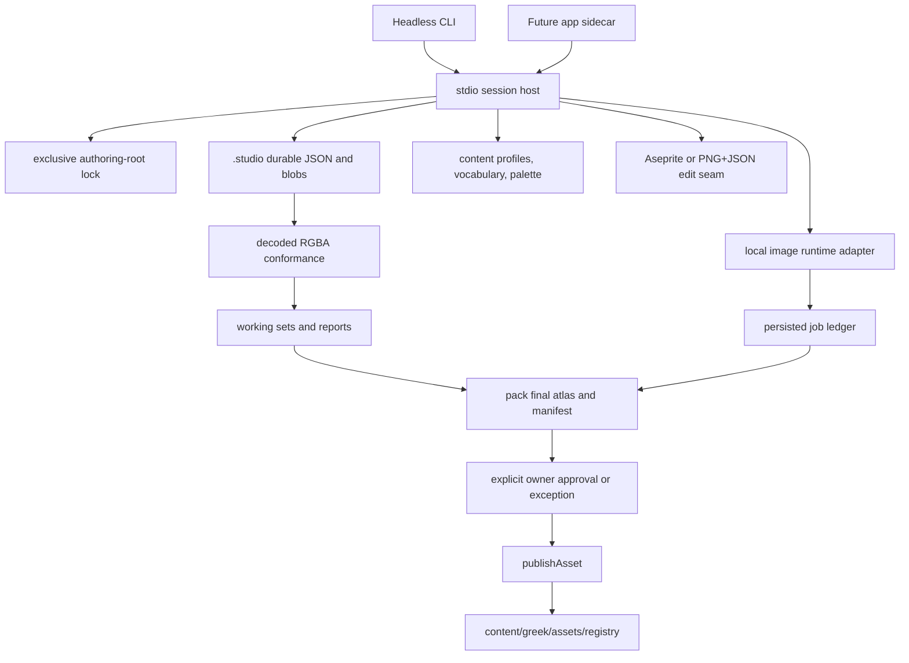
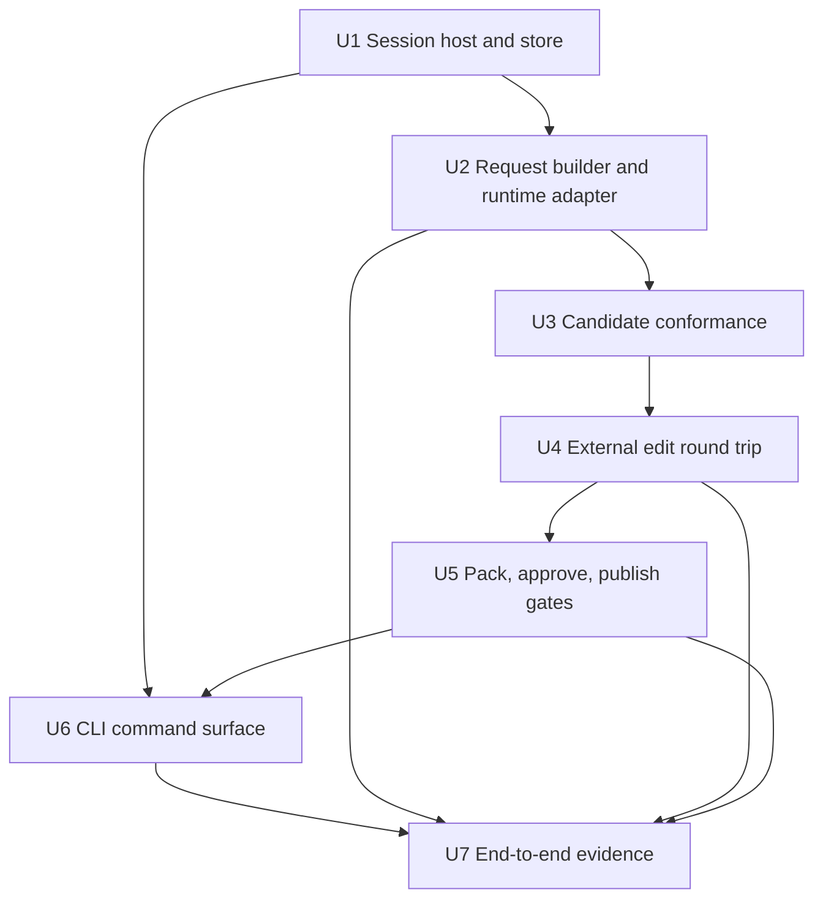

# feat: Studio pipeline CLI

## Overview

Build the Unit 5 authoring pipeline as shared Node/Bun business logic hosted by a headless CLI now and by the studio app later. The unit turns content-backed owner requests into local character-art candidates, records observable job and draft state, runs deterministic conformance, round-trips selected drafts through Aseprite or PNG+JSON export/import when needed, packs complete selected frame sets, approves the exact final atlas and manifest once, and publishes that unchanged approved record through the existing registry publication primitive.

This is not the full studio. Unit 5 proves the production authoring seam for Zeus idle-south and the six-expression portrait through the CLI/library path. The Tauri studio shell remains parent Unit 7, and packaged game rendering remains parent Unit 8.

---

## Problem Frame

The repository now has asset contracts, a canon registry, deterministic conformance, and an approved Greek master palette, but no production owner for the workflow between a content definition and a publishable asset. The missing Unit 5 boundary is stateful: jobs can be queued, removed, running, unavailable, failed or cancelled; drafts can be edited externally and finished or discarded; approval must bind exact final bytes; and aborts must never leak stale output into candidates.

The same authored actions need two consumers: a headless entrypoint now and an app consumer later. Duplicating business rules between those surfaces would fork approval, provenance, cancellation and conformance semantics. The plan therefore creates a node-only studio subpath in `@panthea/assets` while keeping root and registry exports free of studio host side effects.

---

## Requirements Trace

R identifiers refer to `docs/brainstorms/2026-10-03-asset-studio-requirements.md`. Product IDs remain planned until implementation updates traceability with evidence.

| Requirement | Unit 5 interpretation | Plan units | Product IDs |
| --- | --- | --- | --- |
| R2 | Preserve complete provenance for generation jobs, used outputs, runtime/profile components, hand edits, licences, cancelled jobs and final manifest bytes | U1, U2, U4, U5, U7 | U06, U07, U08, X02 |
| R4 | Keep published registry files plain and validated; authoring records stay separate from canon | U1, U5, U6 | U08 |
| R5 | Local providers expose unavailable/staging and job outcomes without hosted fallback | U2, U6, U7 | U06, U07 |
| R6 | Use output-redistributable local runtime records and selected-profile licence facts, not non-commercial chains or generic policy theatre | U2, U5, U7 | U06, X02 |
| R7 | Build generation specs from god profiles, visual profiles, vocabulary, palette and art guide data | U2, U3 | U06, X02 |
| R8 | Queue visibility, remove and abort are observable; abort restarts the owned child and yields no asset result | U1, U2, U6, U7 | U07 |
| R9 | Every candidate and edited draft runs deterministic conformance before approval | U3, U4, U5 | U06, X02 |
| R10 | Drafts round-trip through Aseprite with tags, slices, pivots, palettes and fallback export/import | U4, U6, U7 | X02 |
| R11 | Re-imported edits show report-only conformance and pixel diffs | U3, U4 | X02 |
| R12 | Hand pixels are never silently rewritten; deliberate owner imports can keep pixels and create new reports even when conformance fails, while automatic replacement proposals require explicit owner approval | U4, U5, U6 | X02 |
| R18 | CLI and later app call the same shared functions; neither reimplements pipeline rules | U1, U6 | U08 |
| R20 | Unit 5 produces Zeus idle-south and the six-expression portrait through the real authoring seam | U2–U7 | U06, U07, U08, X02 |
| F1 | Request-to-candidates flow: content-backed request resolution, local provider jobs, conformance reports, candidate sheet, rerolls and picked drafts | U2, U3, U6 | U06, U07, X02 |
| F2 | Hand cleanup round trip: Aseprite or export/import editing, report-only conformance, finish and discard | U4, U6 | X02 |
| F4 | Publish-to-engine flow: pack final atlas/manifest, explicit approval, registry publication and subject mapping | U5, U6, U7 | U08, X02 |

---

## Scope Boundaries

- Unit 5 targets character-art authoring for sprites and portraits. Tiles, effects, sound, derivation recipes, studio UI and packaged game loading stay in later parent units.
- Unit 5 does not make a single generated raw image into a valid sprite record. A generated keyframe enters an authoring working set; only a complete packed frame set can become a manifest-backed `AssetRecord`.
- Unit 5 does not procedurally derive idle bob, seated, strike, remaining directions or realm variants. Hand-edited animation frames are authored in Aseprite from generated keyframes; procedural idle bob starts in parent Unit 9.
- Unit 5 acceptance is Zeus idle-south plus the six-expression portrait. Seated and strike remain the T1/parent Unit 8 checkpoint, not a new Unit 5 gate.
- Unit 5 publishes only after packing selected drafts into the final atlas and manifest, approving that exact record once, and calling the existing `publishAsset` path. It does not add inherited component approval, double approval, or silent trust rules.
- Unit 5 has one long-lived stdio session host per authoring root. It does not create a studio control-plane daemon, socket, HTTP service, token service, pid-file lock, stale-lock recovery system, WAL layer, migration/upcaster framework, or automatic garbage collector; the owned `sd-server` runtime may still use its existing local loopback HTTP API.

### Deferred to Separate Tasks

- Parent Unit 7: Tauri studio UI, sidecar launch, packaged app-level CLI/app parity and studio headroom measurements.
- Parent Unit 8: packaged game client registry resolution and T1 seated/strike/portrait inspection.
- Parent Unit 9: deterministic derivation including idle bob and realm variants.
- Future units: tiles, effects, sounds, Tiled export, sound encoders, optional local LLM parameter proposals and SFX models.

---

## Context & Research

### Relevant Code and Patterns

- `packages/contracts/src/assets.ts` owns `GenerationRequest`, manifest parsing, provenance parsing, `LicenceRecord`, `JobRef`, `AssetRevisionRef` and settings redaction rules. Existing generated provenance is single-job and insufficient for final Unit 5 packing.
- `packages/contracts/src/asset-lifecycle.ts` owns `GenerationJob`, `AssetRecord`, `transitionAsset`, approval semantics and `checkProvenanceAgainstJobs`.
- `packages/assets/src/conformance.ts` owns decoded-RGBA conformance, report-only output, metrics, diffs and scale evidence.
- `packages/assets/src/registry.ts` owns immutable revision writes, palette refusal, atomic index selection and `publishAsset` for one approved record.
- `packages/assets/package.json` exports root, `./registry` and `./fixtures`; Unit 5 adds `./studio` as a node-only subpath. Root already uses Node/Bun-safe helpers such as PNG encode/hash code, so the boundary is no studio, filesystem lock, SQLite, child-process or session side effects through root imports.
- `packages/content/src/god-profile.ts`, `packages/content/src/god-visual-profile.ts`, `content/greek/assets/vocabulary.json` and `content/greek/assets/subjects/zeus.json` provide subject identity, visual profile, vocabulary, states, expressions, cells and palette family.
- `tools/content/src/assets.ts` validates vocabulary, palette, gods, visual profiles and registry; it is the pattern for standalone content validation, not a pipeline runner.
- `tools/probes/art-local-2/components.json` and `tools/probes/art-local-2/evidence/unit1-measurements.json` pin the selected no-LoRA Z-Image runtime profile and timings for planning.
- `tools/probes/art-local-2/src/run.ts`, `arm.ts`, `process.ts`, `cli.ts` and `stage.ts` provide evidence patterns for unavailable staging, restart-based cancellation, late-output discard, owned-child readiness and artifact staging. They remain probe code, not production owners.
- `apps/simulation/src/lifecycle.ts::acquireLock` is the single-writer pattern: an OS-held SQLite exclusive lock refuses busy writers while the owning process keeps the connection open.

### Institutional Learnings

- `docs/solutions/integration-issues/managed-generator-process-boundaries-2026-10-04.md`: process ownership, stop attribution, readiness and restart timing need explicit boundaries; fake servers prove harness behavior, not generator quality.
- `docs/solutions/integration-issues/sdcpp-cancel-sigint-diffusion-fa-2026-09-27.md`: stable-diffusion.cpp HTTP cancel is not a real in-flight cancel; hard abort is restart-based and must be labelled as such.
- `docs/solutions/integration-issues/proposal-accepted-then-lost-before-durable-2026-09-28.md`: never acknowledge accepted work before the durable write that makes it recoverable.
- `docs/solutions/best-practices/staging-verified-generator-artifacts-2026-10-04.md`: external binaries and weights are staged with size/hash checks before their paths become usable.
- `docs/solutions/developer-experience/shared-probe-assets-across-worktrees-2026-10-04.md`: large ignored model/runtime assets must not be accidentally owned by disposable worktrees.
- `docs/solutions/integration-issues/incomplete-pngs-pass-hash-and-header-checks-2026-10-04.md`: matching hash and dimensions do not prove a valid image; encoded PNG checks and decoded-pixel conformance are separate boundaries.
- `docs/solutions/logic-errors/transparent-rgb-bytes-broke-grid-recovery-2026-10-05.md`: visual comparisons ignore RGB under alpha zero, but raw hand-edit bytes remain unchanged.
- `docs/solutions/logic-errors/saved-pixel-previews-scaled-size-but-not-offset-2026-10-05.md`: saved pixel previews need independent saved-PNG comparison plus visual review; pixel equality does not prove readability.

### External References

- Aseprite official CLI and scripting documentation supports batch execution, `--sheet`, `--data`, `--split-tags`, `--palette`, `--script` and `--script-param`; use Aseprite's export surface rather than parsing `.aseprite` internals (`docs/research/asset-generation-2026-10-03.md`). The Aseprite API `main` docs are not an exact 1.3.18.6 pin, so installed round-trip remains a runtime verification gate.
- PNG behavior follows the W3C PNG decoder rules for IHDR, filters, alpha representation, tRNS and decoder conformance, plus the existing registry PNG integrity boundary. Unsupported PNG variants fail with re-export guidance instead of silent conversion.
- stable-diffusion.cpp official/runtime research confirms the selected runtime family and that cancel behavior must be verified on the actual build, not inferred from the probe harness.

---

## Prior-Art Survey

```json
{
  "schema_version": 2,
  "verdict": "extend",
  "scope": "packages/{assets,contracts,content},tools/content,tools/probes/art-local-2 production files,content/greek/{assets,palette}",
  "freshness": {
    "vcs_reference": "fb8968225d86f3827b1e6faa6db9fee88f4aec34"
  },
  "budget": {
    "max_search_passes": 4,
    "max_candidate_inspections": 14,
    "exhausted": true
  },
  "candidates": [
    {
      "path_or_symbol": "packages/content/src/god-visual-profile.ts::parseGodVisualProfiles",
      "description": "Owns god visual profiles: godId join, paletteFamily validation, iconography, optional portrait mapping. Does not own candidate generation, job state, conformance, approval, or publication.",
      "disposition": "extend"
    },
    {
      "path_or_symbol": "content/greek/assets/subjects/zeus.json",
      "description": "Owns current authored visual seed data for Zeus: paletteFamily olympus and iconography terms. Does not own request batches, candidate records, conformance reports, or approved assets.",
      "disposition": "extend"
    },
    {
      "path_or_symbol": "packages/contracts/src/assets.ts::GenerationRequest",
      "description": "Owns the canonical request shape: subject, kind, slots, batch, styleNote, seed. Does not own deriving requests from content, executing them, storing jobs, or ranking candidates.",
      "disposition": "extend"
    },
    {
      "path_or_symbol": "packages/assets/src/conformance.ts::conformImage",
      "description": "Owns deterministic conformance over decoded RGBA: grid recovery, alpha preparation, palette reduction, checks, metrics, diffs, proposal, and report-only behavior. Does not own jobs or approval.",
      "disposition": "reuse"
    },
    {
      "path_or_symbol": "packages/contracts/src/asset-lifecycle.ts::GenerationJob",
      "description": "Owns observable job record states queued, running, succeeded, failed, unavailable, and cancelled; outputs exist only for succeeded jobs. Does not own persistence, cancellation execution, or listing.",
      "disposition": "extend"
    },
    {
      "path_or_symbol": "tools/probes/art-local-2/src/run.ts::runCell",
      "description": "Owns probe cell execution states completed, failed, timed-out, unavailable, and cancelled; cancellation records no result and counts discarded late output. Probe-only, not asset-candidate production state.",
      "disposition": "insufficient",
      "insufficiency_reason": "It proves abort semantics for probe cells but does not produce GenerationJob records, asset candidates, conformance reports, or publishable manifests."
    },
    {
      "path_or_symbol": "tools/probes/art-local-2/src/arm.ts::runArm",
      "description": "Owns probe-arm orchestration: server lifecycle, component provenance, image events, cell records, cancel probe, pairings, and report notes. Does not own content-derived requests or asset lifecycle.",
      "disposition": "insufficient",
      "insufficiency_reason": "It is benchmark/probe orchestration around configured prompts and cells, not the production owner-driven candidate workflow."
    },
    {
      "path_or_symbol": "tools/probes/art-local-2/src/cli.ts::main",
      "description": "Owns a headless probe CLI that parses config, writes probe images, logs, results.json, and exit codes. Does not own the scoped production asset authoring CLI or registry publication.",
      "disposition": "insufficient",
      "insufficiency_reason": "It is a reusable headless pattern but its contract is probe config/output, not content definitions, conformance inspection, draft editing, approval, or packs."
    },
    {
      "path_or_symbol": "packages/contracts/src/asset-lifecycle.ts::transitionAsset",
      "description": "Owns asset record transitions candidate, draft, approved, canon, rejected; draft external editing; approve by passing report or owner exception; canonize after approval. Does not own storage or batches.",
      "disposition": "extend"
    },
    {
      "path_or_symbol": "packages/contracts/src/assets.ts::parseProvenance",
      "description": "Owns generated, hand, and derived provenance validation, relatedJobs, handEdits, sourceAssets, licences, runtime/model/settings, resultHashes, and generated source-job success checks. Does not build provenance.",
      "disposition": "extend"
    },
    {
      "path_or_symbol": "packages/contracts/src/asset-lifecycle.ts::checkProvenanceAgainstJobs",
      "description": "Owns cross-checking provenance against job records: job existence, source succeeded status, output hash equality, and request equality. Does not own the job ledger or manifest assembly.",
      "disposition": "extend"
    },
    {
      "path_or_symbol": "packages/assets/src/registry.ts::publishAsset",
      "description": "Owns approved-to-canon publication for one asset: palette refusal, writeRevision, selectRevision, and canon transition. Does not own candidate selection, approval set packing, or multi-asset transactions.",
      "disposition": "extend"
    },
    {
      "path_or_symbol": "tools/content/src/assets.ts::validateAssets",
      "description": "Owns content-root validation across vocabulary, palette, gods, subjects, registry, sprite ownership, portrait ownership, abilities, and palette refusal diagnostics. Does not create candidates or publish assets.",
      "disposition": "reuse"
    },
    {
      "path_or_symbol": "packages/assets/src/resolve.ts::resolveAsset",
      "description": "Owns consumer resolution from registry snapshot to canon asset or placeholder fallback for sprite and portrait queries. Does not own authoring actions, job state, approval, or publication.",
      "disposition": "reuse"
    }
  ]
}
```

---

## Key Technical Decisions

- KTD1. **One stdio session host, no studio control-plane server.** A foreground CLI session and future app sidecar launch the same long-lived host over newline JSON on stdin/stdout. One-shot commands may open, run and close a session; `open` keeps it alive until explicit finish or discard. There is no studio socket, studio HTTP service, token, daemon, remote-control queue, or pid-file lock; this does not remove the owned image runtime's existing local loopback HTTP API.
- KTD2. **Single writer per authoring root.** The host reuses the `apps/simulation/src/lifecycle.ts::acquireLock` pattern with a Bun SQLite exclusive lock. Read-only list/status commands may inspect another active session, but mutations refuse busy instead of sending commands to it.
- KTD3. **Local causal ledger is always on.** Requests, commands, jobs, working-set changes, remove/abort, finish/discard, pack, approve and publish attempts are recorded locally. There is no off switch and no external export in Unit 5.
- KTD4. **Durability before acceptance.** A job, request, working set or command that returns accepted must already have its durable JSON record and required bytes written by atomic temp/rename. Recovery marks interrupted queued and running work failed; it never silently restarts a generator.
- KTD5. **Gitignored authoring store, canon registry unchanged.** `.studio/` holds request ledgers, job records, working sets, content-addressed PNG bytes, edit workspaces and session state. `content/greek/assets/registry/` remains the committed canon registry. Publish audit must not depend on inaccessible `.studio` ledgers.
- KTD6. **Node-only studio subpath.** `@panthea/assets/studio` may import `node:fs`, subprocess, SQLite, PNG inflate and Aseprite helpers. Root and registry exports must not import studio session, lock, queue or child-process code as side effects; existing root Node/Bun helpers remain valid.
- KTD7. **Minimal PNG decode is required now.** Conformance accepts decoded RGBA, so Unit 5 owns a bounded PNG-to-RGBA decoder for 8-bit RGB/RGBA without tRNS, noninterlaced PNGs, filters 0–4 and existing integrity checks. RGB decodes to alpha 255 only when no tRNS chunk is present. tRNS is rejected with re-export guidance unless implementation deliberately adds exact key-transparency support. Unknown critical chunks error; unknown ancillary chunks may be skipped. Unsupported variants fail explicitly; no silent conversion or hidden alpha/background threshold is allowed.
- KTD8. **Working set before valid asset.** Generated keyframes and externally edited pixels are authoring records until complete frame sets are packed into the final atlas and manifest. Picked portrait keyframes are auto-conformed to native portrait cells and stored with original generated output hashes and provenance; they are not raw 768×768 images. Packing never manufactures, copies or pads frames to satisfy a frame count; valid authored identical holds from an imported animation export are allowed.
- KTD9. **Pack before approve.** Selected complete working sets are packed into the final atlas and manifest first. `newCandidate` and `pick` create the selected packed draft record; approval applies once to that exact packed record; publish calls `publishAsset` on the unchanged approved record.
- KTD10. **Aseprite is external and trusted for batch export only.** Unit 5 uses configured executable discovery, batch Lua and script-parameter inputs. It does not parse `.aseprite` internals or use `--trim`; missing editor falls back to explicit PNG+JSON export/import.
- KTD11. **Real abort semantics are verified on the selected runtime.** Probe evidence is a pattern, not production proof. The production adapter must kill/restart the owned child before the next job, discard late output, preflight occupied endpoints, bind readiness to the owned child, and await all subprocess-tree teardown.
- KTD12. **Generated provenance is a greenfield contract change.** Existing `GeneratedProvenance` models exactly one source job and requires result hashes to equal all outputs. Unit 5 replaces those fields with `generations[]`, where each `GenerationRef` records job id, exact narrowed `GenerationRequest`, runtime/model/LoRA/encoder/VAE refs, seed, settings and nonempty used output hashes. Parser rules require at least one generation, unique job ids, a matching succeeded `relatedJobs` entry, used hashes as a nonempty subset of that job's outputs, and matching `LicenceRecord` subject/role entries for every runtime/model/LoRA/encoder/VAE ref.
- KTD13. **Canon provenance audits new local jobs and prior revisions differently.** New generation references are checked against persisted succeeded ledger jobs. Failed, unavailable and cancelled jobs may remain contextual `relatedJobs` without outputs. Preserved earlier canon states use `sourceAssets` only for real published revisions already readable from the registry; their existing manifests carry their own provenance and are not rechecked against lost `.studio` ledgers.
- KTD14. **Selected profile licence gate, not a source allowlist.** Production Unit 5 uses the selected no-LoRA profile: `sd-cpp-master-929-3f8527a` runtime (MIT), `z_image_turbo-Q3_K` model (Apache-2.0), `Qwen3-4B-Instruct-2507-Q4_K_M` text encoder (Apache-2.0) and `z-image-ae` VAE (Apache-2.0). Licence checks verify recorded selected-profile facts, complete input/original-work records and R2/R6 output-redistribution compatibility. They do not introduce a blanket MIT/Apache-only or known-source allowlist; compatible sources such as CC0 inputs are not rejected merely for being outside the selected model profile. Known incompatible publication terms block publish, and unclear terms are surfaced for existing final owner approval rather than automatically cleared.
- KTD15. **Batch semantics are per slot.** Root requests expand `slots × batch` into local runtime jobs. The shared `GenerationRequest` stays within its current contract: one slot, `batch: 1`, and the effective seed. Source request id, slot key and ordinal live in the studio-local ledger wrapper around the `GenerationJob`, preserving canonical request equality for provenance checks. The base seed is owner-supplied or drawn once and persisted; rerolls continue the ordinal sequence; request edits create a new request while picked drafts survive.

---

## Open Questions

### Resolved During Planning

- The session host is newline JSON over stdio, not a daemon/socket/studio-control HTTP/token system; the selected local runtime may still use its loopback HTTP API behind the adapter.
- Draft animation frames are hand-edited from generated keyframes; idle bob is parent Unit 9.
- Packing happens before final approval; publication consumes exactly the approved packed record.
- Unit 5 acceptance is Zeus idle-south and six portrait expressions through the CLI/library path; seated and strike stay in the T1/parent Unit 8 checkpoint.
- Root `@panthea/assets` can keep current Node/Bun helpers; the boundary is no studio host side effects through root or registry imports.
- Provenance contract changes are in scope for Unit 5 and have no compatibility burden because no canon generated assets exist yet.

### Deferred to Implementation

- Exact command names, JSON field names and storage filenames are implementation details once they satisfy the contracts above.
- If actual Z-Image-Turbo readiness, cancellation or late-output behavior differs from probe assumptions, record the measured behavior and adjust the adapter or stop before accepting jobs.
- If PNG variants outside the decoder floor appear from Aseprite or the selected runtime, fail with re-export guidance first; broader PNG support needs explicit implementation evidence. tRNS remains rejected unless exact key transparency is deliberately implemented.
- If owner review chooses a lower batch for acceptance evidence, document that as a run parameter; the default remains batch four per slot.

---

## Output Structure

The expected shape is a scope declaration, not a constraint. Per-unit file lists are authoritative.

    packages/assets/src/studio/      Shared host, store, commands and pipeline functions
    packages/assets/src/studio/png/  Bounded decode helpers for conformance input
    tools/studio/                    Headless CLI entrypoint and command tests
    .studio/                         Gitignored local authoring records and edit workspaces
    docs/evidence/asset-studio/      Future Unit 5 local evidence, written during implementation only

---

## High-Level Technical Design

> *This illustrates the intended approach and is directional guidance for review, not implementation specification. The implementing agent should treat it as context, not code to reproduce.*



The host is the only mutating actor for one authoring root. Every mutating command writes intent first, then performs work. Read-only commands can inspect records written by another active host, but mutations refuse busy roots. Abort and remove happen inside the owning session so late output can be attributed and discarded correctly.

---

## Implementation Units



### U1. Session host and authoring store

- [x] **Goal:** Create the node-only shared host and durable local authoring store that CLI and future app commands call.
- **Requirements:** R2, R4, R8, R18; U07, U08.
- **Dependencies:** Existing `@panthea/assets` exports and `apps/simulation/src/lifecycle.ts::acquireLock` pattern.
- **Files:**
  - Create: `packages/assets/src/studio/index.ts`
  - Create: `packages/assets/src/studio/session.ts`
  - Create: `packages/assets/src/studio/store.ts`
  - Create: `packages/assets/src/studio/workspace.ts`
  - Create: `packages/assets/src/studio/session.test.ts`
  - Create: `packages/assets/src/studio/store.test.ts`
  - Modify: `packages/assets/package.json`
  - Modify: `.gitignore`
  - Modify: `packages/assets/src/index.test.ts`
- **Approach:** Add `./studio` as a node-only subpath. Store requests, jobs, working sets, commands and content-addressed PNG bytes under a gitignored `.studio/` root using atomic temp/rename JSON writes. Accept jobs only after their durable record exists. On recovery, mark interrupted `queued` and `running` records failed with a restart reason; do not restart generators silently. Keep canon publication outputs in `content/greek/assets/registry/`, not `.studio/`.
- **Execution note:** Characterize recovery and busy-root behavior before adding higher-level commands.
- **Patterns to follow:** `apps/simulation/src/lifecycle.ts::acquireLock`, `packages/assets/src/registry.ts::writeAtomic`, and the durable-acceptance lesson in `docs/solutions/integration-issues/proposal-accepted-then-lost-before-durable-2026-09-28.md`.
- **Test scenarios:**
  - Happy path: opening a session creates the authoring root, acquires the exclusive lock and writes a readable session record.
  - Happy path: a read-only status call can inspect records while another process owns the lock.
  - Edge case: opening a second mutating session on the same root refuses busy without corrupting the store.
  - Edge case: root package imports continue to expose current helpers without importing the studio subpath or starting host side effects.
  - Failure path: a malformed JSON record is reported as failed or invalid without deleting unrelated records.
  - Failure path: recovery turns interrupted `queued` and `running` jobs into failed records and preserves succeeded records.
  - Integration: enqueue/remove/abort command records remain in the always-on local ledger and are visible in status.
- **Verification:** The host/store can be used by tests without touching canon files, `.studio/` is ignored, and no mutation acknowledges work before the durable record exists.

### U2. Content-driven request builder and local runtime adapter

- [x] **Goal:** Convert content definitions into generation jobs and execute them through the selected local runtime with production cancellation semantics.
- **Requirements:** R5, R6, R7, R8, R20; F1; AE5; U06, U07, X02.
- **Dependencies:** U1; Unit 1 selected Z-Image-Turbo no-LoRA runtime profile; existing staged binary/weights are configured, not downloaded automatically.
- **Files:**
  - Create: `packages/assets/src/studio/request.ts`
  - Create: `packages/assets/src/studio/provider.ts`
  - Create: `packages/assets/src/studio/runtime.ts`
  - Create: `packages/assets/src/studio/png/decode.ts`
  - Create: `packages/assets/src/studio/request.test.ts`
  - Create: `packages/assets/src/studio/runtime.test.ts`
  - Create: `packages/assets/src/studio/png/decode.test.ts`
  - Modify: `packages/assets/src/studio/index.ts`
- **Approach:** Join god profiles, visual profiles, vocabulary, palette and art-guide constraints into explicit generation specs. Expand each root request into `slots × batch` jobs; default batch four is per slot. Each job stores a strict narrowed `GenerationRequest` with one slot, `batch: 1` and the effective seed; source request id, slot key and ordinal are studio-local ledger fields around the job record. The base seed is owner-supplied or drawn once and persisted; rerolls continue the ordinal sequence. The runtime profile is selected by pinned ids and hashes from `tools/probes/art-local-2/components.json`: sd-server `master-929-3f8527a`, `z_image_turbo-Q3_K`, `Qwen3-4B-Instruct-2507-Q4_K_M`, `z-image-ae`, no LoRA. The adapter reports unavailable plus staging guidance for missing binary or weights; it never downloads, uses hosted fallback or writes credentials into content, provenance or logs. It preflights occupied endpoints, starts one owned heavy child, binds readiness to that child, kills/restarts on abort and discards late output.
- **Execution note:** Use fake runtime processes for control-flow tests, then verify the selected runtime's real readiness/cancellation/late-output behavior before accepting production jobs.
- **Patterns to follow:** `tools/probes/art-local-2/src/process.ts`, `tools/probes/art-local-2/src/arm.ts`, `docs/solutions/integration-issues/managed-generator-process-boundaries-2026-10-04.md`, and `docs/solutions/best-practices/staging-verified-generator-artifacts-2026-10-04.md`.
- **Test scenarios:**
  - Happy path: Zeus idle-south and portrait requests derive subject, palette family, cell sizes, expressions, pivot constraints and seed records from content data.
  - Happy path: default batch four over six portrait expressions creates 24 narrowed jobs with explicit slot and ordinal association.
  - Happy path: same seed/spec yields the same adapter inputs; it does not promise identical model output bytes unless measured.
  - Happy path: reroll continues the persisted seed ordinal without replacing picked drafts from an earlier request sheet.
  - Edge case: unknown subject, state, direction or expression returns a typed error with valid alternatives.
  - Failure path: missing runtime artifacts yield `unavailable` with staging guidance and no child process.
  - Failure path: Ctrl-C in one-shot generate aborts that session's own running job, records `cancelledBy: "aborted"`, restarts the owned child before the next job and creates no candidate from late output.
  - Integration: fake runtime process tests prove kill+await teardown; real selected runtime readiness, abort, restart and teardown are measured on host hardware before the adapter is considered production-ready.
- **Verification:** A content-derived request can produce durable job records and decoded candidate bytes through the adapter. Runtime unavailability, removal and cancellation are observable states, not exceptions hidden from the queue.
- **Evidence (macOS only, qualified):** the full workspace check passed (3041 pass, 1 skip, 0 fail; all saved exits 0) with the 20 U2 source hashes unchanged. One real run of the selected runtime produced a content-derived 512x640 sprite (seed `Number.MAX_SAFE_INTEGER`, accepted by the server, not a seed-range proof) and a 768x768 portrait (seed 0), with sent bodies, stored hashes and decoder lengths matching. Abort during `generating` was ledgered with no output and no blob, and a fresh replacement child became ready and completed. Normal shutdown reopened the root, and a corrected rerun of the throwing-caller `finally` case returned `shutdown` ok in 60 ms with the job cancelled and no image. Unproven: sampling depth at abort, a real late payload, a clean replacement-ready time, Linux, and event-loop responsiveness through abort (U6/U7). The harness's process-group checks were invalid; see `tools/probes/studio-runtime/README.md`. This is runtime correctness only, not image quality, palette conformance, coexistence or canon. U3–U7 and parent Unit 5 remain incomplete.

### U3. Candidate ingestion, conformance and working sets

- [x] **Goal:** Turn successful image outputs into candidate working sets with deterministic conformance reports, visual diffs and sorted review data.
- **Requirements:** R2, R9, R11, R20; F1; U06, X02.
- **Dependencies:** U1, U2 and existing `packages/assets/src/conformance.ts`.
- **Files:**
  - Create: `packages/assets/src/studio/candidates.ts`
  - Create: `packages/assets/src/studio/reports.ts`
  - Create: `packages/assets/src/studio/working-set.ts`
  - Create: `packages/assets/src/studio/candidates.test.ts`
  - Create: `packages/assets/src/studio/reports.test.ts`
  - Modify: `packages/assets/src/studio/index.ts`
- **Approach:** Decode saved PNG bytes into RGBA with the Unit 5 decoder floor, preserve raw PNG and decoded-byte provenance, and run conformance against the asset family palette with explicit background/keying inputs. Store reports, structured metrics, diffs and proposal images beside the candidate. Sort sheets by conformance outcome and fewest changes while preserving every metric. Picked drafts survive request-sheet replacement and rerolls. A picked portrait expression can be complete from its auto-conformed 96×96 native cell keyframe; multi-frame animation working sets require a complete valid edit import. A `WorkingSet` is a local studio type with keyframe source refs, edited frame hashes, durations and `open` or `complete` status; invalid or incomplete working sets are not manifest-backed `AssetRecord`s.
- **Execution note:** Add tests that fail on raw byte rewriting before adding review conveniences.
- **Patterns to follow:** `packages/assets/src/conformance.ts`, `docs/solutions/logic-errors/transparent-rgb-bytes-broke-grid-recovery-2026-10-05.md`, and `docs/solutions/integration-issues/incomplete-pngs-pass-hash-and-header-checks-2026-10-04.md`.
- **Test scenarios:**
  - Happy path: a successful idle-south candidate stores original PNG bytes, decoded RGBA evidence, conformance report, proposal and metrics.
  - Happy path: a six-expression portrait request keeps expression-specific working entries and aggregate sheet status.
  - Edge case: RGB beneath alpha zero affects neither grid confidence nor visual diffs while raw bytes remain available.
  - Edge case: 8-bit RGB without tRNS decodes as alpha 255, RGBA preserves raw alpha-zero RGB bytes, filters 0–4 decode, unknown ancillary chunks skip, and valid CRC/inflate checks pass.
  - Failure path: tRNS, unknown critical chunks, 16-bit, indexed colour, grayscale, interlaced, truncated, overlong, bad-CRC and bad-inflate PNGs fail explicitly with unsupported or corrupt-file guidance and create no candidate.
  - Failure path: low-confidence scale produces a needs-scale response rather than a guessed candidate.
  - Integration: editing a request replaces non-picked sheet entries while selected drafts remain addressable.
- **Verification:** Candidate review data is deterministic from durable inputs, and every candidate can be traced back to a succeeded job output hash.
- **Evidence (fixtures only):** candidates keep the original raw PNG and its hash plus decoded-byte evidence, the exact effective params and family palette, reports, and a `needs-scale` status when scale is unsure. Picks are snapshots that survive reroll, sheet replacement and re-conform; a portrait is `complete` once all six slots are picked, and sprites stay `open` until U4 authored frames. Source: `candidates.ts`, `reports.ts`, `working-set.ts`; tests: `candidates.test.ts`, `reports.test.ts`. Full workspace check passed (3087 pass, 1 skip, 0 fail, 188 files; all exits 0; the 25-file source hash snapshot matches); scoped assets 365 pass. Parameter values in tests are provisional, not owner defaults; no real generation, art quality or canon is assessed. U4–U7 and parent Unit 5 remain incomplete.

### U4. External edit workspace and import seam

- [x] **Goal:** Open selected draft working sets in Aseprite or export PNG+JSON, watch/report edits, and finish or discard without losing hand pixels.
- **Requirements:** R10, R11, R12, R20; F2; AE3; X02.
- **Dependencies:** U3; configured Aseprite executable or fallback export/import path.
- **Files:**
  - Create: `packages/assets/src/studio/aseprite.ts`
  - Create: `packages/assets/src/studio/edit-session.ts`
  - Create: `packages/assets/src/studio/export-import.ts`
  - Create: `packages/assets/src/studio/scripts/export.lua`
  - Create: `packages/assets/src/studio/aseprite.test.ts`
  - Create: `packages/assets/src/studio/edit-session.test.ts`
  - Modify: `packages/assets/src/studio/index.ts`
- **Approach:** Generate trusted batch Lua and script-parameter inputs for Aseprite; do not parse `.aseprite` internals or use trimming. Resolve the executable from configured path first, then `PATH`, then the macOS app-bundle default. Keep exported sprites in RGB workspace to avoid indexed-colour conversion. Use Aseprite API fields deliberately: convert `frame.duration` seconds to integer manifest milliseconds and back; leave pivot slices nil unless assigned; set `Tag.repeats = 0` so exports play once; avoid Lua `io`/`os` in headless scripts. Represent the authoring workspace as keyframes and frame metadata until complete frame sets exist. On each stable save/export, content hashes decide whether to import. Report-only conformance and diffs update preview state but never rewrite hand pixels. Importing valid supported owner-edited pixels succeeds and stores exact bytes even if report-only conformance fails; malformed PNG or metadata can fail import with structured errors. A separate headless conform/proposal that would replace hand-edited pixels exits 1 with a structured diff, leaves hand pixels untouched, and grants no approval. Finish appends one hand-edit step and imports final saved bytes; discard restores the last selected draft state.
- **Execution note:** Real installed-editor checks are required before claiming tag/slice/pivot/duration fidelity; fake-process tests only prove command assembly and state transitions.
- **Patterns to follow:** `packages/contracts/src/asset-lifecycle.ts::transitionAsset`, `packages/contracts/src/assets.ts::parseProvenance`, and the saved-pixel preview lesson in `docs/solutions/logic-errors/saved-pixel-previews-scaled-size-but-not-offset-2026-10-05.md`.
- **Test scenarios:**
  - Happy path: open writes a tagged workspace with palette, frame tags, slices, pivots, durations and geometry metadata.
  - Happy path: deliberate PNG+JSON import stores exact edited bytes and refreshed report even when report status is fail.
  - Happy path: finish imports changed bytes, appends exactly one hand-edit step and drops stale conformance reports.
  - Edge case: missing editor returns a clear error while PNG+JSON export/import remains usable.
  - Edge case: a half-written or failed export leaves the last successful state untouched.
  - Failure path: malformed PNG/metadata reports errors and leaves prior state intact.
  - Integration: fake Aseprite executable asserts configured-path and macOS-bundle discovery, argv, RGB-workspace export paths and teardown; installed Aseprite round-trips tags, slices, optional pivots, integer-ms durations, palette and cell geometry for Zeus idle-south and the portrait expressions.
- **Verification:** The external edit seam proves finished and discarded edits preserve provenance and pixels exactly as the owner chose.
- **Evidence (fixtures, macOS GUI host, Aseprite 1.3.18.6):** source `aseprite.ts`, `edit-session.ts`, `export-import.ts`, `scripts/export.lua`; tests `aseprite.test.ts`, `edit-session.test.ts`; probe `tools/probes/studio-editor/README.md`. Real positive: 81 checks, 0 failures, on idle 4×64×80 and portrait 6×96×96; a one-pixel in-editor edit imports exactly (stored sheet equals the editor's PNG, exact crops), an off-palette edit imports with a failed report and a separate proposal that is not applied, finish adds one hand-edit step per slot, originals stay byte-identical and the root reopens. Real negative: an unedited export is refused despite differing codec bytes; visible or raw edited imports are exact, but a base-equivalent re-encode or hidden-RGB-only change may no-op, so not every byte-distinct file is stored. Reports never rewrite hand frames, discard keeps the prior working set, and finish is one idempotent step. Durations convert seconds to integer ms; one pivot per slot, inclusive bounds (32,80), slice-relative offsets converted; no per-frame pivot claim. Full check passed (3252 pass, 1 skip, 0 fail, 190 files; all exits 0; 32-file source hash snapshot matches); scoped assets 530 pass twice. Not shown: GUI watching, Linux or Windows, window-server-free runs, canon or art quality. U5–U7 and parent Unit 5 remain incomplete.

### U5. Pack, approve and publish gates

- [ ] **Goal:** Pack complete selected frame sets into final manifest/atlas records, approve the exact final record once, and publish unchanged canon through the registry.
- **Requirements:** R2, R4, R9, R12, R20; F4; U06, U08, X02.
- **Dependencies:** U3 and U4 complete enough to produce frame sets; Unit 4 approved palette; existing `publishAsset`.
- **Files:**
  - Create: `packages/assets/src/studio/packing.ts`
  - Create: `packages/assets/src/studio/approval.ts`
  - Create: `packages/assets/src/studio/publish.ts`
  - Create: `packages/assets/src/studio/packing.test.ts`
  - Create: `packages/assets/src/studio/approval.test.ts`
  - Create: `packages/assets/src/studio/publish.test.ts`
  - Modify: `packages/assets/src/studio/index.ts`
  - Modify: `packages/contracts/src/assets.ts`
  - Modify: `packages/contracts/src/assets-manifest.test.ts`
  - Modify: `packages/contracts/src/asset-lifecycle.ts`
  - Modify: `packages/contracts/src/asset-lifecycle.test.ts`
  - Modify: `packages/contracts/src/index.ts`
  - Modify: `packages/assets/src/fixtures.ts`
  - Modify: `packages/assets/src/registry.test.ts`
  - Modify: `tools/content/src/assets.ts`
  - Modify: `tools/content/src/assets.test.ts`
- **Approach:** Implement the greenfield provenance change before packing. `GeneratedProvenance` gains `generations[]` and no longer relies on one source job whose outputs equal all result hashes. Each `GenerationRef` has a unique job id, exact narrowed request, runtime/model/LoRA/encoder/VAE refs, seed, settings and nonempty used output hashes. Parser rules require at least one generation; unique job ids; each referenced job present in `relatedJobs` with status `succeeded`; used hashes as a nonempty subset of the referenced job's outputs; and matching licence subject/role records for every runtime/model/LoRA/encoder/VAE ref. `checkProvenanceAgainstJobs` compares each new generation request by `canonicalJson`, verifies the full job-output set equals the `JobRef.outputs` set, and then verifies the selected used hashes are within that set. Failed, unavailable and cancelled jobs may remain in `relatedJobs` with no outputs. Preserve all profile component licence records, real input/original-work records, result hashes and hand-edit steps when assembling final manifests. Require complete frame sets before packing. Use stable vocabulary state order, direction order, ability id and frame index for sprites, and vocabulary expression order for portraits. Pack one untrimmed row of cells with the existing pinned `encodeRgbaPng` golden encoder. Durations come from edited metadata and pass vocabulary frame-count/fps validation.

  Packing runs report-only conformance on every final cell at scale 1 with the asset family palette. Aggregate checks use free-string names such as `idle/south#0:grid` or `portrait/neutral:palette`, and pass only when all cells pass. Selected complete working set → final atlas+manifest → `newCandidate` → `pick` is the selected-pack action; approval is separate and sole. Single-frame portrait expressions may come directly from picked auto-conformed native keyframes or valid edit imports; multi-frame sprite animations require complete valid imported animation frames. Publish audit checks new local job refs against the persisted job ledger, checks preserved prior states through real `sourceAssets` revisions that are readable and hash-valid in the registry, and never requires lost prior `.studio` ledgers. Carried-forward canon cells stay byte-identical unless explicitly replaced.

  The selected production profile records sd-server `master-929-3f8527a` as runtime, `z_image_turbo-Q3_K` as diffusion model, `Qwen3-4B-Instruct-2507-Q4_K_M` as text encoder and `z-image-ae` as VAE, all with the pinned hashes and licences from `tools/probes/art-local-2/components.json`. No LoRA is used for production canon; the Civitai Z-Image LoRA remains benchmark-only. Draft generation, editing and import are not restricted by a new source allowlist. At publish time, every real input/original-work and selected component needs recorded licence/attribution; known incompatible publication terms block publish, and unclear terms are surfaced at final owner approval rather than silently cleared or waived by a conformance exception.
- **Execution note:** Implement the contract/parser/test change before publish plumbing; no compatibility layer is needed for unshipped generated assets.
- **Patterns to follow:** `packages/assets/src/registry.ts::publishAsset`, `packages/contracts/src/asset-lifecycle.ts::approve`, `packages/contracts/src/asset-lifecycle.ts::checkProvenanceAgainstJobs`, and ADR 0009.
- **Test scenarios:**
  - Happy path: selected idle-south frames pack into a deterministic untrimmed atlas and manifest with valid frame timings and palette references.
  - Happy path: selected portrait expression frames pack into one final approved portrait manifest in vocabulary expression order.
  - Happy path: valid authored identical hold frames from an imported animation export are accepted.
  - Edge case: short imported animations reject unchanged; packing never manufactures, copies or pads frames to meet vocabulary frame counts.
  - Edge case: adding states preserves existing prior canon cells byte-identically and references their real published revision in `sourceAssets`.
  - Failure path: empty generations, duplicate generation job ids, missing generation job refs, non-succeeded generation refs, missing used hashes, missing component licences, request mismatch, output-set mismatch, stale report, failed conformance, unapproved palette, incompatible publication terms, failed source job, missing canon revision or unreadable prior revision block approval or publish before writes.
  - Integration: publish writes immutable blob/manifest files and atomically selects the revision; a failed gate leaves the prior registry index unchanged.
- **Verification:** Final approval binds to the full final manifest and atlas hash. Published canon contains all required source metadata without `.studio`; palette approval is not asset approval, and licence checks are compatibility facts rather than legal clearance.

### U6. Headless CLI command surface

- [ ] **Goal:** Expose the shared pipeline through a foreground CLI with JSON machine results and stderr progress.
- **Requirements:** R5, R8, R10, R12, R18, R20; F1, F2, F4; AE3, AE5, AE6; U07, U08, X02.
- **Dependencies:** U1–U5.
- **Files:**
  - Create: `tools/studio/package.json`
  - Create: `tools/studio/tsconfig.json`
  - Create: `tools/studio/src/index.ts`
  - Create: `tools/studio/src/commands.ts`
  - Create: `tools/studio/src/format.ts`
  - Create: `tools/studio/src/index.test.ts`
  - Create: `tools/studio/src/commands.test.ts`
  - Modify: `bun.lock`
- **Approach:** Implement verbs for session, generate, list/status, remove, abort, conform, pick, reject, open, finish, discard, export, import, pack, approve, approve-with-exception, publish and unsupported derive. One-shot generate can open/run/close a session; Ctrl-C aborts its own running job. CLI open keeps the session alive while edits are watched until explicit finish or discard. A separate process attempting a mutation against an active session gets busy. `abort` records `cancelledBy: "aborted"`; `remove` records `cancelledBy: "removed"`; real runtime errors and recovery interruptions are failed jobs, not ambiguous cancellations. Exit codes are 0 success, 1 runtime/workflow failure and 64 usage/config errors. CLI never invents owner approval. Any workspace package/lockfile update is an implementation-time owner gate; no external dependency is planned here.
- **Execution note:** Start with command contract tests for machine-readable outputs and busy-root refusal before connecting real runtime/editor calls.
- **Patterns to follow:** `tools/content/src/index.ts` exit shape, `tools/probes/art-local-2/src/cli.ts` evidence output style and shared-host command separation.
- **Test scenarios:**
  - Happy path: generate produces a machine JSON result, stderr progress and durable job/candidate records.
  - Happy path: list/status can inspect another active session without taking the writer lock.
  - Happy path: enqueue/remove/abort operate during a running generation inside the owning session.
  - Edge case: mutation against a busy root refuses with a structured error instead of remote-controlling the owner session.
  - Edge case: unsupported derive returns explicit unsupported status without creating frames.
  - Failure path: invalid args return 64; unavailable runtime/editor returns 1 with staging or editor guidance; headless conform on a hand-edited draft where the proposal would replace pixels exits 1 with a structured diff, leaves hand pixels untouched, and does not silently approve or replace; approval without explicit owner action fails.
  - Integration: CLI and direct library fixtures for the same request/seed produce identical adapter inputs, deterministic transforms, reports and final records; actual CLI/app parity remains a parent Unit 7 gate.
- **Verification:** The CLI can exercise every Unit 5 action headlessly through shared functions, and future app code can call the same exported business functions.

### U7. Unit 5 acceptance evidence

- [ ] **Goal:** Prove the full Unit 5 path on real Zeus idle-south and six-expression portrait assets, distinguishing deterministic transforms from model nondeterminism.
- **Requirements:** R2, R5–R12, R18, R20; F4; AE3, AE5, AE6; U06, U07, U08, X02.
- **Dependencies:** U1–U6 and actual owner review time.
- **Files:**
  - Create: `tools/studio/src/fixtures/zeus.ts`
  - Create: `tools/studio/src/fixtures/zeus.test.ts`
  - Create: `docs/evidence/asset-studio/unit5/README.md`
  - Create: `docs/evidence/asset-studio/unit5/zeus-idle-south/`
  - Create: `docs/evidence/asset-studio/unit5/zeus-portrait/`
  - Modify: `content/greek/assets/registry/index.json`
  - Modify: `content/greek/assets/registry/manifests/`
  - Modify: `content/greek/assets/registry/blobs/`
- **Approach:** Run the actual local generation, conformance, optional external edit, pack, approval and publish path for Zeus idle-south and all six portrait expressions. Portrait expressions may publish from picked auto-conformed 96×96 native keyframes when the owner accepts them, without a mandatory editor trip; multi-frame sprite animation still needs a complete edited imported frame set. Use fake adapters for unit coverage and real runtime/editor evidence for acceptance. Record timing/readiness, cancellation, conformance reports, diffs, approval reason where applicable, final manifest hashes and licence records. The planning estimate for 24 default portrait-expression runs at 768×768 is roughly 60 minutes of generation alone, using measured Z-Image no-LoRA p50 148,968 ms and p95 149,065 ms with n=3, before warmup, edit and overhead. Batch remains configurable for the acceptance run; lowering it is a run parameter, not a new default. Window-cropped evidence and independent non-Designer visual review happen before presenting generated evidence.
- **Execution note:** Do not claim repeated external model output is byte-identical from seed unless measured. Deterministic packing/conformance byte equality is separate from nondeterministic generation behavior.
- **Patterns to follow:** `docs/evidence/asset-studio/palette/README.md` evidence scope language and saved-pixel verification caveats.
- **Test scenarios:**
  - Happy path: Zeus idle-south final atlas/manifest publishes with complete provenance and passes content validation.
  - Happy path: all six portrait expressions publish or remain as explicit draft artifacts with owner disposition recorded.
  - Edge case: edited hand pixels can be deliberately imported and stored despite a failing report; automatic replacement/requantization remains forbidden.
  - Failure path: three-job queue supports remove, abort/restart and third-job continuation while discarding cancelled late result. Responsiveness check (AE6): a timer heartbeat on the session's event loop runs through abort and replacement with no synchronous `ps` or similar blocking call in between, and its worst gap is recorded against R8's stay-responsive requirement.
  - Integration: actual Aseprite round-trip preserves tags/slices/pivots/durations/cell geometry; fake Aseprite controls are labelled as controls, not editor proof.
  - Integration: actual selected runtime timings, readiness and cancellation behavior are recorded; fake adapter tests are labelled as control evidence only.
- **Verification:** Unit 5 is complete only when the CLI/library path proves Zeus idle-south and six-expression portrait authoring with complete provenance, cancellation evidence, editor round-trip evidence and owner approval for any canon publication. App parity remains parent Unit 7; packaged game parity remains parent Unit 8.

---

## System-Wide Impact

- **Interaction graph:** CLI and future app sidecar converge on `@panthea/assets/studio`; canon consumers continue to use root lookup and `@panthea/assets/registry`.
- **Error propagation:** Runtime unavailable, missing editor, failed conformance, failed licence audit and failed publish gates return structured errors and do not mutate later states.
- **State lifecycle risks:** Accepted jobs write durable records before execution; cancelled jobs hold no outputs; packed approvals bind final hashes; failed gates write no canon bytes or index selection.
- **API surface parity:** The shared host API must be stable enough for `tools/studio` now and app sidecar commands later. CLI names are not the app API; shared functions are.
- **Integration coverage:** Unit tests with fake adapters prove state machines. Actual runtime/editor evidence proves the host boundaries that mocks cannot: readiness, cancellation, late output, Aseprite metadata and hand-pixel preservation.
- **Unchanged invariants:** The world/simulation service remains authoritative; renderer consumers do not decide outcomes; offline mode never silently falls back to hosted providers; credentials never enter content, prompts, provenance or logs. AE9 app parity is still a parent Unit 7 gate; Unit 5 supplies shared-library and CLI fixture evidence only.

---

## Risks & Dependencies

| Risk | Mitigation |
| --- | --- |
| Selected runtime cannot provide reliable cancellation/readiness | Verify on the actual runtime before accepting production jobs; mark unavailable or stop rather than weaken abort semantics. |
| Provenance contract underspecifies packed outputs | Implement the greenfield `generations[]` contract and validators before publication plumbing. |
| Aseprite batch export loses metadata | Treat installed-editor round-trip as an acceptance gate; fallback PNG+JSON path remains available. |
| Hand-edited pixels are overwritten by cleanup | Report-only conformance, exact-byte import, explicit finish/approval and no headless replace shortcut. |
| CLI and future app diverge | Keep all business logic in `@panthea/assets/studio`; `tools/studio` translates arguments only. |
| Root package gains studio host side effects | Add import-boundary tests proving root and registry exports do not load studio session/lock/child-process modules. |
| Licence fields become theatre | Publish gate checks selected-profile facts, complete input/original-work records and R2/R6 compatibility before `publishAsset`; it does not introduce a source allowlist or silently clear unclear terms. |
| Evidence overstates model determinism | Separate deterministic transforms from model runs; record measured behavior only. |
| Portrait default batch is slow | Keep batch four as default but label throughput estimates honestly; acceptance can choose owner-directed lower batch as a run parameter. |

---

## Documentation / Operational Notes

- Implementation PRs that touch U06, U07, U08 or X02 update `docs/product/traceability.md`; this plan-writing task does not.
- The Unit 5 implementation should update ADR 0009 because generated provenance changes accepted asset-contract shape. The ADR update belongs to implementation, not this doc-only integration.
- Unit 5 evidence belongs under `docs/evidence/asset-studio/unit5/` with explicit scope labels. Palette approval remains separate from asset approval.
- Any new reusable solved problem goes under `docs/solutions/` after implementation, not during this doc-only planning pass.
- No implementation unit may add dependencies, touch lockfiles, change capabilities, or run public actions without explicit owner approval.

---

## Sources & References

- Origin: `docs/brainstorms/2026-10-03-asset-studio-requirements.md`.
- Parent plan: `docs/plans/2026-10-03-001-feat-asset-studio-foundation-plan.md`.
- Reading order: `docs/README.md`.
- Art rules: `docs/product/art-guide.md`.
- Product IDs: `docs/product/requirements.md`, `docs/product/traceability.md`.
- Asset registry decision: `docs/decisions/0009-asset-registry-lifecycle-and-uris.md`.
- Local image decision: `docs/decisions/0007-local-image-generation.md`.
- Provider coexistence decision: `docs/decisions/0005-model-providers.md`.
- Asset-generation research: `docs/research/asset-generation-2026-10-03.md`.
- Selected runtime pins: `tools/probes/art-local-2/components.json`.
- Unit 1 measurements: `tools/probes/art-local-2/evidence/unit1-measurements.json`.
- Aseprite CLI: <https://www.aseprite.org/docs/cli/>.
- Aseprite API: <https://github.com/aseprite/api> and the sprite, frame, tag, slice, palette, image and ExportSpriteSheet API pages under that repository; main branch docs are reference material, not an installed-version proof.
- PNG specification: <https://www.w3.org/TR/png/> sections for IHDR, filter types, alpha representation, tRNS and decoder conformance.
- Contracts: `packages/contracts/src/assets.ts`, `packages/contracts/src/asset-lifecycle.ts`.
- Conformance and registry: `packages/assets/src/conformance.ts`, `packages/assets/src/registry.ts`, `packages/assets/src/resolve.ts`.
- Content joins: `packages/content/src/god-profile.ts`, `packages/content/src/god-visual-profile.ts`, `content/greek/assets/vocabulary.json`, `content/greek/assets/subjects/zeus.json`.
- Validator: `tools/content/src/assets.ts`.
- Probe patterns: `tools/probes/art-local-2/src/run.ts`, `tools/probes/art-local-2/src/arm.ts`, `tools/probes/art-local-2/src/process.ts`, `tools/probes/art-local-2/src/stage.ts`.
- Relevant learnings: `docs/solutions/integration-issues/managed-generator-process-boundaries-2026-10-04.md`, `docs/solutions/integration-issues/sdcpp-cancel-sigint-diffusion-fa-2026-09-27.md`, `docs/solutions/integration-issues/proposal-accepted-then-lost-before-durable-2026-09-28.md`, `docs/solutions/best-practices/staging-verified-generator-artifacts-2026-10-04.md`, `docs/solutions/developer-experience/shared-probe-assets-across-worktrees-2026-10-04.md`, `docs/solutions/integration-issues/incomplete-pngs-pass-hash-and-header-checks-2026-10-04.md`, `docs/solutions/logic-errors/transparent-rgb-bytes-broke-grid-recovery-2026-10-05.md`, `docs/solutions/logic-errors/saved-pixel-previews-scaled-size-but-not-offset-2026-10-05.md`.
