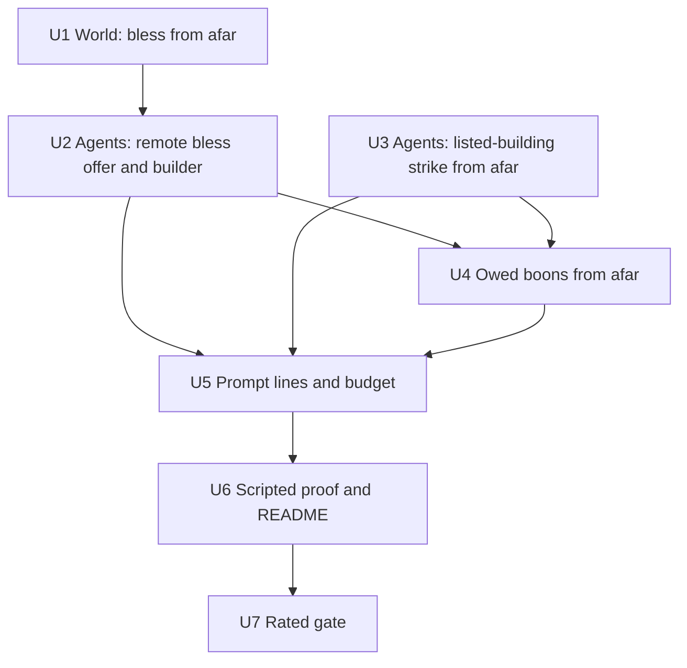

# feat: Gods answer prayers from where they stand

## Overview

A god answers a prayer addressed to it in one turn, from wherever it stands. It can bless the petitioner, strike the wrongdoer or a building the prayer lists, offer terms, refuse, or deliver a boon it owes under accepted terms. Refusing, offering terms and striking the named wrongdoer already work from afar. This plan adds:
- blessing from afar;
- strikes on a prayer's listed buildings;
- owed-boon delivery without travel;
- the prompt lines that offer these directly.

It doesn't change the scheduler, travel or any rate.

## Problem Frame

**The gates.** In the two rated gates on 2026-10-07, each god got 4–5 turns per 5-minute episode, and 63 of 71 (then 56 of 102) committed actions were walks. A blessing costs a walk and a second turn a whole turn gap later, against a 150-tick prayer lapse. 41 of 105 prayers lapsed in the first gate and 36 in the second (see origin: `docs/brainstorms/2026-10-07-turn-economy-requirements.md`).

**What the code does now.**
- **Blessing** has two blockers:
  - the world's co-location check;
  - the god's side, which offers and builds a blessing only for a petitioner in its scene.
- **Building strikes** are already legal from anywhere in the world. The prompt tells the god to travel unless the building is in its scene, and the builder requires the building in the snapshot.
- **Owed boons** are delivered by travelling to the mortal.

## Requirements Trace

- R1. Bless the mortal whose open prayer is addressed to the god, from anywhere, including an owed boon. Units 1, 2 and 4.
- R2. Strike the named wrongdoer or a listed building, from anywhere, including an owed strike. Units 3 and 4.
- R3. Offer terms on the prayer from anywhere. This is already true, and Unit 5's prompt tests keep it.
- R4. Refuse from anywhere. This is already true and stays unchanged.
- R5. Every other act keeps today's rules. Every unit keeps it, and the System-Wide Impact section lists what stays unchanged.
- R6. The world checks blessings and refusals from afar. Strikes keep today's world rules, and the prayer link is on the god's side and in judging. Units 1 and 3.
- R7. The effect lands at the target's place, and nobody there learns where the god is. Those with the god see it spend divinity, as today. Unit 1.
- R8. The prompt offers each answer as a move the god can copy and send as written, with no travel step. Units 2, 3, 4 and 5.
- Success criteria. Unit 6 gives scripted proof of a blessing and a building strike from afar, each with a positive control. Unit 7 is the measured rated gate.
- Traceability rows:
  - W04: perception;
  - W05: authoritative rules;
  - M04: patronage via answers;
  - O08: liveliness under load.

## Scope Boundaries

- No scheduler priority, free travel, queued "go and act" moves, or change to the prayer lapse or any rate.
- No new world gate on strikes (owner, 2026-10-07). A strike whose prayer lapses while the god is thinking still lands and answers nothing.
- No change to where the divinity-cost event is placed, and no hiding of remote answers from a travelling god (owner, 2026-10-07).
- Legends, reports, demands, contests and settlements are unchanged.
- How the renderer depicts an act from afar is out of scope.
- No tuning toward SC4 and SC5 of the mortal-wrongs plan.

## Context & Research

### Relevant Code and Patterns

**World**
- `packages/world/src/validate.ts`:
  - `handleBless` has the co-location reject.
  - `handleStrike` and `strikeMortal` have no location check.
  - `handleRefuse` is the remote prior art.
- `packages/world/src/petitions.ts`:
  - `blessability` and `refusability` check that the prayer is addressed, open and in its window, but not its location.
  - `judgeAnswers` closes a bless by `petitionId`, a mortal strike by offender, and a building strike by listed building.
  - Punish requests list the offender's buildings.
- `packages/world/src/perception.ts` `eventLocation`:
  - `blessing-granted` and `mortal-struck` are placed at the target, and building events at the building.
  - `resource-consumed` is placed at the actor.
- `packages/world/src/contests.ts` `serviceOf` counts bless and strike service at the target's place.

**Agents**
- `packages/agents/src/context.ts`:
  - The bless offer is limited to petitioners in the scene by `petitionView.petitionerHere` and `blessablePetitions`.
  - `answerGuidance`'s help and punish branches send the god to travel first.
  - `offerFor` collects strike targets, and `parseAction`'s bless and strike cases read them.
  - The prayer instructions near the top of the prompt say to travel first.
- `packages/agents/src/observation.ts` `buildModelProposal`:
  - The bless branch needs the petitioner in the snapshot.
  - The building strike branch needs the building in the snapshot and pins the building's revision.
  - The mortal strike branch is the pattern to mirror: it reads `petition:<id>` and pins only the god.
- `packages/agents/src/practices.ts`:
  - `owedBoonOf` and `owedStrikeOf` return a travel step when the god isn't with the target.
  - `offerTermsFor` is remote prior art.

**Scenarios**
- `tools/scenarios/m2-greek-cast/src/steps/staging.ts`:
  - `stageWorld`, `inStagedWorld`, `withGod` (the god copies a move from its prompt) and `stageBlessing`.
  - `steps/context.ts`: `STAGED_STEPS`, `CONTROL_STEP`, `WORLD_CONTROLS`.
  - `steps/s21-wrongs.ts` already proves a remote mortal strike, with a control.
  - `steps/s14-supplication.ts` `giveBoon` walks the god to the mortal before the boon.

### Institutional Learnings

- `docs/solutions/logic-errors/whole-entity-revision-pins-refused-petition-answers-2026-10-02.md`: don't pin what the validator rechecks at commit. A blessing pins nothing, as it does today. A remote building strike pins only what strikes pin today, without the building revision, because the world rechecks the building's status itself.
- `docs/solutions/best-practices/prompt-commanding-old-action-hides-new-option-2026-10-03.md`: replace the travel command with peer choices. Every move shown is built through the world validator.
- `docs/solutions/logic-errors/move-realm-transition-destination-pairing-2026-10-02.md`: the schema must be at least as strict as the parser, and each enum names only ids that were shown.
- `docs/solutions/best-practices/ollama-4k-prompts-truncate-silently-2026-10-03.md`: budget each growing section, measure `prompt_eval_count`, and keep the whole-prompt guard.
- `docs/solutions/logic-errors/world-judged-obligation-evidence-windows-2026-10-03.md`: an owed boon uses the action's own validator predicate (`blessability`), never a copy.
- `docs/solutions/logic-errors/knowledge-leaks-through-perception-timing-and-citations-2026-09-29.md`: a strike target must come from a shown prayer, which is the god's perception path (W04).
- `docs/solutions/best-practices/end-to-end-scenario-with-positive-controls-2026-09-28.md`: every scripted claim has a positive control, and the scenario stays out of `bun run check`.
- Owner test policy (project memory): staged steps set their causes up directly. A control runs only its own step, and the README is regenerated once on the final tree.

## Prior-Art Survey

```json
{
  "schema_version": 2,
  "verdict": "extend",
  "scope": "packages/world, packages/agents, packages/contracts, tools/scenarios/m2-greek-cast",
  "freshness": {
    "vcs_reference": "docs/turn-economy-brainstorm@ca11d67 based on main@2227a78"
  },
  "budget": {
    "max_search_passes": 3,
    "max_candidate_inspections": 10,
    "exhausted": false
  },
  "candidates": [
    {
      "path_or_symbol": "packages/world/src/validate.ts#handleRefuse",
      "description": "Remote refusal validates deity plus refusability (open, addressed, in window) with no location check.",
      "disposition": "reuse"
    },
    {
      "path_or_symbol": "packages/world/src/petitions.ts#blessability/refusability/judgeAnswers",
      "description": "Answer rules separate prayer checks from action effects; judgeAnswers closes bless by petitionId and punish by struck offender or listed building.",
      "disposition": "extend"
    },
    {
      "path_or_symbol": "packages/world/src/practices.ts#openOffer",
      "description": "Supplication offers on prayers validate ownership, open, window, living petitioner and terms, with no location check.",
      "disposition": "reuse"
    },
    {
      "path_or_symbol": "packages/agents/src/context.ts#petitionView/answerGuidance/offerFor",
      "description": "Prompt assembly already shows remote refusal, remote mortal punishment and offer objects; bless and listed-building strikes still route through travel.",
      "disposition": "extend"
    },
    {
      "path_or_symbol": "packages/agents/src/observation.ts#buildModelProposal",
      "description": "Builder supports petition-fact-based remote refusal, offer and mortal strike; bless and building strike still require the scene.",
      "disposition": "extend"
    },
    {
      "path_or_symbol": "tools/scenarios/m2-greek-cast/src/steps/s21-wrongs.ts#stepWrongChain",
      "description": "Staged step proving a god copies a remote mortal strike from its prompt, answering the prayer, with a positive control.",
      "disposition": "reuse"
    }
  ]
}
```

## Key Technical Decisions

- **Blessing is the only world rule that changes.** `handleBless` drops the co-location check, and `blessability` stays the gate. A blessing of the petitioner's own open, addressed, in-window help prayer is the only bless the world takes, and that is all `handleBless` accepts today. So dropping the check doesn't widen blessing beyond prayer answers. R5's "blessing unprompted needs presence" has no world path today, because every bless names a petition.
- **Strikes keep today's world rules (owner).** The prayer link lives on the god's side and in `judgeAnswers`. A stale strike lands and answers nothing, and a test pins that.
- **The god's side reads the prayer, not the scene.**
  - A remote bless and a listed-building strike are built from `petition:<id>` facts, mirroring the existing remote mortal strike.
  - A remote blessing pins nothing (`expectedRevisions: []`, as today). The world rechecks petition state, the petitioner being alive, and the god's power. Worship between observation and commit raises the god's revision, so a pin would refuse a legal blessing as `stale-target`. Superseded 2026-10-07: an earlier draft of this plan pinned the god; review showed this failure.
  - A remote building strike pins only the god, as the remote mortal strike does today. The world rechecks the building's status.
- **Every listed operational building is offered, with no cap.** No authored mortal owns more than 2 buildings (`content/greek/world/buildings.json`: the farmer 2, the rest 1), so a punish prayer adds at most 3 strike lines. Unit 5's measurement confirms they fit `PRAYERS_BUDGET_CHARS`, and the existing "and N more" overflow still bounds a crowded section.
- **Owed boons use the action's own predicates.**
  - `owedBoonOf` emits the remote bless when `blessability` holds and the god has the divinity.
  - `owedStrikeOf` emits the remote strike on a listed operational building or the offender.
  - Travel stays only for an owed act that no remote move can deliver.
- **No change to perception.** Effects already land at the target, and the cost event stays with the god (owner).
- **Scripted proof uses staged worlds.** It follows the S21 pattern: the god copies the move from its prompt, and the world judges it. Each new step runs alone under `--steps` and has a positive control.

## Open Questions

### Resolved During Planning

- **Strike gate:** no new world gate (owner).
- **Cost event and journeys:** no change. A remote answer by a travelling god that a thread awaits ends its journey as "replaced", as any committed act does (owner).
- **Owed boons:** in scope (owner).
- **Contest service from afar:** it already counts at the target's place, and that is kept (owner).

### Deferred to Implementation

- **Owed boon after the answer window closes.** An owed boon whose prayer's answer window closes before the thread's deadline can't be delivered by bless. Confirm whether this can occur with today's term deadlines. If it can, the thread breaches as it would today. No new rule.
- **Text of the new prompt lines.** The exact wording of the remote bless line and the two building-strike lines is settled against the measured budget.

## Implementation Units



- [ ] **Unit 1: World accepts a blessing from afar**

**Goal:** `handleBless` takes a blessing of the praying mortal wherever the god and the mortal stand.

**Requirements:** R1, R6, R7

**Dependencies:** None

**Files:**
- Modify: `packages/world/src/validate.ts`
- Test: `packages/world/src/petitions.test.ts`, `packages/world/src/perception.test.ts`, `packages/world/src/contests.test.ts`

**Approach:**
- Remove the co-location reject in `handleBless`. Keep the deity, `blessability`, living petitioner and divinity checks, and the event shape.
- Update the existing remote-bless test in `petitions.test.ts`, which expects `not-adjacent`, to expect acceptance.

**Execution note:** test-first. The flipped test and AE1 go red before the change.

**Patterns to follow:** `handleRefuse`, the remote prior art.

**Test scenarios:**
- Happy path, AE1: the farmer prays to Hera in the agora while Hera is at the harbour. Hera's bless commits that tick, `blessing-granted` names the petition, and `judgeAnswers` closes it.
- Error path, AE4: Hera blesses the petitioner of a prayer addressed to Zeus, and the world refuses it.
- Error path: the prayer lapsed, was answered or was refused before the bless reached the world, which refuses it. A dead petitioner is refused as today, and so is a god with too little divinity.
- Integration, R7:
  - A mortal in the agora perceives `blessing-granted`.
  - A god standing at the harbour, not with the farmer, doesn't perceive the blessing.
  - A mortal at the harbour perceives only the `resource-consumed` cost, as today.
- Integration: `serviceOf` records the remote blessing as service at the agora, reaching the mortals there.

**Verification:** the world tests pass, and a remote bless answers its prayer in one tick with the effect placed at the petitioner.

- [ ] **Unit 2: The god is offered and can send a blessing from afar**

**Goal:** a god is offered a copyable bless for every shown open help prayer it can afford, and its bless is built from the prayer, not the scene.

**Requirements:** R1, R6, R8

**Dependencies:** Unit 1

**Files:**
- Modify: `packages/agents/src/context.ts` (`petitionView`, `blessablePetitions`, `answerGuidance` help branch, the schema's bless enum), `packages/agents/src/observation.ts` (bless branch)
- Test:
  - `packages/agents/src/petitions-context.test.ts`
  - `packages/agents/src/supplications-context.test.ts`
  - `packages/agents/src/prayer-budget.test.ts`
  - `packages/agents/src/practice-openings.test.ts`
  - `packages/agents/src/observation.test.ts`

**Approach:**
- Drop `petitionerHere` from the bless offer. Keep the divinity gate, and gate the help-branch bless line on it too.
- Replace the help branch's travel and reachability lines with the direct bless move, built through the world validator.
- In the builder, source the petitioner from `remembered.petitions` with a `petition:<id>` fact read, as the remote mortal strike does. Keep the proposal unpinned, with `expectedRevisions: []`.

**Patterns to follow:** the remote mortal strike in `petitionView`, `answerGuidance` and `buildModelProposal`.

**Test scenarios:**
- Happy path: Hera at the harbour is shown the farmer's help prayer. Her prompt carries `{"action":"bless","petition":"…"}`, which parses, is built and commits through `runTick`.
- Edge case: a god with too little divinity has no bless line, and the schema enum excludes the prayer.
- Edge case: the bless enum names only prayers that were shown, so an unshown prayer is refused by both the parser and the schema.
- Edge case: a help prayer shows both the bless line and the offer-terms line.
- Error path: the petitioner died between prompt and commit, and the world refuses the bless without corrupting state.
- Regression: build a remote bless, apply a real `worship-performed` that raises the god's revision, then commit the bless through `runTick`. It succeeds.
- Updated tests:
  - The tests expecting travel for a distant help prayer, or no bless for an absent petitioner, now expect the direct bless.
  - The "petitioner walked away" test now expects acceptance.

**Verification:** the agents tests pass, and no help-prayer line mentions travel.

- [ ] **Unit 3: The god can strike a prayer's listed building from afar**

**Goal:** a punish prayer offers a copyable strike on each of the wrongdoer's listed operational buildings, plus the wrongdoer, with no travel.

**Requirements:** R2, R6, R8

**Dependencies:** None (the world already accepts it)

**Files:**
- Modify: `packages/agents/src/context.ts` (`petitionView`, `answerGuidance` punish branch, `offerFor`), `packages/agents/src/observation.ts` (building-strike branch for a prayer-listed building)
- Test:
  - `packages/agents/src/petitions-context.test.ts`
  - `packages/agents/src/punish-line.test.ts`
  - `packages/agents/src/patrons-context.test.ts`
  - `packages/agents/src/observation.test.ts`
  - `packages/world/src/petitions.test.ts`

**Approach:**
- For each shown punish prayer, add a strike target for each listed operational building, each built through the world validator.
- Replace the travel branch. In the builder, a strike on a building that a shown prayer lists reads `petition:<id>` and pins only the god. The scene branch is unchanged for buildings the god sees.

**Patterns to follow:** the remote mortal strike branch.

**Test scenarios:**
- Happy path, AE2 shape: Doris prays to Poseidon to punish Lykos, whose workshop is listed, and Poseidon is far away.
  - Poseidon's prompt carries a strike on the workshop and one on Lykos.
  - The workshop strike commits, damages the workshop and closes the prayer.
- Edge case: the farmer's punish prayer lists both of his buildings, and both are offered.
- Edge case: a listed building that is burning or destroyed isn't offered.
- Error path, owner decision: the prayer lapsed between prompt and commit. The strike still lands, and `judgeAnswers` credits no prayer.
- Integration: a remote building strike is contest service at the building's place.
- Updated tests: the tests expecting travel, or no strike line until the god is present, now expect the direct strike.

**Verification:** the agents and world tests pass, and no punish-prayer line mentions travel.

- [ ] **Unit 4: Owed boons are delivered from afar**

**Goal:** a god that owes a blessing or a strike under accepted terms is offered the remote act as its next step.

**Requirements:** R1, R2, R8

**Dependencies:** Units 2 and 3

**Files:**
- Modify: `packages/agents/src/practices.ts` (`owedBoonOf`, `owedStrikeOf`, the owed-boon prompt rows)
- Test: `packages/agents/src/boon-owed.test.ts`, `packages/agents/src/practice-legality.test.ts`

**Approach:**
- `owedBoonOf` returns the remote bless when `blessability` holds and divinity suffices.
- `owedStrikeOf` returns the remote strike on the offender or a listed operational building.
- Travel stays only where no remote move delivers the owed act. Delivering a boon still closes the obligation through the existing world judging.

**Patterns to follow:** `offerTermsFor`, which builds through `validatePractice`. Owed acts use the action's own validator predicate.

**Test scenarios:**
- Happy path: the farmer accepted Zeus's terms, and Zeus is far away. The owed-boon row shows a remote bless, which commits and closes the obligation.
- Happy path: an owed punish strike, with the god away, shows the remote strike on a listed building.
- Happy path: an owed punish strike against a wrongdoer with no operational building shows the remote strike on the wrongdoer itself.
- Edge case: the owed bless is unaffordable, so the row shows it blocked, as today's blocked rows do.
- Updated test: `boon-owed.test.ts` no longer expects travel to the building or the mortal.

**Verification:** the owed-boon tests pass, and the rows offer the act, not a walk.

- [ ] **Unit 5: Prompt instructions and budget**

**Goal:** the instructions stop telling gods to travel before answering, and the busiest prompt stays inside its guards.

**Requirements:** R8

**Dependencies:** Units 2–4

**Files:**
- Modify: `packages/agents/src/context.ts` (the prayer instructions)
- Test: `packages/agents/src/prayer-budget.test.ts`, `packages/agents/src/contests-context.test.ts`

**Approach:**
- Rewrite the instruction that says a distant petitioner or building means travelling first. Present answers as peer choices.
- Re-measure the busiest prompt's character count, and its `prompt_eval_count` once against local Ollama. Record the measurement in `docs/product/defaults.md`, with the method, the model and the Ollama version. Raise `PRAYERS_BUDGET_CHARS` only if the measurement requires it, staying under the 10,500-character guard.

**Test scenarios:**
- Happy path: no prompt text tells a god to travel in order to answer a prayer.
- Edge case: a crowded prompt with many punish prayers keeps the binding rows and ends with "and N more", inside the prayers budget.
- Integration: every copyable move in a crowded prompt validates through the world, extending the existing crowded-prompt test.

**Verification:** the guard tests pass at the measured budget, and the measurement is recorded.

- [ ] **Unit 6: Scripted proof of remote answers**

**Goal:** the m2 story proves a blessing from afar and a building strike from afar through the real service. Each runs as a staged step with a positive control.

**Requirements:** success criteria; R1, R2 and R7 end to end

**Dependencies:** Unit 5

**Files:**
- Modify:
  - `tools/scenarios/m2-greek-cast/src/steps/staging.ts`
  - `tools/scenarios/m2-greek-cast/src/steps/context.ts`
  - `tools/scenarios/m2-greek-cast/src/steps/s14-supplication.ts` (`giveBoon` delivers from afar)
  - `tools/scenarios/m2-greek-cast/src/story.ts`
  - `tools/scenarios/m2-greek-cast/src/run.ts`
  - `tools/scenarios/m2-greek-cast/README.md`
- Create: new staged step files for the remote bless and the remote building strike (numbered after S25)
- Test: `tools/scenarios/m2-greek-cast/src/*.test.ts` for any pure helper

**Approach:**
- Each step starts its own staged world. The god and the target stand apart, the god copies the move from its prompt via `withGod`, and the step asserts the following on the same tick:
  - the act committed;
  - the god didn't move;
  - the prayer is answered;
  - mortals at the target's place perceived it;
  - none of them learned the god's location.
- Controls: the god withholds the remote line and travel is required, and the step must fail at its own check. Wire both the way S21's control is wired:
  - add the step ids to `STAGED_STEPS`;
  - add the control names to the `ControlName` union and `CONTROL_NAMES`, and map each to its step in `CONTROL_STEP`;
  - dispatch the new step functions in `story.ts`'s staged-step loop;
  - give each control its sabotage line in `run.ts`.

  `WORLD_CONTROLS` is only for in-process evidence controls, so neither new control goes there.
- `giveBoon` in S14 now delivers from afar. `stageBlessing` can drop its walk.

**Patterns to follow:** S21's remote mortal strike and its control, `stageWorld` and `withGod`.

**Test scenarios:**
- Integration: the remote bless step passes, and its control fails at that step.
- Integration: the remote building strike step passes, and its control fails at that step.
- Integration: S14 still passes, with its boon delivered from afar.

**Verification:**
- `--steps` runs each new step alone, in seconds.
- One `--write-readme --jobs=4` run on the final tree holds every step, and every control fails at its own step.
- The README records both new controls.

- [ ] **Unit 7: Rated gate, measured**

**Goal:** record what remote answers change in a real-model gate.

**Requirements:** success criteria (measured, not targets)

**Dependencies:** Unit 6

**Files:**
- Create: `tools/scenarios/m2-greek-cast/episodes/<timestamp>/`
- Modify: `docs/product/traceability.md` (implementation and gate evidence on W04, W05, M04 and O08; the planned clauses landed with this plan), `docs/brainstorms/2026-10-07-turn-economy-requirements.md` (status line)

**Approach:** one rated seven-god gate, 3 × 300 s on qwen3-8b-4k, with nothing else running. Compare against the two 2026-10-07 gates:
- actions spent on answers versus walks;
- prayers answered versus lapsed;
- strikes, revenge and defections;
- queue wait.

Don't tune anything to the result.

**Test expectation:** none. This is measurement evidence.

**Verification:** the evidence is committed with an honest comparison, and the SC verdicts are restated.

## System-Wide Impact

- **Interaction graph:**
  - Remote answers flow through the existing pipeline: proposal, validator, events, `judgeAnswers`, memories and affinity, then contests' `serviceOf`.
  - A remote strike gives the struck mortal a grudge against the god, which may lead to a harm prayer and revenge.
  - More answered prayers feed defection, via an answered prayer from a non-patron god.
- **State lifecycle:** no new state. A travelling god that a thread awaits ends its journey as "replaced" if it answers remotely (owner, accepted).
- **Unchanged invariants:**
  - The world stays authoritative.
  - The strike rules are unchanged.
  - Perception placement is unchanged.
  - Demand, contest, settlement, legend and report rules are unchanged.
  - Refusals and offers of terms are unchanged.
- **Integration coverage:** the world and agents tests prove each piece. The staged steps prove the chain through the built sidecar.

## Risks & Dependencies

| Risk | Mitigation |
|------|------------|
| Cheap strikes produce repetitive revenge loops instead of varied disputes | Accepted in the origin. Unit 7 measures it; no tuning now |
| More answer lines push the prayers section over budget | At most 3 strike lines per punish prayer with today's content. Unit 5 measures and keeps the guards, and the "and N more" overflow bounds a crowded section |
| Gods stop moving, so the map looks static | Accepted. Travel remains for legends, contests and presence |
| Owed boon's window closes before the thread's deadline | Unit 4 confirms whether this can occur. If it can, the thread breaches as today |

## Sources & References

- **Origin document:** [docs/brainstorms/2026-10-07-turn-economy-requirements.md](../brainstorms/2026-10-07-turn-economy-requirements.md)
- **Rated gates:** `tools/scenarios/m2-greek-cast/episodes/2026-10-07T00-52-07/` and `tools/scenarios/m2-greek-cast/episodes/2026-10-07T02-58-12/`
- **Related PRs:** #152 (first gate), #153 (copyable legend and report, merged and in this plan's base)
