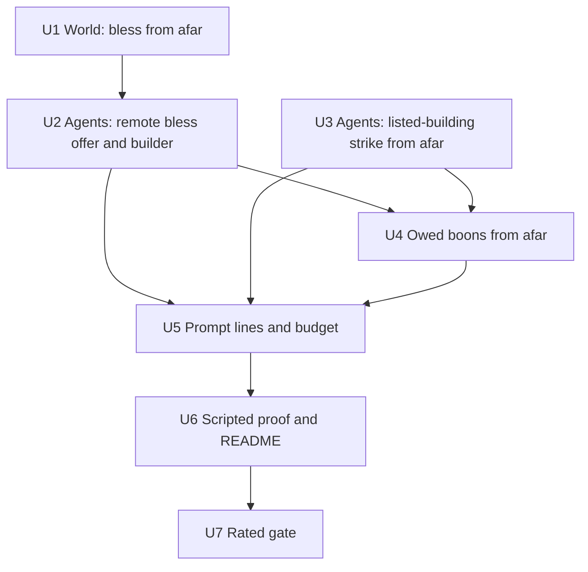

# feat: Gods answer prayers from where they stand

## Overview

A god answers a prayer addressed to it in one turn, from wherever it stands. It can bless the petitioner, strike the wrongdoer or a building the prayer lists, offer terms, refuse, or deliver a boon it owes under accepted terms. Refusing, offering terms and striking the named wrongdoer already work from afar. This plan adds:
- blessing from afar;
- strikes on a prayer's listed buildings;
- owed-boon delivery without travel;
- the prompt lines that offer these directly.

It doesn't change the scheduler, travel or any rate.

## Problem Frame

**The gates.** In the two rated gates on 2026-10-07, each god got 4–5 turns per 5-minute episode, and 63 of 71 (then 56 of 102) committed actions were walks. A blessing costs a walk and a second turn a whole turn gap later, against a 150-tick prayer lapse. 41 of 105 prayers lapsed in the first gate and 36 in the second (see origin: `docs/brainstorms/2026-10-07-turn-economy-requirements.md`).

**What the code does now.**
- **Blessing** has two blockers:
  - the world's co-location check;
  - the god's side, which offers and builds a blessing only for a petitioner in its scene.
- **Building strikes** are already legal from anywhere in the world. The prompt tells the god to travel unless the building is in its scene, and the builder requires the building in the snapshot.
- **Owed boons** are delivered by travelling to the mortal.

## Requirements Trace

- R1. Bless the mortal whose open prayer is addressed to the god, from anywhere, including an owed boon. Units 1, 2 and 4.
- R2. Strike the named wrongdoer or a listed building, from anywhere, including an owed strike. Units 3 and 4.
- R3. Offer terms on the prayer from anywhere. This is already true, and Unit 5's prompt tests keep it.
- R4. Refuse from anywhere. This is already true and stays unchanged.
- R5. Every other act keeps today's rules. Every unit keeps it, and the System-Wide Impact section lists what stays unchanged.
- R6. The world checks blessings and refusals from afar. Strikes keep today's world rules, and the prayer link is on the god's side and in judging. Units 1 and 3.
- R7. The effect lands at the target's place, and nobody there learns where the god is. Those with the god see it spend divinity, as today. Unit 1.
- R8. The prompt offers each answer as a move the god can copy and send as written, with no travel step. Units 2, 3, 4 and 5.
- Success criteria. Unit 6 gives scripted proof of a blessing and a building strike from afar, each with a positive control. Unit 7 is the measured rated gate.
- Traceability rows:
  - W04: perception;
  - W05: authoritative rules;
  - M04: patronage via answers;
  - O08: liveliness under load.

## Scope Boundaries

- No scheduler priority, free travel, queued "go and act" moves, or change to the prayer lapse or any rate.
- No new world gate on strikes (owner, 2026-10-07). A strike whose prayer lapses while the god is thinking still lands and answers nothing.
- No change to where the divinity-cost event is placed, and no hiding of remote answers from a travelling god (owner, 2026-10-07).
- Legends, reports, demands, contests and settlements are unchanged.
- How the renderer depicts an act from afar is out of scope.
- No tuning toward SC4 and SC5 of the mortal-wrongs plan.

## Context & Research

### Relevant Code and Patterns

**World**
- `packages/world/src/validate.ts`:
  - `handleBless` has the co-location reject.
  - `handleStrike` and `strikeMortal` have no location check.
  - `handleRefuse` is the remote prior art.
- `packages/world/src/petitions.ts`:
  - `blessability` and `refusability` check that the prayer is addressed, open and in its window, but not its location.
  - `judgeAnswers` closes a bless by `petitionId`, a mortal strike by offender, and a building strike by listed building.
  - Punish requests list the offender's buildings.
- `packages/world/src/perception.ts` `eventLocation`:
  - `blessing-granted` and `mortal-struck` are placed at the target, and building events at the building.
  - `resource-consumed` is placed at the actor.
- `packages/world/src/contests.ts` `serviceOf` counts bless and strike service at the target's place.

**Agents**
- `packages/agents/src/context.ts`:
  - The bless offer is limited to petitioners in the scene by `petitionView.petitionerHere` and `blessablePetitions`.
  - `answerGuidance`'s help and punish branches send the god to travel first.
  - `offerFor` collects strike targets, and `parseAction`'s bless and strike cases read them.
  - The prayer instructions near the top of the prompt say to travel first.
- `packages/agents/src/observation.ts` `buildModelProposal`:
  - The bless branch needs the petitioner in the snapshot.
  - The building strike branch needs the building in the snapshot and pins the building's revision.
  - The mortal strike branch is the pattern to mirror: it reads `petition:<id>` and pins only the god.
- `packages/agents/src/practices.ts`:
  - `owedBoonOf` and `owedStrikeOf` return a travel step when the god isn't with the target.
  - `offerTermsFor` is remote prior art.

**Scenarios**
- `tools/scenarios/m2-greek-cast/src/steps/staging.ts`:
  - `stageWorld`, `inStagedWorld`, `withGod` (the god copies a move from its prompt) and `stageBlessing`.
  - `steps/context.ts`: `STAGED_STEPS`, `CONTROL_STEP`, `WORLD_CONTROLS`.
  - `steps/s21-wrongs.ts` already proves a remote mortal strike, with a control.
  - `steps/s14-supplication.ts` `giveBoon` walks the god to the mortal before the boon.

### Institutional Learnings

- `docs/solutions/logic-errors/whole-entity-revision-pins-refused-petition-answers-2026-10-02.md`: don't pin what the validator rechecks at commit. A blessing pins nothing, as it does today. A remote building strike pins only what strikes pin today, without the building revision, because the world rechecks the building's status itself.
- `docs/solutions/best-practices/prompt-commanding-old-action-hides-new-option-2026-10-03.md`: replace the travel command with peer choices. Every move shown is built through the world validator.
- `docs/solutions/logic-errors/move-realm-transition-destination-pairing-2026-10-02.md`: the schema must be at least as strict as the parser, and each enum names only ids that were shown.
- `docs/solutions/best-practices/ollama-4k-prompts-truncate-silently-2026-10-03.md`: budget each growing section, measure `prompt_eval_count`, and keep the whole-prompt guard.
- `docs/solutions/logic-errors/world-judged-obligation-evidence-windows-2026-10-03.md`: an owed boon uses the action's own validator predicate (`blessability`), never a copy.
- `docs/solutions/logic-errors/knowledge-leaks-through-perception-timing-and-citations-2026-09-29.md`: a strike target must come from a shown prayer, which is the god's perception path (W04).
- `docs/solutions/best-practices/end-to-end-scenario-with-positive-controls-2026-09-28.md`: every scripted claim has a positive control, and the scenario stays out of `bun run check`.
- Owner test policy (project memory): staged steps set their causes up directly. A control runs only its own step, and the README is regenerated once on the final tree.

## Prior-Art Survey

```json
{
  "schema_version": 2,
  "verdict": "extend",
  "scope": "packages/world, packages/agents, packages/contracts, tools/scenarios/m2-greek-cast",
  "freshness": {
    "vcs_reference": "docs/turn-economy-brainstorm@ca11d67 based on main@2227a78"
  },
  "budget": {
    "max_search_passes": 3,
    "max_candidate_inspections": 10,
    "exhausted": false
  },
  "candidates": [
    {
      "path_or_symbol": "packages/world/src/validate.ts#handleRefuse",
      "description": "Remote refusal validates deity plus refusability (open, addressed, in window) with no location check.",
      "disposition": "reuse"
    },
    {
      "path_or_symbol": "packages/world/src/petitions.ts#blessability/refusability/judgeAnswers",
      "description": "Answer rules separate prayer checks from action effects; judgeAnswers closes bless by petitionId and punish by struck offender or listed building.",
      "disposition": "extend"
    },
    {
      "path_or_symbol": "packages/world/src/practices.ts#openOffer",
      "description": "Supplication offers on prayers validate ownership, open, window, living petitioner and terms, with no location check.",
      "disposition": "reuse"
    },
    {
      "path_or_symbol": "packages/agents/src/context.ts#petitionView/answerGuidance/offerFor",
      "description": "Prompt assembly already shows remote refusal, remote mortal punishment and offer objects; bless and listed-building strikes still route through travel.",
      "disposition": "extend"
    },
    {
      "path_or_symbol": "packages/agents/src/observation.ts#buildModelProposal",
      "description": "Builder supports petition-fact-based remote refusal, offer and mortal strike; bless and building strike still require the scene.",
      "disposition": "extend"
    },
    {
      "path_or_symbol": "tools/scenarios/m2-greek-cast/src/steps/s21-wrongs.ts#stepWrongChain",
      "description": "Staged step proving a god copies a remote mortal strike from its prompt, answering the prayer, with a positive control.",
      "disposition": "reuse"
    }
  ]
}
```

## Key Technical Decisions

- **Blessing is the only world rule that changes.** `handleBless` drops the co-location check, and `blessability` stays the gate. A blessing of the petitioner's own open, addressed, in-window help prayer is the only bless the world takes, and that is all `handleBless` accepts today. So dropping the check doesn't widen blessing beyond prayer answers. R5's "blessing unprompted needs presence" has no world path today, because every bless names a petition.
- **Strikes keep today's world rules (owner).** The prayer link lives on the god's side and in `judgeAnswers`. A stale strike lands and answers nothing, and a test pins that.
- **The god's side reads the prayer, not the scene.**
  - A remote bless and a listed-building strike are built from `petition:<id>` facts, mirroring the existing remote mortal strike.
  - A remote blessing pins nothing (`expectedRevisions: []`, as today). The world rechecks petition state, the petitioner being alive, and the god's power. Worship between observation and commit raises the god's revision, so a pin would refuse a legal blessing as `stale-target`. Superseded 2026-10-07: an earlier draft of this plan pinned the god; review showed this failure.
  - A remote building strike pins only the god, as the remote mortal strike does today. The world rechecks the building's status.
- **Every listed operational building is offered, with no cap.** No authored mortal owns more than 2 buildings (`content/greek/world/buildings.json`: the farmer 2, the rest 1), so a punish prayer adds at most 3 strike lines. Unit 5's measurement confirms they fit `PRAYERS_BUDGET_CHARS`, and the existing "and N more" overflow still bounds a crowded section.
- **Owed boons use the action's own predicates.**
  - `owedBoonOf` emits the remote bless when `blessability` holds and the god has the divinity.
  - `owedStrikeOf` emits the remote strike on a listed operational building or the offender.
  - Travel stays only for an owed act that no remote move can deliver.
- **No change to perception.** Effects already land at the target, and the cost event stays with the god (owner).
- **Scripted proof uses staged worlds.** It follows the S21 pattern: the god copies the move from its prompt, and the world judges it. Each new step runs alone under `--steps` and has a positive control.

## Open Questions

### Resolved During Planning

- **Strike gate:** no new world gate (owner).
- **Cost event and journeys:** no change. A remote answer by a travelling god that a thread awaits ends its journey as "replaced", as any committed act does (owner).
- **Owed boons:** in scope (owner).
- **Contest service from afar:** it already counts at the target's place, and that is kept (owner).

### Deferred to Implementation

- **Owed boon after the answer window closes.** An owed boon whose prayer's answer window closes before the thread's deadline can't be delivered by bless. Confirm whether this can occur with today's term deadlines. If it can, the thread breaches as it would today. No new rule.
- **Text of the new prompt lines.** The exact wording of the remote bless line and the two building-strike lines is settled against the measured budget.

## Implementation Units



- [ ] **Unit 1: World accepts a blessing from afar**

**Goal:** `handleBless` takes a blessing of the praying mortal wherever the god and the mortal stand.

**Requirements:** R1, R6, R7

**Dependencies:** None

**Files:**
- Modify: `packages/world/src/validate.ts`
- Test: `packages/world/src/petitions.test.ts`, `packages/world/src/perception.test.ts`, `packages/world/src/contests.test.ts`

**Approach:**
- Remove the co-location reject in `handleBless`. Keep the deity, `blessability`, living petitioner and divinity checks, and the event shape.
- Update the existing remote-bless test in `petitions.test.ts`, which expects `not-adjacent`, to expect acceptance.

**Execution note:** test-first. The flipped test and AE1 go red before the change.

**Patterns to follow:** `handleRefuse`, the remote prior art.

**Test scenarios:**
- Happy path, AE1: the farmer prays to Hera in the agora while Hera is at the harbour. Hera's bless commits that tick, `blessing-granted` names the petition, and `judgeAnswers` closes it.
- Error path, AE4: Hera blesses the petitioner of a prayer addressed to Zeus, and the world refuses it.
- Error path: the prayer lapsed, was answered or was refused before the bless reached the world, which refuses it. A dead petitioner is refused as today, and so is a god with too little divinity.
- Integration, R7:
  - A mortal in the agora perceives `blessing-granted`.
  - A god standing at the harbour, not with the farmer, doesn't perceive the blessing.
  - A mortal at the harbour perceives only the `resource-consumed` cost, as today.
- Integration: `serviceOf` records the remote blessing as service at the agora, reaching the mortals there.

**Verification:** the world tests pass, and a remote bless answers its prayer in one tick with the effect placed at the petitioner.

- [ ] **Unit 2: The god is offered and can send a blessing from afar**

**Goal:** a god is offered a copyable bless for every shown open help prayer it can afford, and its bless is built from the prayer, not the scene.

**Requirements:** R1, R6, R8

**Dependencies:** Unit 1

**Files:**
- Modify: `packages/agents/src/context.ts` (`petitionView`, `blessablePetitions`, `answerGuidance` help branch, the schema's bless enum), `packages/agents/src/observation.ts` (bless branch)
- Test:
  - `packages/agents/src/petitions-context.test.ts`
  - `packages/agents/src/supplications-context.test.ts`
  - `packages/agents/src/prayer-budget.test.ts`
  - `packages/agents/src/practice-openings.test.ts`
  - `packages/agents/src/observation.test.ts`

**Approach:**
- Drop `petitionerHere` from the bless offer. Keep the divinity gate, and gate the help-branch bless line on it too.
- Replace the help branch's travel and reachability lines with the direct bless move, built through the world validator.
- In the builder, source the petitioner from `remembered.petitions` with a `petition:<id>` fact read, as the remote mortal strike does. Keep the proposal unpinned, with `expectedRevisions: []`.

**Patterns to follow:** the remote mortal strike in `petitionView`, `answerGuidance` and `buildModelProposal`.

**Test scenarios:**
- Happy path: Hera at the harbour is shown the farmer's help prayer. Her prompt carries `{"action":"bless","petition":"…"}`, which parses, is built and commits through `runTick`.
- Edge case: a god with too little divinity has no bless line, and the schema enum excludes the prayer.
- Edge case: the bless enum names only prayers that were shown, so an unshown prayer is refused by both the parser and the schema.
- Edge case: a help prayer shows both the bless line and the offer-terms line.
- Error path: the petitioner died between prompt and commit, and the world refuses the bless without corrupting state.
- Regression: build a remote bless, apply a real `worship-performed` that raises the god's revision, then commit the bless through `runTick`. It succeeds.
- Updated tests:
  - The tests expecting travel for a distant help prayer, or no bless for an absent petitioner, now expect the direct bless.
  - The "petitioner walked away" test now expects acceptance.

**Verification:** the agents tests pass, and no help-prayer line mentions travel.

- [ ] **Unit 3: The god can strike a prayer's listed building from afar**

**Goal:** a punish prayer offers a copyable strike on each of the wrongdoer's listed operational buildings, plus the wrongdoer, with no travel.

**Requirements:** R2, R6, R8

**Dependencies:** None (the world already accepts it)

**Files:**
- Modify: `packages/agents/src/context.ts` (`petitionView`, `answerGuidance` punish branch, `offerFor`), `packages/agents/src/observation.ts` (building-strike branch for a prayer-listed building)
- Test:
  - `packages/agents/src/petitions-context.test.ts`
  - `packages/agents/src/punish-line.test.ts`
  - `packages/agents/src/patrons-context.test.ts`
  - `packages/agents/src/observation.test.ts`
  - `packages/world/src/petitions.test.ts`

**Approach:**
- For each shown punish prayer, add a strike target for each listed operational building, each built through the world validator.
- Replace the travel branch. In the builder, a strike on a building that a shown prayer lists reads `petition:<id>` and pins only the god. The scene branch is unchanged for buildings the god sees.

**Patterns to follow:** the remote mortal strike branch.

**Test scenarios:**
- Happy path, AE2 shape: Doris prays to Poseidon to punish Lykos, whose workshop is listed, and Poseidon is far away.
  - Poseidon's prompt carries a strike on the workshop and one on Lykos.
  - The workshop strike commits, damages the workshop and closes the prayer.
- Edge case: the farmer's punish prayer lists both of his buildings, and both are offered.
- Edge case: a listed building that is burning or destroyed isn't offered.
- Error path, owner decision: the prayer lapsed between prompt and commit. The strike still lands, and `judgeAnswers` credits no prayer.
- Integration: a remote building strike is contest service at the building's place.
- Updated tests: the tests expecting travel, or no strike line until the god is present, now expect the direct strike.

**Verification:** the agents and world tests pass, and no punish-prayer line mentions travel.

- [ ] **Unit 4: Owed boons are delivered from afar**

**Goal:** a god that owes a blessing or a strike under accepted terms is offered the remote act as its next step.

**Requirements:** R1, R2, R8

**Dependencies:** Units 2 and 3

**Files:**
- Modify: `packages/agents/src/practices.ts` (`owedBoonOf`, `owedStrikeOf`, the owed-boon prompt rows)
- Test: `packages/agents/src/boon-owed.test.ts`, `packages/agents/src/practice-legality.test.ts`

**Approach:**
- `owedBoonOf` returns the remote bless when `blessability` holds and divinity suffices.
- `owedStrikeOf` returns the remote strike on the offender or a listed operational building.
- Travel stays only where no remote move delivers the owed act. Delivering a boon still closes the obligation through the existing world judging.

**Patterns to follow:** `offerTermsFor`, which builds through `validatePractice`. Owed acts use the action's own validator predicate.

**Test scenarios:**
- Happy path: the farmer accepted Zeus's terms, and Zeus is far away. The owed-boon row shows a remote bless, which commits and closes the obligation.
- Happy path: an owed punish strike, with the god away, shows the remote strike on a listed building.
- Happy path: an owed punish strike against a wrongdoer with no operational building shows the remote strike on the wrongdoer itself.
- Edge case: the owed bless is unaffordable, so the row shows it blocked, as today's blocked rows do.
- Updated test: `boon-owed.test.ts` no longer expects travel to the building or the mortal.

**Verification:** the owed-boon tests pass, and the rows offer the act, not a walk.

- [ ] **Unit 5: Prompt instructions and budget**

**Goal:** the instructions stop telling gods to travel before answering, and the busiest prompt stays inside its guards.

**Requirements:** R8

**Dependencies:** Units 2–4

**Files:**
- Modify: `packages/agents/src/context.ts` (the prayer instructions)
- Test: `packages/agents/src/prayer-budget.test.ts`, `packages/agents/src/contests-context.test.ts`

**Approach:**
- Rewrite the instruction that says a distant petitioner or building means travelling first. Present answers as peer choices.
- Re-measure the busiest prompt's character count, and its `prompt_eval_count` once against local Ollama. Record the measurement in `docs/product/defaults.md`, with the method, the model and the Ollama version. Raise `PRAYERS_BUDGET_CHARS` only if the measurement requires it, staying under the 10,500-character guard.

**Test scenarios:**
- Happy path: no prompt text tells a god to travel in order to answer a prayer.
- Edge case: a crowded prompt with many punish prayers keeps the binding rows and ends with "and N more", inside the prayers budget.
- Integration: every copyable move in a crowded prompt validates through the world, extending the existing crowded-prompt test.

**Verification:** the guard tests pass at the measured budget, and the measurement is recorded.

- [ ] **Unit 6: Scripted proof of remote answers**

**Goal:** the m2 story proves a blessing from afar and a building strike from afar through the real service. Each runs as a staged step with a positive control.

**Requirements:** success criteria; R1, R2 and R7 end to end

**Dependencies:** Unit 5

**Files:**
- Modify:
  - `tools/scenarios/m2-greek-cast/src/steps/staging.ts`
  - `tools/scenarios/m2-greek-cast/src/steps/context.ts`
  - `tools/scenarios/m2-greek-cast/src/steps/s14-supplication.ts` (`giveBoon` delivers from afar)
  - `tools/scenarios/m2-greek-cast/src/story.ts`
  - `tools/scenarios/m2-greek-cast/src/run.ts`
  - `tools/scenarios/m2-greek-cast/README.md`
- Create: new staged step files for the remote bless and the remote building strike (numbered after S25)
- Test: `tools/scenarios/m2-greek-cast/src/*.test.ts` for any pure helper

**Approach:**
- Each step starts its own staged world. The god and the target stand apart, the god copies the move from its prompt via `withGod`, and the step asserts the following on the same tick:
  - the act committed;
  - the god didn't move;
  - the prayer is answered;
  - mortals at the target's place perceived it;
  - none of them learned the god's location.
- Controls: the god withholds the remote line and travel is required, and the step must fail at its own check. Wire both the way S21's control is wired:
  - add the step ids to `STAGED_STEPS`;
  - add the control names to the `ControlName` union and `CONTROL_NAMES`, and map each to its step in `CONTROL_STEP`;
  - dispatch the new step functions in `story.ts`'s staged-step loop;
  - give each control its sabotage line in `run.ts`.

  `WORLD_CONTROLS` is only for in-process evidence controls, so neither new control goes there.
- `giveBoon` in S14 now delivers from afar. `stageBlessing` can drop its walk.

**Patterns to follow:** S21's remote mortal strike and its control, `stageWorld` and `withGod`.

**Test scenarios:**
- Integration: the remote bless step passes, and its control fails at that step.
- Integration: the remote building strike step passes, and its control fails at that step.
- Integration: S14 still passes, with its boon delivered from afar.

**Verification:**
- `--steps` runs each new step alone, in seconds.
- One `--write-readme --jobs=4` run on the final tree holds every step, and every control fails at its own step.
- The README records both new controls.

- [x] **Unit 7: Rated gate, measured**

**Goal:** record what remote answers change in a real-model gate.

**Requirements:** success criteria (measured, not targets)

**Dependencies:** Unit 6

**Files:**
- Create: `tools/scenarios/m2-greek-cast/episodes/<timestamp>/`
- Modify: `docs/product/traceability.md` (implementation and gate evidence on W04, W05, M04 and O08; the planned clauses landed with this plan), `docs/brainstorms/2026-10-07-turn-economy-requirements.md` (status line)

**Approach:** one rated seven-god gate, 3 × 300 s on qwen3-8b-4k, with nothing else running. Compare against the two 2026-10-07 gates:
- actions spent on answers versus walks;
- prayers answered versus lapsed;
- strikes, revenge and defections;
- queue wait.

Don't tune anything to the result.

**Test expectation:** none. This is measurement evidence.

**Verification:** the evidence is committed with an honest comparison, and the SC verdicts are restated.

**Status (2026-10-07): the measurement ran; the owner rates.** One rated gate, 3 × 300 s on qwen3-8b-4k with reasoning off, on main 4bea553 (`tools/scenarios/m2-greek-cast/episodes/2026-10-07T14-02-54/`), the load average 4.65 at the start and 5.83 at the end from other processes. Exit 1: 143 passed and 43 failed of 186 checks (the first gate, 79 failed; the second, 52). Compared with the two earlier 2026-10-07 gates (transcripts: `tools/scenarios/m2-greek-cast/episodes/2026-10-07T00-52-07/`, `tools/scenarios/m2-greek-cast/episodes/2026-10-07T02-58-12/`):

| | Gate 1 (00-52) | Gate 2 (02-58, legend fix) | Gate 3 (14-02, from afar) |
| --- | --- | --- | --- |
| Failed checks | 79 | 52 | 43 |
| Walks (travel) | 63 | 56 | 57 |
| Direct answers: blesses / strikes on mortals / strikes on buildings / refusals | 1 / 1 / 0 / 0 | 6 / 0 / 0 / 0 | 3 / 0 / 0 / 0 |
| Offers of terms to mortals | 6 | 7 | 6 |
| Legends / reports | 0 / 0 | 23 / 4 | 18 / 28 |
| Demands or contests between gods | 0 | 0 | 0 |
| Turns where a prayer was open to the god: walk / answer or offer / other | 49 / 8 / 0 | 43 / 13 / 10 | 36 / 9 / 33 |
| Prayers opened; closed (lapsed / answered / refused) | 105; 43 (41 / 2 / 0) | 86; 42 (36 / 6 / 0) | 95; 40 (37 / 3 / 0) |
| Revenges / defections | 5 / 0 | 6 / 0 | 4 / 0 |
| Wrongs between different patrons; prayed to the victim's patron; with a consequence | 27; 20; 5 | 23; 15; 6 | 27; 16; 4 |
| Food lines per episode; food-prayer share | 69, 59, 65; 58%, 50%, 51% | 66, 49, 73; 42%, 57%, 50% | 68, 65, 95; 52%, 58%, 50% |
| Requests; exhausted | 84; 12 | 102; 2 | 114; 0 |
| Rejected proposals (blesses and reports) | 1 | 4 | 2 (reports, `not-adjacent`) |
| Turns per god per episode; queue-wait p95 range; god-episodes over 90 s | 3 to 6; 73 to 115; 13 of 21 | 4 to 7; 62 to 83; 0 | 5 to 7; 59 to 73; 0 |

Per god in gate 3 (committed actions over the three episodes): Athena 9 legends, 3 reports, 3 walks; Hades 16 walks; Hephaestus 9 legends, 5 walks, 1 report; Hera 10 reports, 6 walks; Hermes 10 walks, 5 reports, 3 offers; Poseidon 9 walks, 6 reports; Zeus 8 walks, 3 offers, 3 blesses, 3 reports. Prayers addressed per god (all three episodes): Poseidon 32, Hermes 21, Athena 18, Hera 11, Zeus 10, Hades 3, Hephaestus 0. "Turns where a prayer was open" counts a prayer for its 150-tick window unless answered, so it is an upper bound on the turns that could have answered one.

**Verdicts, mortal-wrongs plan.** SC1: lines pass (68, 65, 95 of at most 250); the share is not under half in any episode: not met. SC2: each god's trouble fired 2 to 3 times in every episode; every god but Hephaestus received prayers (Hades 3, Hephaestus 0 in all three episodes, as in both earlier gates): not met for Hephaestus. SC3: met (27 wrongs, 16 prayed to the victim's patron, 4 consequences, all revenges). SC4, SC5: not met (no demand or contest between gods in any episode, so no god showed initiative). SC6: not shown (0 defections; 3 of 95 prayers answered). SC7: the owner rates.

**Did answering from afar change what it set out to change?** Mechanically yes, and behaviourally no. The promise was one turn per answer, not fewer lapsed prayers or more disputes (the origin's success criteria): the scripted story proves the one-turn answer for a blessing and a building strike, each with a control. In the real gate the wasted requests on answers fell (a bless refused as malformed or `not-adjacent`: 1 and 4 before, 0 now; exhausted requests 12, 2, 0), the queue wait stayed within 90 s, and each god took 5 to 7 turns. But walks did not fall (63, 56, 57), direct answers fell from 6 to 3, and 37 of the 40 prayers that closed lapsed (41 of 43 and 36 of 42 before).

**Causes, read from the transcripts.** *Model behaviour:* a god with a prayer open took a direct answer on about one turn in nine (9 of 78 counting offers; 3 blesses): it walked on 46% and sent a report on 35%. The one sampled turn is the same in all three episodes (Hera, request 4, with a farmer's help prayer open and `help freely, from where you stand` written out whole): she travelled to the ancient olive tree, a place unrelated to the prayer. The old gates sent her to the town square, where the farmer was, as the instructions then told her. Walks are the model's default action, and the old walk-first instruction was not what drove them. The reports are chatter with no claim (Hera told weaver-xenia nearly the same line four times, a repetition failure). All three blesses are Zeus's owed boon on the same prayer (evt-5-106, the world starts identically each episode); there was no unprompted blessing (gate 2 had three, by Athena and Poseidon) and no strike on a mortal or a building. *Mechanics:* Hephaestus is addressed no prayer in any gate; the not-adjacent report rejections come from a listener who walked away between the prompt and the commit. One run, one model, 5 to 7 turns a god: the differences between 3 and 6 answers are not significant.

**Next options (not taken).** (1) Compare a different local model on the same prompt (granite3.3-8b-4k, llama3.1-8b-4k, gemma4-e4b-4k are installed) to separate the model from the prompt; one variable, a few minutes. (2) Put the answer ahead of the idle choices in a prayer's menu or name it the default; that is tuning, and the owner rejected it before the system is built. (3) Look at why Hephaestus's smiths pray to no one. (4) A scheduler priority is no longer the limit: the queue wait is within the target. (5) Rate as it stands.

**Status (2026-10-07), the same gate on a second local model, llama3.1-8b-4k.** The identical rated gate (3 × 300 s, 4K context, `--reasoning-effort=none`, which Ollama accepted for llama3.1 without error; no prompt or rate changed; only `--model=llama3.1-8b-4k`) ran once on main 4bea553 (`tools/scenarios/m2-greek-cast/episodes/2026-10-07T15-44-00/`), against the qwen3-8b-4k gate on the same tree (`tools/scenarios/m2-greek-cast/episodes/2026-10-07T14-02-54/`, the evidence of the answer-from-afar gate, #159). The load average was 3.34 at the start and 4.98 at the end (other work, light). Exit 1: 119 passed and 67 failed of 186 checks (qwen3: 143 and 43).

| | qwen3-8b-4k (gate 3) | llama3.1-8b-4k (gate 4) |
| --- | --- | --- |
| Failed checks | 43 | 67 |
| Walks (travel) | 57 | 21 |
| Blesses / strikes on mortals / strikes on buildings / refusals | 3 / 0 / 0 / 0 | 1 / 1 / 0 / 0 |
| Offers of terms | 6 | 3 |
| Legends / reports | 18 / 28 | 9 / 19 |
| Demands or contests between gods | 0 | 0 |
| Turns where a prayer was open to the god: walk / answer or offer / other | 36 / 9 / 33 (of 78) | 12 / 5 / 18 (of 35) |
| Prayers opened; closed (lapsed / answered / refused) | 95; 40 (37 / 3 / 0) | 93; 40 (38 / 2 / 0) |
| Revenges / defections | 4 / 0 | 5 / 1 |
| Cross-patron wrongs; prayed to the victim's patron; with a consequence | 27; 16; 4 | 29; 17; 6 |
| Requests; exhausted; rejected proposals | 114; 0; 2 | 60; 2; 1 |
| Latency p50 / p95 per episode | 8.3, 8.3, 6.3 s / 12.2, 13.0, 12.4 s | 13.3, 12.4, 15.0 s / 23.7, 25.2, 20.0 s |
| Turns per god per episode; queue-wait p95 range; god-episodes over 90 s | 5 to 7; 59 to 73 s; 0 of 21 | 2 to 4; 78 to 137 s; 18 of 21 |
| Food lines; food-prayer share per episode | 68, 65, 95; 52%, 58%, 50% | 62, 52, 69; 48%, 56%, 61% |

**Verdicts, mortal-wrongs plan (llama3.1).** SC1: lines pass (62, 52, 69); the share is under half in one episode of three: not met. SC2: each god's trouble fired 2 to 3 times an episode; every god received a prayer across the run (Hephaestus 1, Hades 2), not in every god-episode (4 had none): not met per episode. SC3: met (29 cross-patron wrongs, 17 prayed to the victim's patron, 6 wrongs with a consequence; the run held 5 revenges, a punishment (Poseidon's strike) and a defection). SC4 and SC5: not met (no demand or contest between gods in any episode). SC6: shown in one episode of three: in episode 1 a trouble in Athena's domain took the farmer's planks, it prayed to Athena (not its patron Hera), Athena blessed it at tick 132 having taken no other action since tick 18 (so from where she stood), Hera let two prayers lapse, and at tick 211 the farmer left Hera for Athena. SC7: the owner rates.

**One sampled turn (Hera, request 4 of 20, a help prayer from the farmer open and `help freely, from where you stand: {"action":"bless","petition":"evt-3-60"}` written out whole in her prompt):** episode 1, `{"action":"report","listener":"zeus","content":"I will travel to town-square to see what is happening there"}` (a report that says it will travel); episode 2, a report to Zeus about a grudge; episode 3, exhausted, an offer sent without the term's `to`, `resource` and `amount`. qwen3 on the same request travelled to the ancient olive tree in all three episodes.

**Is the walk-by-default habit the model's or the prompt's?** The habit of not answering is shared; the idle action it is replaced by is the model's. With a prayer open, qwen3 took a direct answer (bless, strike, refusal) on 3 of 78 turns and llama3.1 on 2 of 35, 4% and 6%; counting offers, 12% and 14%. The rest went to idle actions: qwen3 walked on 46% of those turns and reported on 35%; llama3.1 walked on 34% and reported on 37% (and told legends on 11%). So walking is qwen3's favourite idle action (llama walks on 39% of all its actions against qwen3's 51%), but neither model answers a prayer written out whole in its prompt on more than about one turn in seven. That points to the prompt's menu (the answer is one line among four, and waiting, walking, reporting and telling a legend are always on offer) as much as to either model: the removal of the old walk-first instruction did not make the gods answer. Llama3.1 did produce the two unprompted answers from afar the qwen3 gate did not (Athena's blessing, and Poseidon's strike on a mortal at tick 73, his first action, with no walk before it), and one defection; with 2 to 4 turns a god, that is a count of one or two, not a rate.

**Problems specific to llama3.1.** (1) Throughput: 13 to 15 s median latency against 6 to 8 s, so 60 requests where qwen3 made 114, 2 to 4 turns a god, and a p95 queue wait over ADR-0005's 90 s in 18 of 21 god-episodes (qwen3: 0); the harness showed degraded frames in 3% and 5% of polls in two episodes. (2) Two requests exhausted on an offer sent without the term's `to`, `resource` and `amount`, which the prompt's copyable offer shows: the same class of fault the legend and report fixes cured (a field the model drops from a nested object), now in the offer's term. (3) A report that announces a journey in its `content` instead of travelling (see the sampled turn). (4) The world refused Zeus's one offer, `insufficient-resources`. Nothing in the harness failed for this model: the schema format, the 4K context (prompts up to 9,721 characters) and `reasoning_effort` all worked.

**Status (2026-10-07), the same gate on the two remaining installed models, granite3.3-8b-4k and gemma4-e4b-4k.** The identical rated gate (3 × 300 s each, 4K context, `--reasoning-effort=none`, only `--model` changed, no prompt or rate touched), run back to back on main 123f788 in a separate worktree, one at a time: granite3.3 (`tools/scenarios/m2-greek-cast/episodes/2026-10-07T18-48-15/`, 15 m 13 s, load average 2.60 at the start and 5.67 at the end) and gemma4 (`tools/scenarios/m2-greek-cast/episodes/2026-10-07T19-04-46/`, 15 m 16 s, load 8.45 at the start and 7.12 at the end; other work was running, heavier than in the earlier runs). Ollama accepted `reasoning_effort: none` for both (gemma4 has a thinking mode; nothing errored). Exit 1 for both: granite3.3 156 passed and 30 failed of 186 checks, gemma4 124 passed and 62 failed (qwen3: 143 and 43; llama3.1: 119 and 67). One table across the four models, built from the transcripts:

| | qwen3-8b | llama3.1-8b | granite3.3-8b | gemma4-e4b |
| --- | --- | --- | --- | --- |
| Failed checks | 43 | 67 | 30 | 62 |
| Walks (travel) | 57 | 21 | 4 | 3 |
| Blesses / strikes on mortals / strikes on buildings / refusals | 3 / 0 / 0 / 0 | 1 / 1 / 0 / 0 | 43 / 3 / 2 / 0 | 11 / 1 / 0 / 0 |
| Offers of terms | 6 | 3 | 4 | 1 |
| Legends / reports; goals set / ended (declarations that ride on a request, never turns) | 18 / 28; 0 / 0 | 9 / 19; 0 / 0 | 17 / 14; 1 / 0 | 10 / 30; 17 / 4 |
| Demands or contests between gods | 0 | 0 | 0 | 0 |
| Committed actions | 112 | 54 | 88 (67 in episodes 1 and 2) | 56 |
| Requests with a prayer open to the god, recounted below: successful; exhausted | 76; 0 | 36; 2 | 53; 95 (44; 0 in episodes 1 and 2) | 42; 17 |
| of the successful: walk / direct answer / offer / other | 33 / 3 / 6 / 34 | 11 / 2 / 3 / 20 | 0 / 46 / 4 / 3 | 0 / 12 / 1 / 29 |
| Prayers opened; closed (lapsed / answered / refused) | 95; 40 (37 / 3 / 0) | 93; 40 (38 / 2 / 0) | 115; 55 (9 / 46 / 0) | 90; 45 (33 / 12 / 0) |
| Revenges / defections | 4 / 0 | 5 / 1 | 0 / 0 | 3 / 0 |
| Cross-patron wrongs; prayed to the victim's patron; with a consequence | 27; 16; 4 | 29; 17; 6 | 22; 16; 3 | 25; 15; 4 |
| Requests; exhausted; rejected proposals | 114; 0; 2 | 60; 2; 1 | 217; 125 (124 in one stretch, see below); 3 | 90; 34; 0 |
| Latency p50 / p95 per episode | 8.3, 8.3, 6.3 s / 12.2, 13.0, 12.4 s | 13.3, 12.4, 15.0 s / 23.7, 25.2, 20.0 s | 7.7, 7.3 s (episode 3 broken) / 12.1, 13.5 s | 7.9, 7.9, 10.0 s / 16.8, 19.0, 15.6 s |
| Turns per god per episode; queue-wait p95; god-episodes over 90 s | 5 to 7; 59 to 73 s; 0 of 21 | 2 to 4; 78 to 137 s; 18 of 21 | 4 to 6 in episodes 1 and 2; 42 to 73 s; 0 of 21 | 4 to 6; 76 to 96 s; 5 of 21 |
| Food lines per episode; food-prayer share | 68, 65, 95; 52%, 58%, 50% | 62, 52, 69; 48%, 56%, 61% | 83, 79, 52; 45%, 35%, 45% | 65, 55, 42; 44%, 50%, 58% |

**How a request with a prayer open is counted (recount, 2026-10-07).** The unit is one model request, a god's turn, counted once. A goal set or ended is a declaration that rides on the committed action of a request, not a turn of its own: in gemma4's episode 1, Poseidon's report, goal end and goal set at tick 82 are one request (13). A request has a prayer open when, at the tick it started (the transcript's "Asked at tick"), at least one prayer addressed to that god had been opened at or before that tick and had not been closed, by answer, lapse or refusal, at or before it; counting a close on the start tick itself as open or as closed changes no figure. Each such request is classified by what it committed: a direct answer (bless, strike or refuse); an offer of terms; a walk (travel); another action (a legend or report, a wait, or a proposal the world refused or left pending when the episode ended); or exhausted (no action). "Successful" is every class but exhausted, and each share below is given with and without the exhausted requests in the denominator. One script over the committed transcripts (the request table, the list of proposals, and the prayer open and close lines of the world's log) made every figure; it is not kept. As a check, it reproduces each gate's prayers opened and closed (95 / 40, 93 / 40, 115 / 55, 90 / 45) and its totals of successful and exhausted requests (114 / 0, 58 / 2, 92 / 125, 56 / 34).

Requests with a prayer open, per model and episode ("other" holds the other committed actions, 3 waits, and 3 proposals the world refused: qwen3 1, llama3.1 1, granite3.3 1; shares are direct answers, then answers or offers, of the successful requests, with the exhausted ones added to the denominator in brackets):

| Model, episode | Successful | Exhausted | Direct | Offer | Walk | Other | Direct share | Answer or offer share |
| --- | --- | --- | --- | --- | --- | --- | --- | --- |
| qwen3, 1 / 2 / 3 | 24 / 25 / 27 | 0 / 0 / 0 | 1 / 1 / 1 | 1 / 4 / 1 | 11 / 6 / 16 | 11 / 14 / 9 | 4% / 4% / 4% | 8% / 20% / 7% |
| qwen3, all | 76 | 0 | 3 | 6 | 33 | 34 | 4% | 12% |
| llama3.1, 1 / 2 / 3 | 12 / 12 / 12 | 0 / 1 / 1 | 1 / 1 / 0 | 0 / 0 / 3 | 3 / 5 / 3 | 8 / 6 / 6 | 8% / 8% / 0% | 8% / 8% / 25% (23%) |
| llama3.1, all | 36 | 2 | 2 | 3 | 11 | 20 | 6% (5%) | 14% (13%) |
| granite3.3, 1 / 2 / 3 (broken) | 21 / 23 / 9 | 0 / 0 / 95 | 18 / 19 / 9 | 2 / 2 / 0 | 0 / 0 / 0 | 1 / 2 / 0 | 86% / 83% / 100% (9%) | 95% / 91% / 100% (9%) |
| granite3.3, 1 and 2 | 44 | 0 | 37 | 4 | 0 | 3 | 84% | 93% |
| granite3.3, all three | 53 | 95 | 46 | 4 | 0 | 3 | 87% (31%) | 94% (34%) |
| gemma4, 1 / 2 / 3 | 18 / 15 / 9 | 4 / 5 / 8 | 5 / 5 / 2 | 1 / 0 / 0 | 0 / 0 / 0 | 12 / 10 / 7 | 28% (23%) / 33% (25%) / 22% (12%) | 33% (27%) / 33% (25%) / 22% (12%) |
| gemma4, all | 42 | 17 | 12 | 1 | 0 | 29 | 29% (20%) | 31% (22%) |

This recount supersedes the figures for turns with a prayer open in the merged qwen3 and llama3.1 notes (#159, #160), which counted by the earlier method and are left as written. The corrected ones: qwen3 had 76 requests with a prayer open, not 78 turns (33 walks, 3 direct answers, 6 offers, 34 other, not 36 / 9 / 33), and llama3.1 had 36, not 35 (11 / 5 / 20, not 12 / 5 / 18); the shares stand (qwen3 4% direct and 12% with offers; llama3.1 6% and 14%). For gemma4 the old 63 is consistent with counting committed items, which include goal declarations: gemma4 made 56 successful requests and 21 goal declarations (17 sets, 4 ends), 17 of them with a prayer open. The independent count at request-start ticks gave 18 + 4, 15 + 5 and 9 + 8 (successful + exhausted) per episode, 42 + 17 = 59, and this recount matches it in every episode. I could not reproduce 63 exactly from the transcripts.

**Verdicts, mortal-wrongs plan, per model.** SC1: granite3.3 met (lines pass; the food-prayer share is under half in all three episodes); gemma4 not met (under half in one of three; one episode is at exactly half, which is not fewer than half); qwen3 not met; llama3.1 not met (one of three). SC2: each god's trouble fired 2 to 3 times an episode in all four; prayers reached every god across the run for granite3.3 (Hades 2, Hephaestus 5) and llama3.1, but not Hephaestus for qwen3 or gemma4 (0); god-episodes with no prayer: granite3.3 2, gemma4 3, qwen3 3, llama3.1 4; so not met per episode for any model. SC3: met for all four (granite3.3: 3 consequences, all punishments, since nothing lapsed for a revenge to follow). SC4 and SC5: not met for any model; no god opened a demand or a contest, so no initiative. SC6: shown only for llama3.1 (one defection); granite3.3 had none because its prayers were answered, not neglected (46 of 55 closed prayers answered, 9 lapsed). SC7: the owner rates.

**The sampled turn (Hera, request 4, the farmer's help prayer open, `help freely, from where you stand: {"action":"bless","petition":"evt-3-60"}` written out whole in her prompt), per model and episode.** granite3.3: `{"action":"bless","petition":"evt-3-60"}` in all three episodes, the line copied exactly. gemma4: a report to Zeus in all three, for example "It seems the mortals still need aid. I feel compelled to assist the farmer's plight regarding the planks." and "The mortals pray for aid, but do not grasp the weight of proper reverence. I shall remind you both of the proper respect due a queen.". qwen3: travelled to the ancient olive tree in all three. llama3.1: a report to Zeus saying "I will travel to town-square to see what is happening there" (episode 1), a report about a grudge (episode 2), and an exhausted offer (episode 3).

**Answers on requests with a prayer open, and the idle habit, per model (counted as above; shares of the successful requests, the figure with the exhausted ones in brackets where it differs).** Direct answers (bless, strike, refuse): qwen3 3 of 76 (4%), llama3.1 2 of 36 (6%; 5% with the 2 exhausted), gemma4 12 of 42 (29%; 20% with the 17 exhausted), granite3.3 46 of 53 (87%; 31% with the 95 exhausted, almost all in the broken episode 3, so its fair figure is episodes 1 and 2: 37 of 44, 84%, with none exhausted); counting offers of terms: 12%, 14% (13%), 31% (22%), 94% (34%; episodes 1 and 2: 93%). Idle habit: qwen3 walked on 43% of those requests, reported on 37% and told legends on 8%; llama3.1 walked on 31%, reported on 36%, told legends on 11% and waited on 6%; gemma4 reported on 69% and never walked, and 13 of its 42 requests (31%) also set a goal (for example "To address the prayers from the farmer." and, as the reason, "I will address the goal now and strike him at town-square.", then did not strike), while its 17 exhausted requests with a prayer open were all the legend fault below; granite3.3 walked on none, reported on 2% and told no legend with a prayer open.

**Does any model answer prayers materially more often?** Yes: with the same prompt and the bless line copied whole, granite3.3 answers on about five requests in six with a prayer open (84% in its two unbroken episodes, 87% overall), against about one in twenty-five for qwen3 (4%), one in seventeen for llama3.1 (6%) and a little under three in ten for gemma4 (29%, or one in five, 20%, counting the requests it lost to its legend fault). Granite3.3 is ahead of every other model under either denominator and in each of its unbroken episodes, so the count does not change the conclusion; the gap to gemma4 is narrower than the earlier table showed (84% against 29%, where it showed 69% against 19%), and gemma4 still answers on fewer than one request in three. So the prompt alone is not what stops the gods answering: what a model does with an answer written out whole depends on the model. It is not that prayers disappear when answered: granite3.3's gods answered 46 of 55 closed prayers (qwen3: 3 of 40), and the two things that did not move are what mortal-wrongs SC4 and SC5 ask for (no demand or contest between gods) and defection (none to see, since the prayers were answered by the patron). granite3.3 reached its blessings with almost no walking (4 walks in 88 actions), and its two strikes on buildings are the first the real model has sent.

**Problems specific to a model.** (1) granite3.3, episode 3: from request 22 (tick 142) 124 of 145 requests were exhausted, each an HTTP 200 whose body was not a completion (`"created":-62135596800` and `"model":""`, the zero values of a server-side error) answered in about 24 ms; the harness showed degraded frames in 51% of polls. It did not recur in episode 1 or 2 (one exhausted request in episode 1 was an offer whose `term.party` was not a god), and granite3.3 answered 6 of 6 gate-sized prompts afterwards; the machine was at about 17.8 of 18 GB used with load average 5 to 8 from other work at the time. I take it as an Ollama or machine fault, not the model's behaviour, and did not rerun (owner's instruction: no looping). The granite3.3 numbers above include that episode; for episodes 1 and 2 alone it committed 67 actions (35 blesses, 2 strikes on mortals, 2 on buildings, 4 offers, 12 reports, 9 legends, 3 walks), opened 86 prayers and closed 44 of them (37 answered, 7 lapsed), with 44 requests where a prayer was open of which 37 were direct answers. (2) gemma4: 34 of 90 requests exhausted, all the legend fault again: `{"action":"legend","linkedEventId":"evt-…"}` with no `assertion`, though the legend's shape is written out in its instructions; qwen3 had the same fault before the copyable line was added, and neither qwen3 nor llama3.1 had it in the later gates. (3) gemma4's queue wait is over the 90 s target in 5 of 21 god-episodes, under heavier machine load than the other runs. (4) llama3.1: as in its note above.

**Status (2026-10-07), one clean granite3.3-8b-4k gate, on the town after the sale-herd fix (#162).** The identical rated gate (3 × 300 s, 4K context, `--reasoning-effort=none`, only `--model=granite3.3-8b-4k`) ran once on main 1917511 with nothing else running (`tools/scenarios/m2-greek-cast/episodes/2026-10-07T20-12-37/`, 15 m 12 s). Load average 2.62 at the start and 1.34 at the end; `vm_stat` pages free 4,155 and 14,835, swap used 7.0 of 8.0 GB at the start and 10.3 of 11.0 GB at the end (the Ollama model, loaded, 5.7 GB). The empty-200 fault of the last granite3.3 run did not recur: no response in any episode was a zero-value body, and one request of 103 was exhausted (an offer whose `term.resource` was not a resource in the world). Exit 1: 162 passed and 24 failed of 186 checks (the earlier granite3.3 run: 156 and 30; qwen3: 143 and 43). Compared with qwen3 (`tools/scenarios/m2-greek-cast/episodes/2026-10-07T14-02-54/`) and granite3.3's earlier run, episodes 1 and 2, which were intact (`tools/scenarios/m2-greek-cast/episodes/2026-10-07T18-48-15/`, on the town before the sale-herd fix):

| | qwen3, 3 episodes | granite3.3 earlier, episodes 1 and 2 | granite3.3 clean, 3 episodes |
| --- | --- | --- | --- |
| Failed checks | 43 | 30 (all three episodes; one broken) | 24 |
| Walks | 57 | 3 | 2 |
| Blesses / strikes on mortals / on buildings / refusals | 3 / 0 / 0 / 0 | 35 / 2 / 2 / 0 | 64 / 4 / 3 / 1 |
| Offers of terms | 6 | 4 | 9 |
| Legends / reports | 18 / 28 | 9 / 12 | 9 / 7 |
| Demands or contests between gods | 0 | 0 | 0 |
| Committed actions | 112 | 67 | 99 |
| Turns with a prayer open: walk / answer or offer / other | 36 / 9 / 33 (of 78) | 0 / 41 / 12 (of 53) | 0 / 80 / 7 (of 87) |
| Direct answers (bless, strike, refuse) on those turns | 4% | 70% | 82% (92% with offers) |
| Prayers opened; closed (lapsed / answered / refused) | 95; 40 (37 / 3 / 0) | 86; 44 (7 / 37 / 0) | 197; 118 (47 / 70 / 1) |
| Revenges / defections | 4 / 0 | 0 / 0 | 3 / 6 |
| Cross-patron wrongs; prayed to the victim's patron; with a consequence | 27; 16; 4 | 22; 16; 3 (three episodes) | 33; 28; 9 |
| Requests; exhausted; rejected proposals | 114; 0; 2 | 72; 1; 2 | 103; 1; 3 |
| Latency p50 / p95 per episode | 8.3, 8.3, 6.3 s / 12.2, 13.0, 12.4 s | 7.7, 7.3 s / 12.1, 13.5 s | 8.1, 7.1, 7.4 s / 12.8, 11.8, 12.5 s |
| Turns per god per episode; queue-wait p95; god-episodes over 90 s | 5 to 7; 59 to 73 s; 0 of 21 | 4 to 6; 42 to 73 s; 0 | 4 to 7; 63 to 79 s; 0 of 21 |
| Food lines; food-prayer share | 68, 65, 95; 52%, 58%, 50% | 83, 79; 45%, 35% | 86, 103, 85; 31%, 34%, 35% |

**Did the 69% answer rate hold?** Yes, and higher: 71 of 87 turns with a prayer open (82%) were a bless, a strike or a refusal, against 70% (37 of 53) in the earlier run's two intact episodes; 80 of 87 (92%) counting offers. The gods did not walk (2 walks in 99 actions) and answered from where they stood; the 7 other turns were 6 reports and a legend. This is a model difference: qwen3 on a town of the same kind took a direct answer on 4% of its turns.

**Verdicts, mortal-wrongs plan.** SC1 met: food lines 86, 103, 85 (at most 250) and the food-prayer share under half in all three episodes. SC2 met: each god's trouble fired 2 to 3 times in every episode and every god received prayers in every episode (Hades 10, Hephaestus 11 over the run). SC3 met: 33 wrongs between mortals of different patrons, 28 prayed to the victim's patron, 9 with a consequence (3 revenges, 6 defections, strikes on a wrongdoer). SC4 not met: no demand or contest between gods opened. SC5 not met: all seven gods fail the initiative check. SC6 met: six mortals defected inside the 300-tick episodes, in all three of them (ticks 206, 241, 248; 243; 268, 294), each to a god that had answered it, citing the patron's unanswered prayers. SC7: the owner rates.

**What comes from the town and what from the model.** From the town (the sale-herd fix): prayers per episode rose from about 32 (qwen3) and 43 (granite3.3 before) to 66, wrongs between mortals of different patrons from about 9 (qwen3) and 7 (granite3.3 before) to 11 an episode, and the food-prayer share fell to 31 to 35% (from 35 to 45% for granite3.3 before); more prayers than the gods' five turns an episode can answer left 47 to lapse, which is where the six defections come from (the earlier run answered 37 of 44 and lapsed 7). From the model: the answer rate and the absence of walking, as before, and the model's choice of what to do on a turn (the 82% above, against 4% for qwen3 on a similar town). The sampled turn changed with the town: Hera's request 4 is now on the farmer's prayer evt-3-61, and she offers terms (a supplication, a make-offering term) in all three episodes instead of blessing.

**Faults.** None of the empty-200 kind. Rejected proposals: two strikes on a mortal, rejected `stale-target` (Zeus on fisher-kallias, Hera on olive-grower-phoebe; the target's or the god's revision moved between the prompt and the commit), and a Hades offer rejected `insufficient-resources`. One request exhausted on an offer whose `term.resource` was outside the world's resources. Minimum activity fails for 8 god-episodes (4 or 3 actions where 5 are required): the gods took 4 to 7 turns, and a god that answers every prayer in 4 turns passes nothing else.

## System-Wide Impact

- **Interaction graph:**
  - Remote answers flow through the existing pipeline: proposal, validator, events, `judgeAnswers`, memories and affinity, then contests' `serviceOf`.
  - A remote strike gives the struck mortal a grudge against the god, which may lead to a harm prayer and revenge.
  - More answered prayers feed defection, via an answered prayer from a non-patron god.
- **State lifecycle:** no new state. A travelling god that a thread awaits ends its journey as "replaced" if it answers remotely (owner, accepted).
- **Unchanged invariants:**
  - The world stays authoritative.
  - The strike rules are unchanged.
  - Perception placement is unchanged.
  - Demand, contest, settlement, legend and report rules are unchanged.
  - Refusals and offers of terms are unchanged.
- **Integration coverage:** the world and agents tests prove each piece. The staged steps prove the chain through the built sidecar.

## Risks & Dependencies

| Risk | Mitigation |
|------|------------|
| Cheap strikes produce repetitive revenge loops instead of varied disputes | Accepted in the origin. Unit 7 measures it; no tuning now |
| More answer lines push the prayers section over budget | At most 3 strike lines per punish prayer with today's content. Unit 5 measures and keeps the guards, and the "and N more" overflow bounds a crowded section |
| Gods stop moving, so the map looks static | Accepted. Travel remains for legends, contests and presence |
| Owed boon's window closes before the thread's deadline | Unit 4 confirms whether this can occur. If it can, the thread breaches as today |

## Sources & References

- **Origin document:** [docs/brainstorms/2026-10-07-turn-economy-requirements.md](../brainstorms/2026-10-07-turn-economy-requirements.md)
- **Rated gates:** `tools/scenarios/m2-greek-cast/episodes/2026-10-07T00-52-07/` and `tools/scenarios/m2-greek-cast/episodes/2026-10-07T02-58-12/`
- **Related PRs:** #152 (first gate), #153 (copyable legend and report, merged and in this plan's base)
