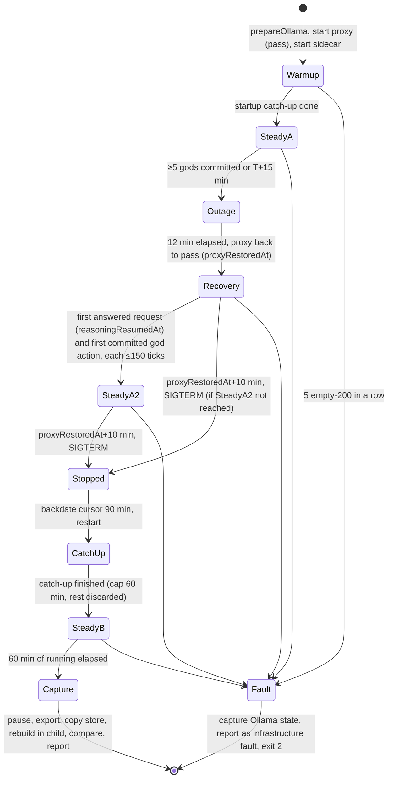

# feat: M2 unattended one-hour run, exit gate, and workload baseline

## Overview

This plan builds Unit 13 of the M2 plan (`docs/plans/2026-09-29-001-feat-m2-autonomous-greek-cast-plan.md`). The run is one world for one hour on the granite3.3-8b-4k baseline: seven gods and twenty mortals, with a scripted provider outage and recovery and a scripted stop with a catch-up gap and restart. At the end the harness captures the archive and checks that a rebuilt world equals the live one. It writes one report for the owner to read and rate, with a threshold table that decides whether M2 exits. A failed run is kept as evidence.

## Problem Frame

The existing gate (`--episodes`) runs several fresh five-minute worlds. Each one is polled, stopped and then deleted (`tools/scenarios/m2-greek-cast/src/real.ts`, `collectRun`). That cannot show what M2's exit requires:
- one world staying lively and stable for an hour;
- surviving a provider outage, a restart and a capped catch-up;
- the ADR-0005 workload baseline: Ollama memory, archive size, rebuild time, and rebuilt-equals-live.

The per-turn and per-god measurements mostly exist. The single-world lifecycle, the injections, the end capture and the exit report do not.

## Requirements Trace

- R1. One world runs unattended for 60 minutes on the baseline model, with seven gods and twenty mortals. After start, no operator acts except the scripted harness (O08; acceptance "one-hour observation trial").
- R2. A scripted provider outage runs through a local proxy and is then restored. While it lasts, ticks, routines and the director keep running, and no god action commits. After the proxy is restored, a model request is answered again and a god action commits again (P07, local endpoint only; W06, W10; acceptance A13).
- R3. A scripted stop, a 90-minute gap, then a restart. Catch-up applies the 60-minute cap and discards the rest, makes no provider request while it runs, and leaves a summary that survives the restart (O03; acceptance A08).
- R4. End capture: export an archive, rebuild from genesis and the event log in a separate process, and confirm rebuilt equals live. Record archive and store bytes and rebuild time (O01, O08; ADR-0005 workload baseline). This is the export and rebuild part of A14, not all of it.
- R5. Memory: sample Ollama runner RSS, sidecar RSS and swap through the hour, as the workload baseline (O08, ADR-0005).
- R6. Report each god's participation and idle reasons, relationship and belief changes, legends and repetition, queue wait, longest quiet stretch and latency, director events by phase, and the knowledge-boundary checks (O04, W04, W09; acceptance one-hour trial).
- R7. A threshold table decides pass or fail. A run hit by Ollama's empty-response fault is marked an infrastructure fault, not a gate result. The owner rating sheet is filled in by hand (O08; acceptance rubric).

## Scope Boundaries

- No new game mechanics, and no rate, prompt or scheduler tuning.
- Not fixing the lack of demands or contests between gods (mortal-wrongs SC4 and SC5).
- Not the eight-hour endurance trial, any M4 image-generation concurrency, or the renderer running alongside.
- A15 (replay with inference off) is not claimed. Rebuild-equals-live is replay from the journal, which is part of A15 and not all of it.
- Killing the service mid-catch-up is not repeated here, because M1 S13 already proves it.
- Hosted providers are out: the run is local only.

## Context & Research

### Relevant Code and Patterns

- `tools/scenarios/m2-greek-cast/src/run.ts`, `args.ts`, `episodes.ts` and `real.ts` hold the episode gate, the arguments, Ollama warm-up (`prepareOllama`) and routing (`routingConfigFor`). `collectRun` polls `/frame` every 2 s and deletes its store in `finally`.
- `tools/scenarios/m1-living-world/src/sidecar.ts` (`startSidecar`, stop with a signal) and `m2-greek-cast/src/story.ts` (`restart` on the same data directory) are the sidecar drivers.
- `m2-greek-cast/src/steps/s10-catch-up.ts` backdates the cursor, restarts, and checks that no provider request falls between catch-up start and finish. `m1-living-world/src/steps/s14-archives.ts` covers export and import, and the refusal of a hostile archive.
- `apps/simulation/src/catchup.ts`: the cap bounds the remaining backlog, and progress and the summary are persisted. `apps/simulation/src/agents.ts` runs one inference at a time, and a pending journal entry blocks a god's next turn. `apps/simulation/src/server.ts`: an exhausted route sets `modelDegraded`, and ticks keep running.
- `packages/agents/src/router.ts` uses a 45 s attempt and a 60 s chain timeout with 2 attempts, and retries network and 5xx failures.
- `packages/persistence/src/archive.ts` (`exportArchive`, and `importArchive`, which already checks that the rebuilt projection equals the archived one) and `store.ts` (`rebuildProjections`).
- Analysis already in place:
  - `request-timing.ts` (`p95GapTicks`, per-request table);
  - `episode-analysis.ts` (`influencedBy`, repetition, minimum activity);
  - `real-analysis.ts` (exhaustion reasons, perception compliance, dispositions);
  - `gate-analysis.ts`;
  - `transcript.ts` (`renderWorldNotes` with director lines, the rubric, `QUEUE_WAIT_P95_TARGET_SECONDS` of 90).
- `tools/probes/inference-baseline/src/run.ts` (`findOllamaRunnerPids`, `resolveRssPids`, `pollExternalRss`) samples the runner child that Ollama respawns, not `ollama serve`.

### Institutional Learnings

- Count every proposal's outcome, not only the commits (`docs/solutions/logic-errors/whole-entity-revision-pins-refused-petition-answers-2026-10-02.md`).
- Every absence claim needs a positive control that makes the check fail (`docs/solutions/best-practices/end-to-end-scenario-with-positive-controls-2026-09-28.md`).
- Ollama RSS lives in the runner child. Resolve that child again on every poll (`docs/solutions/performance-issues/ollama-runner-pid-rss-sampling-2026-09-27.md`).
- A 4K prompt truncates silently. Measure the busiest prompt before blaming the model (`docs/solutions/best-practices/ollama-4k-prompts-truncate-silently-2026-10-03.md`).
- Catch-up summaries come from committed rows and are stored at the commit that ends the catch-up (`docs/solutions/best-practices/catch-up-cap-per-backlog-not-per-run-2026-09-28.md`).
- Rebuild-equals-live must run in a fresh process that shares nothing with the writer (`docs/solutions/integration-issues/world-persistence-composition-broken-after-reopen-2026-09-27.md`).
- Bucket exhaustion reasons before drawing a conclusion (`docs/solutions/logic-errors/move-realm-transition-destination-pairing-2026-10-02.md`).
- No solution doc covers Ollama's empty-200 fault. It was observed on granite3.3 on 2026-10-07: episode 3 of `tools/scenarios/m2-greek-cast/episodes/2026-10-07T18-48-15/` lost 124 of 145 requests.

## Prior-Art Survey

```json
{
  "schema_version": 2,
  "verdict": "extend",
  "scope": "tools/scenarios/m2-greek-cast, tools/scenarios/m1-living-world, apps/simulation, packages/{agents,persistence,world}, tools/probes/{inference-baseline,god-latency,catchup-bench}",
  "freshness": {
    "vcs_reference": "main@c82cc2f"
  },
  "budget": {
    "max_search_passes": 3,
    "max_candidate_inspections": 10,
    "exhausted": false
  },
  "candidates": [
    {
      "path_or_symbol": "tools/scenarios/m2-greek-cast/src/run.ts + episodes.ts + real.ts",
      "description": "scenario:m2 entry, episode gate orchestration, Ollama warm-up, routing config, request/proposal/event collection from a temporary store",
      "disposition": "extend"
    },
    {
      "path_or_symbol": "tools/scenarios/m2-greek-cast/src/request-timing.ts + transcript.ts",
      "description": "per-request timing, per-god p95GapTicks queue wait, latency and prompt-size reporting, the 90 s target, transcript and summary rendering with the owner rubric",
      "disposition": "extend"
    },
    {
      "path_or_symbol": "tools/scenarios/m2-greek-cast/src/episode-analysis.ts + real-analysis.ts + gate-analysis.ts",
      "description": "influence, repetition, minimum activity, petition checks, perception compliance, dispositions, exhaustion reasons, food and wrong metrics",
      "disposition": "extend"
    },
    {
      "path_or_symbol": "tools/scenarios/m1-living-world/src/sidecar.ts + m2-greek-cast/src/story.ts + steps/s10-catch-up.ts",
      "description": "compiled sidecar start/stop/restart on one data dir, cursor backdate, catch-up bracket check with no provider requests",
      "disposition": "reuse"
    },
    {
      "path_or_symbol": "apps/simulation/src/catchup.ts + agents.ts + server.ts",
      "description": "capped catch-up with persisted progress and summary, one-at-a-time god turns, model-degraded status that never halts ticks",
      "disposition": "reuse"
    },
    {
      "path_or_symbol": "packages/persistence/src/archive.ts + store.ts",
      "description": "exportArchive, importArchive with projection equality check, rebuildProjections from genesis and event log",
      "disposition": "reuse"
    },
    {
      "path_or_symbol": "tools/probes/inference-baseline/src/run.ts",
      "description": "Ollama runner-child RSS resolution and polling (findOllamaRunnerPids, resolveRssPids, pollExternalRss)",
      "disposition": "extend"
    },
    {
      "path_or_symbol": "tools/probes/catchup-bench",
      "description": "one-hour catch-up timing and replay-equals-live over the seven-god pack",
      "disposition": "reuse"
    }
  ],
  "excluded_scopes": [
    {
      "scope": "apps/client, apps/desktop",
      "reason": "The run drives the compiled sidecar directly; the renderer is not co-resident in this baseline."
    },
    {
      "scope": "tools/probes/art-local*, tools/studio",
      "reason": "Image-generation concurrency is measured against this baseline later (M4), not here."
    }
  ]
}
```

## Key Technical Decisions

- **One single-world mode, `--unattended`, on the existing harness.** This is not `--episodes=1 --episode-seconds=3600`, because that path deletes its store and injects nothing. The mode owns one data directory under the run's evidence folder and keeps it.
- **The outage runs through a local pass-through proxy (owner, 2026-10-07).** The harness points routing at a small Bun proxy in front of Ollama, then switches it to fail every request fast and back again. The outage stays separate from the restart, `ollama serve` stays up so memory sampling keeps working, and an outage longer than Ollama's 10-minute keep-alive measures a real cold reload.
  - Note (2026-10-08): the 10 minutes apply only to the harness's warm request. The gods' requests take Ollama's default keep-alive, which unloaded the runner after about 5 minutes on this machine. A 12-minute outage still crosses it. The report records whether the runner was present at `proxyRestoredAt` and the first request's latency after it, and quotes no keep-alive figure.
- **The proxy also detects the empty-200 fault.** It records each response's status, latency and whether the body is the empty shape: HTTP 200 with `"model":""` and the zero `created` date. It records no prompt or completion text. Five empty-shape responses in a row, in any phase, mark the run an infrastructure fault (owner, 2026-10-07). The harness then stops, captures Ollama's `/api/ps`, the tail of the server log and memory, writes the report marked as a fault, exits 2, and is rerun. Exit 2 means only this. Every gate fail exits 1, including a process that dies.
- **Phases are triggered by condition and bounded by time.** The outage starts once at least 5 of the 7 gods have committed an action, or at 15 minutes, whichever comes first. It lasts 12 minutes and ends at `proxyRestoredAt`, when the proxy passes requests again. The stop comes 10 minutes after `proxyRestoredAt`. The gap is 90 minutes, which crosses the 60-minute catch-up cap (owner, 2026-10-07). The run ends after 60 minutes of running time, which counts the time the sidecar is up and not the stopped gap. The report prints both running time and elapsed wall time. Every boundary is recorded as wall time and tick.
- **Queue wait leaves out only the windows with no service (owner, 2026-10-07).** The gate's p95 per god is computed outside two windows: from the outage start to `proxyRestoredAt`, and from the stop to the end of catch-up. Waiting after the proxy is restored counts. The p95 including those windows is reported beside it. Without the second exclusion, the catch-up's 3,600 ticks would count as one god's wait.
- **Memory is recorded, not gated by a number (owner, 2026-10-07).** The harness samples Ollama runner RSS, sidecar RSS and swap every 10 s, and records store and archive bytes. The run fails on memory only if a process dies, or if sidecar RSS keeps rising through the last 20 minutes instead of levelling off. Levelling off means the last 20 minutes' least-squares slope is under 1% of the mean per 10 minutes. The figures become the ADR-0005 baseline.
- **Rebuild-equals-live runs out of process, on a copy.** After pause and export, the harness copies the stopped store and rebuilds projections from genesis and the event log in a child process. It times that, then compares canonical JSON of the rebuilt and live projections. Importing the exported archive into a scratch slot is a second proof, because import refuses a mismatched projection.
- **Per-god thresholds are the existing checks, unchanged, plus one hour-scale check.** Minimum activity, repetition and influence run over the hour, with the outage window left out of minimum activity. Constants are not rescaled, per the rule against tuning. The new check (owner, 2026-10-07): each god's longest stretch of service time with no request is at most 300 ticks. That stretch includes the one from its last request to the end of the run, and leaves out the no-service windows. 300 ticks is about three times the worst gap measured (68–108 ticks). Without it, a god could meet minimum activity early and sit idle for the rest of the hour.
- **Knowledge boundary is every existing privacy property.** The row covers perception compliance, goal privacy and petition privacy, and fails if any one fails (W04).
- **Recovery is two rows, model and world.** "Reasoning resumes" is the first post-restore model request answered with an intent, not exhausted, within 150 ticks of `proxyRestoredAt`; that time is `reasoningResumedAt`. "Gods act again" is the first committed god action after `proxyRestoredAt`, reported with its tick and gated at the same 150 ticks. A world rejection such as `stale-target` fails only the second row. The basis for 150: the worst per-god gap measured is 68–108 ticks, plus one cold reload.
- **Idle reasons come from stored requests and proposals only.** The categories are:
  - exhausted, split into outage, empty-200, timeout and invalid output;
  - rejected, by reason;
  - goal-only;
  - in flight at the stop;
  - no request in a window.

  Scheduler skips aren't journaled, so "never scheduled" is inferred from the absence of requests and labelled as inferred.
- **A shortened mode for development.** `--unattended-minutes=N` scales the running phases in proportion so implementers can iterate in minutes. The 90-minute gap is not scaled, because the catch-up cap is a world rule and catching up 60 minutes takes seconds. The gate verdict is only rendered at 60. A shorter run prints a non-gate report.

## Open Questions

### Resolved During Planning

- **Queue-wait target:** 90 s p95 per god, from the ADR-0005 2026-10-05 amendment. The 30 s line in the M2 plan's Unit 13 is history.
- **Outage mechanism, empty-200 verdict, memory gating, gap length, queue-wait windows:** decided by the owner on 2026-10-07, as recorded above.
- **Crash-safe catch-up summary dependency:** already merged (#57, `167450e`).
- **Who starts the run:** a documented manual step on a quiet machine, with other apps closed, Ollama running and nothing heavy alongside. An agent may start it only after the owner confirms the machine is ready.

### Deferred to Implementation

- **How the RSS helpers are shared.** Either import them from the probe by a workspace-relative path, or move them into the scenario and have the probe import them. Either way there's no new dependency and no lockfile change.
- **The proxy's fail mode.** Closing the connection or returning 503: pick whichever the router classifies as retryable `network` or `5xx`. Record the choice in the report.
- **Prompt tokens.** Whether the request rows already carry Ollama's prompt token count, or the proxy should read `prompt_eval_count` from the response. Either way, report the busiest prompt's tokens against 4,096.

## High-Level Technical Design

> *This illustrates the intended approach and is directional guidance for review, not implementation specification. The implementing agent should treat it as context, not code to reproduce.*



## Implementation Units

- [x] **Unit 1: Outage proxy and empty-200 detection**

**Goal:** a pass-through proxy that the harness can switch between passing requests, failing them, and passing them again. It classifies every response without keeping any content.

**Requirements:** R2, R7

**Dependencies:** none

**Files:**
- Create: `tools/scenarios/m2-greek-cast/src/outage-proxy.ts`
- Test: `tools/scenarios/m2-greek-cast/src/outage-proxy.test.ts`

**Approach:**
- Bun serves the proxy on a loopback port and forwards every request to the Ollama base URL, streaming the response.
- `fail()` makes every new request fail fast and aborts the ones in flight. `pass()` restores forwarding.
- For each response it records the tick-free wall time, status, latency, whether the body has the empty shape, and `prompt_eval_count` if present. It never records prompt or completion text.
- It counts empty-shape responses in a row and calls back at 5.

**Execution note:** test-first, against an in-process fake upstream.

**Test scenarios:**
- Happy path: a request forwards to the fake upstream, and the response arrives unchanged.
- Error path: after `fail()`, a request fails in a way the router classifies as retryable, and after `pass()` the next request succeeds.
- Edge case: a request in flight when `fail()` is called is aborted, and a later request is not.
- Happy path: a 200 with `"model":""` and the zero `created` date is classified as empty. A normal completion is not.
- Edge case: four empty responses then a normal one reset the run counter, and five in a row fire the callback once.
- Privacy: the response record carries no prompt or completion text and no host.

**Verification:** the proxy tests pass, and the router run against the proxy sees `fail()` as a retryable failure.

- [x] **Unit 2: Memory sampler**

**Goal:** sample Ollama runner RSS, sidecar RSS and swap every 10 s, and summarize the samples into a baseline.

**Requirements:** R5

**Dependencies:** none

**Files:**
- Create: `tools/scenarios/m2-greek-cast/src/memory.ts`
- Modify: `tools/probes/inference-baseline/src/run.ts` (only if the RSS helpers are moved; see Deferred)
- Test: `tools/scenarios/m2-greek-cast/src/memory.test.ts`

**Approach:**
- Resolve the runner child of `ollama serve` again on every sample.
- Read sidecar RSS from its pid, and swap from `vm.swapusage`.
- Record only the pid and numbers, never command lines.
- The summary gives the start, peak, end and the slope over the last 20 minutes.

**Test scenarios:**
- Happy path: given a fake process table, a new runner child after a reload is picked up on the next sample.
- Edge case: when no runner is present during an unload, the sample records the runner as absent rather than 0 or the supervisor's RSS.
- Happy path: a flat series gives a slope under the threshold, and a steadily rising one gives a slope over it.
- Edge case: a series shorter than the 20-minute window reports that the slope can't be judged rather than passing.

**Verification:** the sampler tests pass. A short run of the development mode logs real runner RSS within a few percent of Activity Monitor's figure for the runner.

- [x] **Unit 3: Unattended run driver**

**Goal:** `--unattended` drives one world through the phases and keeps every artifact.

**Requirements:** R1, R2, R3, R7

**Dependencies:** Units 1 and 2

**Files:**
- Create: `tools/scenarios/m2-greek-cast/src/unattended.ts`
- Modify: `tools/scenarios/m2-greek-cast/src/args.ts`, `src/run.ts`, `src/real.ts` (keep-store option, routing base URL), `src/provider.ts` (a raw-response reply mode, so a test can return the empty shape: HTTP 200 with `model: ""` and the zero `created` date)
- Test: `tools/scenarios/m2-greek-cast/src/unattended.test.ts`, `src/args.test.ts`

**Approach:**
- Warm up the model, start the proxy and the sampler, and start the sidecar with routing pointed at the proxy.
- Poll `/frame` every 2 s and record each phase boundary as wall time and tick.
- Run the phases as in the design. For the stop and restart, reuse the S10 cursor backdate and `restart` on the same data directory.
- After the gap, record the catch-up summary from the committed row.
- The empty-200 callback leads to the infrastructure-fault path (exit 2). A process that dies is recorded, the harness captures what it can, and the gate fails (exit 1).
- Write the store, the frames, the proxy records and the memory samples under the run folder. Nothing is deleted.
- `--unattended-minutes` scales the phases. The arguments refuse `--unattended` together with `--episodes` or `--real`.

**Execution note:** build and iterate against the scripted provider (`src/provider.ts`) and `--unattended-minutes=6`. Run the one-hour real run only in Unit 6.

**Test scenarios:**
- Happy path: a 6-minute run on the scripted provider produces all phase markers in order, a catch-up summary showing 60 minutes applied and 30 discarded, and a kept store.
- Integration: no provider request falls between catch-up start and finish, the same check as S10.
- Error path: a scripted provider returning the empty shape five times in a row ends the run as an infrastructure fault with exit 2 and a report.
- Edge case: if fewer than 5 gods have acted by the time bound, the outage still starts at the time bound and the report says so.
- Error path: the sidecar killed mid-run ends the run with exit 1, a report marked failed, and the kept store.
- Args: `--unattended` with `--episodes` is refused, and `--unattended-minutes` without `--unattended` is refused.

**Verification:** the development-mode run on the scripted provider completes all phases in about 6 minutes and leaves a full evidence folder.

- [x] **Unit 4: End capture and workload baseline**

**Goal:** export, rebuild out of process, compare, time and size.

**Requirements:** R4, R5

**Dependencies:** Unit 3

**Files:**
- Create: `tools/scenarios/m2-greek-cast/src/baseline.ts`
- Test: `tools/scenarios/m2-greek-cast/src/baseline.test.ts`

**Approach:**
- Pause the sidecar, export the archive into the run folder, then stop it.
- Copy the store and its WAL. A child process opens the copy and times `rebuildProjections`, then compares the canonical JSON of the rebuilt projection against the live one.
- Import the archive into a scratch slot as a second proof.
- Record the bytes of the store, WAL and archive, the rebuild milliseconds, the event count and equality.

**Execution note:** test-first for the comparison, including its positive control.

**Test scenarios:**
- Happy path: on a short real-store world, the rebuilt projection equals the live one, and the bytes and time are recorded.
- Positive control: a copy with one event row altered gives inequality, and the import is refused with a reason about the event log.
- Edge case: a run that ended as a fault still captures what it can, and marks the missing parts as missing rather than failed.

**Verification:** the baseline tests pass, and the development-mode run's report carries all baseline fields.

- [x] **Unit 5: Run report and threshold table**

**Goal:** a report the owner can read and rate without opening the database.

**Requirements:** R2, R3, R6, R7

**Dependencies:** Units 3 and 4

**Files:**
- Create: `tools/scenarios/m2-greek-cast/src/unattended-analysis.ts`, `src/unattended-report.ts`
- Modify: `src/request-timing.ts` (excluded windows), `src/transcript.ts` (shared renderers only)
- Test: `tools/scenarios/m2-greek-cast/src/unattended-analysis.test.ts`, `src/unattended-report.test.ts`

**Approach:** the report has these sections:
- a phase timeline;
- per-god participation, with idle reasons including the inferred absences;
- relationship and belief changes per god, by phase, through `influencedBy` unchanged;
- legends and repetition;
- queue wait per god, excluding and including the no-service windows;
- each god's longest quiet stretch, with the stretch from its last request to the end of the run shown;
- latency, steady and on the first request after recovery, kept separate;
- recovery: `proxyRestoredAt`, `reasoningResumedAt`, and the first committed god action;
- the busiest prompt's tokens against 4,096;
- the empty-200 count;
- director events by kind and phase;
- outage-window checks: tick, routine and director events continue, no god action commits, reasoning resumes within 150 ticks, and gods act again within 150 ticks;
- catch-up: applied and discarded, and no provider requests during it;
- the knowledge boundary: perception compliance, goal privacy and petition privacy;
- the memory baseline, and the rebuild and archive line;
- the threshold table;
- the owner's rating sheet, with the rubric, director-caused and god-caused episodes scored separately;
- running time and elapsed wall time.

The threshold table's verdict is PASS, FAIL or INFRASTRUCTURE FAULT, and it lists each threshold with its measured value. M2 exits only on PASS plus the owner's approval of the rated episodes. The report states what it proves: the local outage only for P07, and export and rebuild only for A14.

**Execution note:** each absence check gets an in-process positive control on synthetic run data.

**Test scenarios:**
- Happy path: synthetic run data inside every threshold renders PASS with every row filled.
- Positive control: an event committed by a god inside the outage window fails "no god action during outage".
- Positive control: a window with no routine or director events fails "routines continue".
- Positive control: no answered request within 150 ticks of `proxyRestoredAt` fails "reasoning resumes". Answered requests whose proposals are all rejected pass "reasoning resumes" and fail "gods act again".
- Positive control: a god whose last request is 400 service ticks before the end fails the longest-quiet-stretch row. The same gap inside a no-service window does not.
- Positive control: a provider request between catch-up start and finish fails the catch-up check.
- Positive control: a perception-compliance violation, a goal-privacy violation and a petition-privacy violation each fail the knowledge-boundary row.
- Edge case: a 3,600-tick catch-up gap is excluded from queue wait. The same data without the exclusion gives the larger figure, shown as the inclusive line.
- Edge case: a slow first request after `proxyRestoredAt` counts in the gate's queue wait.
- Edge case: an inferred "no request" idle reason is labelled as inferred.
- Edge case: a development-length run renders the report with the verdict "not a gate run".
- Privacy: the report contains no host, port or key reference, only "a local OpenAI-compatible endpoint".

**Verification:** the analysis and report tests pass. The development-mode report reads end to end, and every positive control fails its own row.

Status (2026-10-08): Units 1–5 are built on `feat/unattended-run`. A 6-minute scripted development run went through every phase and rendered "not a gate run". Where the build differs from the plan:

- **RSS helpers:** they come from `tools/probes/coexistence/src/sample.ts`, which already exports them with an injectable command runner. The `inference-baseline` copies are private to its entry file. No probe file changed.
- **`real.ts`:** it needed no keep-store or base-URL change. `routingConfigFor` gained only an explicit local kind, so the proxied run is labelled local rather than hosted.
- **Catch-up check:** the sidecar can run a second short catch-up pass that overwrites the persisted summary. The "applies the cap and discards the rest" row reads the journal and the settled tick, and reports the number of passes.
- **Provider subset:** `--steps` accepts only the staged steps S21–S27, so the provider change was checked with S21, S23 and S24.
- **Development flag:** `--scripted=answer|empty-200` drives the unattended mode with the scripted provider. No gate uses it.
- **Store:** the kept store and archive are git-ignored under `unattended/`. The report, run record, frames, proxy records and memory samples stay committable.

- [ ] **Unit 6: Procedure, the run, and the M2 decision**

**Goal:** a documented procedure, one real hour on a quiet machine, the committed evidence and the owner's decision.

**Requirements:** R1–R7

**Dependencies:** Units 1–5 merged

**Files:**
- Modify: `tools/scenarios/m2-greek-cast/README.md` (unattended section: machine preparation, command, reading the report)
- Modify: `docs/plans/2026-09-29-001-feat-m2-autonomous-greek-cast-plan.md` (Unit 13: a dated note pointing here; the threshold history)
- Modify: `docs/product/traceability.md` (O08, O03, O01, P07, W06, W10)
- Modify: `docs/product/defaults.md` (the memory row's "set from the M2 unattended run" values, if the owner sets them)
- Modify: `docs/product/mvp-roadmap.md` (an M2 outcome only after a pass)
- Create: the evidence folder under `tools/scenarios/m2-greek-cast/unattended/<timestamp>/` (report, archive size record, memory series; the store itself is kept locally and not committed if it is large)

**Approach:**
- The owner prepares the machine and confirms it is ready. Then the hour runs once on granite3.3-8b-4k.
- An infrastructure-fault result is committed as evidence and rerun.
- A gate fail is committed as evidence, with the reasons bucketed, and goes to the owner. Nothing is tuned to pass.
- The owner rates the episodes on the sheet, and the M2 decision is recorded.

**Test expectation:** none. This unit produces evidence and a decision.

**Verification:** the report, the threshold table and the owner's rating are committed. The roadmap records an M2 outcome only after a pass.

Status (2026-10-08): the procedure is in the m2 README, generated from `report.ts`. The first real hour ran on granite3.3-8b-4k on a quiet machine: load about 2 and swap about 1 GB at the start (`tools/scenarios/m2-greek-cast/unattended/2026-10-08T10-35-26/`). The run went through every phase in 60.0 running minutes, with no empty responses. It exited 1, FAIL, with 4 of 24 threshold rows failed.

**Held:**
- **Outage:** routines and the director produced 19,121 events, and no god action committed. Reasoning resumed 12 ticks after the proxy was restored, and a god acted after 13.
- **Catch-up:** it applied 60.1 minutes and discarded 30.1 over 2 passes, with no provider request during it.
- **Per-god checks:** every god held minimum activity, repetition and influence.
- **Knowledge boundary:** all three checks held.
- **Rebuild:** it equals the live world, 202,162 events in 496 ms. The store is 242 MiB and the archive 92 MiB.

**Failed in the world:**
- **Queue wait:** the p95 was 113–117 ticks for every god, against 90. Median latency rose from 8.4 s at about 1,750 prompt tokens in the first 10 minutes to 13–14 s at about 3,400 tokens from minute 30.
- **Sidecar memory:** it did not level off, rising 5.82% per 10 minutes over the last 20 minutes (61 MiB at the start, 243 MiB at peak, 135 MiB at the end).

**Failed in the harness:** "the catch-up summary is still the summary at the end" assumed one catch-up pass, and "the run went through every phase" failed only through it.

**At the limit:** the busiest prompt was 4,094 of 4,096 tokens, with 10 responses at 4,000 or more. The prompt budgets are in characters measured on qwen3's tokenizer.

The owner chose to fix the harness row and to investigate the prompt budget on granite3.3, the cause of the queue wait, and the sidecar's memory growth before any rerun. Nothing was tuned. The rating sheet is unfilled. M2 does not exit on this run.

Status (2026-10-08, rows corrected after the first hour): four gate checks were wrong or blind, and were corrected on a branch before any rerun. Nothing about the model, the prompts or the thresholds changed. The hour was judged again from its kept store (`tools/scenarios/m2-greek-cast/unattended/2026-10-08T10-35-26/`):

- **Catch-up summary row:** it now accepts a summary that a later pass replaced. On the kept store the final summary is at sequence 187,062, after the catch-up's, and the journal still holds the same 30.1 minutes discarded, so the row holds. That also clears "the run went through every phase". The stored `run.json` still carries the old verdict for both, because the check ran when the hour did.
- **Queue wait and quiet stretch:** they count only requests the model answered. The 721 requests the outage proxy refused sat 0 to 1 service ticks apart and made 715 of 928 gaps, which pulled the p95 down. Per god, the p95 was 113–117 ticks and is 124 (athena), 126 (hades), 129 (hephaestus), 133 (hera), 131 (hermes), 134 (poseidon) and 133 (zeus), against 90. The longest quiet stretch is unchanged at 135 ticks (hera), under 300.
- **Prompt size:** the largest token count cannot show a cut prompt, because Ollama cuts an over-long prompt and reports what is left, exactly 2,050 tokens on this 4,096-token context. The row now also fails when a response matched to its request reports far fewer tokens than its prompt's length predicts from the run's own median (0.329 tokens a character, a cut at under 70% of it). The length decides, not the count: a prompt can genuinely be 2,050 tokens, and an ordinary one at that count is not cut. A response at exactly 2,050 with no prompt length to read it against (no request matched to it, or too few matched to calibrate a median) has only the count to go on, so it is named as suspected in the report, with its god when known, and does not fail the row. Nine responses were cut, athena 8 and hephaestus 1, all with prompts of 11,962 to 12,371 characters, so the row that passed on 4,094 now fails. 232 of the hour's 233 responses were matched to a request, and none was suspected. The length signal does not depend on a model's tokenizer or on Ollama's cutting rule.
- **Memory:** the row now judges the sidecar's physical footprint (`footprint -p`), with RSS reported beside it. RSS counted pages the allocator had freed and the kernel had not taken back: in process, over 16,000 ticks, the JS heap stayed at 12–13 MiB and the footprint at 77–82 MiB while RSS rose to 459 MiB. The first hour recorded RSS only, so its footprint was never measured and its row reads not judgeable, which fails it. The 5.82% per 10 minutes stays on record as the RSS trend.

Re-judged, the hour still fails, now on three rows: queue wait (124–134 ticks against 90), prompt size (9 cut responses) and memory (not judgeable). A rerun is needed for the footprint, and the queue wait and the cut prompts are the model's and the prompts' to answer, not the harness's.

Status (2026-10-08, second hour, with the prompt cap): the hour was rerun on granite3.3-8b-4k from `main` at `459a459`, with the runtime prompt cap (#176) in place (`tools/scenarios/m2-greek-cast/unattended/2026-10-08T22-59-35/`). Load was 1.0–1.9 at the start and rose to 3.5–4.6, from the model server, Spotlight indexing and media analysis. Swap peaked at 2.07 GB. The run went through every phase in 60.1 running minutes, with no empty responses. It exited 1, FAIL, on 3 of 24 rows.

**Held:**
- No prompt was cut. Real prompt tokens: median 2,729, p95 2,845, maximum 3,002 (one request), against a first-hour median of 3,343 with 9 cut.
- Recovery: a god acted 15 ticks after the proxy returned.
- Catch-up: 60.1 minutes applied, 30.1 discarded, no provider request inside it.
- Activity, influence and repetition held for all seven gods.
- Perception, goal and petition privacy held.
- Rebuild equals live: 203,387 events in 515 ms.
- Archive import held.

**Failed:**
- **Queue wait:** p95 102–108 ticks for six gods and 286 for Zeus, against 90.
  - Steady latency had a median of 11.0 s and a p95 of 14.4 s. At the same prompt size it drifted from 9.3 s (minutes 12–25) to 12.1 s (minutes 55–60) as load rose.
  - 59% of rounds had 8 picks, because a god that owes goes ahead of the round.
  - Modelled from this run's latencies, p95 is about 91 on a quiet machine and 108 loaded. Meeting 90 needs a mean of about 8.8 s per request.
- **Longest quiet stretch:** Zeus went 375 ticks (6363–6738), against 300.
  - The stretch, and his 286 p95, come from 5 turns skipped as `prompt-over-cap`. Athena had 1.
  - A skipped turn changes nothing, so the same state recurred until a shorter prayer replaced the kept one.
  - What could not be shed: a 96-character goal-history row whose memory was outside the shown memories, and the practice digest repeating the kept prayer's offer.
  - One id-dense request ran at 2.807 characters a token, under the cap's 2.85, and reached 3,002 tokens.
- **Memory:** the sidecar's footprint slope over the last 20 minutes was 2.61% per 10 minutes, against 1%.
  - The footprint sat in a noisy band of 100–133 MiB after the restart.
  - Noise alone moves a 20-minute slope by about ±1.8%, and the same data gives −1.65 to +4.34% depending on the window.
  - Retained heap after a forced GC grows about 0.15–0.2 MiB per 1,000 ticks. No leak was found, and a fast in-process run levelled off.

The owner chose to:
- make the over-cap stalls fixable: unshown goal-history rows shed in the memories tier, the digest stops repeating the kept offer, and granite3.3's ratio becomes 2.75;
- judge memory by comparing the two halves of the settled span after catch-up;
- keep the scheduler, which lets a god that owes go ahead of the round.

After those fixes, the hour is rerun once on a quiet machine. If queue wait is still over 90, the measured conflict goes to the owner with a proposed amendment to ADR-0005's target. The rating sheet is unfilled. M2 does not exit on this run.

## System-Wide Impact

- **Interaction graph:** the only production path exercised in a new way is the router meeting a failing endpoint mid-run, which is existing behaviour. Everything new lives in `tools/scenarios`. `apps/simulation` and the packages are unchanged unless the run finds a defect. A defect is fixed in a separate PR with a test.
- **Error propagation:**
  - a provider failure becomes an exhausted turn and degraded status, and ticks continue;
  - an empty-200 fault ends the run with exit 2;
  - a gate fail exits 1;
  - a dead process is recorded and fails the gate.
- **State lifecycle risks:** the run's store is kept on purpose. Large stores stay local, and the committed evidence carries their sizes and digests.
- **Unchanged invariants:**
  - the episode gate (`--episodes`) and the scripted story behave exactly as today;
  - offline mode still drops non-local endpoints;
  - no credential enters evidence.

## Risks & Dependencies

| Risk | Mitigation |
|------|------------|
| The empty-200 fault recurs, and the hour has to be rerun | Detection and capture of Ollama's state make the rerun cheap and the evidence useful. If it recurs, the fault is a finding for the owner. |
| Swap pressure on a 16 GB machine distorts latency | The run starts on a quiet machine, swap is recorded at start, peak and end, and memory gating is "no process dies, sidecar levels off" |
| The development mode passes but the hour finds a timing bug | Phases are condition-gated with time bounds, every boundary is recorded, and a failed hour is kept as evidence with its timeline |
| The report over-claims A14, A15, P07 or the eight-hour trial | The scope boundaries and the report wording name exactly what the run proves: export and rebuild for A14, a local outage for P07, no A15 claim, and one hour only |
| A large store bloats the repo | The store stays local. Only the report, the size and timing records and the memory series are committed. |

## Sources & References

- M2 plan, Unit 13: `docs/plans/2026-09-29-001-feat-m2-autonomous-greek-cast-plan.md`
- `docs/decisions/0005-model-providers.md` (the 90 s queue-wait amendment, the workload baseline, the 2026-10-07 granite3.3 baseline)
- `docs/product/acceptance.md` (the one-hour trial, A08, A13, A14, A15)
- Evidence that shaped decisions:
  - `tools/scenarios/m2-greek-cast/episodes/2026-10-07T18-48-15/` (the empty-200 fault);
  - `2026-10-07T20-12-37/` (the clean granite3.3 gate).
- Related PRs: #57 (crash-safe catch-up summary), #161 (Unit 12 director), #164 (clean granite3.3 gate), #165 (granite3.3 baseline)
