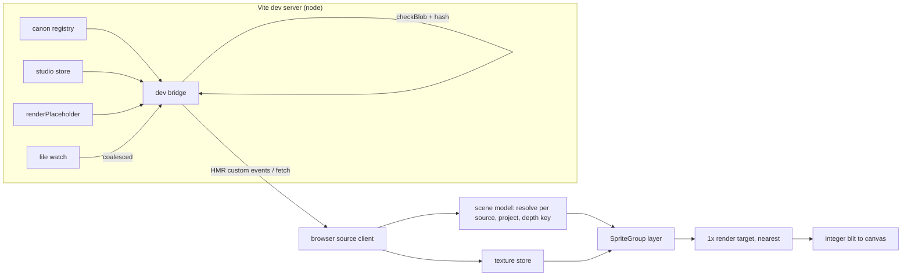

# feat: Studio isometric preview layer

## Overview

Create a minimal `apps/studio` web workspace with a studio-owned isometric preview. It renders at 1× logical pixels into a low-resolution target and upscales by an integer factor with nearest-neighbour filtering. Placement and depth order are computed by the studio, not by three-flatland's TileMap2D. Assets reach the browser through a dev-server bridge that reads the real canon registry and studio store, validates bytes and pushes changes for live reload. The Tauri unit later wraps this workspace and replaces the bridge with its command bridge.

## Problem Frame

Owner review of a draft needs to see it in a representative scene, at the game's real zoom levels, before approval. Today nothing draws an isometric scene: the client renders a radial marker layout with antialiasing and device-pixel-ratio scaling (`apps/client/src/renderer/scene.ts`). This is parent Unit 6 of `docs/plans/2026-10-03-001-feat-asset-studio-foundation-plan.md`. Unit 5 shipped the authoring pipeline and the first canon asset, the Zeus portrait. The Zeus idle sprite is deferred, so sprite previews show the placeholder or fixture data until an authored sprite exists.

## Requirements Trace

| ID | Obligation | Units |
| --- | --- | --- |
| R16 (origin) | Representative scene at integer zoom (2×, 3×, 4×) with nearest-neighbour upscale. Placeholders fill in for context, and drafts and approved sets can be previewed as well as canon | U2, U3, U4, U5 |
| R17 (origin) | A changed asset reloads without restarting the studio | U3, U4 |
| AE1 (origin) | Canon idle-south draws while a missing seated state draws the placeholder, with no error | U2, U3, U5 |
| U08, X02 (product) | Asset presentation and art evidence; update traceability notes | U5 |

Art-guide rules (`docs/product/art-guide.md` lines 11–25) are binding inputs:
- 64×32 tiles, with the diamond drawn 64×31;
- 16 px elevation step;
- depth order `x + y − z`, ties broken by layer: ground, decals, structures, actors, effects, speech;
- pivot at the midpoint between the feet, placed on the tile's bottom vertex.

## Scope Boundaries

- No Tauri shell, native capabilities, packaged build, CI change or CSP change. Packaged WKWebView proof belongs to the Tauri unit.
- No client adoption or shared renderer extraction (parent plan: coordinated in the packaged-client unit).
- No tile, structure or effect assets. Ground diamonds and context props are procedural or placeholder.
- No walk or facing-driven animation. An idle animation plays only frames already in a manifest.
- No studio request, queue or approval UI. The preview page is a minimal harness, and the real UI is the Tauri unit's design work.
- Unpacked working-set keyframes are not previewable. Only packed asset records (draft, approved, canon) are.

### Deferred to Separate Tasks

- Tauri command-bridge implementation of the asset source, and packaged WebGL2 and CSP proof: parent Unit 7.
- Real dual-grid tile sets in the preview: parent Unit 11.

## Context & Research

### Relevant Code and Patterns

- `apps/client/src/renderer/markers.ts`: SpriteGroup ownership. One group per renderer lifetime, and sprites are explicitly removed and disposed.
- `apps/client/src/renderer/lifecycle.ts`, `recovery.ts` and their tests: start, failure and device-loss reporting, silence after dispose, and fresh-canvas recovery.
- `packages/assets/src/resolve.ts` `resolveAsset`: per-state fallback to a deterministic placeholder, with a reason.
- `packages/assets/src/registry.ts`:
  - `loadRegistry` gives the canon snapshot;
  - `readRevision` gives a manifest plus atlas bytes;
  - `checkBlob` is the PNG integrity gate.

  All are node-only.
- `packages/assets/src/studio/store.ts`: `readAsset` and `readBlob` give packed draft and approved records, keyed by studio record id (not by `assetId`). Node-only, and it reads without taking the session lock.
- Neither `checkBlob` nor the store's `readAsset`/`readBlob` is exported today. `@panthea/assets/studio` exports `readStudioStatus`, `studioPaths` and `Store` types only.
- `packages/assets/src/placeholder.ts` `renderPlaceholder`: deterministic character placeholder PNG. Node-only.
- `packages/assets/src/fixtures.ts` `spriteFixture`: a real parsed sprite manifest (64×80 cell, idle-south) used for sprite cases.
- three-flatland 0.1.0-alpha.10, as installed:
  - TileMap2D types declare `isometric`, but `TileLayer` places tiles orthogonally;
  - Sprite2D `anchor`, `frame`, `sortLayer` and `zIndex` are real;
  - `zIndex` is 12-bit and sorted only within a batch;
  - the `pixel-art` texture preset is the default;
  - `Sprite2D.dispose()` never disposes textures.
- three r185:
  - `RenderTarget` defaults to linear filtering;
  - `WebGPURenderer` falls back to its WebGL2 backend and supports `forceWebGL`;
  - device loss latches `_isDeviceLost` with no recovery.

### Institutional Learnings

- `docs/solutions/integration-issues/three-webgpurenderer-device-loss-latch-2026-09-27.md`: recovery means a fresh canvas and a new renderer, never reuse of the same instance.
- `docs/solutions/integration-issues/wkwebview-webgpu-unavailable-macos-15-2026-09-26.md`: WebGL2 is the real baseline, so evidence runs that backend.
- `docs/solutions/integration-issues/koota-new-function-tauri-csp-2026-09-27.md`: the packaged CSP needs `'unsafe-eval'`. That's relevant to the Tauri unit, not this one.
- `docs/solutions/logic-errors/saved-pixel-previews-scaled-size-but-not-offset-2026-10-05.md`: scale offset and size from one grid, and verify by decoded pixels under integer division.
- `docs/solutions/logic-errors/client-view-presentation-against-invented-fixtures-2026-09-28.md`: test placement against real parsed manifests, not hand-built data.
- `docs/solutions/integration-issues/incomplete-pngs-pass-hash-and-header-checks-2026-10-04.md`: a matching hash doesn't prove an image is valid, so route every atlas through `checkBlob`.
- `docs/solutions/logic-errors/transparent-rgb-bytes-broke-grid-recovery-2026-10-05.md`: canonicalize RGB under alpha zero before deciding whether bytes changed.

### External References

- three.js manual, "How to use render targets", and the `webgpu_postprocessing_pixel` example. The bundled pixelation passes add edge detection, so a plain render-target blit is used instead.

## Prior-Art Survey

```json
{
  "schema_version": 2,
  "verdict": "build-new-within-scope",
  "scope": "apps/, packages/, tools/probes/",
  "freshness": { "vcs_reference": "3e27d5000dda5321f7ab02caa801c85761fca331" },
  "budget": { "max_search_passes": 4, "max_candidate_inspections": 12, "exhausted": false },
  "candidates": [
    { "path_or_symbol": "apps/client/src/renderer/scene.ts#createWorldRenderer", "description": "Radial world renderer with device-loss hooks, canvas marker textures and Sprite2D actors.", "disposition": "insufficient", "insufficiency_reason": "Antialiased, DPR-scaled radial layout; no isometric placement, depth key, low-resolution target, integer upscale, atlas loading or texture reload." },
    { "path_or_symbol": "apps/client/src/renderer/markers.ts#createMarkerLayer", "description": "One SpriteGroup per renderer with explicit sprite removal and disposal.", "disposition": "insufficient", "insufficiency_reason": "The lifetime pattern is followed, but it owns no projection, depth order, render target or reload." },
    { "path_or_symbol": "apps/client/src/renderer/lifecycle.ts#startSceneRenderer", "description": "Renderer start, failure and device-loss reporting with silence after dispose.", "disposition": "insufficient", "insufficiency_reason": "Pattern followed; unrelated to texture invalidation, reload or scene composition." },
    { "path_or_symbol": "tools/probes/renderer-webgl2/README.md", "description": "Packaged evidence for Flatland sprites with sortLayer/zIndex, TileMap2D and a hand-rolled pixel-perfect camera on WebGL2.", "disposition": "insufficient", "insufficiency_reason": "Evidence only; the probe source was removed and its TileMap2D use was orthogonal." },
    { "path_or_symbol": "tools/probes/webgpu-wkwebview/README.md", "description": "WKWebView exposes no navigator.gpu on macOS 15.", "disposition": "insufficient", "insufficiency_reason": "Backend evidence; owns no rendering component." },
    { "path_or_symbol": "packages/assets/src/resolve.ts#resolveAsset", "description": "Stable sprite id lookup with per-state placeholder fallback.", "disposition": "insufficient", "insufficiency_reason": "Selection semantics only; reused for fallback, but no bytes, textures, placement or reload." },
    { "path_or_symbol": "packages/assets/src/registry.ts#readRevision", "description": "Node-side canon manifest plus atlas bytes.", "disposition": "insufficient", "insufficiency_reason": "Reused by the bridge; filesystem-bound with no browser texture path or watcher." },
    { "path_or_symbol": "packages/assets/src/studio/store.ts#openStore", "description": "Node-side studio records and blobs.", "disposition": "insufficient", "insufficiency_reason": "Reused by the bridge for draft and approved records; no renderer-facing reload or texture lifecycle." },
    { "path_or_symbol": "packages/assets/src/studio/png/decode.ts#decodePng", "description": "Node-side PNG to RGBA decode.", "disposition": "insufficient", "insufficiency_reason": "Internal and node-only; the browser decodes with its own image pipeline." },
    { "path_or_symbol": "packages/contracts/src/assets.ts#SpriteManifest", "description": "Manifest vocabulary for cell, pivot, footprint, atlas and frames.", "disposition": "insufficient", "insufficiency_reason": "Data consumed by placement; implements no placement, order, rendering or reload." }
  ]
}
```

## Key Technical Decisions

- **Studio-owned projection, not TileMap2D.** The installed TileMap2D places tiles orthogonally whatever orientation it is given. Ground diamonds and sprites are Sprite2Ds placed by studio projection math.
- **Depth is one studio key applied as sprite z, with alpha-cutout depth testing.** Flatland's `zIndex` is 12-bit and sorts only within one batch, and sprites with different textures land in different batches. So painter order across textures can't rely on it. The studio computes a key from `x + y − z` of the footprint's bottom-vertex cell, then layer, then a stable entity order. It writes the key into position z, inside an orthographic near/far range. Binary alpha makes alpha-test cutout exact, so the depth test gives correct occlusion across batches. Coordinates outside the scene's supported range are refused, not clamped.
- **Fixed logical viewport and an exact integer canvas.** The low-resolution target is a fixed logical size with nearest filtering on both hops. The canvas backing store is exactly logical size × zoom, in device pixels, and its CSS size is backing ÷ device pixel ratio. So one canvas pixel maps to one device pixel, and there is no fit-to-window or fractional factor. Overflow scrolls or letterboxes in the page. The camera position is rounded to whole logical pixels.
- **The asset source is an interface, and the dev bridge is its first implementation.** The renderer depends only on an asset-source port: list, resolve per source, and subscribe to changes. In this unit, a Vite dev-server plugin implements it on the node side and pushes change events over Vite's own HMR channel. That adds no dependency, and HMR disposal tears the subscription down. The Tauri unit implements the same port over native commands.
- **The bridge is the single validation choke point.** Every manifest goes through the existing contract parser, which checks that frames sit inside the atlas and the pivot inside the cell. Every atlas passes `checkBlob`, its hash, and a check that its dimensions match the manifest, all on the node side before any push. A corrupt, partly written or inconsistent payload becomes a placeholder plus a reported problem, so the browser only ever receives validated payloads.
- **One source per selection, and fallback stays inside it.** A selection names its source: canon, draft or approved. Canon selections use the asset id. Draft and approved selections use the studio record id, which is unique, so no tie-break between records is needed; the listing shows each record's asset id and state. The bridge builds a snapshot for that source, and `resolveAsset` applies per-state fallback within it. A missing state falls back to the placeholder, never to another source.
- **A narrow node-only read API in `@panthea/assets`.** The bridge needs registry blob validation and store record reads that aren't exported today. Add read-only exports for them to the existing node-only subpaths, rather than deep imports or duplicated validation.
- **Portraits preview flat.** Portraits show in a flat panel at the same integer zoom, outside the isometric scene. The canon Zeus portrait proves the real path from registry through bridge and texture to screen. In-scene placement, depth and reload are proven with the real parsed fixture sprite manifest and atlas, labelled as a fixture, until an authored sprite exists.
- **The texture lifetime belongs to the layer.** A texture store creates, swaps and disposes textures. On reload it detaches the old texture from its sprites before disposing it. When the manifest revision is unchanged and the atlas keeps its size, image data is swapped in place. Any manifest change (frames, pivot, cell, timing) rebuilds the frames and re-places the sprite, whatever the atlas size. Events are coalesced through an injected scheduler; the window is a module constant, not a D23 tunable.
- **Device loss rebuilds from retained preview state.** The retained state is the selection (asset, source, state, direction or expression), the zoom, the camera origin and the last validated payloads. Recovery is a fresh canvas and a new renderer, as in the client, and events that arrive mid-rebuild apply to the rebuilt scene.
- **Workspace lockfile entry.** The owner approved it on 2026-10-08. `apps/studio` reuses packages already in the lock (three, three-flatland, react, vite), so only the workspace entry changes.

## Open Questions

### Resolved During Planning

- **TileMap2D verification:** its source shows that isometric orientation is declared in types but not implemented. One test records the orthogonal placement, so the finding comes from execution.
- **What a "draft" preview is:** a packed draft asset record. Working-set keyframes are out of scope.
- **Push transport:** Vite's HMR websocket with custom events.
- **Evidence backend:** the WebGL2 backend (`forceWebGL`) in a browser window, owner decision 2026-10-08. It is not packaged proof.

### Deferred to Implementation

- **Exact Flatland material flags for cutout plus depth writes.** Confirm in the browser check that two textures in two batches order correctly.
- **Logical viewport size and scene layout:** the ground patch size, Zeus's tile, and the context props.
- **Pixel readback API on the WebGL2 backend:** for example the render-target pixel readback against canvas pixels.

## Output Structure

    apps/studio/
      package.json, tsconfig.json, vite.config.ts, index.html
      src/main.tsx, src/App.tsx            minimal preview harness
      src/renderer/iso.ts, scene.ts        projection, depth key, scene composition (pure)
      src/renderer/textures.ts             texture store and swap
      src/renderer/preview.ts              renderer, render target, blit, recovery
      src/source/port.ts                   asset-source interface
      src/source/dev-bridge.ts             Vite plugin (node side)
      src/source/client.ts                 browser side of the dev bridge
      src/check/pixels.ts                  in-page pixel checks for evidence
    docs/evidence/asset-studio/unit6/      README and window-cropped screenshots

## High-Level Technical Design

> *This illustrates the intended approach and is directional guidance for review, not implementation specification. The implementing agent should treat it as context, not code to reproduce.*



## Implementation Units

- [ ] **U1: Studio workspace scaffold**

**Goal:** A buildable `apps/studio` Vite and React workspace that the root checks include.

**Requirements:** Enables everything else.

**Dependencies:** None.

**Files:**
- Create: `apps/studio/package.json`, `apps/studio/tsconfig.json`, `apps/studio/vite.config.ts`, `apps/studio/index.html`, `apps/studio/src/main.tsx`, `apps/studio/src/App.tsx`
- Modify: `bun.lock` (workspace entry only, owner-approved)

**Approach:**
- Mirror the scripts and tsconfig conventions of `apps/client`.
- Give the dev server fixed ports that differ from the client's, and bind it to localhost.
- Add no new external packages.

**Patterns to follow:** `apps/client/package.json`, `apps/client/vite.config.ts`, `tsconfig.base.json`.

**Test expectation:** none. This is scaffolding, covered by the typecheck and lint gates.

**Verification:** `bun install --frozen-lockfile` passes after the lock update, and `bun run check` includes and passes the workspace.

- [ ] **U2: Isometric math and scene model**

**Goal:** Pure placement, depth and composition logic, from resolved assets to drawable instances.

**Requirements:** R16, AE1.

**Dependencies:** U1.

**Files:**
- Create: `apps/studio/src/renderer/iso.ts`, `apps/studio/src/renderer/scene.ts`
- Test: `apps/studio/src/renderer/iso.test.ts`, `apps/studio/src/renderer/scene.test.ts`

**Approach:**
- Map tile coordinates (x, y, elevation) to logical screen pixels for 64×32 tiles, with 64×31 diamonds and a 16 px elevation step.
- Place a sprite by its manifest pivot on the bottom vertex of its footprint cell.
- Compute the depth key: depth, then layer, then stable entity order.
- Compose a scene from the resolver's per-state results: canon frames or the placeholder.
- Refuse out-of-range coordinates.

**Execution note:** test-first.

**Patterns to follow:** `packages/assets/src/resolve.ts` result shapes; `spriteFixture` for real manifests.

**Test scenarios:**
- Happy path: tile (0,0,0) and (1,0,0) diamonds abut with no seam row (64×31 rule). Elevation 1 lifts exactly 16 px.
- Happy path: the `spriteFixture` idle-south pivot (32,80) lands on the bottom vertex of its tile, and the offset and size come from one grid.
- Happy path: with a registry holding canon idle-south only, composing idle-south gives canon frames and composing seated gives the placeholder, with no error (AE1).
- Edge case: equal depth and layer resolve to a stable order that repeats across recompositions.
- Edge case: a tall sprite's height doesn't change its depth; only its footprint's bottom-vertex cell and elevation do. A 2×2 tall structure in front occludes an actor behind it.
- Edge case: elevation enters depth as `− z`. At the same x + y, a sprite one step up sorts before one at ground level, and the 16 px lift is applied to screen position only.
- Edge case: actor and structure at the same depth order by layer (structures before actors).
- Error path: coordinates outside the supported range are refused with a reason, not clamped.
- Integration: placement of TileMap2D tiles with orientation `isometric` is recorded as orthogonal, which documents the finding by execution.

**Verification:** placement, depth and fallback hold against real parsed manifests.

- [ ] **U3: Asset-source port and dev bridge**

**Goal:** Validated canon, draft, approved and placeholder bytes, with change events, behind one interface.

**Requirements:** R16, R17, AE1.

**Dependencies:** U1.

**Files:**
- Create: `apps/studio/src/source/port.ts`, `apps/studio/src/source/dev-bridge.ts`, `apps/studio/src/source/client.ts`
- Modify: `apps/studio/vite.config.ts` (register the plugin)
- Modify: `packages/assets/src/registry.ts` and `packages/assets/src/studio/index.ts` (narrow read-only exports), plus the public-surface test that pins `@panthea/assets/studio` exports
- Test: `apps/studio/src/source/dev-bridge.test.ts`

**Approach:**
- The port offers list, resolve and subscribe.
- Export what the bridge needs from the node-only subpaths: registry blob validation, and store record and blob reads by record id. Read-only, with no new behaviour.
- The bridge reads the canon registry (`loadRegistry`, `readRevision`), packed draft and approved records from the studio store by record id, and renders placeholders with `renderPlaceholder`.
- It parses every manifest with the contract parser, validates every atlas with `checkBlob`, its hash and its dimensions against the manifest, then builds a per-source snapshot for `resolveAsset`.
- It watches the registry and store roots, coalesces events through an injected scheduler, and pushes changes over HMR custom events.
- Endpoints are read-only and take asset ids, never file paths.
- The roots come from the studio config.

**Execution note:** test-first, with injected clock and watcher seams and temp roots. No real timers or servers (memory #8760).

**Patterns to follow:** `tools/content/src/assets.test.ts` temp-root fixtures; `packages/assets/src/studio` store reads.

**Test scenarios:**
- Happy path: the canon `zeus-portrait` from a copy of the committed registry resolves to its manifest and atlas.
- Happy path: a packed draft record in a temp studio store resolves for source `draft` by its record id. Its asset id under `canon` resolves only from the registry.
- Happy path: the listing shows two draft records for one asset id as two selections, each with its record id and state.
- Error path: an intact PNG whose dimensions don't match its manifest's atlas gives the placeholder and reports a problem.
- Happy path: a missing state within the selected source returns the placeholder with reason `missing-state`, and never the other source's frames.
- Error path: a truncated atlas whose recorded hash matches still fails `checkBlob`, gives the placeholder, and reports a problem.
- Error path: a missing registry index or store directory gives all placeholders plus a problem, not a throw.
- Edge case: five writes inside the coalescing window produce one change event, and the final bytes win.
- Edge case: a re-export whose only change is RGB under alpha zero produces no change event.
- Edge case: a draft published to canon while selected emits one change for the canon selection and none for a stale draft.
- Edge case: deleting an asset emits a change that resolves to the placeholder.
- Error path: a request for an unknown or malformed id is refused, with no filesystem access beyond the configured roots.

**Verification:** the browser can receive only validated bytes, and every listed failure becomes a placeholder plus a reported problem.

- [ ] **U4: Preview renderer and texture lifecycle**

**Goal:** A pixel-exact, live-reloading renderer that survives device loss.

**Requirements:** R16, R17.

**Dependencies:** U2, U3.

**Files:**
- Create: `apps/studio/src/renderer/textures.ts`, `apps/studio/src/renderer/preview.ts`
- Test: `apps/studio/src/renderer/textures.test.ts`, `apps/studio/src/renderer/preview.test.ts`

**Approach:**
- `WebGPURenderer` with a `forceWebGL` option and antialiasing off.
- A low-resolution `RenderTarget` with nearest min and mag filters, blitted to the canvas at the selected integer zoom with a nearest-filtered quad.
- The camera is rounded to whole logical pixels.
- One SpriteGroup per renderer.
- Textures are created from validated bytes with the pixel-art preset, with no premultiplication, so binary alpha survives.
- The texture store detaches the old texture before disposing it. An unchanged manifest with a same-size atlas swaps image data in place; any manifest change rebuilds the frames and re-places the sprite.
- Device loss recovers with a fresh canvas and a new renderer, rebuilt from the retained state.
- Events after dispose are ignored.

**Patterns to follow:** `apps/client/src/renderer/markers.ts`, `lifecycle.ts`, `recovery.ts` and their tests. Fakes and `DataTexture` stand in for WebGL.

**Test scenarios:**
- Happy path: after 20 reloads of one asset, live texture and sprite counts return to their baseline.
- Happy path: a same-size reload with an unchanged manifest reuses the texture object; a size change disposes the old texture and rebuilds the frames.
- Edge case: a reload that changes only the pivot or frame rectangles, with the atlas the same size, re-places the sprite with the new geometry.
- Edge case: a texture is never disposed while a sprite still references it.
- Edge case: a reload during device-loss recovery applies to the rebuilt scene once, without a throw or a leak.
- Edge case: change events after dispose, or after an HMR teardown, are no-ops.
- Error path: renderer construction failure reports failure once and draws nothing.
- Happy path: the zoom change from 2× to 4× resizes the backing store to exactly logical size × zoom without re-resolving assets.

**Verification:** lifecycle tests prove no leaks and correct recovery. Pixel exactness is proven in U5 on a real backend.

- [ ] **U5: Preview harness, pixel checks and evidence**

**Goal:** A usable preview page and recorded evidence on the WebGL2 backend.

**Requirements:** R16, R17, AE1; U08, X02.

**Dependencies:** U4.

**Files:**
- Modify: `apps/studio/src/App.tsx`
- Create: `apps/studio/src/check/pixels.ts`, `docs/evidence/asset-studio/unit6/README.md` and its screenshots
- Modify: `docs/product/traceability.md`, `docs/plans/2026-10-03-001-feat-asset-studio-foundation-plan.md` (Unit 6 checkbox)
- Test: `apps/studio/src/check/pixels.test.ts`

**Approach:**
- Minimal controls: asset, source, state, direction or expression, zoom.
- A scene of a ground diamond patch, the subject at a fixed tile, a placeholder mortal for scale and a placeholder structure for occlusion. A flat portrait panel.
- An in-page check mode renders a known scene, reads back the render target and the canvas, and reports pass or fail for each check:
  - every canvas pixel equals its render-target source pixel under integer division;
  - every sprite frame pixel lands at its projected texel;
  - two-texture occlusion follows the depth key.
- Evidence uses the WebGL2 backend in a browser window, with window-cropped screenshots only (project rule).

**Patterns to follow:** `docs/evidence/asset-studio/palette/README.md` scope language; window-only capture (`screencapture -l`).

**Test scenarios:**
- Happy path: the block-comparison function accepts an exact N× nearest enlargement and rejects one offset by a pixel or blended at an edge.
- Edge case: integer division at the last row and column maps to the final source pixel, with no out-of-range read.

**Verification:**
- The check mode passes at 2×, 3× and 4× on the WebGL2 backend.
- Screenshots show:
  - the canon Zeus portrait;
  - the AE1 fallback (fixture canon idle-south beside the seated placeholder);
  - occlusion behind a structure;
  - a live reload after an edit to a store record.
- The README states plainly that this is browser evidence, not packaged proof.
- Traceability and the parent checkbox are updated.

## System-Wide Impact

- **Interaction graph:** a new workspace that reads `packages/assets` (registry, resolve, placeholder, studio store). The only package change is narrow read-only exports on the existing node-only subpaths.
- **Error propagation:** bridge failures become placeholders plus reported problems. Renderer failures report once and stop drawing, with no crash.
- **State lifecycle risks:** texture and sprite leaks on reload, and stale events after dispose or HMR. Both are covered in U4.
- **API surface parity:** the asset-source port is the seam the Tauri unit must implement with the same semantics.
- **Unchanged invariants:**
  - the client renderer, simulation, world rules and persistence are untouched;
  - the studio store is read without the session lock, so a running authoring session is never blocked;
  - generated code never runs in the webview.

## Risks & Dependencies

| Risk | Mitigation |
| --- | --- |
| Flatland cutout plus depth-write ordering across batches behaves differently than its source suggests | The U5 check covers two-texture occlusion on WebGL2 and fails visibly. The fallback is one runtime atlas per scene, so everything sorts within a single batch |
| Browser evidence differs from packaged WKWebView | WebGL2 is forced to match the backend. Packaged proof stays a Tauri-unit gate, stated in the README |
| The dev bridge drifts from the future Tauri bridge | Both implement one port. Port behaviour is tested through the dev implementation |
| Watch events on macOS are noisy or duplicated | Coalescing plus hash comparison with alpha canonicalized |

## Documentation / Operational Notes

- `docs/evidence/asset-studio/unit6/README.md` records the backend, the zoom levels, the check results and the scope limits.
- Traceability updates U08 and X02.

## Sources & References

- **Origin document:** [docs/brainstorms/2026-10-03-asset-studio-requirements.md](../brainstorms/2026-10-03-asset-studio-requirements.md)
- Parent plan: `docs/plans/2026-10-03-001-feat-asset-studio-foundation-plan.md`, Unit 6.
- ADR-0002 (renderer backend), ADR-0009 (asset registry).
- three.js render targets: https://threejs.org/docs/#manual/en/introduction/How-to-use-render-targets
