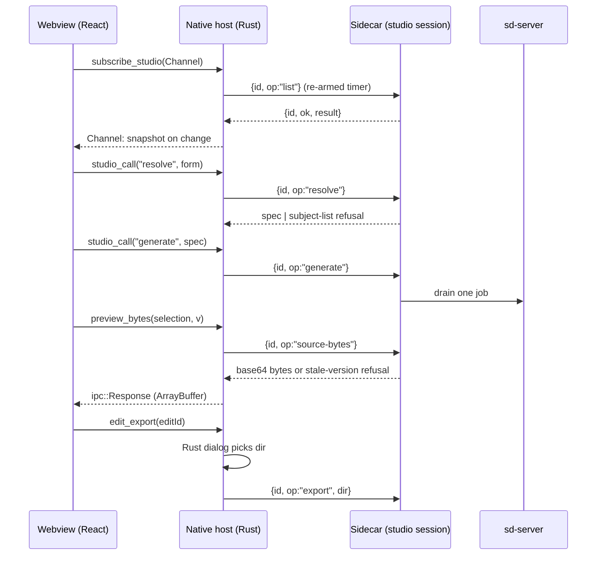

# feat: Packaged Tauri studio app

## Overview

Wrap `apps/studio` in its own Tauri app. A native host supervises a Bun sidecar that runs the studio session `tools/studio` already uses, and the webview reaches it only through named commands. The app covers request → queue → contact sheet → pick → edit in Aseprite → pack a draft → approve that packed record → publish. Unit 6's isometric preview reloads drafts and approved assets live, fed by a packaged asset source that replaces the Vite dev bridge. The unit ends with packaged window evidence and a measured studio headroom, with one real Z-Image job running beside the studio.

## Problem Frame

This is parent Unit 7 of `docs/plans/2026-10-03-001-feat-asset-studio-foundation-plan.md`. Units 5 and 6 shipped the headless pipeline, the Zeus portrait and sprite in canon, and a browser-only preview. The owner can run the pipeline only from a terminal, and nothing proves the preview works inside a packaged WKWebView. Research found that the simulation sidecar pattern (`apps/desktop/src-tauri/src/sidecar.rs`) fits the lifecycle but not the transport. The studio session speaks newline-JSON request and reply over stdio, not loopback HTTP. The session also lacks a spec preview, and its file-path ops can't be exposed to a webview that has no filesystem access.

## Requirements Trace

| ID | Obligation | Units |
| --- | --- | --- |
| R8 | Visible per-job queue with remove and abort, where abort means restarting sd-server and is recorded as cancelled; the studio stays responsive | U1, U3, U5, U6 |
| R10, R11, R12 | Open the draft in Aseprite, report-only re-import with a diff, and no automatic change to hand pixels; with no editor, export and import still work | U1, U3, U5, U6 |
| R16, R17 | Preview drafts and approved assets at integer zoom; changes reload live without a restart | U4, U6 |
| R18 | App and CLI call the same `@panthea/assets` functions; the webview has no shell or filesystem permission | U1, U2, U3 |
| AE6 | Three queued jobs: remove the second, abort the first, the third runs after the restart, and the UI stays usable | U5, U6 |
| AE9 | Same request and seed through CLI and app give identical candidate pixels and reports | U1, U6 |
| Parent Unit 7 verification | Packaged studio, studio headroom with one real job, window screenshots of each listed state, Rust crate passes fmt, clippy and tests | U3, U6 |
| U08, X02 (product) | Traceability notes for studio presentation and art evidence | U6 |

## Scope Boundaries

- No game client changes, registry bundling into `apps/desktop`, or renderer extraction (parent Unit 8).
- No `derive`; the UI shows no derive action (parent Unit 9).
- No full owner sitting from request to packaged client (parent Unit 8).
- No hosted providers, no code signing or notarization, no distribution build.
- No masked-edit generation (edit base and mask files) from the app. It stays a CLI path in Unit 7.
- No single-instance plugin. A second instance finds the root locked and shows the read-only state.
- `apps/desktop` is not modified; the studio crate is separate, with its own `Cargo.lock`.

## Context & Research

### Relevant Code and Patterns

- Session host and protocol: `tools/studio/src/index.ts`, `commands.ts`, `host.ts`. One-shot and session modes, `{id, op, args}` → `{id, ok, result|error}`. Reads take no lock, and mutations go through `owner()`, which refuses `busy`.
- Session, runtime and lock: `packages/assets/src/studio/session.ts` holds an exclusive SQLite lock and recovers interrupted jobs as failed. `runtime.ts` owns the `sd-server` process group and aborts by killing and relaunching it.
- Sidecar supervision to follow: `apps/desktop/src-tauri/src/{sidecar,state,commands,lib}.rs`. One `Lifecycle` lock with `launch_id` fencing, restart backoff, and a `Channel` forwarding changed frames with replay on resubscribe. Capabilities are named commands only (`capabilities/proxy.json`, `build.rs`).
- Sidecar build: `apps/simulation/scripts/build-sidecar.sh` (`bun build --compile`, triple-suffixed binary). CI `rust` job (`.github/workflows/ci.yaml`) builds a sidecar before clippy.
- Preview seam: `apps/studio/src/source/port.ts` (`AssetSource`: list, resolve, fetchBytes, subscribe). The Vite plugin `dev-bridge.ts` holds the node-side validation, `pixelKey`/`manifestKey`, the late-root watcher and `?v=` enforcement. `client.ts` is the browser adapter.
- UI tests: `apps/client/src/ui/*.test.tsx` render to static markup with fake transports. There is no DOM runner.

### Institutional Learnings

- `integration-issues/koota-new-function-tauri-csp-2026-09-27.md`: packaged CSP needs `script-src 'self' 'unsafe-eval'`, or the window stays blank. Only the packaged bundle shows it.
- `integration-issues/wkwebview-webgpu-unavailable-macos-15-2026-09-26.md`: evidence runs on the WebGL2 backend.
- `best-practices/lifecycle-state-one-lock-transitions-2026-09-28.md`, `test-failures/sidecar-launch-token-epipe-masked-early-exit-2026-10-02.md`, ADR-0003: one lock, `launch_id` fencing, effects after unlock, stdin-EOF and parent-PID orphan guards.
- `integration-issues/version-keyed-asset-bridge-live-reload-2026-10-08.md`: version-pinned bytes and watching roots created late. It was built for the dev bridge, so the packaged source must keep both.
- `integration-issues/webgpurenderer-render-target-blit-and-compile-2026-10-08.md`, `three-webgpurenderer-device-loss-latch-2026-09-27.md`: keep the blit flip and `compileAsync`, and recover device loss on a fresh canvas.
- `performance-issues/progress-poll-starved-job-drain-2026-10-08.md`: poll only watched jobs, chain `setTimeout` rather than `setInterval`, and use virtual-clock tests.
- `logic-errors/inherited-property-op-names-got-no-response-2026-10-08.md`: own-property op lookup, one reply per request.
- `integration-issues/sdcpp-cancel-sigint-diffusion-fa-2026-09-27.md`: abort means restart; warmup is about 37 s; late output is discarded.
- `performance-issues/ollama-runner-pid-rss-sampling-2026-09-27.md`: sample the real worker PID each tick.
- `workflow-issues/tauri-clippy-requires-built-sidecar-2026-10-04.md`: build the sidecar before clippy.
- `integration-issues/sdcpp-cli-guidance-is-not-server-cfg-2026-10-08.md`: compare AE9 parity on decoded pixels.

### External References

- Tauri 2.12.1 (docs.rs and installed `@tauri-apps/api` types):
  - `tauri::ipc::Response::new(Vec<u8>)` resolves to an `ArrayBuffer` in JS.
  - `Channel<T>` delivers in order, and the webview resubscribes after a reload.
  - A custom URI scheme bypasses the capability ACL, so it is not used.
- `tauri-plugin-dialog` 2.8.1 (Apache-2.0 OR MIT). It is called from Rust only, with `blocking_pick_*` run off the main thread, and the window gets no `dialog:*` permission.

## Prior-Art Survey

```json
{
  "schema_version": 2,
  "verdict": "extend",
  "scope": "apps/desktop, apps/studio, tools/studio, packages/assets/src/studio",
  "freshness": { "vcs_reference": "f8fe56b" },
  "budget": { "max_search_passes": 3, "max_candidate_inspections": 12, "exhausted": false },
  "candidates": [
    { "path_or_symbol": "apps/desktop/src-tauri/src/sidecar.rs", "description": "Spawns and supervises the panthea-sim externalBin: stdin launch write, port discovery, launch fencing, restart backoff, kill on stop.", "disposition": "extend" },
    { "path_or_symbol": "apps/desktop/src-tauri/src/state.rs", "description": "Lifecycle under one lock: launch_id, child, poll task, restart counters, cached frame, channel.", "disposition": "extend" },
    { "path_or_symbol": "apps/desktop/src-tauri/src/proxy.rs", "description": "Native-only polling with Channel forwarding of changed frames and replay to a new subscriber.", "disposition": "extend" },
    { "path_or_symbol": "apps/desktop/src-tauri/src/commands.rs", "description": "Named Tauri commands exposed to the webview.", "disposition": "extend" },
    { "path_or_symbol": "apps/desktop/src-tauri/capabilities/proxy.json", "description": "Least-permission capability granting only named app commands.", "disposition": "extend" },
    { "path_or_symbol": "apps/simulation/src/lifecycle.ts", "description": "Sidecar-side stdin session, stdin-EOF shutdown and parent-PID guard.", "disposition": "extend" },
    { "path_or_symbol": "tools/studio/src/index.ts", "description": "Studio newline-JSON session protocol over stdio with stderr diagnostics and signal teardown.", "disposition": "extend" },
    { "path_or_symbol": "tools/studio/src/host.ts", "description": "Root ownership, lazy runtime and editor, queue drain, watched-job progress, edit watching.", "disposition": "extend" },
    { "path_or_symbol": "packages/assets/src/studio/session.ts", "description": "Single-writer studio session, exclusive SQLite lock, durable queue and lifecycle transitions.", "disposition": "reuse" },
    { "path_or_symbol": "packages/assets/src/studio/runtime.ts", "description": "sd-server process group, artifact verification, one-job drain, abort by teardown.", "disposition": "reuse" },
    { "path_or_symbol": "apps/studio/src/source/port.ts", "description": "Webview-safe AssetSource: list, resolve, fetchBytes, subscribe.", "disposition": "reuse" },
    { "path_or_symbol": "apps/studio/src/source/dev-bridge.ts", "description": "Dev-only node bridge: validation, version keys, late-root watcher, read-only endpoints, HMR change events.", "disposition": "extend" }
  ]
}
```

## Key Technical Decisions

| Decision | Approach and reason |
| --- | --- |
| Sidecar | `tools/studio` session compiled with `bun build --compile` as `panthea-studio-sidecar`. It's the same dispatcher the CLI uses (R18, AE9). |
| Transport | Native multiplexer over the sidecar's stdio: monotonic request ids, one pending reply per id, a timeout per op class, stdout replies only. Nothing is reused from the simulation's HTTP proxy. |
| Webview bridge | Named commands only. `studio_call(op, args)` checks a native per-op argument schema. An op not in the table, or an argument not in its schema, is refused before the sidecar sees it. No schema contains a path field. Path flows (export dir, import files, config file, opening the edit workspace in Aseprite) are separate commands. They open native dialogs or launch Aseprite in Rust and pass paths straight to the sidecar. The webview never holds a path. |
| Progress and state | Native polls the sidecar's read-only `list` (jobs with order, status and reason; edits; working sets; assets) on a re-armed timer. It pushes the full snapshot over one `Channel` when it changes, and replays the latest snapshot to a new subscriber, as the desktop app does with frames. The contact sheet loads on demand through `sheet`. The session gains no event protocol. |
| Preview bytes | `preview_bytes` returns `tauri::ipc::Response`. Change keys come over the same `Channel`. The `?v=` / `pixelKey` mismatch refusal moves into a shared node module used by both the Vite plugin and the sidecar. No custom URI scheme, because it bypasses capabilities. |
| Spec preview | New read-only `resolve` op. It builds the request record from content only and returns the spec, or the subject-list refusal, without taking the lock. |
| Retry | The queue's retry on a failed or cancelled job calls the existing `reroll` for that request and slot, so a new seed and job join the same request and provenance. No new op or job-record field. |
| Approval gates | Unchanged. Plain `approve` refuses a failed report, and `approve-with-exception` carries the owner's reason. `publish` confirms by revision, which the sidecar checks against current state. The UI shows the revision it confirms and never supplies a constant. |
| Config | The app stores one setting in app data: the path to a CLI studio config JSON, chosen through the native dialog. With no setting, the app shows a not-configured state. App and CLI read the same file. |
| Edit in Aseprite | The session's `open` builds and watches the workspace with Aseprite in batch mode only. The native `edit_open` command takes the workspace path from the sidecar's reply and launches Aseprite on it, so the owner gets an editor window. The path never reaches the webview. |
| Quit | On quit the host closes the sidecar's stdin, waits a bounded time for teardown (sd-server stopped, lock released), then kills the sidecar. The sidecar also self-terminates on parent death. |
| Crate | `apps/studio/src-tauri` with its own `Cargo.lock`, identifier `ai.panthe.studio`, and CSP `script-src 'self' 'unsafe-eval'` in both prod and dev configs. CI gains a studio Rust job: build the sidecar, then fmt, clippy `-D warnings`, `cargo test`. |
| UI ownership | The workflow UI is design work, done in its own unit, with independent review. Headless units leave view code alone. |

Owner approvals recorded 2026-10-08:
- `tauri-plugin-dialog` added to the studio crate;
- the studio crate keeps its own `Cargo.lock`;
- a new CI job runs fmt, clippy and `cargo test`;
- config comes from a pointer to the CLI config file.

The `bun.lock` change is workspace-only: `@tauri-apps/api` and `@tauri-apps/cli` at the versions already pinned in the repo.

## Open Questions

### Resolved During Planning

- Aseprite is installed. The main edit path is `open` → save → `finish`. Export and import are the tested fallback.
- Read-only inspection of a locked root works: reads take no lock, so the app shows a read-only state when a CLI session owns the root.

### Deferred to Implementation

- Exact poll interval and per-op timeouts. Set them from the measured cost of `list` on the real store; the target is about one-second UI updates without starving the drain.
- Whether `export`/`import`/`finish` need byte-accepting variants. Native passes dialog-chosen paths, so the current path ops may suffice.
- The bounded quit wait. Measure sd-server teardown first.

## High-Level Technical Design

> *This illustrates the intended approach and is directional guidance for review, not implementation specification. The implementing agent should treat it as context, not code to reproduce.*



## Implementation Units

- [ ] **U1: Session additions for the app**

**Goal:** Give the session the read-only and source ops the app needs, without changing CLI behaviour.

**Requirements:** R8, R10–R12, R16–R18, AE9.

**Dependencies:** None.

**Files:**
- Modify: `tools/studio/src/commands.ts`, `tools/studio/src/host.ts`, `tools/studio/src/index.ts`, `tools/studio/README.md`
- Create: `packages/assets/src/studio/preview-source.ts`, with its test, holding the node-side source core extracted from `apps/studio/src/source/dev-bridge.ts`
- Modify: `apps/studio/src/source/dev-bridge.ts`, to use the extracted core; `packages/assets/src/studio/index.ts`
- Test: `tools/studio/src/commands.test.ts`, `tools/studio/src/session.test.ts` (or the existing session test file), `packages/assets/src/studio/preview-source.test.ts`, `apps/studio/src/source/dev-bridge.test.ts`

**Approach:**
- `resolve` runs the request builder against content and returns the spec, or the same subject-list refusal `generate` gives. It takes no lock and works when the root is busy.
- `source-list`, `source-resolve`, `source-bytes` and `source-keys` wrap the extracted preview-source core. Bytes come back base64 in the reply line, and a stale `v` gets a refusal.
- `open`'s reply includes the workspace file location, for the native host to launch Aseprite on. The native host strips it before anything reaches the webview.
- A parent-PID guard, enabled by a flag in session mode, mirrors `apps/simulation/src/lifecycle.ts`. Stdin EOF already ends the session.
- Op lookup stays own-property. Each new op is added to the inherited-name regression test.

**Execution note:** Test-first for each new op.

**Patterns to follow:** existing op table and `readOnly`/`owner()` split in `tools/studio/src/host.ts`; dev-bridge tests for validation and version keys.

**Test scenarios:**
- Happy path: `resolve` returns the same spec that a following `generate` with the same input stores in its request record.
- Error path: `resolve` with an unknown subject returns the subject-list refusal and writes nothing.
- Edge case: `resolve` succeeds while another session holds the lock.
- Happy path: `open` replies with the workspace location the native host needs to launch Aseprite.
- Happy path: `source-bytes` with the current key returns the atlas bytes, which decode to the validated size.
- Error path: `source-bytes` with a stale key is refused. After a rewrite, the next `source-keys` shows the new key.
- Edge case: a store root created after the session starts appears in `source-list` after it is created.
- Integration: the dev bridge still passes its existing tests on the extracted core.
- Error path: the parent guard ends the session when the parent PID dies, using a fake PID probe and a virtual clock.

**Verification:** `bun run check` passes. CLI behaviour is unchanged for existing ops.

- [ ] **U2: Studio sidecar build**

**Goal:** Produce the triple-suffixed `panthea-studio-sidecar` binary from the studio session.

**Requirements:** R18.

**Dependencies:** U1.

**Files:**
- Create: `apps/studio/scripts/build-sidecar.sh`
- Modify: `.gitignore` (for `apps/studio/src-tauri/binaries/`), `apps/studio/package.json` scripts
- Test: `tools/studio/src/sidecar.test.ts`, which spawns the compiled entry in-process where possible, or the built binary in one bounded test

**Approach:** Mirror `apps/simulation/scripts/build-sidecar.sh`, including triple detection and explicit targets off macOS. The entry is the studio session in sidecar mode, with the parent guard on and stdout carrying replies only. The Aseprite adapter resolves `scripts/export.lua` from `import.meta.url`, which a compiled binary does not ship. Embed the script text in the build and write it to a scratch file before invoking Aseprite.

**Patterns to follow:** `apps/simulation/scripts/build-sidecar.sh`.

**Test scenarios:**
- Integration: the built sidecar answers `status` over stdio and exits on stdin EOF.
- Error path: an unknown op name gets exactly one error reply with the request id.
- Integration: the built binary runs an Aseprite batch export through the embedded Lua script. Skipped when Aseprite is absent.

**Verification:** The script builds on macOS arm64. The binary answers a session request and completes an Aseprite batch export.

- [ ] **U3: Native host crate**

**Goal:** `apps/studio/src-tauri` supervises the sidecar, exposes named commands, and builds a packaged app.

**Requirements:** R8, R10, R12, R18; parent Unit 7 crate checks.

**Dependencies:** U2.

**Files:**
- Create: `apps/studio/src-tauri/{Cargo.toml,Cargo.lock,build.rs,tauri.conf.json,tauri.dev.conf.json}`, `capabilities/{default,studio}.json`
- Create: `src/{main,lib,sidecar,state,mux,commands,config}.rs`, `tests/sidecar_integration.rs`
- Modify: `apps/studio/package.json` (adds `@tauri-apps/api` and `@tauri-apps/cli` at the pinned 2.12.1, plus tauri scripts), `bun.lock` (workspace-only), `.github/workflows/ci.yaml` (adds a studio Rust job)
- Create: ADR `docs/decisions/0010-studio-app-host.md`, with an entry in the ADR index

**Approach:**
- **Lifecycle.** One `Lifecycle` lock with `launch_id` fencing, restart backoff, and effects after unlock. A launch-write `EPIPE` races the child's exit.
- **`mux`.** It correlates replies by id and applies a timeout per op class. Abort and generate get long timeouts; reads get short ones. A sidecar exit fails all pending requests with a retryable error.
- **Commands.**
  - `studio_call` checks the per-op argument schema.
  - `subscribe_studio(Channel)` polls `list` on a re-armed timer and replays to new subscribers.
  - `preview_bytes` returns `ipc::Response`.
  - `edit_open` launches Aseprite on the workspace the sidecar reported.
  - `edit_export`, `edit_import`, `config_choose` and `config_status` use the Rust-only dialog.
- **Plugins.** Dialog (approved), and shell for spawning the sidecar only, as in `apps/desktop`. The capability grants only `allow-*` app commands.
- **Quit.** Close stdin, wait a bounded time, then kill.

**Execution note:** Test-first for the multiplexer and lifecycle transitions as pure Rust units.

**Patterns to follow:** `apps/desktop/src-tauri/src/{sidecar,state,proxy,commands}.rs`, `capabilities/proxy.json`, `tests/proxy_integration.rs`.

**Test scenarios:**
- Happy path (mux): concurrent requests get their own replies out of order.
- Error path (mux): a reply with an unknown id is dropped and logged. A timeout fails only its request.
- Error path (mux): a sidecar exit fails every pending request as retryable. A restart gives a new `launch_id`, and late replies from the old launch are ignored.
- Error path (bridge): `studio_call` refuses an op not in the schema table, and any argument not in the op's schema (for example `dir`, `png`, edit base or mask), without contacting the sidecar.
- Integration (parity): each op in the schema table reaches the same session dispatcher the CLI uses with its op name and arguments unchanged. The table covers request, generate, reroll, remove, abort, pick, reject, open, finish, discard, pack, approve, approve-with-exception and publish. `derive` is outside this unit and absent from the table.
- Happy path (channel): a new subscriber gets the cached snapshot immediately. An unchanged snapshot is not re-sent.
- Integration: the real sidecar spawned through Bun answers `status` through the mux; stdin close ends it within the bounded wait. Skipped when Bun is absent, as in `proxy_integration.rs`.
- Edge case: config not set → `config_status` reports not-configured, and `studio_call` refuses with that reason.

**Verification:** `cargo fmt --check`, `cargo clippy --locked --all-targets -- -D warnings` and `cargo test` pass in `apps/studio/src-tauri` after the sidecar build. `tauri build` produces a `.app` whose window loads and reaches the sidecar. The packaged preview is proven in U4 and U6.

- [ ] **U4: Packaged asset source**

**Goal:** The preview reads drafts, approved assets and canon through the native bridge, with live reload.

**Requirements:** R16, R17.

**Dependencies:** U1, U3.

**Files:**
- Create: `apps/studio/src/source/tauri.ts`, `apps/studio/src/source/tauri.test.ts`
- Modify: `apps/studio/src/harness/usePreview.ts`, to select the source by environment

**Approach:** Implement `AssetSource` over `invoke` and the studio `Channel`.
- `fetchBytes` passes the version key and, on a stale-key refusal, re-resolves.
- `subscribe` maps key changes from the channel to `SourceChange`.
- The browser-safety rule stays: no node or `@panthea/assets` runtime import in the webview.

**Patterns to follow:** `apps/studio/src/source/client.ts` and its tests.

**Test scenarios:**
- Happy path: list, then resolve, then fetchBytes return the bytes for the selection.
- Edge case: a stale-key refusal triggers one re-resolve, then the new bytes.
- Integration: a key change on the fake channel emits one `SourceChange` for the affected selection.
- Error path: the source module imports no node module and no `@panthea/assets` runtime.

**Verification:** Unit tests pass. In the packaged app, rewriting a draft updates the preview without a restart (shown in U6).

- [ ] **U5: Workflow UI**

**Goal:** The owner workflow in one window: request and queue, contact sheet with reports and provenance, edit, pack/approve/publish, and the preview.

**Requirements:** R8, R10–R12, R16, AE6.

**Dependencies:** U3, U4.

**Files:**
- Create: `apps/studio/src/workflow/*` (views and a pure state reducer), `apps/studio/src/workflow/*.test.ts(x)`
- Modify: `apps/studio/src/App.tsx`

**Approach:**
- **States.** A pure reducer turns snapshots and command results into UI state. The queue states are empty, unavailable/staging (naming the missing artifact), queued, running, aborting/restarting (about 37 s, with remove still usable), cancelled, removed, failed and completed. The app-level states are root locked (read-only, mutations disabled with the owner named) and not configured.
- **Contact sheet.** It shows checks, scale, colours merged, pixels moved, and frame playback at manifest timing.
- **Actions.** Candidates: pick, reject and reroll. Jobs: retry appears only on failed or cancelled jobs, and calls reroll for that slot. Drafts: edit, then pack. A packed record offers approve only when its report passes, approve-with-exception with a required reason, and reject. An approved record offers publish, showing the exact revision being confirmed.
- **Editing.** Opening an edit launches Aseprite. Each save shows the report-only conformance result and the pixel diff against the previous version. Finish keeps the edit, and discard restores it. The export/import fallback is shown when no editor is configured.
- **Who builds it.** This is design work. The visual layout follows the existing studio look and the art guide's 1× preview.

**Execution note:** Reducer and controls test-first. Views are tested by static markup with fake transports. No real timers.

**Patterns to follow:** `apps/client/src/ui/*.test.tsx` (static markup), `apps/client/src/connection.ts` (parsing transport payloads).

**Test scenarios:**
- Happy path: each queue state renders its label and only its legal controls.
- Error path: a packed record with a failed report shows no plain approve. Approve-with-exception without a reason is disabled.
- Happy path: an external-edit save renders the report-only result and the pixel diff, and no control changes the edited pixels without confirmation.
- Edge case: retry is absent on succeeded, queued and running jobs.
- Error path: when the root is locked, every mutating control is disabled and the read-only notice names the lock owner.
- Integration (AE6): with three queued jobs, remove the second and abort the first. The reducer shows the first as cancelled, then restarting, and the third as running after the restart. Remove stays enabled throughout.
- Edge case: after a webview reload, the first snapshot rebuilds the full state, including an open external edit.
- Edge case: late output for a cancelled job never shows the job as completed.
- Error path: unavailable/staging is distinct from failed and names the missing weight or binary.

**Verification:** `bun run check` passes. An independent design review of the packaged window happens before the owner sees it.

- [ ] **U6: Packaged evidence, headroom and parity**

**Goal:** Prove the packaged studio works end to end, and measure headroom.

**Requirements:** R8, R10–R12, R16–R18, AE6, AE9; parent Unit 7 verification; U08, X02.

**Dependencies:** U5.

**Files:**
- Create: `docs/evidence/asset-studio/unit7/README.md` and window-only screenshots
- Create: `tools/probes/studio-headroom/README.md`, `src/run.ts`, `src/run.test.ts`, reusing the coexistence sampler
- Create: `tools/studio/src/parity.test.ts`, or a scenario under `tools/scenarios/`, for AE9
- Modify: `docs/product/traceability.md`; `docs/plans/2026-10-03-001-feat-asset-studio-foundation-plan.md` (Unit 7 pointer and status; corrects the stale Unit 5 sprite-deferral line)

**Approach:**
- **States.** Drive the real `.app` on the WebGL2 backend and capture each state: not configured, unavailable/staging, queued, running, aborting/restarting, cancelled, failed, completed, root locked, editing externally with a saved edit's diff and report, export/import fallback, failed conformance needing an exception, blocked publish, and placeholder fallback.
- **Packaged checks.** Check that the CSP allows the renderer imports, that the preview reloads live, and that a forced device loss redraws.
- **AE6.** Run it on the real runtime.
- **AE9.** Run the same request and seed through the CLI and the app. Compare decoded candidate pixels and conformance reports. Positive control: a different seed must fail the comparison.
- **Negative claims, each with a control that must flip it.**
  - Plain approve refuses a failed report; the control is a passing report, which approves.
  - Late output after abort never becomes a candidate.
  - A stale confirm revision is refused.
- **Headroom.** Run one Z-Image 512×640 job beside the running studio. Sample the worker RSS every tick, re-resolving the PID, along with studio RSS, memory pressure, swap, disk, and UI responsiveness (command round-trip time). This is evidence, not a gate.

**Test scenarios:**
- Integration (AE9): CLI and app candidates for one request and seed decode to identical pixels, and their reports match. The control with a different seed differs.
- Integration (headroom sampler): with a fake process table, the sampler re-resolves the worker PID on each tick and labels the PID it sampled.

**Verification:** The README records each state with a window screenshot, the AE6 and AE9 results with controls, and the measured headroom. Traceability is updated. No browser-only or mocked claim counts as packaged proof.

## System-Wide Impact

- **Interaction graph:** webview → named commands → native mux → sidecar session → `@panthea/assets` → `sd-server`. Only the native host spawns processes.
- **Error propagation:** a sidecar exit fails pending requests as retryable, and the host restarts the sidecar with backoff. Jobs it interrupted reappear as failed with retry. Refusals (busy, unavailable, stale) arrive as typed errors, not crashes.
- **State lifecycle risks:** the store keeps a single writer through the SQLite lock. Quit must release the lock and stop `sd-server`, and the bounded wait plus the parent guard cover orphans.
- **API surface parity:** CLI ops gain `resolve` and the `source-*` ops, and `open` reports the workspace location. CLI behaviour for existing ops is otherwise unchanged.
- **Unchanged invariants:** `apps/desktop`, the simulation sidecar, the canon registry format, approval and publish gates, and offline-only generation (no hosted fallback).

## Risks & Dependencies

| Risk | Mitigation |
| --- | --- |
| Large base64 atlas lines over stdio stall the mux | Atlases are 1–600 KB. The mux reads by line with no size cap below a few MB. Measure in U3. |
| `list` polling starves the drain | Re-armed timer, read-only reads, interval set from measured cost (the poll-starvation learning). |
| Packaged CSP or WebGL2 differs from the browser | Proven only from the packaged `.app` in U6. |
| CI time grows with a second Tauri crate | Separate job, with a cache keyed on the studio `Cargo.lock`. |

## Documentation / Operational Notes

- ADR-0010 records the studio app host: a separate crate, stdio mux, per-op schema bridge, Rust-only dialog, and native launch of Aseprite.
- `tools/studio/README.md` lists the new ops.
- Running the app needs the CLI config file and the gitignored models in the main checkout (`tools/probes/art-local-2`).

## Sources & References

- **Origin document:** [docs/brainstorms/2026-10-03-asset-studio-requirements.md](../brainstorms/2026-10-03-asset-studio-requirements.md)
- Parent plan: `docs/plans/2026-10-03-001-feat-asset-studio-foundation-plan.md`, Unit 7
- Prior child plans: `docs/plans/2026-10-05-001-feat-studio-pipeline-cli-plan.md`, `docs/plans/2026-10-08-002-feat-studio-isometric-preview-plan.md`
- Related PRs: #174, #179, #188
