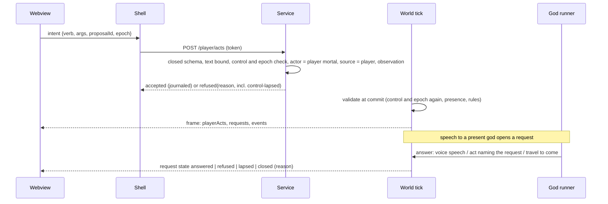

# feat: M3 phase 1, a mortal in the town

## Overview

Phase 1 makes the world playable. The owner creates a mortal with an existing trade and enters the running town. From there they can:
- move and travel between realms;
- work, eat, exchange goods, pray, make offerings and choose a patron;
- speak to gods, who answer in their own voice or with an act;
- speak to mortals, who answer from their own state;
- leave, and come back to a summary of what happened.

Every player act enters through a new player intake, and the world validates and journals it like any other actor's. Phase 1 ends at two gates:
- a queue-wait re-measure that includes player speech;
- the owner's play rating.

## Problem Frame

The client is a read-only observer, and nobody can take part (see origin: Problem Frame). Research confirmed what phase 1 has to add:
- **Entry and control.** There is no path for a client act, and no event creates an actor after genesis. A mortal's routine always drives it.
- **Speech.** Speech has no event and no memory kind. Prayers need a known cause and an altar.
- **Patron choice.** A patron change is emitted only when a prayer ends.
- **The client.** It has no input handlers. Its frames hold only 10 ticks of events, while a request lasts 150.

## Requirements Trace

- R1–R2. Create a mortal from a name, a look, an allowed spawn, a trade template and an optional patron. It enters as an ordinary inhabitant (M01). The trade gives it starting goods, a workplace (the gathering place of the template inhabitant) and a routine.
- R3. Player acts are validated and journaled proposals. Intake accepts only a closed set of fields and refuses an act unless the player holds control. Creation and control changes are recorded inputs (W05; ADR-0008 superseding note).
- R4. Move, travel where a mortal is allowed, work, eat, exchange goods, pray, make an offering, choose a patron (W02, M04).
- R5. Keyboard, pointer and controller parity, with on-screen text entry and quick phrases (M02).
- R6. Acts that can't happen are shown disabled with a reason. Refused acts show the world's reason.
- R7. Pause and normal speed, now available in game as well as in the tray (owner, 2026-10-10).
- R8–R13. Typed speech to anyone present:
  - Speech to a present god opens a request the god owes an answer. It is answered on the god's next turn while a priority budget shared by all gods has room. Otherwise it waits in rotation as `queued` (owner, 2026-10-10).
  - Speech to an absent god opens a plea. A god spoken to by name, or prayed to at its altar, may come.
  - Request states are visible: queued, waiting, answered, refused, lapsed and closed.
  - Mortals answer from their own state.
  - Speech is perceived only by those present (M02, W04).
- R14. Choosing a patron is recorded as a defection that both gods perceive (M04).
- R15. The world's existing pressures apply to the player: wrongs, grudges and shortages (W06, W09).
- R16–R17. Playing, observing and away are distinct states. The return summary leads with the mortal's events and shows applied and skipped time (M07, A07, A08).
- R18. Queue wait is re-measured with player speech before phase 2 (ADR-0005, O08). If it misses, the shared priority window is widened.
- R19. The owner rates play after phase 1.
- R29, menu part only. Retiring from the menu, pulled forward from phase 4 (owner, 2026-10-10). The retired mortal stays in town as an ordinary inhabitant, and a new mortal can be created.
- R35. Works offline (P01, P07).

## Scope Boundaries

- Phase 1 only. Interruption, artifacts, conflict, death, the Underworld as a place to play, god defeat, realm rules and transformation belong to later phases.
- Mortals answer without a model. Looks come from the existing sprites.
- A new mortal owns no building. It gathers and sells alongside the existing owners.
- Retiring from the Underworld is phase 4.
- The rest of the M2 tuning list is not phase 1 work.

### Deferred to Separate Tasks

- Phases 2–6 of the origin document get their own plans after the phase 1 gates.

## Context & Research

### Relevant Code and Patterns

**Intake**
- `apps/simulation/src/server.ts`: `handleProposal`, `checkRequestGuards` and `IN_PROCESS_SOURCES`, which blocks only `model` and `director`, so `routine` can be claimed over HTTP.
- `packages/contracts/src/proposal.ts`: `PROPOSAL_SOURCES` and `parseProposal`.
- `packages/persistence/src/journal.ts`: `insertExternalProposal`.
- `apps/simulation/src/agents.ts`: `GodTurnRunner`, the pattern for a service-set source and observation.

**Actors and state**
- `packages/world/src/state.ts`: `createInitialWorldState`, the only place actors are created.
- Authored inhabitant fields (`gathers`, `startingInventory`, `devotion`, `temperament`, `drives`) are defined in `packages/contracts/src/content.ts`.
- `packages/world/src/memory.ts`: memory kinds and eviction.

**Persistence**
- `packages/world/src/codec.ts`: the world state codec.
- `packages/persistence/src/archive.ts`: `HASHED_TABLES`, export and import.

**Routines, journeys and ticks**
- `packages/world/src/routines.ts`: `decideRoutineProposal`.
- `apps/simulation/src/tick.ts`: `buildRoutineQueue`, `admitWithinCap` and `mergeTickQueue`.
- `packages/world/src/actions.ts` and `packages/world/src/journey.ts` (`planHop`): journey hops advance outside `buildRoutineQueue`.

**Validation**
- `packages/world/src/validate.ts`:
  - `move` and `realm-transition` are open to mortals;
  - `travel` is limited to deities;
  - `handlePray` needs the altar and a cause;
  - `handleWorship`;
  - `report`, the co-located words path.

**Petitions and patrons**
- `packages/world/src/petitions.ts`: `prayableCauses`, `routePetition`, `blessability`, `lapsingPetitions`, and the 150-tick window.
- `packages/world/src/patrons.ts`: `defectionOf`, which reads `sign` memories, and `applyPatronChanged`.

**Scheduling, perception and prompts**
- `packages/agents/src/practices.ts`: `schedulingSignals`.
- `packages/agents/src/scheduler.ts`: `pickGod` tiers.
- `packages/world/src/perception.ts`: co-location at event time.
- `packages/agents/src/context.ts`: `buildGodContext`.
- `packages/agents/src/prompt-cap.ts`: shed `TIERS` and the protected floor.

**Snapshot and client**
- `packages/contracts/src/snapshot.ts`: `CatchUpSummary`.
- Client entry points are `apps/client/src/App.tsx`, `apps/client/src/ui/surface.tsx` and `apps/client/src/connection.ts`. There are no input handlers, and the tokens are in `surface.css`.

**Desktop shell**
- `apps/desktop/src-tauri/src/lib.rs`, `proxy.rs` and `tray.rs` (pause and resume).
- The webview's capability set.

**Scenarios**
- `tools/scenarios/m2-greek-cast/src/steps/staging.ts`: `stageWorld` and `stagePrayer`.
- `apps/simulation/src/test-service.ts`: `startTestService`.

### Institutional Learnings

- **Validation:** proposals carry intent only and are revalidated at commit. Pin only the facts they depend on (`authoritative-rule-validation`, `whole-entity-revision-pins-refused-petition-answers`).
- **Durability:** journal before acknowledging, and consume atomically with the tick (`proposal-accepted-then-lost-before-durable`, `side-effects-inside-the-commit-transaction`).
- **Replay:** use fresh composition, and recorded inputs only (`world-persistence-composition-broken-after-reopen`).
- **Prompt:** budget the whole prompt, use copyable answer forms, and keep schema and parser in agreement (`ollama-4k-prompts-truncate-silently`, `prompt-commanding-old-action-hides-new-option`, `move-realm-transition-destination-pairing`).
- **Request windows:** windows and feasibility use one predicate (`world-judged-obligation-evidence-windows`).
- **Perception:** perception happens at event time (`knowledge-leaks-through-perception-timing-and-citations`).
- **Admission order:** admission order is policy and must be tested under a binding cap (`tick-admission-starved-external-proposals`).
- **Summaries:** a summary is persistent level state with a stable id (`catch-up-summary-lost-between-polls`, `catch-up-cap-per-backlog-not-per-run`).
- **Packaged app:** it needs WebGL2 and the koota `unsafe-eval` CSP exception (`wkwebview-webgpu-unavailable-macos-15`, `koota-new-function-tauri-csp`).
- **Scenarios and process:** every negative claim in a scenario needs a positive control, and scenario causes are staged. Build the direct version first (`end-to-end-scenario-with-positive-controls`, `greenfield-anti-over-engineering`).

## Prior-Art Survey

```json
{
  "schema_version": 2,
  "verdict": "extend",
  "scope": "apps/simulation, apps/desktop/src-tauri, apps/client/src, packages/contracts, packages/world, packages/agents, packages/persistence, content/greek/world, tools/scenarios",
  "freshness": {
    "vcs_reference": "ffb74a5"
  },
  "budget": {
    "max_search_passes": 25,
    "max_candidate_inspections": 40,
    "exhausted": false
  },
  "candidates": [
    { "path_or_symbol": "apps/simulation/src/server.ts handleProposal", "description": "Token-bearing proposal intake that parses, guards and journals external proposals", "disposition": "extend" },
    { "path_or_symbol": "packages/persistence/src/journal.ts insertExternalProposal", "description": "Durable journaling of an external proposal before acknowledgement", "disposition": "reuse" },
    { "path_or_symbol": "apps/simulation/src/agents.ts GodTurnRunner", "description": "Service-side producer that sets source and builds the observation", "disposition": "reuse" },
    { "path_or_symbol": "packages/world/src/routines.ts decideRoutineProposal", "description": "Per-actor routine proposal each tick", "disposition": "extend" },
    { "path_or_symbol": "apps/simulation/src/tick.ts mergeTickQueue", "description": "Lets an external proposal take an actor's slot for one tick", "disposition": "insufficient", "insufficiency_reason": "Per tick only; it cannot stand the routine down across idle ticks" },
    { "path_or_symbol": "packages/world/src/state.ts createInitialWorldState", "description": "Creates actors at genesis", "disposition": "insufficient", "insufficiency_reason": "No actor can enter after genesis; rebuild needs a creation event" },
    { "path_or_symbol": "packages/world/src/validate.ts handlePray", "description": "Mortal prayer at the altar on a known cause", "disposition": "insufficient", "insufficiency_reason": "Free speech has no cause and need not be at an altar" },
    { "path_or_symbol": "packages/world/src/petitions.ts", "description": "Petition window, routing, answers and lapse", "disposition": "reuse" },
    { "path_or_symbol": "packages/world/src/validate.ts report", "description": "Co-located words with a told memory", "disposition": "insufficient", "insufficiency_reason": "Told memories need a structured claim and create no obligation to answer" },
    { "path_or_symbol": "packages/world/src/patrons.ts applyPatronChanged", "description": "Patron change reducer and patronage memories", "disposition": "reuse" },
    { "path_or_symbol": "packages/world/src/validate.ts handleWorship", "description": "Offering that credits a god's divinity and favor", "disposition": "reuse" },
    { "path_or_symbol": "packages/world/src/validate.ts travel", "description": "Multi-hop journey with world-side routing", "disposition": "extend" },
    { "path_or_symbol": "apps/desktop/src-tauri/src/proxy.rs", "description": "Shell relay that keeps the token out of the webview", "disposition": "extend" },
    { "path_or_symbol": "tools/scenarios/m2-greek-cast/src/steps/staging.ts", "description": "Staged causes for causal scenarios", "disposition": "reuse" }
  ]
}
```

## Key Technical Decisions

- **Player intake: `POST /player/acts`, owner-approved on 2026-10-10.** The webview sends a typed intent through a new shell command, and the shell keeps the token.
  - An intent is a verb, its arguments, a client-minted `proposalId` and the control epoch the client observed.
  - **The intent schema is closed.** Each verb accepts only its declared fields. Any other field, including actor, source, observation, epoch overrides or `expectedRevisions`, gets a 400 (W05).
  - **Text bound.** Text is limited to 280 characters at intake. The same bound applies to god and mortal speech text before it becomes an event (R3, W05).
  - **Intake requires control.** An act is refused as `control-lapsed` unless the mortal's control is player and the epoch matches. The commit checks again (R16).
  - The service sets the actor from the world's one player mortal, sets `source: player`, and builds the observation and pins, the way `GodTurnRunner` does.
  - `POST /proposals` refuses both `player` and `routine`.
  - All of this is recorded in an ADR-0008 superseding note.
- **Control is world state.** New events are `mortal-entered` (which carries control = player), `control-taken`, `control-released` and `mortal-retired`.
  - Control state and the request ledger live in the world projection state, so archive, rebuild and hash already cover them.
  - A player proposal carries the control epoch. A mismatch is refused as `control-lapsed`, at intake and again at commit.
  - `buildRoutineQueue` skips an actor while the player has control. In that state the mortal waits for the player (owner, 2026-10-10). Observing, leaving and closing the window all release control.
  - **Taking control ends the mortal's in-flight journey.** It records `journey-ended` with a control reason. Journey hops advance outside `buildRoutineQueue` (`packages/world/src/actions.ts`, `packages/world/src/journey.ts` `planHop`), so the routine stand-down alone does not stop them.
  - **Startup release.** `control-released` (`session-ended`) is journaled at service start as the first input of the first tick after start. It is applied before proposal admission, so catch-up always runs the routine, including after a crash.
    - A player act that was pending before a crash is then refused as `control-lapsed`.
    - Its outcome is recorded once, and a retried `proposalId` returns that refusal.
- **One player mortal is active at a time.** Retiring from the menu (confirmed, irreversible) clears it. The retired mortal stays in town under its routine, keeping its history, and a new mortal can be created. Mortal ids are minted by the service and are never reused or deleted.
- **A trade is a template.** Choosing a trade copies an authored inhabitant's `gathers` and `startingInventory` for that trade.
  - The workplace is the gathering place where the template inhabitant gathers. It is a place, not a building (R2).
  - The new mortal owns no building.
- **Creation is validated at intake.**
  - Names are NFKC-folded and length-bounded. Ids are minted by the service, so names need not be unique.
  - The spawn must be a mortal-realm place the content allows.
  - Creation is refused, with a retryable reason, while catch-up is running (R17).
- **Movement.** The player's mortal may use `travel`. The deity-only rule becomes "a deity, or the player's mortal". Destinations stay gated by capability, so `olympus-gate` and `judgment-hall` stay out of reach.
- **Eat and work.** Eating is a player act that reuses the existing `consume`. Work is the existing gather (and produce, where the trade has a recipe) at the workplace (R4).
- **A request ledger in world state.** It is keyed by mortal id. It is separate from petitions: a request has no cause and no altar, does not use the prayer cooldown, and does not count toward defection rules.
  - **Speech** to a co-located god opens a `speech` request that the god owes an answer. **Speech** to an absent god opens a `plea` with the same 150-tick window.
  - **Limits.** There is one open request per god, and no per-god speech cooldown. A new line to the same god closes the old request with state `closed` and reason `replaced`.
  - **Retirement.** On `mortal-retired`, every open request from that mortal closes with reason `retired` in the same commit.
  - **Answering in voice.** The god emits a placed `speech` event, which needs the player co-located at emission. If the player is not there, only acts (bless, strike, refuse, offer terms) or "come" are offered.
  - **Answering with an act.** An act answers the request when it names it.
  - **Coming** is a `travel` toward the player.
    - The god is offered it only when the route fits the request's remaining window, using the same predicate as the answer.
    - The request does not close on arrival unless the god answers.
    - A god spoken to by name, or addressed by an open prayer at its altar, is offered it under the same rule (R10).
  - **Leaving.** If the god leaves before its turn, the request becomes a plea with the remaining window.
  - **States** are `queued`, `waiting`, `answered`, `refused`, `lapsed` or `closed`, each with a reason code. `waiting` means the request is inside the speech priority budget. `queued` means it waits in rotation.
- **Scheduling.** Tiers are: obligation, then request (within budget), then awaited, then rotation.
  - **Speech priority is a shared budget.** It covers all gods together: at most `speechPriorityTurns` forced turns per `speechPriorityTicks` window, starting at 2 per 120 ticks.
  - A request inside the budget is answered on the god's next turn. Once the budget is used up, a request waits in rotation with state `queued`.
  - If the Unit 9 gate misses 105, the window is widened, which lowers the number of forced turns.
  - **Journeying gods.** The request tier excludes a journeying god, so a request waits for its arrival. Today any committed act ends a journey.
  - The scheduling signal lives in `packages/agents/src/practices.ts`.
- **Prompt.** Open requests join the protected floor under the prompt cap. Each has copyable answer forms, and the schema and parser agree on them. Player text is quoted as data, capped at 280 characters.
- **Mortal replies.** The reply is a placed `speech` event by the mortal, using the persisted PRNG. It is chosen from authored line sets keyed by need, grudge, temperament, trade and patron.
  - **Own state only.** A reply uses only the speaking mortal's own state and memories. It never names a patron change, and never names another actor's private facts (W04).
  - **Words memory.** Words heard become a new `words` memory kind. Only the latest one per speaker is kept, so a flood of lines cannot evict a grudge (R12, R15).
- **Patron choice.** It emits `patron-changed` with cause `chosen` and skips the prayer preconditions.
  - `patron-changed` becomes a discriminated union on `cause`. The prayer-ending variant keeps `answered` and `unanswered`. The `chosen` variant has neither.
  - It reuses `applyPatronChanged` unchanged, with its patronage memories.
  - It has a cooldown, `patronChoiceCooldownTicks`, which limits defection churn (R14; the M2 known limit).
  - A patron picked at creation is initial state, set the same way an authored inhabitant's devotion is, with no event.
- **Offerings** reuse `worship` and require the altar. They write a new `offering` memory kind, not a `sign`: a sign needs a petition, and `defectionOf` reads signs.
  - The addressed god perceives the offering wherever it is, because the offering is addressed to it.
  - `defectionOf` ignores `offering` memories (R4, R14).
- **Frame additions.** `playerActs` lists pending, committed and refused acts with reason codes. The request ledger view and the return summary are level state with stable ids.
  - **Return summary.** It is built service-side when control is taken. It is anchored at the release sequence and merged with any catch-up summary. The mortal's events come first, then answers, then applied and skipped time, with an item cap.
  - **Stable id.** Merging catch-up content into the summary only adds content, and the id does not change. The client acknowledges that id.
  - **Storage.** The summary has its own single-row table, separate from `catch_up_summary`.
- **Admission.** The player slot is reserved inside `admitWithinCap` (`apps/simulation/src/tick.ts`), under `maxProposalsPerTick`, not in `mergeTickQueue`. Only one player act can be pending at a time, and a client-minted `proposalId` makes retries idempotent.
- **Client text.** The client renders all player, god and mortal text as text nodes, with no HTML or markdown (U05 webview boundary).
- **Pause in game.** A new shell command relays pause and resume. The tray keeps its own (owner, 2026-10-10).
- **Store.** `user_version` goes to 7. M2 worlds are not migrated (greenfield).
  - The new return-summary table joins `HASHED_TABLES` in `packages/persistence/src/archive.ts`, with export and import.
  - Archive import refuses journal rows with source `player` or `routine` (O01; ADR-0008 treats archives as untrusted bytes).

## Open Questions

### Resolved During Planning

- How player acts enter: through the intake design above, which the owner approved.
- What playing-but-idle means: the mortal waits.
- Where pause lives: in game, as well as in the tray.
- How a creation mistake is fixed: retire from the menu, pulled forward into phase 1.
- What a trade is: a template, with no building.
- How speech differs from prayer: it is a separate request ledger.
- How speech priority is bounded: a shared budget across all gods (owner, 2026-10-10).

### Deferred to Implementation

- Exact event and payload field names, and reason-code strings.
- The default values: `speechPriorityTurns` (starting at 2), `speechPriorityTicks` (starting at 120), `patronChoiceCooldownTicks` (starting at 300), and the return-summary item cap. Each is set in `docs/product/defaults.md` with a boundary test.
- The commit path for the startup `control-released`. The requirement is fixed: it is the first input of the first tick after start and is applied before proposal admission.
- The size of the authored mortal line sets.
- The frame-size cost of the ledger and `playerActs`, measured once both exist.
- The control scheme and the quick-phrase set. These are design decisions in Unit 7.

## High-Level Technical Design

> *This illustrates the intended approach and is directional guidance for review, not implementation specification. The implementing agent should treat it as context, not code to reproduce.*



## Implementation Units

- [ ] **Unit 1: Contracts, state and store for players, control and requests**

**Goal:** add the data shapes the rest of the plan stands on.

**Requirements:** R1, R3, R4, R11, R12, R14, R16

**Dependencies:** none

**Files:**
- Modify: `packages/contracts/src/proposal.ts`, `packages/contracts/src/event.ts`, `packages/contracts/src/snapshot.ts`
- Modify: `packages/world/src/state.ts`, `packages/world/src/codec.ts`, `packages/world/src/memory.ts`, `packages/world/src/perception.ts`
- Modify: `packages/persistence/src/store.ts`, `packages/persistence/src/archive.ts` (the `HASHED_TABLES` list, export and import)
- Test: `packages/contracts/src/event.test.ts`, `packages/contracts/src/proposal.test.ts`, `packages/world/src/codec.test.ts`, `packages/persistence/src/archive.test.ts`

**Approach:**
- Add the `player` source.
- Add the events `mortal-entered`, `control-taken`, `control-released`, `mortal-retired`, `speech`, `request-opened`, `request-answered`, `request-lapsed`, `request-converted` and `request-closed`.
- Add a control reason to `journey-ended`.
- Make `patron-changed` a discriminated union on `cause`. The prayer-ending variant keeps `answered` and `unanswered`. The `chosen` variant has neither. This is the parser change; its tests are in Unit 3.
- Add a control union and an actor status on `ActorState`.
- Add the `words` and `offering` memory kinds, and the request ledger keyed by mortal id. Control state and the ledger live in the world projection state.
- Add perception rules for the new events.
- Add the frame fields `playerActs`, `requests` and `returnSummary`.
- Give the return summary its own single-row table, separate from `catch_up_summary`, and add it to `HASHED_TABLES`, export and import.
- Make archive import refuse journal rows with source `player` or `routine`.
- Bump `user_version` to 7.

**Patterns to follow:** existing event and codec round-trips, and `CatchUpSummary`.

**Test scenarios:**
- Happy path: each new event and state shape round-trips through its parser and the codec.
- Error path: a malformed `mortal-entered` (missing trade or spawn) is refused by the parser.
- Edge case: a store at `user_version` 6 is refused with the existing mismatch error.
- Integration: an archive with control state, a request ledger and a return summary round-trips through export and import, and the content hash matches. Changing the summary row changes the hash.
- Error path (O01): archive import refuses a journal row with source `player` and one with source `routine`.

**Verification:** contracts, codec and archive tests pass, and the typecheck is clean.

- [ ] **Unit 2: World: mortal entry, control and retirement**

**Goal:** a mortal can enter after genesis, control is recorded, and the routine stands down while the player holds control.

**Requirements:** R1, R2, R3, R16, R29 (menu)

**Dependencies:** Unit 1

**Files:**
- Create: `packages/world/src/player.ts`
- Modify: `packages/world/src/actions.ts` (reducers), `packages/world/src/journey.ts`, `packages/world/src/routines.ts`, `packages/world/src/perception.ts`, `packages/world/src/codec.ts`, `apps/simulation/src/tick.ts` (`buildRoutineQueue`)
- Test: `packages/world/src/player.test.ts`, `packages/world/src/codec.test.ts`, `packages/world/src/perception.test.ts`, `apps/simulation/src/world-store.test.ts`

**Approach:**
- Creation copies the trade template. The workplace is the gathering place where the template inhabitant gathers, a place and not a building.
- A patron picked at creation is initial state, set the same way an authored inhabitant's devotion is, with no event.
- `mortal-entered` is a placed event, so actors co-located with the arrival perceive it.
- `control-taken` and `control-released` bump the epoch.
- `control-taken` ends the mortal's in-flight journey and records `journey-ended` with a control reason.
- `buildRoutineQueue` skips any actor whose control is player.
- `mortal-retired` clears the active player and returns the mortal to routine. It closes the mortal's open requests (Unit 4).

**Execution note:** write the world rules test-first.

**Test scenarios:**
- Happy path: a fisher created at the town square has the fisher template's gathers and goods, and appears in the next frame.
- Happy path (R2): the fisher's workplace is the gathering place where the template inhabitant gathers, and the mortal owns no building.
- Happy path: a patron chosen at creation sets the mortal's devotion and emits no `patron-changed` event.
- Happy path: while the player holds control, the mortal's routine proposes nothing for 50 ticks. After `control-released`, the routine resumes on the next tick.
- Edge case: a mortal mid-journey stops when the player takes control. `journey-ended` is recorded with a control reason, and no further hop applies.
- Edge case: a second creation while a player mortal is active is refused (`player-exists`).
- Edge case: after retirement, a new creation succeeds. The retired mortal keeps its history and its routine.
- Error path: a player proposal with a stale epoch is refused (`control-lapsed`).
- Integration: rebuild from genesis plus the log reproduces the entered mortal, its control state and its retirement exactly (fresh composition).
- Integration: a co-located mortal gets a `witnessed` memory of the arrival, and a mortal elsewhere gets none.

**Verification:** the world and world-store tests pass, and rebuild equals live.

- [ ] **Unit 3: World: the player's acts, patron choice, offerings and mortal replies**

**Goal:** the phase 1 acts are legal for the player's mortal, and mortals answer speech.

**Requirements:** R4, R12, R13, R14, R15

**Dependencies:** Unit 2

**Files:**
- Modify: `packages/world/src/validate.ts` (`travel` for the player's mortal, `worship` writing an `offering` memory, eat through `consume`, work through gather and produce), `packages/world/src/patrons.ts` (`chosen` variant, `defectionOf` ignoring `offering`), `packages/world/src/memory.ts` (`offering` and `words` kinds, latest `words` per speaker), `packages/world/src/perception.ts`
- Create: `packages/world/src/replies.ts` and authored line sets under `content/greek/` (path set in implementation)
- Test: `packages/world/src/player-acts.test.ts`, `packages/world/src/replies.test.ts`, `packages/world/src/patrons.test.ts`, `packages/world/src/memory.test.ts`, `packages/contracts/src/event.test.ts`

**Approach:**
- Travel stays capability-gated.
- Exchanging goods reuses trade, and its counterparty check gives a reason when there is no buyer.
- Eating reuses `consume`. Work is the existing gather (and produce, where the trade has a recipe) at the workplace.
- Patron choice reuses `applyPatronChanged` unchanged, with a cooldown (`patronChoiceCooldownTicks`).
- An offering at the altar writes an `offering` memory for the addressed god, whether or not it is present. `defectionOf` ignores `offering` memories.
- A mortal reply is a placed `speech` event chosen from the speaking mortal's own state with the persisted PRNG. It names no patron change and no other actor's private facts.
- The words heard become a `words` memory, and only the latest one per speaker is kept.

**Execution note:** write the tests first.

**Test scenarios:**
- Happy path: the player's mortal travels from the town square to `asphodel-meadow` hop by hop.
- Error path: travel to `olympus-gate` is refused because the destination requires `divine`.
- Happy path (R4): a player holding food at mealtime eats, and the need closes.
- Happy path (R4): at the workplace the player's fisher gathers, and produces where the trade has a recipe.
- Happy path: choosing Hermes over Poseidon emits `patron-changed` with cause `chosen`, and both gods receive patronage memories.
- Error path: the parser refuses a `chosen` `patron-changed` that carries `answered` or `unanswered`, and still accepts the prayer-ending variant with them.
- Edge case: a second patron choice inside the cooldown is refused (R14). An open prayer to the old patron stays answerable.
- Happy path: an offering at the altar to an absent Poseidon credits his divinity and gives him an `offering` memory, not a `sign`.
- Edge case (M04): repeated offerings never trigger a defection. `defectionOf` ignores `offering` memories and no `patron-changed` follows.
- Happy path (AE4): a smith with a grudge against the player answers from the grudge line set, keeps a `words` memory, and refuses a sale.
- Edge case: twenty lines from the player to one mortal leave one `words` memory from the player, and the mortal's grudge memory survives (R12, R15).
- Edge case (W04): after a reply, a co-located third party's memory holds no defection or grudge facts, and the reply never names a patron change.
- Integration: an absent mortal perceives no speech event, and a co-located one does (W04).
- Edge case: the same seed gives the same reply line, and a different seed changes it.
- Integration (R15): another mortal wrongs the player's mortal, a grudge follows, and it changes what that mortal does.
- Integration (R15): a shortage leaves the player's mortal unable to buy, and the refusal carries the shortage reason (W06, W09).

**Verification:** the world tests pass, and replay reproduces the replies.

- [ ] **Unit 4: World: speech requests and pleas**

**Goal:** speech to a god becomes a request that the god owes an answer, with visible outcomes.

**Requirements:** R9, R10, R11

**Dependencies:** Unit 3

**Files:**
- Create: `packages/world/src/requests.ts`
- Modify: `packages/agents/src/practices.ts` (`schedulingSignals` request tier), `packages/world/src/validate.ts` (bless, strike, refuse and offer-terms naming a request; god `speech`; `travel` toward the player)
- Test: `packages/world/src/requests.test.ts`, `packages/agents/src/practices-context.test.ts`

**Approach:**
- The ledger is keyed by mortal id and holds the open request per god. A request opens as `speech` when the god is co-located and as `plea` otherwise, with a 150-tick window.
- It opens `waiting` while the shared speech priority budget has room, and `queued` once the budget is used up.
- A new line to the same god closes the old request as `closed` with reason `replaced`. There is no per-god cooldown.
- On `mortal-retired`, every open request from that mortal closes with reason `retired` in the same commit.
- A god's voice answer needs the player co-located when it is spoken. An act answers a request only when it names that request.
- "Come" is a `travel` toward the player. It is offered only when the route fits the request's remaining window, by the same predicate as the answer. The request does not close on arrival.
- If the god leaves first, the request converts to a plea with the remaining window.
- Lapse records a reason.
- `schedulingSignals` raises a request tier that spends a shared budget of `speechPriorityTurns` forced turns per `speechPriorityTicks`. The tier excludes a journeying god.

**Execution note:** write the tests first, keeping one predicate for the window and the feasibility of an answer.

**Test scenarios:**
- Happy path (AE2): the player speaks to a co-located Poseidon, and the request is `waiting`. His voice answer next turn marks it `answered`, and only co-located actors perceive the exchange.
- Happy path (AE3): words to an absent Poseidon open a plea. With no answer within 150 ticks, it is `lapsed` with reason `no-turn-in-window`.
- Edge case: the god travels away before its turn, so the request converts to a plea with the remaining window, and the frame shows it converted.
- Edge case: a voice answer while the player is elsewhere is refused. A bless that names the request answers it from afar.
- Edge case: a second line to the same god closes the first as `closed` with reason `replaced` and opens a new one. A line right after the first is accepted, since there is no cooldown.
- Edge case: retiring the mortal closes every open request from it with reason `retired` in the same commit. A new mortal's requests are unaffected.
- Edge case: speech at tick 149 versus tick 151 of the window: the window uses one predicate for both the answer and the lapse.
- Edge case: the route to the player is longer than the request's remaining window, so "come" is not available and a `travel` toward the player is refused.
- Edge case: a god that came by "come" arrives, and the request stays open until the god answers.
- Edge case (R3, W05): god and mortal speech text of 280 characters becomes an event, and 281 characters does not.
- Integration: with requests open to three different gods inside one window and a budget of 2, two get forced turns ahead of rotation and the third shows `queued` and is served in rotation. The boundary is tested at budget and budget plus one.
- Integration: a request to a journeying god is outside the request tier. It waits for the god's arrival, and the god's turn comes then.

**Verification:** the request tests pass, and the scheduling signal is covered at its budget.

- [ ] **Unit 5: Agents: requests in the god prompt and scheduler**

**Goal:** gods see the requests they owe and can answer them in their own voice, with an act, or by coming.

**Requirements:** R9, R10, R18

**Dependencies:** Unit 4

**Files:**
- Modify: `packages/agents/src/context.ts`, `packages/agents/src/prompt-cap.ts`, `packages/agents/src/scheduler.ts`, the god schema and parser
- Test: `packages/agents/src/requests-context.test.ts`, `packages/agents/src/prompt-cap.test.ts`, `packages/agents/src/scheduler.test.ts`

**Approach:**
- Add a "Spoken to you" section. Player text is quoted as data, capped at 280 characters.
- Add copyable forms for the voice answer, the acts that name a request, and travel toward the player.
- Offer the "come" form only when the route fits the request's remaining window (the Unit 4 predicate).
- An open prayer addressed to a god also offers that god the "come" form, under the same window rule (R10).
- Open requests join the protected floor.
- The schema and parser accept only the request ids shown.
- `pickGod` gets the request tier, within the shared budget. A `queued` request gets no tier and is served in rotation.

**Patterns to follow:** copyable forms in `context.ts`, the protected causal set in `prompt-cap.ts`, and the W04 enum discipline.

**Test scenarios:**
- Happy path: Zeus with an open speech request sees it and its answer forms, and his prompt fits the cap with a full cast.
- Edge case: with the cap binding, the request survives shedding while recent events are shed first.
- Error path: an answer naming a request that wasn't shown is rejected by the parser.
- Edge case: when the player is not co-located, no voice form is offered.
- Happy path (R10): a god with an open prayer at its altar from an absent mortal is offered the "come" form.
- Edge case: when the route is longer than the remaining window, the "come" form is not offered.
- Happy path: the scheduler serves an obligation before a request, and a request before an awaited thread.
- Edge case: a request beyond the budget is served in rotation, not ahead of an awaited thread.

**Verification:** the agents tests pass, and the busiest prompt with a request is measured under the cap.

- [ ] **Unit 6: Service, shell and the ADR-0008 superseding note**

**Goal:** the approved intake, control recording, frame state, return summary and in-game pause.

**Requirements:** R3, R6, R7, R11, R16, R17

**Dependencies:** Units 1 to 4

**Files:**
- Modify: `apps/simulation/src/server.ts` (`POST /player/acts` with a closed schema, refusing `player` and `routine` on `/proposals`), `apps/simulation/src/tick.ts` (player slot reserved inside `admitWithinCap`), `apps/simulation/src/index.ts` (journal `control-released` at start as the first input of the first tick), frame assembly
- Modify: `apps/desktop/src-tauri/src/lib.rs`, `apps/desktop/src-tauri/src/proxy.rs`, the webview capability file
- Modify: `docs/decisions/0008-world-state-and-client-transport.md` (dated superseding note)
- Test: `apps/simulation/src/player-intake.test.ts`, `apps/simulation/src/index.test.ts`, shell tests in `apps/desktop/src-tauri`

**Approach:**
- The service sets the actor, source and observation for each player act, and checks the epoch.
- The intent schema is closed. Each verb accepts only its declared fields, and text is limited to 280 characters.
- Intake refuses an act as `control-lapsed` unless the mortal's control is player and the epoch the client observed matches. The commit checks again.
- Static refusals return 400 with a reason. Refusals that depend on world state appear in `playerActs`.
- One player act may be pending at a time. A repeated `proposalId` is idempotent, including across a restart.
- `control-released` (`session-ended`) is journaled at start as the first input of the first tick and applied before proposal admission. The exact commit path is left to implementation.
- The return summary is built at `control-taken` and merged with catch-up. It keeps a stable id, and the client acknowledges that id. The acknowledgement persists with the summary row.
- The shell commands relay intents, pause and resume. The webview never sees the token.

**Execution note:** write a failing test first for the `routine` claim over `/proposals`.

**Test scenarios:**
- Error path: `/proposals` with `source: routine` or `source: player` is refused.
- Happy path: an intent `pray` from the webview path produces a journaled proposal with `source: player`, the service-built observation and the current epoch.
- Error path (W05): an intent carrying actor, source, observation, an epoch override or `expectedRevisions` gets a 400. So does any other undeclared field.
- Edge case (R3, W05): speech text of 280 characters is accepted at intake, and 281 characters is refused.
- Error path (R16): an act sent after `control-released` is refused as `control-lapsed`.
- Error path: a disallowed spawn returns 400 with a reason code. Creation during catch-up returns a retryable refusal.
- Edge case: a second act while one is pending is refused. A retried `proposalId` returns the original result.
- Integration: with a binding `maxProposalsPerTick` filled by gods and the director, the player's act still commits that tick.
- Integration: kill the service while the player holds control, restart it, and confirm `control-released` (`session-ended`) is the first input of the first tick after start and that the routine runs through catch-up.
- Integration: kill the service while a player act is pending. After restart the act is refused as `control-lapsed`, its outcome is recorded once, and a retried `proposalId` returns that refusal.
- Integration: a dismissed return summary stays dismissed after a catch-up merge and after a service restart, because its id does not change.
- Integration (AE5): leave, stage a director theft, then return. The summary leads with the theft and shows applied and skipped time.
- Happy path: the pause command from the webview pauses ticks, and resume continues them.

**Verification:** the simulation and shell tests pass. The ADR note records the source, relay, observation, closed schema, control check and capability changes.

- [ ] **Unit 7: Client: entry, controls, talk, request states and return**

**Goal:** the player-facing surfaces, designed and built by @designer.

**Requirements:** R1, R4, R5, R6, R7, R8, R11, R16, R17, R29 (menu)

**Dependencies:** Unit 6

**Files:**
- Modify and create under `apps/client/src/` (layout set by the designer)
- Test: `apps/client/src/**/*.test.tsx`

**Approach:**
- The entry flow keeps the player's choices when creation is refused.
- One input layer maps keyboard, pointer and gamepad to the same acts.
- Contextual acts that can't happen show disabled with a reason.
- The talk panel shows who is present and has an explicit addressee picker. It has an on-screen text entry with quick phrases, and drafts survive re-renders and refused sends (R6).
- Request states are shown with their reasons.
- Playing, observing and away are visibly distinct.
- All player, god and mortal text renders as text nodes, with no HTML or markdown (U05).
- The return summary panel, in-game pause, and retirement from the menu with confirmation.

**Execution note:** the visual and interaction design belongs to @designer. Copy is reviewed afterwards without changing the design.

**Test scenarios:**
- Happy path: each phase 1 act can be reached by keyboard, pointer and simulated gamepad.
- Edge case: a draft survives a frame update and a refused send.
- Happy path: a request moves through queued or waiting, then answered, lapsed or closed, and the reason is shown.
- Edge case: the return summary is shown once, and dismissing it keeps it dismissed after a catch-up merge changes its content.
- Error path (U05): a player line, a god line and a mortal line containing markup render as literal text, and no element is created from them.

**Verification:** the client tests pass, the packaged app runs on WebGL2 with the CSP exception, and window-cropped screenshots go into the PR.

- [ ] **Unit 8: Causal scenario: a new fisher**

**Goal:** prove phase 1 against the compiled service.

**Requirements:** R1–R17, R29 (menu), R35

**Dependencies:** Units 2 to 6

**Files:**
- Create: `tools/scenarios/m3-mortal-in-town/` (steps, staging, README)
- Modify: `tools/scenarios/package.json` (script)

**Approach:** create Kallias the fisher, then run these steps in order:
1. Sell fish.
2. Pray at the altar.
3. Speak to a co-located Poseidon and get his answer.
4. Plead with an absent Hermes until the plea lapses, or Hermes comes.
5. Choose Hermes as patron.
6. Leave, while a director theft is staged.
7. Return to the summary.
8. Retire.

Causes are staged, and each step runs a step subset. The scenario runs with no network (R35).

**Patterns to follow:** `tools/scenarios/m2-greek-cast` staging and controls.

**Test scenarios:**
- Each step asserts committed events and state.
- Each negative claim has a positive control that fails at its own step. The claims are:
  - the routine stays silent while the player has control;
  - absent actors don't perceive speech;
  - the routine source is refused on `/proposals`;
  - a stale epoch is refused;
  - an act sent after `control-released` is refused.
- Offline (R35): the scenario passes with no network available, and no step reaches a hosted provider.

**Verification:** the scenario passes on the compiled service, and every control fails as intended.

- [ ] **Unit 9: Phase 1 gates, defaults and traceability**

**Goal:** close phase 1 with evidence.

**Requirements:** R18, R19

**Dependencies:** Units 1 to 8

**Files:**
- Modify: `tools/scenarios/m2-greek-cast/src/unattended.ts` (an option for a scripted player that speaks to gods)
- Modify: `docs/product/defaults.md`, `docs/product/traceability.md`

**Approach:**
- Rerun the unattended hour on a quiet machine. A scripted player addresses gods at the shared budget's rate, plus one spam arm.
- Judge queue wait against ADR-0005's 105.
- If it misses, widen `speechPriorityTicks` with evidence, which lowers the number of forced turns, or bring the conflict to the owner.
- The owner rates a play session on the rubric. Phase 2 does not start while any dimension scores 0.

**Test scenarios:**
- Test expectation: the gate is a measurement, not a unit test. The scripted-player option gets a unit test showing that it addresses gods at the configured rate.

**Verification:**
- The hour's report includes the player-speech rows.
- The owner's rating is recorded.
- `defaults.md` holds the new tunables.
- Traceability has dated clauses for M01, M02, M04, M07, W04, W05 and O08.

## System-Wide Impact

- **Interaction graph:** every service start journals a control release. Player acts compete for tick slots. Requests change god scheduling and prompts.
- **Error propagation:** a static refusal goes back to the shell as a 400 with a reason. A refusal at commit becomes a `playerActs` entry. Neither throws inside a tick.
- **State lifecycle risks:**
  - control and the epoch across a crash, including a player act pending at the crash;
  - one pending player act at a time;
  - a journey in flight when control is taken;
  - the return summary is level state with a stable id;
  - retired mortals are never deleted, and their open requests close.
- **API surface parity:**
  - the new endpoint, shell commands and webview capability change;
  - `/proposals` now refuses `routine` and `player`;
  - no HTTP caller posts `routine`, and the routine fixtures call the world directly, so they do not change.
- **Integration coverage:** crash and restart with control held and with an act pending; admission under a binding cap; rebuild, archive and import with a mortal created after genesis.
- **Unchanged invariants:**
  - the world stays authoritative;
  - offline mode never falls back to a hosted provider;
  - credentials stay in the shell and Keychain;
  - god knowledge stays perception-bound.

## Risks & Dependencies

| Risk | Mitigation |
|------|------------|
| Player speech pushes queue wait past 105 | The shared priority budget, the Unit 9 gate with a spam arm, and widening the window with evidence |
| The prompt overflows when a request is protected | Units 5 and 9 measure the busiest prompt; the request replaces, rather than adds to, the answer-slot prayer |
| Frame size grows with the ledger and `playerActs` | Bounded lists; measure once both exist |
| The new webview capability widens the attack surface | Intents only, with a closed schema and a 280-character text bound. The token stays in the shell, and the service sets the actor and source |
| Archives or rendered text carry forged player rows or markup | Archive import refuses `player` and `routine` journal rows (O01). The client renders text nodes only (U05) |
| M2 worlds stop opening | Accepted. Greenfield, no migration |

## Documentation / Operational Notes

- The dated ADR-0008 superseding note: the player source, the relay, the observation, the closed intent schema, the control check and the pause command.
- New tunables in `defaults.md`, each with a boundary test.
- `tools/scenarios/m3-mortal-in-town/README.md` with results.
- Traceability is updated in each PR that touches a requirement.

## Sources & References

- **Origin document:** [docs/brainstorms/2026-10-10-m3-playable-consequences-requirements.md](../brainstorms/2026-10-10-m3-playable-consequences-requirements.md)
- ADR-0005 (queue-wait target), ADR-0008 (world state and client transport)
- `docs/product/defaults.md`, `docs/product/acceptance.md` (A05–A08)
