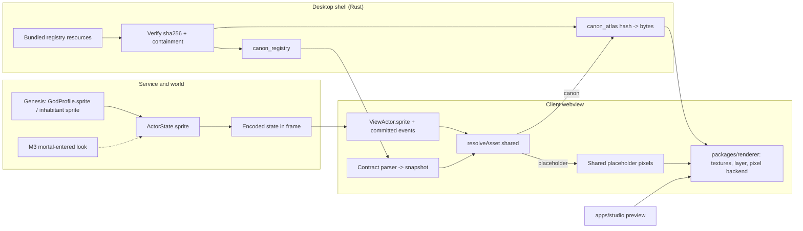
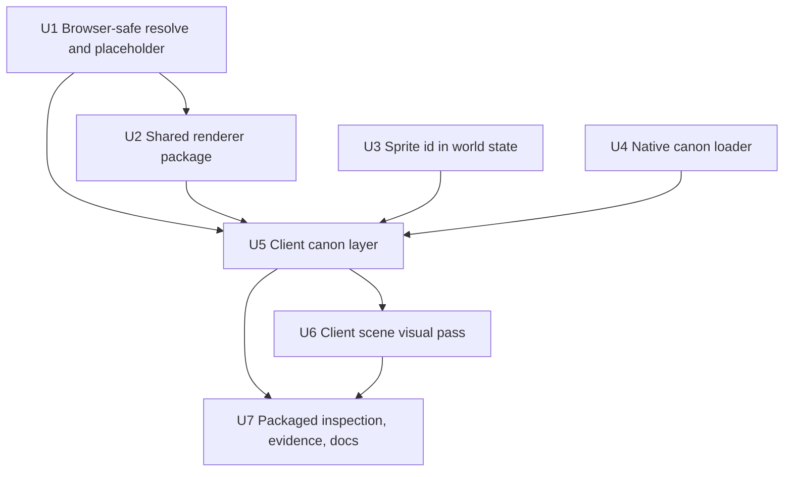

# feat: Packaged game draws canon art (asset studio Unit 8)

## Overview

The packaged game client stops drawing canvas markers for actors and draws published canon art from a registry bundled with the app. Each actor carries a stable sprite id in world state. A native loader hash-checks the bundled registry and hands the verified files to the webview, which parses them with the existing contract parser. The client draws through one pixel-exact renderer that it shares with the studio. Anything not published draws as the deterministic placeholder for that state.

This is the child plan for foundation Unit 8 in `docs/plans/2026-10-03-001-feat-asset-studio-foundation-plan.md`. It extends that unit. Each departure is listed under Key Technical Decisions, in "Supersedes foundation Unit 8". In this document, U1–U7 means this plan's own units.

## Problem Frame

The studio can publish canon, and Zeus has `zeus-sprite` (idle-south, four frames at 333/167/333/167 ms) and the six-expression `zeus-portrait`. The game can't show either (see origin: R3, success criterion 1):
- The client is a radial layout of 28×36 canvas markers, rebuilt on every draw, with antialiasing, sRGB textures and a device pixel ratio of up to 2. None of that is pixel-exact.
- Nothing in world state or the frame says what an actor looks like. `GodProfile.sprite` exists but nothing reads it at runtime. Mortals have no sprite field, and M3 mints player mortals at runtime, so a lookup keyed by actor id can't cover them.
- `resolveAsset` and the placeholder are pure in intent, but they import `node:crypto` and `node:zlib`, so the webview can't use them.
- The desktop app bundles no content, and no command reads assets.

## Requirements Trace

- R3 (origin). The god profile's `sprite` is the stable id for an actor. The client resolves through it, and the placeholder is the fallback for any unresolved id or state. The webview resolves by sprite id and fetches atlases by content hash. `panthea-asset://` stays a logical identifier in manifests and is not a webview protocol (ADR-0009).
- R4 (origin). Registry files are plain, versioned and readable without the studio. The game reads them as bundled, read-only resources.
- R20 (origin), published subset. Canon idle-south draws in the live packaged world. All six portrait expressions draw in the packaged inspection fixture. Seated and strike draw as placeholders in the fixture until they are published. Where portraits appear in play belongs to M3 Unit 7.
- R24 (origin). Edits to `packages/world`, `apps/simulation` and the client happen under owner agreement, given 2026-10-10.
- AE1 (origin). With canon idle-south and no seated, the seated state draws the placeholder and idle-south draws canon. No error is raised.
- U07, U08, X02 (requirements.md). Traceability rows are updated in this PR.
- M3 R1 (`docs/plans/2026-10-10-001-feat-m3-mortal-in-town-plan.md`). A mortal's "look" is a sprite id that this plan's actor field carries.

## Scope Boundaries

- No new art. Seated, strike, the other gods and mortals stay placeholders until the studio publishes them.
- Isometric world layout, tiles and map coordinates are excluded. The client keeps its current place layout and draws it on the shared pixel core.
- Event-driven act animation is excluded. Strike events carry no ability id (`packages/contracts/src/event.ts`), and no strike art exists. Normal play draws idle, and the fixture shows the act state.
- M3 work is excluded: player intake, input layer, talk UI, mortal creation and look selection. Where portraits appear in dialogue is decided by M3 Unit 7's designer pass.
- No live reload in the game. Canon changes reach the game on the next build and load. Only the studio watches.
- No change to the studio's own command surface or authoring store.

### Deferred to Separate Tasks

- Zeus seated and strike art, and the timed owner sitting for T1 success criterion 1: queued studio work, not a gate here (owner, 2026-10-10).
- An event-driven strike act needs the ability id on strike events. This is queued with the strike art, and it reuses the client's event-id dedupe (`apps/client/src/renderer/presentation.ts`), because one event appears in about ten consecutive frames.
- Isometric place layout in the client is a new deferred item tied to foundation Unit 11's tiles. The foundation plan gets a dated note on Unit 11.
- Portrait placement in talk and speech: M3 Unit 7.

## Context & Research

### Relevant Code and Patterns

- Client draw path: `apps/client/src/App.tsx` (`ClientDependencies`, `onDrawn` receipts), `apps/client/src/store.ts` (`toViewModel`, `ViewActor`), `apps/client/src/SceneHost.tsx` (remount on `rendererEpoch`), `apps/client/src/renderer/{scene,markers,lifecycle,presentation,recovery}.ts`.
- Studio renderer, browser-safe and reusable: `apps/studio/src/renderer/iso.ts`, `textures.ts` (atlas frames, nearest filtering, `NoColorSpace`, ref-counted store), `layer.ts` (depth-keyed sprite layer), and `gpu.ts` (pixel-exact target, flipped blit, `compileAsync`, readback). `preview.ts` and `apps/studio/src/source/*` are studio-only.
- Assets: `packages/assets/src/resolve.ts` (`resolveAsset`, `RegistrySnapshot`), `placeholder.ts` (`renderPlaceholder`, `encodeRgbaPng`), `registry.ts` (`loadRegistry`, node-only). `packages/contracts/src/assets.ts` has the manifest parser and is browser-safe.
- World and content: `packages/world/src/state.ts` (`ActorState`, `createInitialWorldState`), `packages/world/src/codec.ts`, `packages/content/src/god-profile.ts` (`sprite`), `content/greek/world/inhabitants.json`, and `tools/content/src/assets.ts` (sprite id validation).
- Desktop shell: `apps/desktop/src-tauri/src/{commands,lib,proxy}.rs`, `build.rs` (app manifest), `capabilities/proxy.json`, `tauri.conf.json` (CSP already allows `'unsafe-eval'`; bundle has `externalBin` only).
- Byte path precedent: the studio's `preview_bytes` returns `tauri::ipc::Response` (`apps/studio/src-tauri/src/commands.rs`, ADR-0010).
- CI: `.github/workflows/ci.yaml`. The `rust` job runs fmt and clippy only. `rust-studio` also runs `cargo test --locked`.

### Institutional Learnings

- `integration-issues/koota-new-function-tauri-csp-2026-09-27`: keep `script-src 'self' 'unsafe-eval'`.
- ADR-0002 and `wkwebview-webgpu-unavailable`: WebGL2 is the packaged baseline. Evidence must come from the packaged app.
- `integration-issues/three-webgpurenderer-device-loss-latch-2026-09-27`: recover with a fresh canvas and renderer, and rebuild from retained state.
- `integration-issues/webgpurenderer-render-target-blit-and-compile-2026-10-08`: nearest filtering, exact backing size, flipped blit `v`, and awaiting `compileAsync` after scene changes.
- `best-practices/studio-owned-isometric-projection-depth-2026-10-08`: Flatland's isometric orientation and `zIndex` are not depth. Use a depth key with alpha-cutout depth testing.
- `test-failures/canon-registry-polluted-validator-fixtures-2026-10-08`: native and validator tests use isolated registry fixtures, never the committed canon.
- `logic-errors/client-view-presentation-against-invented-fixtures-2026-09-28`: presentation tests use contract-valid events and authored world data.
- ADR-0008 and memory: the webview gets named commands only, and never paths, tokens or filesystem access.

### External References

- Tauri 2 resources (`bundle.resources`, `BaseDirectory::Resource`): https://v2.tauri.app/develop/resources. Packaged files live in `Contents/Resources`. `tauri dev` does not serve them, so dev needs its own path.
- `tauri::ipc::Response` for raw bytes: https://v2.tauri.app/develop/calling-rust. No documented size limit.
- WebKit may ignore `createImageBitmap`'s `premultiplyAlpha: 'none'` and `colorSpaceConversion: 'none'` (WHATWG html#10142), so pixel exactness is proven by readback, not assumed.
- three-flatland alpha.10 installed source: `AnimatedSprite2D` takes per-frame `duration` in ms, and `Sprite2DMaterial` supports `alphaTest` with depth write.

## Prior-Art Survey

```json
{
  "schema_version": 2,
  "verdict": "extend",
  "scope": "apps/client/src/renderer, apps/client/src/App.tsx, apps/desktop/src-tauri, apps/studio/src/renderer, apps/studio/src/source, apps/studio/src-tauri/src/commands.rs, packages/assets/src (registry, resolve, placeholder, studio), packages/content/src (god-visual-profile, god-profile, load), packages/world/src/state.ts, apps/simulation/src/greek-world-pack.ts, content/greek/{assets,gods,world}",
  "freshness": {
    "vcs_reference": "126747533be671eeb33dffa9b0b22d8b9cb2c7a7"
  },
  "budget": {
    "max_search_passes": 12,
    "max_candidate_inspections": 30,
    "exhausted": false
  },
  "candidates": [
    { "path_or_symbol": "content/greek/assets/registry", "description": "Published canon: zeus-sprite (idle/south, four 64x80 frames, pivot 32,80) and zeus-portrait (six expressions, 96x96)", "disposition": "reuse" },
    { "path_or_symbol": "packages/assets/src/resolve.ts resolveAsset", "description": "Pure lookup by sprite id and state, direction, ability or expression, with placeholder fallback", "disposition": "extend" },
    { "path_or_symbol": "packages/assets/src/registry.ts loadRegistry", "description": "node:fs loader that verifies index, manifests and blobs into a snapshot", "disposition": "insufficient", "insufficiency_reason": "Node-only, so the webview can't import it. The desktop crate has no manifest or blob verifier." },
    { "path_or_symbol": "packages/assets/src/placeholder.ts renderPlaceholder", "description": "Deterministic placeholder pixels encoded as PNG and named by sha256", "disposition": "extend" },
    { "path_or_symbol": "packages/content/src/god-visual-profile.ts", "description": "Visual profile join by god id, holding the portrait asset id", "disposition": "extend" },
    { "path_or_symbol": "content/greek/gods/*.json sprite", "description": "Stable per-god sprite id, parsed and validated, with no runtime consumer", "disposition": "reuse" },
    { "path_or_symbol": "packages/world/src/state.ts ActorState and apps/client/src/store.ts ViewActor", "description": "Live actor with no sprite or look field", "disposition": "insufficient", "insufficiency_reason": "No field to key a sprite on. Mortals minted at runtime (M3) can't be covered by an actor-id mapping." },
    { "path_or_symbol": "apps/client/src/renderer/scene.ts", "description": "Radial scene with per-draw canvas markers and event rings", "disposition": "extend" },
    { "path_or_symbol": "apps/client/src/renderer/markers.ts", "description": "One SpriteGroup for the renderer lifetime, with explicit release", "disposition": "reuse" },
    { "path_or_symbol": "apps/client/src/renderer/lifecycle.ts, SceneHost.tsx, recovery.ts", "description": "Renderer start, failure reporting, device loss and remount on rendererEpoch", "disposition": "reuse" },
    { "path_or_symbol": "apps/client/src/App.tsx fixtureMode", "description": "Dev-only fixture preview", "disposition": "insufficient", "insufficiency_reason": "Gated by import.meta.env.DEV, so the packaged inspection view needs its own path" },
    { "path_or_symbol": "apps/studio/src/renderer/textures.ts and layer.ts", "description": "Nearest, uncoloured atlas textures and the depth-keyed sprite layer", "disposition": "reuse" },
    { "path_or_symbol": "apps/studio/src/renderer/iso.ts and scene.ts", "description": "Isometric projection, depth key and scene composition", "disposition": "extend" },
    { "path_or_symbol": "apps/studio/src/renderer/gpu.ts", "description": "Pixel-exact backend: fixed target, integer blit, compileAsync, readback", "disposition": "extend" },
    { "path_or_symbol": "apps/studio/src/renderer/preview.ts", "description": "Studio preview controller and selection", "disposition": "insufficient", "insufficiency_reason": "Owns studio selection and zoom controls, which the game doesn't need" },
    { "path_or_symbol": "apps/studio/src/source/port.ts and packages/assets/src/studio/preview-source.ts", "description": "Studio asset source over canon, draft and approved", "disposition": "insufficient", "insufficiency_reason": "Studio-only selection model and a node-only implementation" },
    { "path_or_symbol": "apps/studio/src-tauri/src/commands.rs preview_bytes", "description": "Raw bytes over ipc::Response for a validated selection", "disposition": "extend" },
    { "path_or_symbol": "apps/desktop/src-tauri commands.rs, build.rs, lib.rs, capabilities/proxy.json", "description": "Named-command allowlist for the game webview", "disposition": "extend" },
    { "path_or_symbol": "apps/desktop/src-tauri/tauri.conf.json bundle", "description": "externalBin only, no resources", "disposition": "insufficient", "insufficiency_reason": "Nothing ships as a file resource. The registry needs a bundle.resources entry." }
  ]
}
```

## Key Technical Decisions

- **The sprite id lives on the actor in world state.** `ActorState` gains a required `sprite`, set at genesis.
  - A deity takes it from `GodProfile.sprite` only.
  - A non-deity inhabitant takes it from a new `sprite` field in `inhabitants.json`, set to `placeholder-<id>` until art exists. Deity inhabitants carry no `sprite` field.
  - Pack assembly folds each deity's profile sprite into the pack (`apps/simulation/src/greek-world-pack.ts`, `packages/content/src/load.ts`), so `createInitialWorldState(pack)` and its six callers keep their signature.
  - The codec carries `sprite` in the encoded state the frame already ships, so the client never loads content to learn what an actor looks like.
  - The world never reads `sprite` in a rule.
  - M3's `mortal-entered` sets it from the chosen look.
- **Store version 7.** The codec change bumps `CURRENT_SCHEMA_VERSION` from 6 to 7 (`packages/persistence/src/store.ts`). A version-6 store is refused as documented, with no migration (greenfield). M3's own bump becomes 8.
- **Native loader over bundled resources.** `bundle.resources` uses the map form to place `content/greek/assets/registry` at `registry` and `content/greek/assets/vocabulary.json` at `vocabulary.json`. Release builds resolve the root from `resource_dir()`. Debug builds read the repo paths, so `tauri dev` works. The loader reports which root it used.
  - At startup, Rust reads every file under `manifests/` and `blobs/` and keeps those whose sha256 matches their file name. It also reads the index and the vocabulary as text.
  - Each path is canonicalized under the root, and anything outside it is refused.
  - Rust parses no manifest. The webview parses the index and every manifest with the existing contract parser, using the bundled vocabulary. It draws only blobs named by a parsed, verified manifest. The schema has one definition, in TypeScript.
  - A file that fails is dropped and listed as a problem, and the rest still load. A missing registry gives an empty set and a problem.
  - The `sha2` crate is approved (owner, 2026-10-10).
- **Two named commands.**
  - `canon_registry` returns the index, the verified manifest texts, the vocabulary, the root kind and the problems.
  - `canon_atlas(hash)` returns `ipc::Response` bytes for a hash in the verified blob set and refuses anything else.
  - The webview never sends a path.
  - Each command gets a `proxy.json` entry and an app-manifest line, and the `commands.rs` header comment is updated in the same change.
- **One resolver and one set of placeholder pixels for studio, CLI and game.** Placeholder pixel generation (pure RGBA) is split from PNG encoding and hashing (node).
  - The browser-safe subpath resolves with a pixel-only placeholder variant, with no URI and no PNG bytes.
  - The node path keeps its current `uri` and bytes, so studio, CLI and validator behavior is unchanged.
  - The game's placeholder pixels equal the studio's. This reverses ADR-0009's "the package is for Node and Bun, not the browser" for that subpath only, and ADR-0011 records it.
- **Shared pixel core in `packages/renderer`.**
  - **Moved into the package:** `iso`, `textures`, `layer`, `scene` (composition types), the pixel-exact backend, and the backend's types and constants from `preview.ts` (`RenderBackend`, `PixelBuffer`, `PreviewView`, `Zoom`, `CanvasMetrics`, `cameraBounds`).
  - **Logical size:** the backend takes it as a parameter. The studio keeps 480×270.
  - **Stays in the studio:** the preview controller and the source port.
  - **Dependencies:** the package depends on `three`, `three-flatland`, `@panthea/contracts`, and `@panthea/assets` (types and the browser-safe subpath). Tests that need the node fixtures stay in the studio.
  - **`bun.lock`:** the change is workspace entries only.
- **Client adopts the core now, with its current layout.**
  - U5 changes pixels on purpose: no antialiasing, nearest filtering, and a fixed logical target.
  - The client's logical size contains the mortal realm's ring at 1×: radius 205, plus building offsets, using the current place positions.
  - Atlas textures go through the ref-counted texture store, never the per-draw disposal list.
- **State selection.** Idle-south is the default in normal play. The packaged inspection fixture explicitly selects seated, act and portrait expressions, and never invents world state. Missing states draw the placeholder (AE1).
- **Next-load refresh.** The client fetches the registry once per renderer start and caches bytes for device-loss rebuilds. There is no watcher.
- **Exactness is measured against an independent reference.** Each canon frame's RGBA digest comes from a node decode of the committed blob and is checked in with the scenario.
  - The packaged fixture reads back the render target. For each check it asserts that the source is canon, that the atlas hash is the expected one, and that the region digest matches.
  - An empty or placeholder-only snapshot fails.
  - WKWebView's own decode is never the reference.
- **Desktop CI runs `cargo test --locked`**, matching `rust-studio` (owner, 2026-10-10).

### Supersedes foundation Unit 8

The owner agreed each item below on 2026-10-10. The same list goes into the foundation plan's dated note and ADR-0011.
- "The renderer joins actor IDs to mappings … does not … modify world frames/store" and "no store/observer/settings changes" are replaced: the sprite id lives in world state and the frame, and the store version moves to 7.
- "Native commands resolve only IDs within that root" becomes: the webview addresses atlases by verified content hash, and `canon_registry` returns the whole verified set.
- "Validated actor-to-profile-sprite mappings": Rust does integrity and containment only, the webview parses the schema, and mappings come from the world state set at genesis.
- "Adopt shared isometric layer": the client adopts the shared pixel core, and isometric place layout is deferred.
- The verification "proves placeholder-zeus resolves to canon idle-south, seated-on-cloud, strike and all six portrait expressions" and the timed owner sitting become: canon idle-south in the live world, six portraits in the fixture, and seated and strike as placeholders. The art and the sitting are queued studio work. `placeholder-zeus` is corrected to `zeus-sprite`.
- "Default idle-south and existing committed event presentation drive normal rendering" becomes idle-only until strike art and an ability id on strike events exist.

## Open Questions

### Resolved During Planning

- Seated and strike are not a gate. Placeholders draw until the studio publishes them (owner, 2026-10-10).
- The client keeps its place layout on the shared core, and isometric layout is deferred (owner, 2026-10-10).
- The actor's sprite id lives in world state (owner, 2026-10-10).
- The native loader stays, with the `sha2` crate (owner, 2026-10-10).
- This plan lands before M3's client UI (owner, 2026-10-10).
- The cloud in `seated` is part of that state's spec, not iconography, so it is consistent with ADR-0009.

### Deferred to Implementation

- The client's exact logical size and integer zoom policy, within the containment rule above. U6 can adjust them.
- The browser-safe subpath name and the shared package's export list.
- The test helper that fills `sprite` in existing `ActorState` literals (about 55 sites, including `packages/world/src/practices.ts` and `apps/client/src/fixtures.ts`).
- How long the startup hash check takes on the full registry. Measure it once and record the figure.

## Output Structure

    packages/renderer/
      package.json
      src/{iso,textures,layer,scene,backend,index}.ts
      src/*.test.ts

## High-Level Technical Design

> *This illustrates the intended approach and is directional guidance for review, not implementation specification. The implementing agent should treat it as context, not code to reproduce.*



## Implementation Units



U1, U3 and U4 are independent and may run in parallel lanes with separate worktrees. New behavior is test-first.

- [x] **U1: Browser-safe resolve and placeholder pixels**

**Goal:** the webview can resolve a sprite id and draw the same placeholder as the studio.

**Requirements:** R3, AE1

**Dependencies:** none

**Files:**
- Modify: `packages/assets/src/placeholder.ts`, `packages/assets/src/resolve.ts`, `packages/assets/src/index.ts`, `packages/assets/package.json` (browser-safe subpath)
- Test: `packages/assets/src/placeholder.test.ts`, `packages/assets/src/resolve.test.ts`, a browser-import test in `packages/assets/src/`

**Approach:**
- Split placeholder pixel generation (pure RGBA) from PNG encoding and hashing (node).
- The browser-safe resolver returns a pixel-only placeholder variant, with no URI and no PNG bytes. The node resolver keeps `uri` and bytes, so studio consumers such as `apps/studio/src/renderer/scene.ts` (`PlaceholderSize`) are unchanged.

**Patterns to follow:** existing golden-byte placeholder tests.

**Test scenarios:**
- Happy path: placeholder PNG bytes and sha256 are unchanged for the existing golden inputs.
- Happy path: the browser-safe pixels equal the decoded golden PNG.
- Integration: bundling the browser-safe subpath for a browser target pulls no `node:` module, and the test fails if one is added.
- Edge case: missing id, missing state and wrong kind return the same placeholder pixels as the node path.

**Verification:** studio, CLI and validator tests pass unchanged.

- [x] **U2: Shared renderer package**

**Goal:** one pixel-exact core used by the studio and, from U5, the game.

**Requirements:** R16 (origin, unchanged behavior), X02

**Dependencies:** U1 (placeholder pixels into textures)

**Files:**
- Create: `packages/renderer/package.json`, `packages/renderer/src/{iso,textures,layer,scene,backend,index}.ts`, with fixture-free tests moved alongside
- Modify: `apps/studio/src/renderer/*` (import from the package; `preview.ts` stays and re-exports what moved), `apps/studio/package.json`, `bun.lock` (workspace entry only)
- Test: `packages/renderer/src/*.test.ts`; studio renderer tests that use `@panthea/assets/fixtures` stay in the studio and keep passing

**Approach:**
- Move the files without changing behavior. The moves are the ones listed under Key Technical Decisions, including the backend constants and types from `preview.ts`, because `gpu.ts` imports them.
- The backend takes the logical size as a parameter, and the studio passes 480×270.
- The package depends on `three`, `three-flatland`, `@panthea/contracts` and `@panthea/assets` (types and the browser-safe subpath). It never depends on studio source, the source port or Tauri.

**Execution note:** move first with tests green, then change anything.

**Test scenarios:**
- Happy path: the moved iso, depth, texture and layer tests pass unchanged in the package.
- Integration: the studio's full test suite and its packaged build still pass.
- Edge case: the package's import graph contains no `apps/studio` path, enforced by a test or lint rule.

**Verification:** the studio behaves the same, and the `bun.lock` diff is the workspace entry.

- [x] **U3: Sprite id in world state**

**Goal:** every actor carries its sprite id to the client in the frame.

**Requirements:** R3, M3 R1 (enabler)

**Dependencies:** none

**Files:**
- Modify: `packages/world/src/state.ts`, `packages/world/src/codec.ts` (encode and `parseActorState`), `packages/contracts/src/content.ts` (non-deity inhabitant `sprite`), `content/greek/world/inhabitants.json`, `apps/simulation/src/greek-world-pack.ts` and `packages/content/src/load.ts` (fold the deity profile sprite into the pack), `apps/simulation/src/world-store.ts` if it assembles the pack, `packages/persistence/src/store.ts` (`CURRENT_SCHEMA_VERSION` 7), `tools/content/src/assets.ts` (validate inhabitant sprite ids), `packages/content/src/god-profile.ts` (stale "placeholder sprite id" comment), `apps/client/src/store.ts` (`ViewActor.sprite`), existing `ActorState` literals through one test helper with a default sprite, including `packages/world/src/practices.ts` and `apps/client/src/fixtures.ts`
- Test: `packages/world/src/codec.test.ts`, `packages/world/src/state.test.ts`, `packages/persistence/src/store.test.ts`, `tools/content/src/assets.test.ts`, `apps/client/src/store.test.ts`

**Approach:**
- `sprite` is required on `ActorState` and set only at genesis today. M3 adds the runtime path.
- A deity's sprite comes from its profile. A non-deity's comes from `inhabitants.json`.
- The validator accepts canon ids present in the registry and `placeholder-*` ids, and flags anything else.
- The world never uses `sprite` in a rule. It is presentation data that the world carries.

**Test scenarios:**
- Happy path: Zeus's actor has `sprite: "zeus-sprite"` from his profile, and a non-deity inhabitant has its content id.
- Happy path: the codec round trip preserves `sprite`, and the archive content hash changes when it changes.
- Error path: a non-deity inhabitant without `sprite` fails content parsing. A deity inhabitant with a `sprite` field fails too, since the profile is the only source. An unknown non-placeholder id fails validation.
- Error path: a version-6 store is refused at open, and nothing is decoded.
- Integration: a frame from the real service decodes in the client store with `ViewActor.sprite` set for every actor.
- Edge case: no world rule reads `sprite`. Changing it changes no committed event, as a determinism test shows.

**Verification:** simulation, world and content tests pass, and existing scenarios still decode.

- [x] **U4: Native canon loader**

**Goal:** the shell verifies the bundled registry and serves it to the webview through two named commands.

**Requirements:** R3, R4, U07

**Dependencies:** none

**Files:**
- Create: `apps/desktop/src-tauri/src/canon.rs`
- Modify: `apps/desktop/src-tauri/src/{commands,lib}.rs`, `build.rs`, `capabilities/proxy.json`, `tauri.conf.json` (`bundle.resources`), `Cargo.toml` and `Cargo.lock` (`sha2`), `.github/workflows/ci.yaml` (`cargo test --locked` in `rust`)
- Test: tests in `canon.rs` and `commands.rs` against isolated fixture registries

**Approach:**
- The `bundle.resources` map places the registry at `registry` and the vocabulary at `vocabulary.json`. Release builds resolve them under `resource_dir()`, and debug builds read the repo paths. The root kind is reported to the webview.
- Load once at startup into an immutable verified set: manifest and blob files whose sha256 equals their file name, plus the index and vocabulary texts. Rust parses no manifest.
- `canon_registry` returns the index, manifest texts, vocabulary, root kind and problems. `canon_atlas` takes a 64-hex hash and returns bytes only if the hash is in the verified blob set.
- A file that fails is dropped with a problem entry. A missing or unreadable registry gives an empty set and a problem, and the game still runs on placeholders.

**Patterns to follow:** the studio's `preview_bytes` (`ipc::Response`) and the desktop's existing command and capability tests.

**Test scenarios:**
- Happy path: a fixture registry with one sprite and one portrait verifies, and both commands return the expected texts, vocabulary and bytes.
- Happy path: a release-layout root resolves under the resource directory and reports its root kind as bundled.
- Error path: a manifest whose bytes don't match its hash name is dropped, its problem is listed, and the other entries load.
- Error path: a blob whose bytes don't match its name is not in the verified set, and `canon_atlas` refuses it.
- Error path: a file under the root that resolves outside it through `..` or a symlink is refused, and nothing outside the root is read.
- Error path: `canon_atlas` with a malformed hash, or a well-formed hash outside the verified set, is refused without touching the disk.
- Edge case: no registry directory gives an empty set and a problem, not a crash.
- Integration: the capability lists exactly the existing commands plus the two new ones.

**Verification:** `cargo fmt --check`, `clippy -D warnings` and `cargo test --locked` pass, and CI runs the tests.

- [x] **U5: Client canon layer**

**Goal:** the game draws actors from canon through the shared pixel core, with placeholders per state.

**Requirements:** R3, R20 (published subset), AE1, U08

**Dependencies:** U1, U2, U3, U4

**Files:**
- Create: `apps/client/src/assets/{canon,decode}.ts` (registry client, decode, cache)
- Modify: `apps/client/src/renderer/{scene,markers,lifecycle}.ts`, `apps/client/src/SceneHost.tsx`, `apps/client/src/App.tsx` (`ClientDependencies`), `apps/client/package.json` (workspace dependencies on `@panthea/renderer` and the assets subpath), `bun.lock` (workspace entries)
- Test: `apps/client/src/assets/*.test.ts`, `apps/client/src/renderer/*.test.ts`

**Approach:**
- On renderer start: call `canon_registry`, parse the index and manifests with the contract parser and the returned vocabulary, and build the snapshot. Only blobs named by a parsed manifest are fetched.
- Each actor resolves by `ViewActor.sprite` in idle-south. Atlas bytes are fetched once per hash and cached across device-loss remounts.
- Animated states use per-frame manifest durations. Idle shows its 333/167 ms timing.
- The renderer moves onto the shared backend with a fixed logical size that contains the current layout. This changes pixels on purpose: no antialiasing, and nearest filtering.
- Actor markers become sprites. Buildings, flames, repair bars and event rings stay meshes in render-target pixel space, and keep their current look until U6.
- Atlas textures go through the ref-counted texture store, never `clearScene`'s per-draw disposal list.
- Receipts are unchanged: only drawable committed events produce them.

**Execution note:** start with a failing test that resolves Zeus to canon idle frames and an inhabitant to its placeholder from a real decoded frame.

**Patterns to follow:** the studio's `layer.ts` and texture store for lifetimes, and the client's `markers.ts` release discipline.

**Test scenarios:**
- Happy path: Zeus resolves to `zeus-sprite` idle-south with four frames at 333/167/333/167 ms.
- Edge case (AE1): Zeus seated resolves to the placeholder, and idle-south still draws canon.
- Edge case: a strike event leaves Zeus in idle-south. Normal play has no act selection.
- Integration: a manifest that parses with the bundled vocabulary draws, and a blob not named by any parsed manifest is never fetched.
- Error path: a problem from `canon_registry` and a refused atlas fetch both fall back to placeholders and are reported once. Neither throws during a draw.
- Integration: device loss remounts, rebuilds textures from cached bytes without refetching, and leaks no textures or groups across three remounts.
- Integration: the receipt set for a frame is unchanged from the current renderer for the same events.
- Edge case: tests use contract-valid frames from the real codec, not invented shapes.

**Verification:** client tests pass, and the dev app shows canon Zeus and placeholders.

- [x] **U6: Client scene visual pass**

**Goal:** the scene reads well at pixel scale, with logical size, zoom, backdrop, places and rings designed for the new core.

**Requirements:** X02

**Dependencies:** U5

**Files:**
- Modify: `apps/client/src/renderer/*` presentation constants, `apps/client/src/ui/surface.css` tokens if needed
- Test: existing renderer tests updated for any constant changes

**Approach:**
- The designer owns layout, logical size and integer zoom, how places, buildings and rings look at pixel scale, and actor framing. The current place positions are kept, and the existing tokens are reused.

**Execution note:** this is @designer work. Copy is reviewed afterwards without changing the design.

**Test scenarios:**
- Test expectation: no new behavior. Constant changes keep existing renderer tests green.

**Verification:** window-cropped screenshots, confirmed by the owner through the question tool before the unit counts as done.

- [x] **U7: Packaged inspection, evidence and docs**

**Goal:** prove the packaged path and record the decisions.

**Requirements:** R3, R4, R20 (published subset), AE1, U07, U08, X02

**Dependencies:** U5, U6

**Files:**
- Create: `apps/client/src/inspect/*` (packaged inspection fixture), `tools/scenarios/studio-zeus-scene/README.md` and its committed reference digests (from a node decode of the committed blobs, with the generator test), `docs/evidence/asset-studio/unit8/README.md` and window-cropped images, `docs/decisions/0011-game-canon-art-loading.md`
- Modify: `docs/decisions/README.md`, `docs/product/traceability.md` (U07, U08, X02; a dated W01 note that canon art now reaches the game)
- Test: `apps/client/src/inspect/*.test.ts`, `tools/scenarios/studio-zeus-scene/*.test.ts`

**Approach:**
- The inspection fixture is a named route that exists in packaged builds. It selects an asset, state or expression explicitly and draws it with the same layer, never from world state. Seated, act and all six portraits are reachable there.
- It runs in-app readback checks and shows the results in the window:
  - each canon check asserts source canon, the expected atlas hash and the committed reference digest for that frame at each integer zoom;
  - a missing state equals the shared placeholder pixels;
  - the registry root kind is bundled;
  - the backend reports WebGL2;
  - an empty or placeholder-only snapshot fails every canon check.
- ADR-0011 records the decisions and the supersession list, including the reversal of ADR-0009's browser boundary for the resolver subpath.
- The scenario README records the manual procedure: build a release `.app`, open the inspection fixture and the live world, capture window-cropped screenshots, and read the check results.

**Test scenarios:**
- Happy path: the inspection view lists published assets from the snapshot and selects each portrait expression.
- Edge case: selecting seated draws the placeholder and marks it as such.
- Integration: the readback check fails when a frame is offset by one pixel. This is the positive control.
- Integration: with the registry withheld, every canon check fails instead of passing on placeholders.
- Happy path: the reference-digest generator reproduces the committed digests from the committed blobs.

**Verification:**
- Release-build packaged WebGL2 evidence shows:
  - canon idle-south in the live world;
  - all six portraits in inspection;
  - placeholder seated and strike;
  - passing readback checks, plus the control's failure.
- The window screenshots are cropped to the app window.
- `bun run check` and the desktop cargo checks pass.
- The ADR and traceability rows are in the PR. The parent, origin and M3 notes land with this plan.

## System-Wide Impact

- **Interaction graph:** the world state codec gains a field and the store moves to version 7, so every frame, store and archive covers it. The shell gains a startup read of the bundled registry. The client renderer is rebuilt on the shared core.
- **Error propagation:** a registry problem never stops the game. It becomes a problem entry and placeholders, reported once in the client.
- **State lifecycle risks:** cached atlas bytes must survive device loss without leaking. A version-6 store is refused, not decoded.
- **API surface parity:** the studio and the game use the same resolver, placeholder and pixel core. The studio's commands are unchanged. The game gets two read-only commands.
- **Integration coverage:** a real service frame decoded in the client, a packaged readback, and capability enumeration.
- **Unchanged invariants:** the world stays authoritative and never reads `sprite` in a rule; the webview gets no paths, tokens or filesystem; the CSP is unchanged; offline play is unaffected.

## Risks & Dependencies

| Risk | Mitigation |
|------|------------|
| Changing the world state codec conflicts with M3 Unit 1 | This plan lands first and bumps the store to 7. M3's plan has a dated note to build on `sprite` and bump to 8. Greenfield, so there is no migration. |
| Moving the studio renderer breaks the studio | Move without behavior change and keep the studio suite and packaged build green |
| WKWebView decode alters pixels | In-app readback against digests from a node decode of the committed blobs, with positive controls |
| The startup hash check slows launch as canon grows | Measure once and record it. Canon is two assets today. |
| Shell file overlap with M3 Unit 6 | This plan lands first, and M3 rebases onto it |

## Documentation / Operational Notes

- ADR-0011 records:
  - the native loader, with integrity checked in Rust and the schema parsed in TypeScript;
  - `ActorState.sprite` and store version 7;
  - the shared renderer package;
  - the browser-safe resolver subpath, which reverses ADR-0009's browser boundary;
  - the supersession list.

  It links ADR-0008, ADR-0009 and ADR-0010.
- Dated notes land with this plan. The prior text is kept.
  - **Foundation plan:** Unit 7 ticked; on Unit 8, the supersession list and the `zeus-sprite` correction; on Unit 5, seated and strike no longer gate; on Unit 11, client isometric layout is deferred to sit beside it.
  - **Origin:** success criterion 1 (seated, strike and the timed sitting are queued studio work); success criterion 3 (world-state edits are an agreed exception).
  - **M3 plan:** a look is a sprite id. `mortal-entered` carries it into `ActorState.sprite`. M3 defines the set of valid looks. Its store bump becomes 8. Its client UI builds on `packages/renderer`.

## Sources & References

- **Origin document:** [docs/brainstorms/2026-10-03-asset-studio-requirements.md](../brainstorms/2026-10-03-asset-studio-requirements.md)
- Parent plan: `docs/plans/2026-10-03-001-feat-asset-studio-foundation-plan.md` (Unit 8)
- Sibling plan: `docs/plans/2026-10-10-001-feat-m3-mortal-in-town-plan.md`
- ADR-0002, ADR-0008, ADR-0009, ADR-0010
- Tauri resources: https://v2.tauri.app/develop/resources
- Tauri binary responses: https://v2.tauri.app/develop/calling-rust
